# rbee Complete Flow Diagram - From Clean Install to Inference

**Command:** `rbee infer -a gpu-computer-1 -m hf:meta/llama-3-8b -p "Hello"`

This diagram shows the complete flow from a fresh install through model provisioning, worker spawning, and inference execution.

---

## Mermaid Flow Diagram

```mermaid
graph TB
    %% User starts the flow
    User[👤 User] -->|runs command| CLI[rbee-keeper CLI]
    
    %% CLI operations
    CLI -->|1. Parse command| ParseOp[Parse Operation:<br/>Infer + Hive + Model]
    ParseOp -->|2. Check queen status| QueenCheck{Queen Running?}
    
    %% Queen lifecycle
    QueenCheck -->|No| StartQueen[Start queen-rbee<br/>Port 8500]
    StartQueen --> QueenReady
    QueenCheck -->|Yes| QueenReady[Queen Ready]
    
    %% Job submission
    QueenReady -->|3. POST /v1/jobs| CreateJob[Create Job<br/>job_id: uuid-123]
    CreateJob -->|4. GET /v1/jobs/uuid-123/stream| SSEConnect[Connect SSE Stream]
    
    %% Queen routes the operation
    CreateJob -->|5. Route Operation| QueenRouter{Operation Type?}
    
    %% === HIVE LIFECYCLE PATH ===
    QueenRouter -->|HiveStart| CheckHive{Hive Running?}
    CheckHive -->|No| HiveLifecycle[hive-lifecycle crate:<br/>execute_hive_start]
    
    HiveLifecycle -->|Binary resolution| FindBinary{Binary exists?}
    FindBinary -->|No| DownloadBinary[Download/Build<br/>rbee-hive binary]
    DownloadBinary --> SpawnHive
    FindBinary -->|Yes: target/release/rbee-hive| SpawnHive[Spawn Hive Process<br/>Port 9000]
    
    SpawnHive -->|Health check| HiveHealth[Poll http://localhost:9000/health<br/>Exponential backoff]
    HiveHealth -->|Ready| FetchCaps[Fetch Capabilities<br/>POST /v1/capabilities]
    FetchCaps -->|GPU list + VRAM| CacheCaps[Cache to<br/>~/.config/rbee/capabilities.yaml]
    CacheCaps --> HiveReady[Hive Ready ✅]
    
    CheckHive -->|Yes| HiveReady
    HiveReady --> CheckModel
    
    %% === MODEL PROVISIONING PATH ===
    CheckModel{Model Available?} -->|6. Check model catalog| QueryModelCatalog[Queen → Hive<br/>GET /v1/models]
    QueryModelCatalog -->|Model list| ModelExists{meta/llama-3-8b<br/>exists?}
    
    ModelExists -->|No| ProvisionModel[Queen → Hive<br/>POST /v1/jobs<br/>Operation::ModelDownload]
    
    ProvisionModel --> HiveModelRouter[Hive routes to<br/>model-provisioner crate]
    HiveModelRouter --> ParseModelRef[Parse model ref:<br/>hf:meta/llama-3-8b]
    ParseModelRef --> DownloadFromHF[Download from<br/>Hugging Face Hub]
    
    DownloadFromHF -->|Stream progress via SSE| DownloadProgress[📥 Downloading model...<br/>Progress: 42%]
    DownloadProgress -->|Complete| SaveModel[Save to cache:<br/>~/.cache/rbee/models/meta/llama-3-8b/]
    SaveModel --> UpdateModelCatalog[Update model catalog<br/>metadata.yaml]
    UpdateModelCatalog --> ModelReady[Model Ready ✅]
    
    ModelExists -->|Yes| ModelReady
    ModelReady --> CheckWorker
    
    %% === WORKER PROVISIONING PATH ===
    CheckWorker{Worker Available?} -->|7. Check worker catalog| QueryWorkerCatalog[Queen → Hive<br/>GET /v1/workers]
    QueryWorkerCatalog -->|Worker list| WorkerExists{Worker with<br/>llama-3-8b<br/>on GPU-0?}
    
    WorkerExists -->|No| SpawnWorker[Queen → Hive<br/>POST /v1/jobs<br/>Operation::WorkerSpawn]
    
    SpawnWorker --> HiveWorkerRouter[Hive routes to<br/>worker-lifecycle crate]
    HiveWorkerRouter --> FindWorkerBinary{Worker binary<br/>exists?}
    
    FindWorkerBinary -->|No| DownloadWorkerBinary[Download/Build<br/>llm-worker-rbee binary]
    DownloadWorkerBinary --> SpawnWorkerProcess
    FindWorkerBinary -->|Yes: target/release/llm-worker-rbee| SpawnWorkerProcess[Spawn Worker Process<br/>Port 9300+]
    
    SpawnWorkerProcess --> WorkerLoadModel[Worker: Load Model<br/>meta/llama-3-8b into VRAM]
    WorkerLoadModel --> WorkerStartHTTP[Worker: Start HTTP Server<br/>POST /v1/inference]
    WorkerStartHTTP --> WorkerHeartbeat[Worker → Queen<br/>POST /v1/worker-heartbeat]
    
    WorkerHeartbeat -->|Heartbeat payload| QueenRegistry[Queen updates<br/>worker registry]
    QueenRegistry --> WorkerReady[Worker Ready ✅<br/>worker-abc123]
    
    WorkerExists -->|Yes| WorkerReady
    
    %% === INFERENCE PATH (DIRECT TO WORKER) ===
    WorkerReady -->|8. Queen schedules| SelectWorker[Select Worker:<br/>worker-abc123<br/>http://localhost:9300]
    
    SelectWorker -->|9. Direct HTTP| DirectInference[Queen → Worker<br/>POST http://localhost:9300/v1/inference<br/>Prompt: 'Hello']
    
    DirectInference -->|Worker executes| TokenGeneration[Worker: Generate Tokens<br/>Candle inference engine]
    TokenGeneration -->|Stream tokens| SSETokens[SSE Stream:<br/>data: H<br/>data: ello<br/>data: ,<br/>data: world]
    
    SSETokens -->|Tokens flow| QueenProxy[Queen relays tokens<br/>to client SSE stream]
    QueenProxy -->|Tokens arrive| CLIDisplay[CLI displays tokens<br/>Hello, world!]
    
    CLIDisplay -->|Inference complete| Done[✅ DONE]
    
    %% SSE Stream always connected
    SSEConnect -.->|Events flow| CLIDisplay
    
    %% Styling
    classDef userNode fill:#e1f5ff,stroke:#0288d1,stroke-width:3px
    classDef cliNode fill:#fff3e0,stroke:#f57c00,stroke-width:2px
    classDef queenNode fill:#f3e5f5,stroke:#7b1fa2,stroke-width:2px
    classDef hiveNode fill:#e8f5e9,stroke:#388e3c,stroke-width:2px
    classDef workerNode fill:#fce4ec,stroke:#c2185b,stroke-width:2px
    classDef readyNode fill:#c8e6c9,stroke:#2e7d32,stroke-width:3px
    classDef downloadNode fill:#fff9c4,stroke:#f9a825,stroke-width:2px
    
    class User userNode
    class CLI,ParseOp,CLIDisplay cliNode
    class QueenReady,QueenRouter,QueenRegistry,QueenProxy queenNode
    class HiveReady,HiveLifecycle,HiveModelRouter,HiveWorkerRouter hiveNode
    class WorkerReady,WorkerLoadModel,WorkerStartHTTP,TokenGeneration workerNode
    class Done readyNode
    class DownloadBinary,DownloadFromHF,DownloadWorkerBinary downloadNode
```



---

## Key Architecture Insights

### 1. **Operation Routing**

**Hive Operations** (queen-handled):
- HiveInstall, HiveStart, HiveStop → Executed directly in queen
- Uses `hive-lifecycle` crate (no HTTP forwarding)

**Worker/Model Operations** (hive-forwarded):
- WorkerSpawn, ModelDownload → Forwarded to hive via HTTP
- Uses `hive_forwarder` module

**Inference Operations** (direct to worker):
- Infer → Queen schedules, then **DIRECT HTTP** to worker
- **Bypasses hive** for performance (hot path optimization)

### 2. **Heartbeat Architecture (TEAM-261)**

**Old (REMOVED):**
```
Worker → Hive → Queen
```

**New (CURRENT):**
```
Worker → Queen (DIRECT)
```

**Why?**
- Simpler (no aggregation)
- Single source of truth (queen knows all workers)
- Direct communication (no hop)

### 3. **SSE Streaming**

**All operations use dual-call pattern:**
1. POST /v1/jobs → Get job_id
2. GET /v1/jobs/{job_id}/stream → Connect SSE stream

**Events flow:**
```
Operation handler → job-server registry → SSE channel → Client
```

### 4. **Binary Resolution**

**Search order:**
1. Provided path (--binary-path)
2. `./target/debug/{binary}` (dev)
3. `./target/release/{binary}` (local build)
4. System PATH

### 5. **Model Storage**

**Location (cross-platform):**
- Linux: `~/.cache/rbee/models/`
- macOS: `~/Library/Caches/rbee/models/`
- Windows: `%LOCALAPPDATA%\rbee\models\`

**Structure:**
```
models/
└── meta/
    └── llama-3-8b/
        ├── metadata.yaml
        ├── model.safetensors
        └── config.json
```

---

## Flow Steps Breakdown

### Step 1-4: CLI → Queen (Job Submission)
- User runs command
- CLI parses to Operation::Infer
- CLI submits to queen via POST /v1/jobs
- CLI connects to SSE stream for real-time feedback

### Step 5: Hive Lifecycle (If Needed)
- Queen checks if hive is running
- If not: Downloads binary → Spawns process → Health check → Fetch capabilities
- Capabilities cached to `~/.config/rbee/capabilities.yaml`

### Step 6-7: Model Provisioning (If Needed)
- Queen queries hive for model catalog
- If model missing: Hive downloads from Hugging Face → Saves to cache → Updates catalog
- Progress streamed via SSE to user

### Step 8-9: Worker Provisioning (If Needed)
- Queen queries hive for worker catalog
- If no worker with model: Hive spawns worker → Worker loads model → Worker sends heartbeat
- Queen receives heartbeat and updates worker registry

### Step 10: Inference (Direct to Worker)
- Queen selects worker (scheduling - TODO: load balancing)
- **Queen sends inference request DIRECTLY to worker** (not through hive!)
- Worker generates tokens and streams via SSE
- Queen relays tokens to client SSE stream

---

## Performance Characteristics

### Latency Breakdown

| Operation | Latency | Notes |
|-----------|---------|-------|
| CLI → Queen | ~1-2ms | Local HTTP |
| Queen → Hive (HTTP) | ~5-10ms | For worker/model ops |
| Queen → Worker (DIRECT) | ~1-2ms | Inference hot path |
| First token | ~100-500ms | Model inference |
| Subsequent tokens | ~20-50ms | Streaming |

### Hot Path Optimization

**Inference bypasses hive:**
```
Traditional: Client → Queen → Hive → Worker (3 hops)
rbee:        Client → Queen → Worker (2 hops, DIRECT HTTP)
```

**Why?**
- Performance: Eliminate one hop (~5-10ms)
- Simplicity: No job-server on worker
- Scalability: Hive not bottleneck for inference traffic

---

## State Management

### Queen Registries

**Hive Registry:**
```rust
pub struct HiveState {
    pub hive_id: String,
    pub last_heartbeat: Instant,
    pub workers: Vec<WorkerState>,
}
```

**Worker Registry (TODO):**
```rust
pub struct WorkerInfo {
    pub worker_id: String,
    pub last_heartbeat: Instant,
    pub health_status: HealthStatus,
    pub model: String,
    pub device: String,
    pub url: String,  // Direct worker URL
}
```

### Hive Catalogs

**Model Catalog:**
```yaml
models:
  - id: meta/llama-3-8b
    path: ~/.cache/rbee/models/meta/llama-3-8b
    size: 8589934592
    format: safetensors
```

**Worker Catalog:**
```yaml
workers:
  - id: worker-abc123
    model: meta/llama-3-8b
    device: cuda:0
    port: 9300
    status: ready
```

---

## Error Handling

### Network Timeouts

**All HTTP operations use TimeoutEnforcer:**
```rust
TimeoutEnforcer::new(Duration::from_secs(30))
    .with_job_id(&job_id)  // For SSE routing
    .enforce(slow_operation())
    .await?;
```

### Missing Binaries

**Automatic download/build:**
1. Check target/release/{binary}
2. If missing: Download from GitHub releases
3. If download fails: Build from source (cargo build)
4. Cache in target/release/

### Model Download Failures

**Retry with exponential backoff:**
```rust
let mut retries = 0;
loop {
    match download_model().await {
        Ok(_) => break,
        Err(e) if retries < 3 => {
            retries += 1;
            sleep(Duration::from_secs(2_u64.pow(retries))).await;
        }
        Err(e) => return Err(e),
    }
}
```

---

## Future Enhancements

### M2: Inference Scheduling (Rhai)

**Current (M0/M1):**
- Simple: First available worker

**Future (M2):**
- Rhai-based scheduling scripts
- Load balancing across workers
- Device affinity (prefer GPU-0 for large models)
- Multi-objective optimization (cost, latency, throughput)

### M2: Worker Registry

**Currently:**
- Workers send heartbeats to queen
- Queen logs but doesn't track

**M2:**
- Queen maintains worker registry
- Tracks available workers per model
- Health monitoring (90s timeout)
- Auto-recovery (respawn crashed workers)

### M2: Model Preloading

**Currently:**
- Model downloaded on first inference

**M2:**
- Pre-download popular models
- Model catalog populated at hive start
- Background downloads (low priority)

---

## References

**Architecture Documents:**
- `.arch/00_OVERVIEW_PART_1.md` - System design
- `.arch/01_COMPONENTS_PART_2.md` - Component details
- `.arch/02_SHARED_INFRASTRUCTURE_PART_3.md` - Job client/server
- `.arch/03_DATA_FLOW_PART_4.md` - Request flow patterns
- `.arch/04_DEVELOPMENT_PART_5.md` - Development patterns
- `.arch/05_SECURITY_PART_6.md` - Security architecture

**Implementation Files:**
- `bin/00_rbee_keeper/src/main.rs` - CLI entry point
- `bin/10_queen_rbee/src/job_router.rs` - Operation routing
- `bin/10_queen_rbee/src/hive_forwarder.rs` - HTTP forwarding
- `bin/15_queen_rbee_crates/hive-lifecycle/src/` - Hive management
- `bin/20_rbee_hive/src/job_router.rs` - Hive operations
- `bin/30_llm_worker_rbee/src/main.rs` - Worker implementation

---

**Created:** October 23, 2025  
**Author:** AI Architecture Team  
**Status:** Living Document
