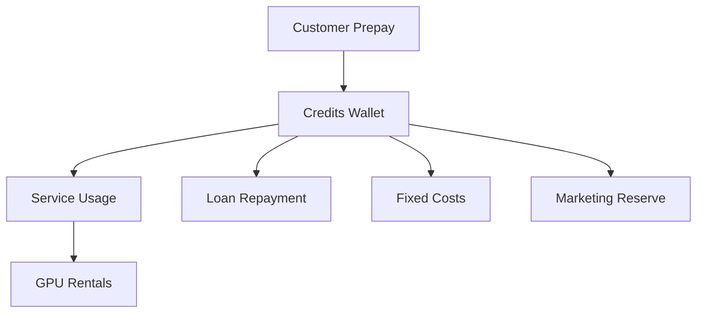
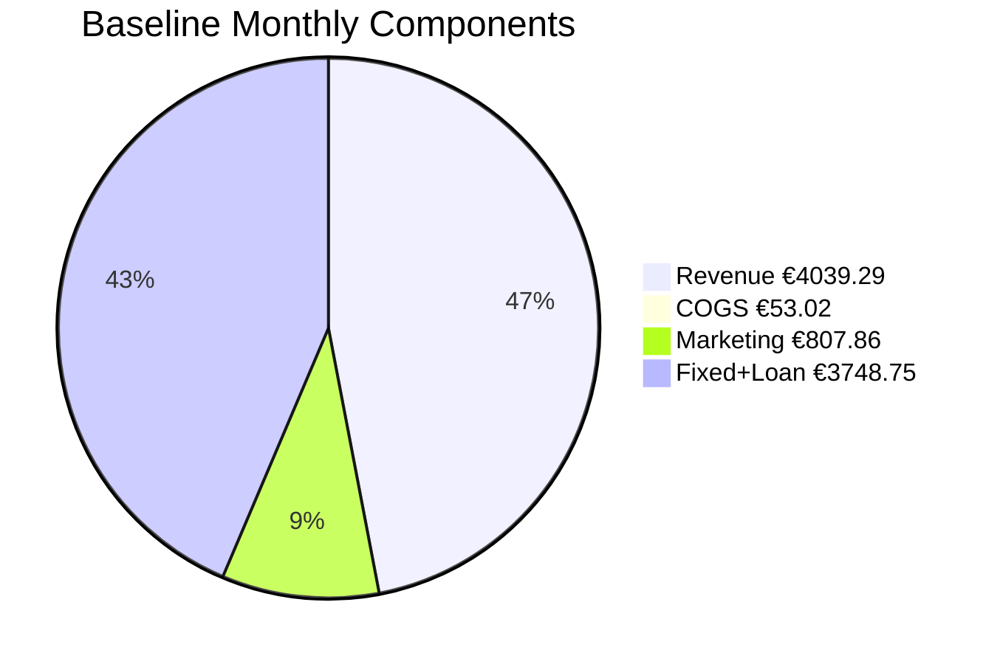

# Financial Plan — Template

## 0) Executive Summary

**Business model (one line):** Prepaid-only AI hosting — no debtors, no refunds, and no idle GPU costs.

- **Loan request:** €30000 for 60 months @ 9.95% (flat)  
- **Monthly repayment:** €748.75 (total repay €44925.0)  
- **Fixed baseline (per month):** personal €3000.0 + business €0.0 + loan €748.75 = **€3748.75**  

**Revenue model:**

- **Public Tap:** flat €0.3 per 1k tokens (no discounts).  
- **Private Tap:** prepaid GPU-hours with markup (provider cost + 50.0%) + management fee.  

**Safeguards:**

- All inflows are prepaid and **non-refundable**.  
- No service without prepaid balance.  
- GPUs are only rented when prepaid demand exists → no over-exposure.  

**Targets:**

- **Required monthly prepaid inflow (baseline):** **€4763.947134324565**  
- **Runway target:** 6 months

### 0.1 Diagram — Prepaid Model Flow (Mermaid)

## 1) Inputs (Ground Truth)

### 1.1 Prepaid Policy

- **Top-up:** min €5, max €1000, expiry 12 months  
- **Refunds:** True (credits are non-refundable, except where legally required)  
- **Auto-refill:** default False, cap €None  
- **Private Tap:** prepaid only; billed in 15 min blocks  
  - Mgmt fee: €99.0/month  
  - GPU-hour markup: 50% above provider cost  
  - FX buffer: 5.0%

---

### 1.2 Catalog (Products Offered)

- **Models (allow-list):** Llama-3.1-8B, Llama-3.1-70B, Mixtral-8x7B, Mixtral-8x22B, Qwen2.5-7B, Qwen2.5-32B, Qwen2.5-72B, Yi-1.5-6B, Yi-1.5-9B, Yi-1.5-34B, DeepSeek-Coder-6.7B, DeepSeek-Coder-33B, DeepSeek-Coder-V2-16B, DeepSeek-Coder-V2-236B  
- **GPUs considered:** A10, A100 40GB (PCIe), A100 80GB (SXM/PCIe), H100 80GB (PCIe/SXM), H200 141GB, L4, L40S, RTX 3090, RTX 4090

---

### 1.3 Price Inputs

- Public Tap prices: defined **per model** (see `price_sheet.csv`)  
  - Example row: Model = Llama 3.1 8B → Sell price = €0.15 / 1k tokens  
- Private Tap markup target: **50.0%** over provider GPU cost  
- Management fee: **€99.0 / month**  

---

### 1.4 Fixed Costs (Monthly)

- Personal baseline: **€3000.0**  
- Business overhead: **€0.0**  
- Loan repayment: **€748.75**  
- **Total fixed costs (with loan): €3748.75**

---

### 1.5 Tax & Billing

- VAT: 21%  
- EU B2B reverse-charge: True  
- Stripe Tax enabled: True  
- Revenue recognition: **prepaid liability until consumed** (prepaid liability until consumed)

---

## 2) Public Tap — Cost & Price per Model

For each model offered on the Public Tap:

- **Provider cost per 1M tokens** is calculated from GPU rental prices (min / median / max across providers).  
- **Sell price per 1M tokens** comes from `price_sheet.csv` (unit_price_eur_per_1k_tokens × 1000).  
- **Gross margin** = Sell price − Provider cost.  

---

### 2.1 Model Economics (per 1M tokens)

| Model | GPU (median) | Cost €/1M (min) | Cost €/1M (median) | Cost €/1M (max) | Sell €/1M | Gross Margin €/1M | Gross Margin % |
|-------|--------------|----------------:|-------------------:|----------------:|----------:|------------------:|---------------:|
| Llama-3.1-8B | RTX 3090 | 0.07 | 0.14 | 0.21 | 150.00 | 149.86 | 99.91 |
| Llama-3.1-70B | RTX 3090 | 6.31 | 13.06 | 19.81 | 1500.00 | 1486.94 | 99.13 |
| Mixtral-8x7B | RTX 3090 | 2.02 | 4.18 | 6.34 | 390.00 | 385.82 | 98.93 |
| Mixtral-8x22B | RTX 3090 | 6.31 | 13.06 | 19.81 | 1350.00 | 1336.94 | 99.03 |
| Qwen2.5-7B | RTX 3090 | 0.24 | 0.50 | 0.75 | 120.00 | 119.50 | 99.59 |
| Qwen2.5-32B | RTX 3090 | 6.31 | 13.06 | 19.81 | 800.00 | 786.94 | 98.37 |
| Qwen2.5-72B | RTX 3090 | 6.31 | 13.06 | 19.81 | 1600.00 | 1586.94 | 99.18 |
| Yi-1.5-6B | RTX 3090 | 6.31 | 13.06 | 19.81 | 100.00 | 86.94 | 86.94 |
| Yi-1.5-9B | RTX 3090 | 6.31 | 13.06 | 19.81 | 140.00 | 126.94 | 90.67 |
| Yi-1.5-34B | RTX 3090 | 6.31 | 13.06 | 19.81 | 900.00 | 886.94 | 98.55 |
| DeepSeek-Coder-6.7B | RTX 3090 | 6.31 | 13.06 | 19.81 | 160.00 | 146.94 | 91.84 |
| DeepSeek-Coder-33B | RTX 3090 | 6.31 | 13.06 | 19.81 | 1300.00 | 1286.94 | 99.00 |
| DeepSeek-Coder-V2-16B | RTX 3090 | 6.31 | 13.06 | 19.81 | 300.00 | 286.94 | 95.65 |
| DeepSeek-Coder-V2-236B | RTX 3090 | 6.31 | 13.06 | 19.81 | 2500.00 | 2486.94 | 99.48 |

#### 2.1.1 Graph — Model Margins

---

### 2.2 Observations

- Models with **negative margin** at median provider prices → move to **Private Tap only**.  
- Models with **stable positive margin** → safe to include in Public Tap.  
- Provider cost ranges already include FX buffer of 5.0%.  
- This table is the **core justification** that the Public Tap can be run profitably.  

---

## 3) Public Tap — Monthly Projection Scenarios

The following scenarios assume:

- All revenue is prepaid.  
- Costs scale linearly with tokens served.  
- Provider costs use **median GPU rental prices** (FX buffer applied).  
- Marketing allocation: 20% of inflow.  

---

### 3.1 Scenario Table (per month)

| Case      | Tokens Sold (M) | Revenue (€) | COGS (€) | Gross Margin (€) | Gross Margin % | Fixed+Loan (€) | Marketing (€) | Net Result (€) |
|-----------|----------------:|------------:|---------:|-----------------:|---------------:|---------------:|--------------:|---------------:|
| Worst     | 1.0 | 807.86 | 10.6 | 797.25 | 98.69 | 3748.75 | 161.57 | **-3113.07** |
| Baseline  | 5.0 | 4039.29 | 53.02 | 3986.27 | 98.69 | 3748.75 | 807.86 | **-570.34** |
| Best      | 15.0 | 12117.86 | 159.05 | 11958.81 | 98.69 | 3748.75 | 2423.57 | **5786.48** |

#### 3.1.1 Chart — Scenario Components

#### 3.1.2 Mermaid — Baseline Components (Pie)

---

### 3.2 Break-even

- **Total fixed monthly costs (personal + business + loan):** €3748.75  
- **Required margin to break even (fixed + marketing):** €4701.539426864913  
- **Required prepaid inflow:** €4763.947134324565  

#### 3.2.1 Chart — Break-even

---

### 3.3 Notes

- Public Tap scales with demand; no idle GPU rentals.  
- Negative net result in **worst case** only reduces profit — not cash runway, since all inflows are prepaid.  
- Best case shows upside potential if adoption is strong.  

---

## 4) Private Tap — Profitability Rules

Private Tap clients prepay for **dedicated GPU-hours** plus a **management fee**.  
Python calculates profitability per GPU as follows:

- **Provider cost €/hr (median)** from `gpu_rentals.csv`  
- **Markup target** from `price_sheet.csv` (% over provider cost)  
- **Sell price €/hr** = Provider cost + Markup  
- **Gross margin €/hr** = Sell price − Provider cost  
- **Management fee €/mo** = fixed fee added to each client  

---

### 4.1 Table — GPU Economics (per hour)

| GPU Model | Provider Cost €/hr (median) | Markup % | Sell Price €/hr | Gross Margin €/hr |
|-----------|----------------------------:|---------:|----------------:|------------------:|
| A10 | 0.95 | 50.00 | 1.42 | 0.47 |
| A100 40GB (PCIe) | 0.94 | 50.00 | 1.41 | 0.47 |
| A100 80GB (SXM/PCIe) | 1.70 | 50.00 | 2.55 | 0.85 |
| H100 80GB (PCIe/SXM) | 2.64 | 50.00 | 3.97 | 1.32 |
| H200 141GB | 6.08 | 50.00 | 9.11 | 3.04 |
| L4 | 0.63 | 50.00 | 0.95 | 0.32 |
| L40S | 0.59 | 50.00 | 0.88 | 0.29 |
| RTX 3090 | 0.75 | 50.00 | 1.13 | 0.38 |
| RTX 4090 | 0.52 | 50.00 | 0.78 | 0.26 |

#### 4.1.1 Chart — GPU Economics

---

### 4.2 Example Client Pack

| Hours Prepaid | GPU Model | Revenue (€) | Provider Cost (€) | Gross Margin (€) | Management Fee (€) | Total Gross Margin (€) |
|---------------|-----------|------------:|-----------------:|-----------------:|-------------------:|-----------------------:|

---

### 4.3 Notes

- **Prepaid only** → no unpaid usage risk.  
- GPUs rented only after payment → no idle cost.  
- Management fee ensures **baseline profitability** even with low GPU usage.  
- Larger prepaid packs amplify gross margin.  

---

## 5) Worst/Best Case Projections

Scenarios combine **Public Tap** and **Private Tap** economics.  
All revenue is prepaid; no refunds. Costs scale linearly with demand.

---

### 5.1 Monthly Scenarios (snapshot)

| Case     | Public Revenue (€) | Private Revenue (€) | Total Revenue (€) | Total COGS (€) | Gross Margin (€) | Fixed+Loan (€) | Marketing (€) | Net (€) |
|----------|-------------------:|--------------------:|------------------:|---------------:|-----------------:|---------------:|--------------:|--------:|
| Worst    | 807.86 | 0.0 | 807.86 | 10.6 | 797.25 | 3748.75 | 161.57 | **-3113.07** |
| Baseline | 4039.29 | 0.0 | 4039.29 | 53.02 | 3986.27 | 3748.75 | 807.86 | **-570.34** |
| Best     | 12117.86 | 0.0 | 12117.86 | 159.05 | 11958.81 | 3748.75 | 2423.57 | **5786.48** |

---

### 5.2 Yearly Projections (12 months)

| Case     | Total Revenue (€) | Total COGS (€) | Gross Margin (€) | Fixed+Loan (€) | Marketing (€) | Net (€) |
|----------|------------------:|---------------:|-----------------:|---------------:|--------------:|--------:|
| Worst    |  | 127.19999999999999 | 9567.0 | 44985.0 | 1938.84 | **-37356.840000000004** |
| Baseline |  | 636.24 | 47835.24 | 44985.0 | 9694.32 | **-6844.08** |
| Best     |  | 1908.6000000000001 | 143505.72 | 44985.0 | 29082.840000000004 | **69437.76** |

---

### 5.3 Loan-Term Projection (60 months)

| Case     | Total Revenue (€) | Total COGS (€) | Gross Margin (€) | Fixed+Loan (€) | Marketing (€) | Net (€) |
|----------|------------------:|---------------:|-----------------:|---------------:|--------------:|--------:|
| Worst    |  | 636.0 | 47835.0 | 224925.0 | 9694.199999999999 | **-186784.2** |
| Baseline |  | 3181.2000000000003 | 239176.2 | 224925.0 | 48471.6 | **-34220.4** |
| Best     |  | 9543.0 | 717528.6 | 224925.0 | 145414.2 | **347188.8** |

---

### 5.4 Notes

- Fixed+Loan already includes **monthly loan repayment €748.75** × 60 months.  
- Marketing allocation: 20% of inflows reserved each period.  
- Net values reflect all obligations — showing repayment ability across full loan term.  

---

## 6) Loan Schedule (60 Months)

Loan request: €30000  
Interest: 9.95% flat, term 60 months  
Monthly payment: **€748.75**  
Total repayment: **€44925.0**  
Total interest: **€14925.0**

---

### 6.1 Repayment Table

| Month | Opening Balance (€) | Interest (€) | Principal (€) | Payment (€) | Closing Balance (€) |
|------:|--------------------:|-------------:|--------------:|------------:|--------------------:|

#### 6.1.1 Chart — Loan Balance Over Time

---

### 6.2 Notes

- Flat interest = equal monthly payments of €748.75.  
- Payment is included in **fixed monthly costs** in all scenarios.  
- Repayment is funded from **prepaid revenue margin** (no credit risk).  
- Closing balance reaches **€0** at month 60.  

---

## 7) Taxes & VAT Set-Aside

All sales are subject to VAT rules in the Netherlands/EU.

---

### 7.1 VAT Policy

- **Standard VAT rate:** 21%  
- **EU B2B reverse-charge:** True  
- **Stripe Tax:** True  
- **Revenue recognition:** prepaid liability until consumed (prepaid liability until consumed)

---

### 7.2 VAT Set-Aside Table (examples)

| Gross Revenue (€) | VAT Rate % | VAT Set-Aside (€) | Net Revenue (€) |
|------------------:|-----------:|-----------------:|----------------:|
| 1000.0 | 21 | 210.0 | 790.0 |
| 10000.0 | 21 | 2100.0 | 7900.0 |
| 100000.0 | 21 | 21000.0 | 79000.0 |

---

### 7.3 Notes

- VAT is automatically collected via Stripe and reserved in a separate account.  
- Net revenue (after VAT) is what funds costs, loan repayment, and margin.  
- EU B2B reverse-charge invoices show €0 VAT but still appear in returns.  
- No risk of “spending VAT by accident” since funds are earmarked.  

---

## 8) Assurances for Lender

This business model is designed to minimize financial risk:

- **Prepaid only** — no service without an active balance.  
- **Non-refundable credits** — all inflows are final (except where legally required).  
- **No idle GPUs** — rentals only occur after prepaid demand is confirmed.  
- **Linear scaling** — each €1 prepaid corresponds to profitable capacity; no over-extension.  
- **Loan repayment embedded in fixed costs** — €748.75 per month for 60 months is always budgeted.  
- **FX buffer applied** — protects against USD/EUR currency swings on GPU rentals.  
- **Marketing spend capped as % of inflow** — prevents runaway acquisition costs.  
- **VAT separated** — reserved at collection, ensuring compliance.  

---

### Why this matters

- No credit risk from customers.  
- No exposure to hardware depreciation (no owned GPUs).  
- No cashflow gaps: inflows always precede outflows.  
- Clear, predictable 60-month repayment plan.  

---

## 9) Appendices

### 9.1 Data Sources

- **Configuration:** `config.yaml` (policies, limits, finance controls)  
- **Costs:** `costs.yaml` (fixed monthly overhead)  
- **Loan:** `lending_plan.yaml` (amount, term, interest, repayment plan)  
- **Pricing:** `price_sheet.csv` (per-model Public Tap prices, Private Tap fees, services)  
- **Models:** `oss_models.csv` (open-source models with parameters, context sizes, licenses)  
- **GPUs:** `gpu_rentals.csv` (provider prices, VRAM, sources)  

---

### 9.2 Engine Outputs (Generated by Python)

- **Model economics:** `model_price_per_1m_tokens.csv`  
- **Scenario tables:** `public_tap_scenarios.csv`, `private-tap-economics.csv`  
- **Break-even targets:** `break_even_targets.csv`  
- **Loan schedule:** `loan_schedule.csv`  
- **VAT set-aside:** `vat_set_aside.csv`  
- **Risk buffers:** `fx_sensitivity.csv`, `provider_price_drift.csv`  

---

### 9.3 Engine Version

- Finance Engine: vv1.0.0  
- Last generated: 2025-09-27T15:02:26Z  

---

### 9.4 Notes

- All monetary values expressed in **EUR** unless otherwise stated.  
- Provider GPU prices in **USD/hour** converted with FX rate 1.08 and buffer 5.0%.  
- Throughput (tokens/sec) is assumed until measured by **llama-orch** telemetry.  
- Template designed to show **inputs, outputs, and safeguards** clearly to lenders.  