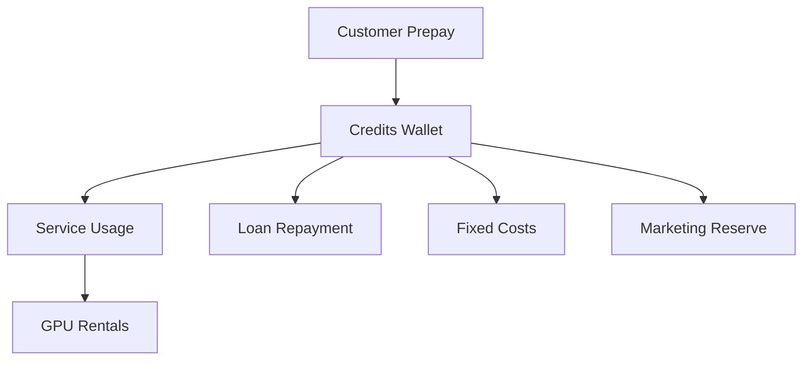
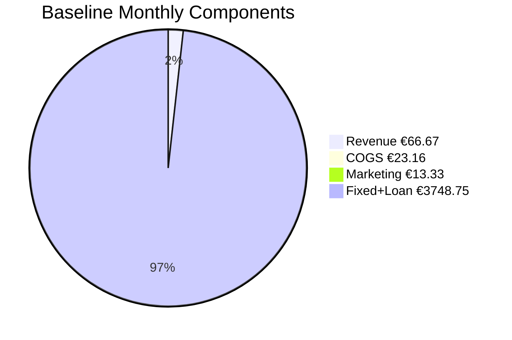

# Financial Plan — Template

## 0) Executive Summary

**Business model (one line):** Prepaid-only AI hosting — no debtors, no refunds, and no idle GPU costs.

- **Loan request:** €30000 for 60 months @ 9.95% (flat)  
- **Monthly repayment:** €748.75 (total repay €44925.0)  
- **Fixed baseline (per month):** personal €3000.0 + business €0.0 + loan €748.75 = **€3748.75**  

**Revenue model:**

- **Public Tap:** per-model prijzen berekend uit beleidsdoel (target marge 45%) en gemeten kosten; blended ≈ €0.0133 per 1k tokens.  
- **Private Tap:** prepaid GPU-uren met opslag (providerkost + 50.0%) + management fee.  

**Safeguards:**

- All inflows are prepaid and **non-refundable**.  
- No service without prepaid balance.  
- GPUs are only rented when prepaid demand exists → no over-exposure.  

**Targets:**

- **Required monthly prepaid inflow (baseline):** **€8282.699955810871**  
- **Runway target:** 6 months

### 0.1 Diagram — Prepaid Model Flow (Mermaid)

## 1) Inputs (Ground Truth)

### 1.1 Prepaid Policy

- **Top-up:** min €5, max €1000, expiry 12 months  
- **Refunds:** True (credits are non-refundable, except where legally required)  
- **Auto-refill:** default False, cap €None  
- **Private Tap:** prepaid only; billed in 15 min blocks  
  - Mgmt fee: €99.0/month  
  - GPU-hour markup: 50% above provider cost  
  - FX buffer: 5.0%

---

### 1.2 Catalog (Products Offered)

- **Models (allow-list):** Llama-3-1-8B, Mixtral-8x7B, Qwen2-5-7B  
- **GPUs considered:** A10, A100 40GB (PCIe), A100 80GB (SXM/PCIe), H100 80GB (PCIe/SXM), H200 141GB, L4, L40S, RTX 3090, RTX 4090

---

### 1.3 Price Inputs

- Public Tap prijzen: per model afgeleid uit kosten (TPS × GPU €/uur met FX buffer) en `inputs/pricing_policy.yaml` (doelen, afronding).  
  - Voorbeeld: Llama 3.1 8B → Verkoopprijs ≈ €N/A / 1k tokens  
- Private Tap markup target: **50.0%** boven provider GPU-kost (optioneel fijnmazig via `gpu_pricing.yaml`)  
- Management fee: **€99.0 / maand**  

---

### 1.4 Fixed Costs (Monthly)

- Personal baseline: **€3000.0**  
- Business overhead: **€0.0**  
- Loan repayment: **€748.75**  
- **Total fixed costs (with loan): €3748.75**

---

### 1.5 Tax & Billing

- VAT: 21%  
- EU B2B reverse-charge: True  
- Stripe Tax enabled: True  
- Revenue recognition: **prepaid liability until consumed** (prepaid liability until consumed)

---

## 2) Public Tap — Cost & Price per Model

For each model offered on the Public Tap:

- **Provider cost per 1M tokens** wordt berekend uit GPU-huurprijzen (min/med/max) met FX-buffer.  
- **Sell price per 1M tokens** wordt afgeleid uit kosten + beleidsdoelmarge en afgerond volgens `pricing_policy.yaml`.  
- **Brutomarge** = Verkoopprijs − Providerkost.  

---

### 2.1 Model Economics (per 1M tokens)

| Model | GPU (median) | Cost €/1M (min) | Cost €/1M (median) | Cost €/1M (max) | Sell €/1M | Gross Margin €/1M | Gross Margin % |
|-------|--------------|----------------:|-------------------:|----------------:|----------:|------------------:|---------------:|
| Llama-3-1-8B | A100 40GB (PCIe) | 0.13 | 0.13 | 0.13 | 10.00 | 9.87 | 98.68 |
| Mixtral-8x7B | H100 80GB (PCIe/SXM) | 13.40 | 13.40 | 13.40 | 20.00 | 6.60 | 33.02 |
| Qwen2-5-7B | A100 40GB (PCIe) | 0.37 | 0.37 | 0.37 | 10.00 | 9.63 | 96.31 |

#### 2.1.1 Graph — Model Margins

---

### 2.2 Observations

- Models with **negative margin** at median provider prices → move to **Private Tap only**.  
- Models with **stable positive margin** → safe to include in Public Tap.  
- Provider cost ranges already include FX buffer of 5.0%.  
- This table is the **core justification** that the Public Tap can be run profitably.  

---

## 3) Public Tap — Monthly Projection Scenarios

The following scenarios assume:

- All revenue is prepaid.  
- Costs scale linearly with tokens served.  
- Provider costs use **median GPU rental prices** (FX buffer applied).  
- Marketing allocation: 20% of inflow.  

---

### 3.1 Scenario Table (per month)

| Case      | Tokens Sold (M) | Revenue (€) | COGS (€) | Gross Margin (€) | Gross Margin % | Fixed+Loan (€) | Marketing (€) | Net Result (€) |
|-----------|----------------:|------------:|---------:|-----------------:|---------------:|---------------:|--------------:|---------------:|
| Worst     | 1.0 | 13.33 | 4.63 | 8.7 | 65.26 | 3748.75 | 2.67 | **-3742.72** |
| Baseline  | 5.0 | 66.67 | 23.16 | 43.51 | 65.26 | 3748.75 | 13.33 | **-3718.58** |
| Best      | 15.0 | 200.0 | 69.48 | 130.52 | 65.26 | 3748.75 | 40.0 | **-3658.23** |

#### 3.1.1 Chart — Scenario Components

#### 3.1.2 Mermaid — Baseline Components (Pie)

---

### 3.2 Break-even

- **Total fixed monthly costs (personal + business + loan):** €3748.75  
- **Required margin to break even (fixed + marketing):** €5405.289991162174  
- **Required prepaid inflow:** €8282.699955810871  

#### 3.2.1 Chart — Break-even

---

### 3.3 Notes

- Public Tap scales with demand; no idle GPU rentals.  
- Negative net result in **worst case** only reduces profit — not cash runway, since all inflows are prepaid.  
- Best case shows upside potential if adoption is strong.  

---

## 4) Private Tap — Profitability Rules

Private Tap clients prepay for **dedicated GPU-hours** plus a **management fee**.  
Python calculates profitability per GPU as follows:

- **Providerkost €/uur (median)** uit `gpu_rentals.csv`  
- **Markup target** uit `config.pricing_inputs` of `gpu_pricing.yaml` (% boven providerkost)  
- **Verkoopprijs €/uur** = Providerkost + Markup  
- **Brutomarge €/uur** = Verkoopprijs − Providerkost  
- **Management fee €/maand** = vaste toeslag per klant  

---

### 4.1 Table — GPU Economics (per hour)

| GPU Model | Provider Cost €/hr (median) | Markup % | Sell Price €/hr | Gross Margin €/hr |
|-----------|----------------------------:|---------:|----------------:|------------------:|
| A10 | 1.12 | 50.00 | 1.68 | 0.56 |
| A100 40GB (PCIe) | 1.26 | 50.00 | 1.90 | 0.63 |
| A100 80GB (SXM/PCIe) | 2.33 | 50.00 | 3.50 | 1.17 |
| H100 80GB (PCIe/SXM) | 3.14 | 50.00 | 4.70 | 1.57 |
| H200 141GB | 9.24 | 50.00 | 13.85 | 4.62 |
| L4 | 0.83 | 50.00 | 1.24 | 0.41 |
| L40S | 0.95 | 50.00 | 1.42 | 0.47 |
| RTX 3090 | 0.83 | 50.00 | 1.24 | 0.41 |
| RTX 4090 | 0.95 | 50.00 | 1.42 | 0.47 |

#### 4.1.1 Chart — GPU Economics

---

### 4.2 Example Client Pack

| Hours Prepaid | GPU Model | Revenue (€) | Provider Cost (€) | Gross Margin (€) | Management Fee (€) | Total Gross Margin (€) |
|---------------|-----------|------------:|-----------------:|-----------------:|-------------------:|-----------------------:|

---

### 4.3 Notes

- **Prepaid only** → no unpaid usage risk.  
- GPUs rented only after payment → no idle cost.  
- Management fee ensures **baseline profitability** even with low GPU usage.  
- Larger prepaid packs amplify gross margin.  

---

## 5) Worst/Best Case Projections

Scenarios combine **Public Tap** and **Private Tap** economics.  
All revenue is prepaid; no refunds. Costs scale linearly with demand.

---

### 5.1 Monthly Scenarios (snapshot)

| Case     | Public Revenue (€) | Private Revenue (€) | Total Revenue (€) | Total COGS (€) | Gross Margin (€) | Fixed+Loan (€) | Marketing (€) | Net (€) |
|----------|-------------------:|--------------------:|------------------:|---------------:|-----------------:|---------------:|--------------:|--------:|
| Worst    | 13.33 | 0.0 | 13.33 | 4.63 | 8.7 | 3748.75 | 2.67 | **-3742.72** |
| Baseline | 66.67 | 0.0 | 66.67 | 23.16 | 43.51 | 3748.75 | 13.33 | **-3718.58** |
| Best     | 200.0 | 0.0 | 200.0 | 69.48 | 130.52 | 3748.75 | 40.0 | **-3658.23** |

---

### 5.2 Yearly Projections (12 months)

| Case     | Total Revenue (€) | Total COGS (€) | Gross Margin (€) | Fixed+Loan (€) | Marketing (€) | Net (€) |
|----------|------------------:|---------------:|-----------------:|---------------:|--------------:|--------:|
| Worst    |  | 55.56 | 104.39999999999999 | 44985.0 | 32.04 | **-44912.64** |
| Baseline |  | 277.92 | 522.12 | 44985.0 | 159.96 | **-44622.96** |
| Best     |  | 833.76 | 1566.2400000000002 | 44985.0 | 480.0 | **-43898.76** |

---

### 5.3 Loan-Term Projection (60 months)

| Case     | Total Revenue (€) | Total COGS (€) | Gross Margin (€) | Fixed+Loan (€) | Marketing (€) | Net (€) |
|----------|------------------:|---------------:|-----------------:|---------------:|--------------:|--------:|
| Worst    |  | 277.8 | 522.0 | 224925.0 | 160.2 | **-224563.19999999998** |
| Baseline |  | 1389.6 | 2610.6 | 224925.0 | 799.8 | **-223114.8** |
| Best     |  | 4168.8 | 7831.200000000001 | 224925.0 | 2400.0 | **-219493.8** |

---

### 5.4 Notes

- Fixed+Loan already includes **monthly loan repayment €748.75** × 60 months.  
- Marketing allocation: 20% of inflows reserved each period.  
- Net values reflect all obligations — showing repayment ability across full loan term.  

---

## 6) Loan Schedule (60 Months)

Loan request: €30000  
Interest: 9.95% flat, term 60 months  
Monthly payment: **€748.75**  
Total repayment: **€44925.0**  
Total interest: **€14925.0**

---

### 6.1 Repayment Table

| Month | Opening Balance (€) | Interest (€) | Principal (€) | Payment (€) | Closing Balance (€) |
|------:|--------------------:|-------------:|--------------:|------------:|--------------------:|

#### 6.1.1 Chart — Loan Balance Over Time

---

### 6.2 Notes

- Flat interest = equal monthly payments of €748.75.  
- Payment is included in **fixed monthly costs** in all scenarios.  
- Repayment is funded from **prepaid revenue margin** (no credit risk).  
- Closing balance reaches **€0** at month 60.  

---

## 7) Taxes & VAT Set-Aside

All sales are subject to VAT rules in the Netherlands/EU.

---

### 7.1 VAT Policy

- **Standard VAT rate:** 21%  
- **EU B2B reverse-charge:** True  
- **Stripe Tax:** True  
- **Revenue recognition:** prepaid liability until consumed (prepaid liability until consumed)

---

### 7.2 VAT Set-Aside Table (examples)

| Gross Revenue (€) | VAT Rate % | VAT Set-Aside (€) | Net Revenue (€) |
|------------------:|-----------:|-----------------:|----------------:|
| 1000.0 | 21 | 210.0 | 790.0 |
| 10000.0 | 21 | 2100.0 | 7900.0 |
| 100000.0 | 21 | 21000.0 | 79000.0 |

---

### 7.3 Notes

- VAT is automatically collected via Stripe and reserved in a separate account.  
- Net revenue (after VAT) is what funds costs, loan repayment, and margin.  
- EU B2B reverse-charge invoices show €0 VAT but still appear in returns.  
- No risk of “spending VAT by accident” since funds are earmarked.  

---

## 8) Assurances for Lender

This business model is designed to minimize financial risk:

- **Prepaid only** — no service without an active balance.  
- **Non-refundable credits** — all inflows are final (except where legally required).  
- **No idle GPUs** — rentals only occur after prepaid demand is confirmed.  
- **Linear scaling** — each €1 prepaid corresponds to profitable capacity; no over-extension.  
- **Loan repayment embedded in fixed costs** — €748.75 per month for 60 months is always budgeted.  
- **FX buffer applied** — protects against USD/EUR currency swings on GPU rentals.  
- **Marketing spend capped as % of inflow** — prevents runaway acquisition costs.  
- **VAT separated** — reserved at collection, ensuring compliance.  

---

### Why this matters

- No credit risk from customers.  
- No exposure to hardware depreciation (no owned GPUs).  
- No cashflow gaps: inflows always precede outflows.  
- Clear, predictable 60-month repayment plan.  

---

## 9) Appendices

### 9.1 Data Sources

- **Configuration:** `config.yaml` (policies, limits, finance controls)  
- **Costs:** `costs.yaml` (fixed monthly overhead)  
- **Loan:** `lending_plan.yaml` (amount, term, interest, repayment plan)  
- **Pricing:** `pricing_policy.yaml` (doelen/afronding); `price_sheet.csv` (metadata/services)  
- **Models:** `oss_models.csv` (open-source models with parameters, context sizes, licenses)  
- **GPUs:** `gpu_rentals.csv` (provider prices, VRAM, sources)  

---

### 9.2 Engine Outputs (Generated by Python)

- **Model economics:** `model_price_per_1m_tokens.csv`  
- **Scenario tables:** `public_tap_scenarios.csv`, `private-tap-economics.csv`  
- **Break-even targets:** `break_even_targets.csv`  
- **Loan schedule:** `loan_schedule.csv`  
- **VAT set-aside:** `vat_set_aside.csv`  
- **Risk buffers:** `fx_sensitivity.csv`, `provider_price_drift.csv`  

---

### 9.3 Engine Version

- Finance Engine: vv1.0.0  
- Last generated: 2025-09-27T17:30:55Z  

---

### 9.4 Notes

- All monetary values expressed in **EUR** unless otherwise stated.  
- Provider GPU prices in **USD/hour** converted with FX rate 1.08 and buffer 5.0%.  
- Throughput (tokens/sec) is assumed until measured by **llama-orch** telemetry.  
- Template designed to show **inputs, outputs, and safeguards** clearly to lenders.  