# Financial Plan — Template

## 0) Executive Summary

**Business model (one line):** Prepaid-only AI hosting — no debtors, no refunds, and no idle GPU costs.

- **Loan request:** €30000 for 60 months @ 9.95% (flat)  
- **Monthly repayment:** €748.75 (total repay €44925.0)  
- **Fixed baseline (per month):** personal €3000.0 + business €0.0 + loan €748.75 = **€3748.75**  

**Revenue model:**

- **Public Tap:** per-model prijzen berekend uit beleidsdoel (target marge 45%) en gemeten kosten; blended ≈ €0.14 per 1k tokens.  
- **Private Tap:** prepaid GPU-uren met opslag (providerkost + 50.0%) + management fee.  

**Safeguards:**

- All inflows are prepaid and **non-refundable**.  
- No service without prepaid balance.  
- GPUs are only rented when prepaid demand exists → no over-exposure.  

**Targets:**

- **Required monthly prepaid inflow (baseline):** **€10036.81392235609**  
- **Runway target:** 6 months

### 0.1 Diagram — Prepaid Model Flow (Mermaid)

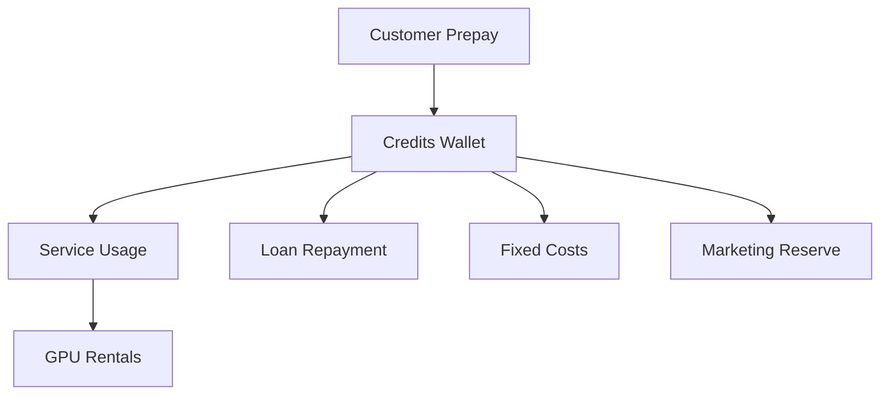

## 1) Inputs (Ground Truth)

### 1.1 Prepaid Policy

- **Top-up:** min €5, max €1000, expiry 12 months  
- **Refunds:** Credits are non-refundable, except where legally required (e.g. statutory consumer rights).  
- **Auto-refill:** default False, cap €None  
- **Private Tap:** prepaid only; billed in 15 min blocks  
  - Mgmt fee: €99.0/month  
  - GPU-hour markup: 50% above provider cost  
  - FX buffer: 5.0%

---

### 1.2 Catalog (Products Offered)

- **Models (allow-list):** Llama-3-1-8B, Qwen2-5-7B, Mixtral-8x7B, DeepSeek-R1-Distill-Llama-8B, Llama-3-3-70B  
- **GPUs considered:** A10, A100 40GB (PCIe), A100 80GB (SXM/PCIe), H100 80GB (PCIe/SXM), H200 141GB, L4, L40S, RTX 3090, RTX 4090

---

### 1.3 Price Inputs

- Public Tap prijzen: per model afgeleid uit kosten (TPS × GPU €/uur met FX buffer) en `inputs/pricing_policy.yaml` (doelen, afronding).  
  - Voorbeeld: Llama 3.1 8B → Verkoopprijs ≈ €0.08 / 1k tokens  
- Private Tap markup target: **50.0%** boven provider GPU-kost (optioneel fijnmazig via `gpu_pricing.yaml`)  
- Management fee: **€99.0 / maand**  

---

### 1.4 Fixed Costs (Monthly)

- Personal baseline: **€3000.0**  
- Business overhead: **€0.0**  
- Loan repayment: **€748.75**  
- **Total fixed costs (with loan): €3748.75**

---

### 1.5 Tax & Billing

- VAT: 21%  
- EU B2B reverse-charge: True  
- Stripe Tax enabled: True  
- Revenue recognition: **prepaid liability until consumed**

---

## 2) Public Tap — Cost & Price per Model

For each model offered on the Public Tap:

- **Provider cost per 1M tokens** wordt berekend uit GPU-huurprijzen (min/med/max) met FX-buffer.  
- **Sell price per 1M tokens** wordt afgeleid uit kosten + beleidsdoelmarge en afgerond volgens `pricing_policy.yaml`.  
- **Brutomarge** = Verkoopprijs − Providerkost.  

---

### 2.1 Model Economics (per 1M tokens)

| Model | GPU (median) | Cost €/1M (min) | Cost €/1M (median) | Cost €/1M (max) | Sell €/1M | Gross Margin €/1M | Gross Margin % |
|-------|--------------|----------------:|-------------------:|----------------:|----------:|------------------:|---------------:|
| Llama-3-1-8B | A100 40GB (PCIe) | 32.28 | 32.28 | 32.28 | 80.00 | 47.72 | 59.65 |
| Qwen2-5-7B | A100 40GB (PCIe) | 32.54 | 32.54 | 32.54 | 80.00 | 47.46 | 59.33 |
| Mixtral-8x7B | H100 80GB (PCIe/SXM) | 214.32 | 214.32 | 214.32 | 480.00 | 265.68 | 55.35 |
| DeepSeek-R1-Distill-Llama-8B | A100 40GB (PCIe) | 44.32 | 44.32 | 44.32 | 100.00 | 55.68 | 55.68 |
| Llama-3-3-70B | H100 80GB (PCIe/SXM) | 403.47 | 403.47 | 403.47 | 910.00 | 506.53 | 55.66 |

#### 2.1.1 Graph — Model Margins

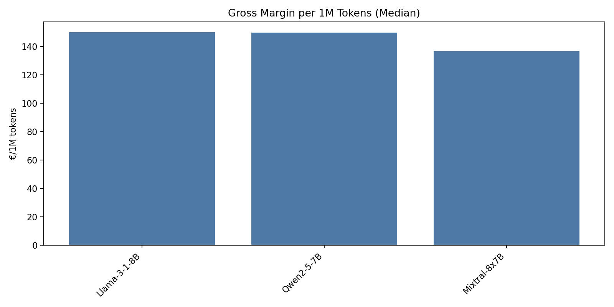

---

### 2.2 Observations

- Models with **negative margin** at median provider prices → move to **Private Tap only**.  
- Models with **stable positive margin** → safe to include in Public Tap.  
- Provider cost ranges already include FX buffer of 5.0%.  
- This table is the **core justification** that the Public Tap can be run profitably.  

---

### 2.3 Acquisitie & Unit Economics (Funnel Driver)

#### 2.3.1 Funnel Snapshot — Baseline

- **Visits:** 1000.0  
- **Signups:** 35.0  
- **Paid New:** 1.75  
- **Free New (OSS users):** 16.225  
- **Marketing (EUR):** €2000.0  

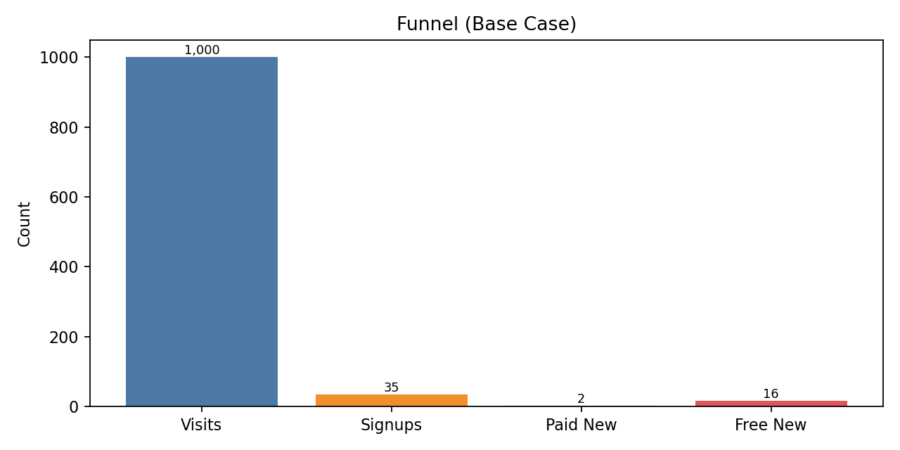

#### 2.3.1b Funnel Snapshot — Worst (Conservative)

- **Visits:** 700.0  
- **Signups:** 14.7  
- **Paid New:** 0.44099999999999995  
- **Free New (OSS users):** 6.9447  
- **Marketing (EUR):** €1400.0  

#### 2.3.1c Funnel Snapshot — Best (Optimistic)

- **Visits:** 1280.8581118384732  
- **Signups:** 53.62568025869548  
- **Paid New:** 3.210726397980913  
- **Free New (OSS users):** 24.67178799589873  
- **Marketing (EUR):** €2600.0  

#### 2.3.2 Unit Economics

| Metric | Value |
|--------|------:|
| ARPU Revenue (€/month) | €210.0 |
| ARPU Contribution (€/month) | €117.49 |
| CAC (blended) | €1142.86 |
| LTV | €2349.9 |
| Payback (months) | 9.7 |

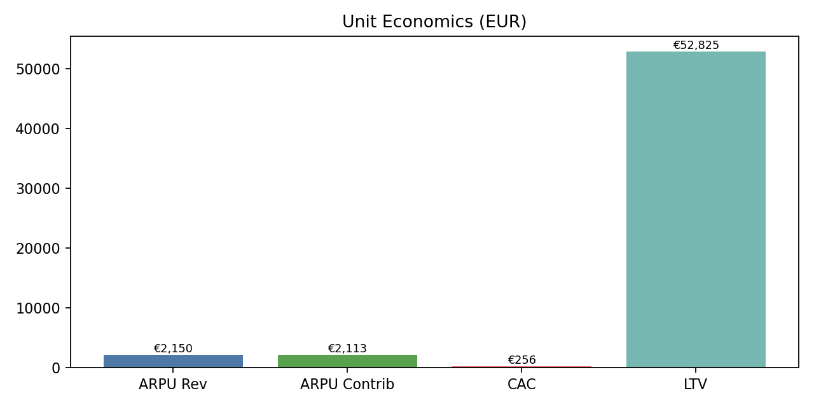

#### 2.3.2b Unit Economics — Worst (Conservative)

| Metric | Value |
|--------|------:|
| ARPU Revenue (€/month) | €168.0 |
| ARPU Contribution (€/month) | €94.0 |
| CAC (blended) | €3174.6 |
| LTV | €1566.6 |
| Payback (months) | 33.8 |

#### 2.3.2c Unit Economics — Best (Optimistic)

| Metric | Value |
|--------|------:|
| ARPU Revenue (€/month) | €231.0 |
| ARPU Contribution (€/month) | €129.24 |
| CAC (blended) | €809.79 |
| LTV | €6462.22 |
| Payback (months) | 6.3 |

> Notes: Worst/Best zijn conservatieve/optimistische schattingen. Werkelijke waarden worden geüpdatet zodra telemetry beschikbaar is (ARPU/churn/CAC).

#### 2.3.3 MRR/ARR

| Metric | Value |
|--------|------:|
| MRR (new cohort) | €367.5 |
| MRR (steady-state) | €7350.0 |
| ARR (steady-state) | €88200.0 |
| Active Paid (steady-state, users) | 35.0 |

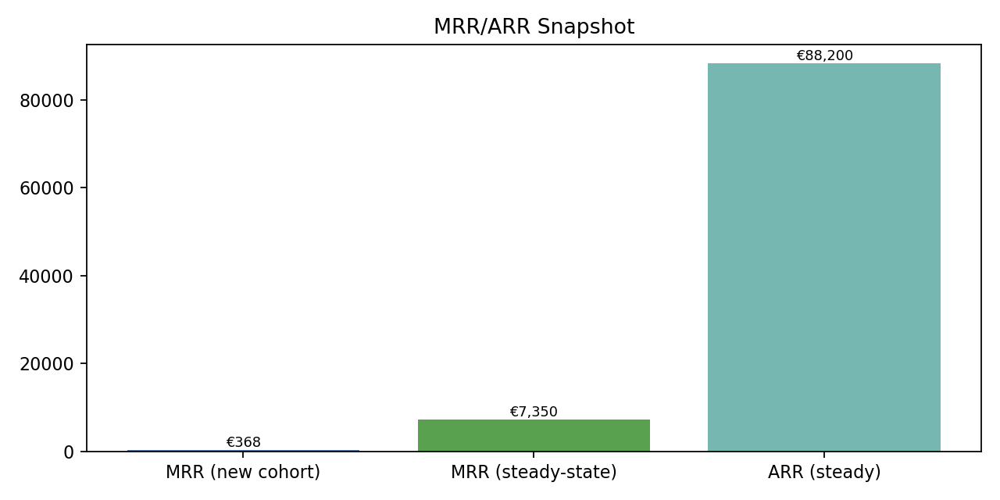

---

## 3) Public Tap — Monthly Projection Scenarios

The following scenarios assume:

- All revenue is prepaid.  
- Costs scale linearly with tokens served.  
- Provider costs use **median GPU rental prices** (FX buffer applied).  
- Marketing allocation: 20% of revenue.  

---

### 3.1 Scenario Table (per month)

| Case      | Tokens Sold (M) | Revenue (€) | COGS (€) | Gross Margin (€) | Gross Margin % | Fixed+Loan (€) | Marketing (€) | Net Result (€) |
|-----------|----------------:|------------:|---------:|-----------------:|---------------:|---------------:|--------------:|---------------:|
| Worst     | 2.05044 | 287.06 | 122.44 | 164.62 | 57.35 | 3748.75 | 57.41 | **-3641.54** |
| Baseline  | 5.869999999999999 | 821.8 | 350.53 | 471.27 | 57.35 | 3748.75 | 164.36 | **-3441.84** |
| Best      | 9.750447196151116 | 1365.06 | 582.26 | 782.81 | 57.35 | 3748.75 | 273.01 | **-3238.96** |

#### 3.1.1 Chart — Scenario Components

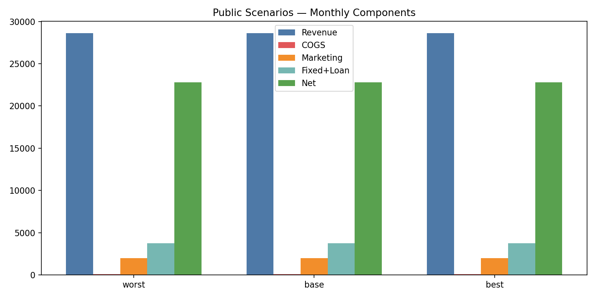

#### 3.1.2 Mermaid — Baseline Components (Pie)

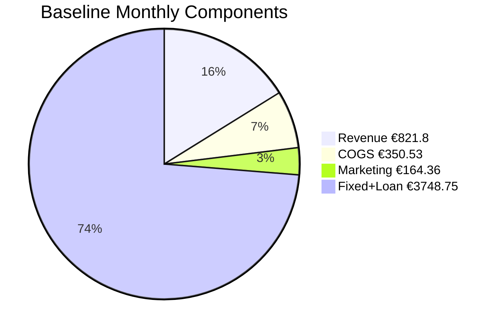

---

### 3.2 Break-even

- **Total fixed monthly costs (personal + business + loan):** €3748.75  
- **Required margin to break even (fixed + marketing):** €5756.112784471218  
- **Required prepaid inflow:** €10036.81392235609  

#### 3.2.1 Chart — Break-even

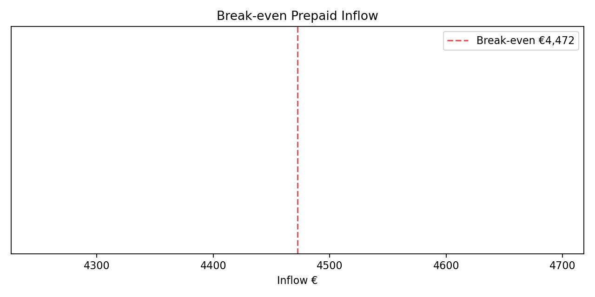

---

### 3.3 Notes

- Public Tap scales with demand; no idle GPU rentals.  
- Negative net result in **worst case** only reduces profit — not cash runway, since all inflows are prepaid.  
- Best case shows upside potential if adoption is strong.  

---

### 3.4 24-Maanden Timeseries (Overzicht)

De onderstaande grafieken geven een overzicht van de ontwikkeling in 24 maanden.

#### 3.4.1 Public Tap Overzicht

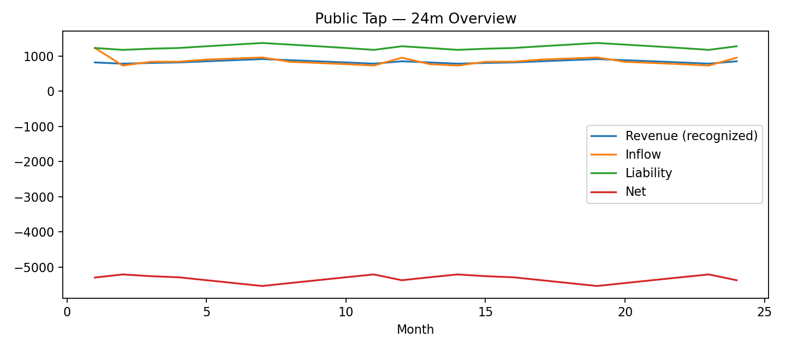

#### 3.4.2 Private Tap Overzicht

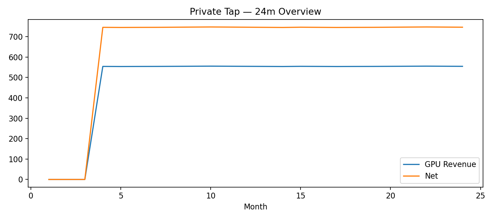

#### 3.4.3 Totaal Overzicht

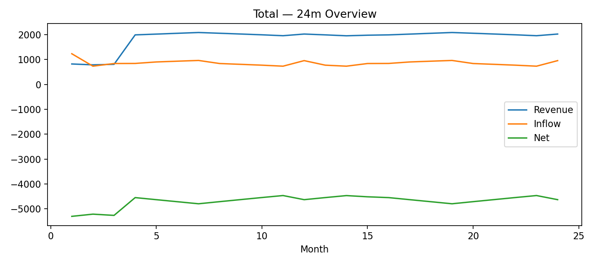

---

## 4) Private Tap — Profitability Rules

Private Tap clients prepay for **dedicated GPU-hours** plus a **management fee**.  
Python calculates profitability per GPU as follows:

- **Providerkost €/uur (median)** uit `gpu_rentals.csv`  
- **Markup target** uit `config.pricing_inputs` of `gpu_pricing.yaml` (% boven providerkost)  
- **Verkoopprijs €/uur** = Providerkost + Markup  
- **Brutomarge €/uur** = Verkoopprijs − Providerkost  
- **Management fee €/maand** = vaste toeslag per klant  

---

### 4.1 Table — GPU Economics (per hour)

| GPU Model | Provider Cost €/hr (median) | Markup % | Sell Price €/hr | Gross Margin €/hr |
|-----------|----------------------------:|---------:|----------------:|------------------:|
| A10 | 1.12 | 45.00 | 1.62 | 0.50 |
| A100 40GB (PCIe) | 1.26 | 45.00 | 1.83 | 0.57 |
| A100 80GB (SXM/PCIe) | 2.33 | 45.00 | 3.38 | 1.05 |
| H100 80GB (PCIe/SXM) | 3.14 | 60.00 | 5.02 | 1.88 |
| H200 141GB | 9.24 | 60.00 | 14.78 | 5.54 |
| L4 | 0.83 | 45.00 | 1.20 | 0.37 |
| L40S | 0.95 | 45.00 | 1.37 | 0.43 |
| RTX 3090 | 0.83 | 50.00 | 1.24 | 0.41 |
| RTX 4090 | 0.95 | 50.00 | 1.42 | 0.47 |

#### 4.1.1 Chart — GPU Economics

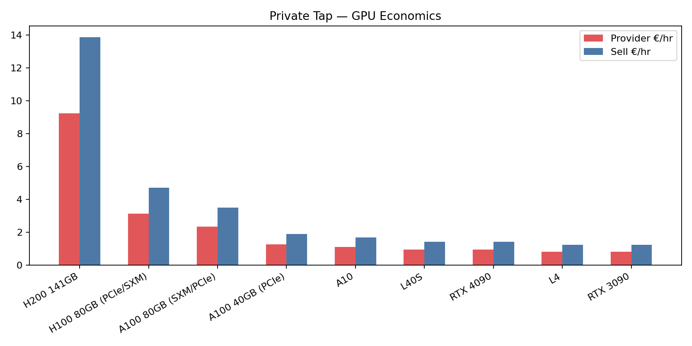

---

### 4.2 Example Client Pack

| Hours Prepaid | GPU Model | Revenue (€) | Provider Cost (€) | Gross Margin (€) | Management Fee (€) | Total Gross Margin (€) |
|---------------|-----------|------------:|-----------------:|-----------------:|-------------------:|-----------------------:|
| 50 | H200 141GB | 738.89 | 461.81 | 277.08 | 99.00 | 376.08 |
| 200 | H200 141GB | 2955.56 | 1847.22 | 1108.33 | 99.00 | 1207.33 |
| 500 | H200 141GB | 7388.89 | 4618.06 | 2770.83 | 99.00 | 2869.83 |

---

### 4.3 Notes

- **Prepaid only** → no unpaid usage risk.  
- GPUs rented only after payment → no idle cost.  
- Management fee ensures **baseline profitability** even with low GPU usage.  
- Larger prepaid packs amplify gross margin.  

---

## 5) Worst/Best Case Projections

Public-only snapshot for scenarios; Private Tap is shown in the 24-month timeseries.  
All revenue is prepaid; no refunds. Costs scale linearly with demand.

---

### 5.1 Monthly Scenarios (snapshot)

| Case     | Public Revenue (€) | Private Revenue (€) | Total Revenue (€) | Total COGS (€) | Gross Margin (€) | Fixed+Loan (€) | Marketing (€) | Net (€) |
|----------|-------------------:|--------------------:|------------------:|---------------:|-----------------:|---------------:|--------------:|--------:|
| Worst    | 287.06 | 0.0 | 287.06 | 122.44 | 164.62 | 3748.75 | 57.41 | **-3641.54** |
| Baseline | 821.8 | 0.0 | 821.8 | 350.53 | 471.27 | 3748.75 | 164.36 | **-3441.84** |
| Best     | 1365.06 | 0.0 | 1365.06 | 582.26 | 782.81 | 3748.75 | 273.01 | **-3238.96** |

---

### 5.2 Yearly Projections (12 months)

| Case     | Total Revenue (€) | Total COGS (€) | Gross Margin (€) | Fixed+Loan (€) | Marketing (€) | Net (€) |
|----------|------------------:|---------------:|-----------------:|---------------:|--------------:|--------:|
| Worst    | 3444.7200000000003 | 1469.28 | 1975.44 | 44985.0 | 688.92 | **-43698.479999999996** |
| Baseline | 9861.599999999999 | 4206.36 | 5655.24 | 44985.0 | 1972.3200000000002 | **-41302.08** |
| Best     | 16380.72 | 6987.12 | 9393.72 | 44985.0 | 3276.12 | **-38867.520000000004** |

---

### 5.3 Loan-Term Projection (60 months)

| Case     | Total Revenue (€) | Total COGS (€) | Gross Margin (€) | Fixed+Loan (€) | Marketing (€) | Net (€) |
|----------|------------------:|---------------:|-----------------:|---------------:|--------------:|--------:|
| Worst    | 17223.6 | 7346.4 | 9877.2 | 224925.0 | 3444.6 | **-218492.4** |
| Baseline | 49308.0 | 21031.8 | 28276.199999999997 | 224925.0 | 9861.6 | **-206510.40000000002** |
| Best     | 81903.59999999999 | 34935.6 | 46968.6 | 224925.0 | 16380.599999999999 | **-194337.6** |

---

### 5.4 Notes

- Fixed+Loan already includes **monthly loan repayment €748.75** × 60 months.  
- Marketing allocation: 20% of revenue reserved each period.  
- Net values reflect all obligations — showing repayment ability across full loan term.  

---

## 6) Loan Schedule (60 Months)

Loan request: €30000  
Interest: 9.95% flat, term 60 months  
Monthly payment: **€748.75**  
Total repayment: **€44925.0**  
Total interest: **€14925.0**

---

### 6.1 Repayment Table

| Month | Opening Balance (€) | Interest (€) | Principal (€) | Payment (€) | Closing Balance (€) |
|------:|--------------------:|-------------:|--------------:|------------:|--------------------:|
| 1.00 | 30000.00 | 248.75 | 500.00 | 748.75 | 29500.00 |
| 2.00 | 29500.00 | 248.75 | 500.00 | 748.75 | 29000.00 |
| 3.00 | 29000.00 | 248.75 | 500.00 | 748.75 | 28500.00 |
| 4.00 | 28500.00 | 248.75 | 500.00 | 748.75 | 28000.00 |
| 5.00 | 28000.00 | 248.75 | 500.00 | 748.75 | 27500.00 |
| 6.00 | 27500.00 | 248.75 | 500.00 | 748.75 | 27000.00 |
| 7.00 | 27000.00 | 248.75 | 500.00 | 748.75 | 26500.00 |
| 8.00 | 26500.00 | 248.75 | 500.00 | 748.75 | 26000.00 |
| 9.00 | 26000.00 | 248.75 | 500.00 | 748.75 | 25500.00 |
| 10.00 | 25500.00 | 248.75 | 500.00 | 748.75 | 25000.00 |
| 11.00 | 25000.00 | 248.75 | 500.00 | 748.75 | 24500.00 |
| 12.00 | 24500.00 | 248.75 | 500.00 | 748.75 | 24000.00 |
| 13.00 | 24000.00 | 248.75 | 500.00 | 748.75 | 23500.00 |
| 14.00 | 23500.00 | 248.75 | 500.00 | 748.75 | 23000.00 |
| 15.00 | 23000.00 | 248.75 | 500.00 | 748.75 | 22500.00 |
| 16.00 | 22500.00 | 248.75 | 500.00 | 748.75 | 22000.00 |
| 17.00 | 22000.00 | 248.75 | 500.00 | 748.75 | 21500.00 |
| 18.00 | 21500.00 | 248.75 | 500.00 | 748.75 | 21000.00 |
| 19.00 | 21000.00 | 248.75 | 500.00 | 748.75 | 20500.00 |
| 20.00 | 20500.00 | 248.75 | 500.00 | 748.75 | 20000.00 |
| 21.00 | 20000.00 | 248.75 | 500.00 | 748.75 | 19500.00 |
| 22.00 | 19500.00 | 248.75 | 500.00 | 748.75 | 19000.00 |
| 23.00 | 19000.00 | 248.75 | 500.00 | 748.75 | 18500.00 |
| 24.00 | 18500.00 | 248.75 | 500.00 | 748.75 | 18000.00 |
| 25.00 | 18000.00 | 248.75 | 500.00 | 748.75 | 17500.00 |
| 26.00 | 17500.00 | 248.75 | 500.00 | 748.75 | 17000.00 |
| 27.00 | 17000.00 | 248.75 | 500.00 | 748.75 | 16500.00 |
| 28.00 | 16500.00 | 248.75 | 500.00 | 748.75 | 16000.00 |
| 29.00 | 16000.00 | 248.75 | 500.00 | 748.75 | 15500.00 |
| 30.00 | 15500.00 | 248.75 | 500.00 | 748.75 | 15000.00 |
| 31.00 | 15000.00 | 248.75 | 500.00 | 748.75 | 14500.00 |
| 32.00 | 14500.00 | 248.75 | 500.00 | 748.75 | 14000.00 |
| 33.00 | 14000.00 | 248.75 | 500.00 | 748.75 | 13500.00 |
| 34.00 | 13500.00 | 248.75 | 500.00 | 748.75 | 13000.00 |
| 35.00 | 13000.00 | 248.75 | 500.00 | 748.75 | 12500.00 |
| 36.00 | 12500.00 | 248.75 | 500.00 | 748.75 | 12000.00 |
| 37.00 | 12000.00 | 248.75 | 500.00 | 748.75 | 11500.00 |
| 38.00 | 11500.00 | 248.75 | 500.00 | 748.75 | 11000.00 |
| 39.00 | 11000.00 | 248.75 | 500.00 | 748.75 | 10500.00 |
| 40.00 | 10500.00 | 248.75 | 500.00 | 748.75 | 10000.00 |
| 41.00 | 10000.00 | 248.75 | 500.00 | 748.75 | 9500.00 |
| 42.00 | 9500.00 | 248.75 | 500.00 | 748.75 | 9000.00 |
| 43.00 | 9000.00 | 248.75 | 500.00 | 748.75 | 8500.00 |
| 44.00 | 8500.00 | 248.75 | 500.00 | 748.75 | 8000.00 |
| 45.00 | 8000.00 | 248.75 | 500.00 | 748.75 | 7500.00 |
| 46.00 | 7500.00 | 248.75 | 500.00 | 748.75 | 7000.00 |
| 47.00 | 7000.00 | 248.75 | 500.00 | 748.75 | 6500.00 |
| 48.00 | 6500.00 | 248.75 | 500.00 | 748.75 | 6000.00 |
| 49.00 | 6000.00 | 248.75 | 500.00 | 748.75 | 5500.00 |
| 50.00 | 5500.00 | 248.75 | 500.00 | 748.75 | 5000.00 |
| 51.00 | 5000.00 | 248.75 | 500.00 | 748.75 | 4500.00 |
| 52.00 | 4500.00 | 248.75 | 500.00 | 748.75 | 4000.00 |
| 53.00 | 4000.00 | 248.75 | 500.00 | 748.75 | 3500.00 |
| 54.00 | 3500.00 | 248.75 | 500.00 | 748.75 | 3000.00 |
| 55.00 | 3000.00 | 248.75 | 500.00 | 748.75 | 2500.00 |
| 56.00 | 2500.00 | 248.75 | 500.00 | 748.75 | 2000.00 |
| 57.00 | 2000.00 | 248.75 | 500.00 | 748.75 | 1500.00 |
| 58.00 | 1500.00 | 248.75 | 500.00 | 748.75 | 1000.00 |
| 59.00 | 1000.00 | 248.75 | 500.00 | 748.75 | 500.00 |
| 60.00 | 500.00 | 248.75 | 500.00 | 748.75 | 0.00 |

#### 6.1.1 Chart — Loan Balance Over Time

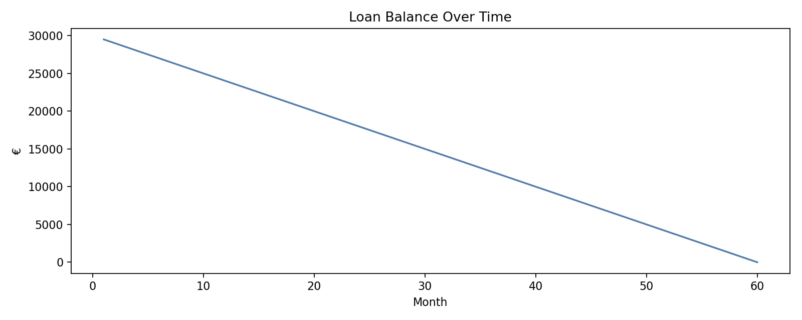

---

### 6.2 Notes

- Flat interest = equal monthly payments of €748.75.  
- Payment is included in **fixed monthly costs** in all scenarios.  
- Repayment is funded from **prepaid revenue margin** (no credit risk).  
- Closing balance reaches **€0** at month 60.  

---

## 7) Taxes & VAT Set-Aside

All sales are subject to VAT rules in the Netherlands/EU.

---

### 7.1 VAT Policy

- **Standard VAT rate:** 21%  
- **EU B2B reverse-charge:** True  
- **Stripe Tax:** True  
- **Revenue recognition:** prepaid liability until consumed

---

### 7.2 VAT Set-Aside Table (examples)

| Gross Revenue (€) | VAT Rate % | VAT Set-Aside (€) | Net Revenue (€) |
|------------------:|-----------:|-----------------:|----------------:|
| 1000.0 | 21 | 210.0 | 790.0 |
| 10000.0 | 21 | 2100.0 | 7900.0 |
| 100000.0 | 21 | 21000.0 | 79000.0 |

---

### 7.3 Notes

- VAT is automatically collected via Stripe and reserved in a separate account.  
- Net revenue (after VAT) is what funds costs, loan repayment, and margin.  
- EU B2B reverse-charge invoices show €0 VAT but still appear in returns.  
- No risk of “spending VAT by accident” since funds are earmarked.  

---

## 8) Assurances for Lender

This business model is designed to minimize financial risk:

- **Prepaid only** — no service without an active balance.  
- **Non-refundable credits** — all inflows are final (except where legally required).  
- **No idle GPUs** — rentals only occur after prepaid demand is confirmed.  
- **Linear scaling** — each €1 prepaid corresponds to profitable capacity; no over-extension.  
- **Loan repayment embedded in fixed costs** — €748.75 per month for 60 months is always budgeted.  
- **FX buffer applied** — protects against USD/EUR currency swings on GPU rentals.  
- **Marketing spend capped as % of revenue** — prevents runaway acquisition costs.  
- **VAT separated** — reserved at collection, ensuring compliance.  

---

### Why this matters

- No credit risk from customers.  
- No exposure to hardware depreciation (no owned GPUs).  
- No cashflow gaps: inflows always precede outflows.  
- Clear, predictable 60-month repayment plan.  

---

## 9) Appendices

### 9.1 Data Sources

- **Configuration (legacy):** `config.yaml`, `pricing_policy.yaml`  
- **Market (legacy):** `scenarios.yaml`, `acquisition.yaml`, `seasonality.yaml`, `competitor_benchmarks.yaml`  
- **Finance (legacy):** `lending_plan.yaml`, `billing.yaml`, `private_sales.yaml`, `costs.yaml`, `timeseries.yaml`  
- **Consolidated (preferred):** `settings.yaml`, `market.yaml`, `finance.yaml`  
- **Catalog:** `oss_models.csv` (open-source models with parameters, context sizes, licenses)  
- **GPUs:** `gpu_rentals.csv` (provider prices, VRAM, sources)  

---

### 9.2 Engine Outputs (Generated by Python)

- **Model economics:** `model_price_per_1m_tokens.csv`  
- **Scenario tables:** `public_tap_scenarios.csv`, `private-tap-economics.csv`  
- **Break-even targets:** `break_even_targets.csv`  
- **Loan schedule:** `loan_schedule.csv`  
- **VAT set-aside:** `vat_set_aside.csv`  
- **Risk buffers:** `fx_sensitivity.csv`, `provider_price_drift.csv`  

---

### 9.3 Engine Version

- Finance Engine: v1.0.0  
- Last generated: 2025-09-28T10:32:36Z  

---

### 9.4 Notes

- All monetary values expressed in **EUR** unless otherwise stated.  
- Provider GPU prices in **USD/hour** converted with FX rate 1.08 and buffer 5.0%.  
- Throughput (tokens/sec) is assumed until measured by **llama-orch** telemetry.  
- Template designed to show **inputs, outputs, and safeguards** clearly to lenders.  

---

## 10) Data Quality Legend

- **Measured:** gpu_rentals.csv: provider USD/hour, tps_model_gpu.csv: throughput_tokens_per_sec  
- **Policy:** inputs/config.yaml: prepaid_policy, tax_billing, finance, inputs/pricing_policy.yaml: public_tap targets, rounding, caps  
- **Estimated:** pricing_inputs.effective_utilization_pct, pricing_inputs.non_gpu_overhead_multiplier_on_cost, seasonality.yaml: diminishing_returns (CPC slope), funnel_overrides.yaml: scenario multipliers  