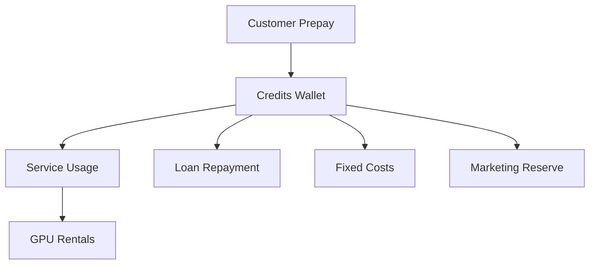

# Financial Plan — Template

## 0) Executive Summary

**Business model (one line):** Prepaid-only AI hosting — no debtors, no refunds, and no idle GPU costs.

- **Loan request:** €{{loan.amount_eur}} for {{loan.term_months}} months @ {{loan.interest_rate_pct}}% (flat)  
- **Monthly repayment:** €{{loan.monthly_payment_eur}} (total repay €{{loan.total_repayment_eur}})  
- **Fixed baseline (per month):** personal €{{fixed.personal}} + business €{{fixed.business}} + loan €{{loan.monthly_payment_eur}} = **€{{fixed.total_with_loan}}**  

**Revenue model:**

- **Public Tap:** per-model prijzen berekend uit beleidsdoel (target marge {{pricing.policy.target_gross_margin_pct}}%) en gemeten kosten; blended ≈ €{{pricing.public_tap_blended_price_per_1k_tokens}} per 1k tokens.  
- **Private Tap:** prepaid GPU-uren met opslag (providerkost + {{pricing.private_tap_default_markup_over_provider_cost_pct}}%) + management fee.  

**Safeguards:**

- All inflows are prepaid and **non-refundable**.  
- No service without prepaid balance.  
- GPUs are only rented when prepaid demand exists → no over-exposure.  

**Targets:**

- **Required monthly prepaid inflow (baseline):** **€{{targets.required_prepaid_inflow_eur}}**  
- **Runway target:** {{finance.runway_target_months}} months

### 0.1 Diagram — Prepaid Model Flow (Mermaid)

## 1) Inputs (Ground Truth)

### 1.1 Prepaid Policy

- **Top-up:** min €{{prepaid.min_topup_eur}}, max €{{prepaid.max_topup_eur}}, expiry {{prepaid.expiry_months}} months  
- **Refunds:** {{prepaid.non_refundable}} (credits are non-refundable, except where legally required)  
- **Auto-refill:** default {{prepaid.auto_refill_default_enabled}}, cap €{{prepaid.auto_refill_cap_eur}}  
- **Private Tap:** prepaid only; billed in {{prepaid.private_tap.billing_unit_minutes}} min blocks  
  - Mgmt fee: €{{private.management_fee_eur_per_month}}/month  
  - GPU-hour markup: {{private.default_markup_over_cost_pct}}% above provider cost  
  - FX buffer: {{pricing.fx_buffer_pct}}%

---

### 1.2 Catalog (Products Offered)

- **Models (allow-list):** {{catalog.allowed_models|join(", ")}}  
- **GPUs considered:** {{catalog.allowed_gpus|join(", ")}}

---

### 1.3 Price Inputs

- Public Tap prijzen: per model afgeleid uit kosten (TPS × GPU €/uur met FX buffer) en `inputs/pricing_policy.yaml` (doelen, afronding).  
  - Voorbeeld: Llama 3.1 8B → Verkoopprijs ≈ €{{ pricing.model_prices.get('Llama-3.1-8B', 'N/A') }} / 1k tokens  
- Private Tap markup target: **{{pricing.private_tap_default_markup_over_provider_cost_pct}}%** boven provider GPU-kost (optioneel fijnmazig via `gpu_pricing.yaml`)  
- Management fee: **€{{private.management_fee_eur_per_month}} / maand**  

---

### 1.4 Fixed Costs (Monthly)

- Personal baseline: **€{{fixed.personal}}**  
- Business overhead: **€{{fixed.business}}**  
- Loan repayment: **€{{loan.monthly_payment_eur}}**  
- **Total fixed costs (with loan): €{{fixed.total_with_loan}}**

---

### 1.5 Tax & Billing

- VAT: {{tax.vat_standard_rate_pct}}%  
- EU B2B reverse-charge: {{tax.eu_reverse_charge_enabled}}  
- Stripe Tax enabled: {{tax.stripe_tax_enabled}}  
- Revenue recognition: **{{tax.revenue_recognition}}** (prepaid liability until consumed)

---

## 2) Public Tap — Cost & Price per Model

For each model offered on the Public Tap:

- **Provider cost per 1M tokens** wordt berekend uit GPU-huurprijzen (min/med/max) met FX-buffer.  
- **Sell price per 1M tokens** wordt afgeleid uit kosten + beleidsdoelmarge en afgerond volgens `pricing_policy.yaml`.  
- **Brutomarge** = Verkoopprijs − Providerkost.  

---

### 2.1 Model Economics (per 1M tokens)

| Model | GPU (median) | Cost €/1M (min) | Cost €/1M (median) | Cost €/1M (max) | Sell €/1M | Gross Margin €/1M | Gross Margin % |
|-------|--------------|----------------:|-------------------:|----------------:|----------:|------------------:|---------------:|
{{tables.model_price_per_1m_tokens}}

#### 2.1.1 Graph — Model Margins

 }})

---

### 2.2 Observations

- Models with **negative margin** at median provider prices → move to **Private Tap only**.  
- Models with **stable positive margin** → safe to include in Public Tap.  
- Provider cost ranges already include FX buffer of {{pricing.fx_buffer_pct}}%.  
- This table is the **core justification** that the Public Tap can be run profitably.  

---

### 2.3 Acquisitie & Unit Economics (Funnel Driver)



#### 2.3.1 Funnel Snapshot — Baseline

- **Visits:** {{ acquisition.funnel_base.visits | default(0) }}  
- **Signups:** {{ acquisition.funnel_base.signups | default(0) }}  
- **Paid New:** {{ acquisition.funnel_base.paid_new | default(0) }}  
- **Free New (OSS users):** {{ acquisition.funnel_base.free_new | default(0) }}  
- **Marketing (EUR):** €{{ acquisition.funnel_base.marketing_eur | default(0) }}  





#### 2.3.2 Unit Economics

| Metric | Value |
|--------|------:|
| ARPU Revenue (€/month) | €{{ acquisition.unit_economics.arpu_revenue_eur | default(0) }} |
| ARPU Contribution (€/month) | €{{ acquisition.unit_economics.arpu_contribution_eur | default(0) }} |
| CAC (blended) | €{{ acquisition.unit_economics.cac_eur }}N/A |
| LTV | €{{ acquisition.unit_economics.ltv_eur }}N/A |
| Payback (months) | {{ acquisition.unit_economics.payback_months }}N/A |





#### 2.3.3 MRR/ARR

| Metric | Value |
|--------|------:|
| MRR (new cohort) | €{{ acquisition.unit_economics.mrr_snapshot_eur | default(0) }} |
| MRR (steady-state) | €{{ acquisition.unit_economics.mrr_steady_eur | default(0) }} |
| ARR (steady-state) | €{{ acquisition.unit_economics.arr_steady_eur | default(0) }} |
| Active Paid (steady-state, users) | {{ acquisition.unit_economics.active_paid_steady | default(0) }} |







> Scenario-driver is ingesteld op "tokens". Schakel over naar `driver: funnel` in `inputs/scenarios.yaml` en voeg `inputs/acquisition.yaml` toe om deze sectie te activeren.



---

## 3) Public Tap — Monthly Projection Scenarios

The following scenarios assume:

- All revenue is prepaid.  
- Costs scale linearly with tokens served.  
- Provider costs use **median GPU rental prices** (FX buffer applied).  
- Marketing allocation: {{finance.marketing_allocation_pct_of_inflow}}% of inflow.  

---

### 3.1 Scenario Table (per month)

| Case      | Tokens Sold (M) | Revenue (€) | COGS (€) | Gross Margin (€) | Gross Margin % | Fixed+Loan (€) | Marketing (€) | Net Result (€) |
|-----------|----------------:|------------:|---------:|-----------------:|---------------:|---------------:|--------------:|---------------:|
| Worst     | {{scenarios.worst.m_tokens}} | {{scenarios.worst.revenue_eur}} | {{scenarios.worst.cogs_eur}} | {{scenarios.worst.gross_margin_eur}} | {{scenarios.worst.gross_margin_pct}} | {{fixed.total_with_loan}} | {{scenarios.worst.marketing_reserved_eur}} | **{{scenarios.worst.net_eur}}** |
| Baseline  | {{scenarios.base.m_tokens}} | {{scenarios.base.revenue_eur}} | {{scenarios.base.cogs_eur}} | {{scenarios.base.gross_margin_eur}} | {{scenarios.base.gross_margin_pct}} | {{fixed.total_with_loan}} | {{scenarios.base.marketing_reserved_eur}} | **{{scenarios.base.net_eur}}** |
| Best      | {{scenarios.best.m_tokens}} | {{scenarios.best.revenue_eur}} | {{scenarios.best.cogs_eur}} | {{scenarios.best.gross_margin_eur}} | {{scenarios.best.gross_margin_pct}} | {{fixed.total_with_loan}} | {{scenarios.best.marketing_reserved_eur}} | **{{scenarios.best.net_eur}}** |

#### 3.1.1 Chart — Scenario Components

 }})

#### 3.1.2 Mermaid — Baseline Components (Pie)

---

### 3.2 Break-even

- **Total fixed monthly costs (personal + business + loan):** €{{fixed.total_with_loan}}  
- **Required margin to break even (fixed + marketing):** €{{targets.required_margin_eur}}  
- **Required prepaid inflow:** €{{targets.required_prepaid_inflow_eur}}  

#### 3.2.1 Chart — Break-even

 }})

---

### 3.3 Notes

- Public Tap scales with demand; no idle GPU rentals.  
- Negative net result in **worst case** only reduces profit — not cash runway, since all inflows are prepaid.  
- Best case shows upside potential if adoption is strong.  

---

## 4) Private Tap — Profitability Rules

Private Tap clients prepay for **dedicated GPU-hours** plus a **management fee**.  
Python calculates profitability per GPU as follows:

- **Providerkost €/uur (median)** uit `gpu_rentals.csv`  
- **Markup target** uit `config.pricing_inputs` of `gpu_pricing.yaml` (% boven providerkost)  
- **Verkoopprijs €/uur** = Providerkost + Markup  
- **Brutomarge €/uur** = Verkoopprijs − Providerkost  
- **Management fee €/maand** = vaste toeslag per klant  

---

### 4.1 Table — GPU Economics (per hour)

| GPU Model | Provider Cost €/hr (median) | Markup % | Sell Price €/hr | Gross Margin €/hr |
|-----------|----------------------------:|---------:|----------------:|------------------:|
{{tables.private_tap_gpu_economics}}

#### 4.1.1 Chart — GPU Economics

 }})

---

### 4.2 Example Client Pack

| Hours Prepaid | GPU Model | Revenue (€) | Provider Cost (€) | Gross Margin (€) | Management Fee (€) | Total Gross Margin (€) |
|---------------|-----------|------------:|-----------------:|-----------------:|-------------------:|-----------------------:|
{{tables.private_tap_example_pack}}

---

### 4.3 Notes

- **Prepaid only** → no unpaid usage risk.  
- GPUs rented only after payment → no idle cost.  
- Management fee ensures **baseline profitability** even with low GPU usage.  
- Larger prepaid packs amplify gross margin.  

---

## 5) Worst/Best Case Projections

Scenarios combine **Public Tap** and **Private Tap** economics.  
All revenue is prepaid; no refunds. Costs scale linearly with demand.

---

### 5.1 Monthly Scenarios (snapshot)

| Case     | Public Revenue (€) | Private Revenue (€) | Total Revenue (€) | Total COGS (€) | Gross Margin (€) | Fixed+Loan (€) | Marketing (€) | Net (€) |
|----------|-------------------:|--------------------:|------------------:|---------------:|-----------------:|---------------:|--------------:|--------:|
| Worst    | {{scenarios.monthly.worst.public_revenue}} | {{scenarios.monthly.worst.private_revenue}} | {{scenarios.monthly.worst.total_revenue}} | {{scenarios.monthly.worst.cogs}} | {{scenarios.monthly.worst.gross}} | {{fixed.total_with_loan}} | {{scenarios.monthly.worst.marketing}} | **{{scenarios.monthly.worst.net}}** |
| Baseline | {{scenarios.monthly.base.public_revenue}} | {{scenarios.monthly.base.private_revenue}} | {{scenarios.monthly.base.total_revenue}} | {{scenarios.monthly.base.cogs}} | {{scenarios.monthly.base.gross}} | {{fixed.total_with_loan}} | {{scenarios.monthly.base.marketing}} | **{{scenarios.monthly.base.net}}** |
| Best     | {{scenarios.monthly.best.public_revenue}} | {{scenarios.monthly.best.private_revenue}} | {{scenarios.monthly.best.total_revenue}} | {{scenarios.monthly.best.cogs}} | {{scenarios.monthly.best.gross}} | {{fixed.total_with_loan}} | {{scenarios.monthly.best.marketing}} | **{{scenarios.monthly.best.net}}** |

---

### 5.2 Yearly Projections (12 months)

| Case     | Total Revenue (€) | Total COGS (€) | Gross Margin (€) | Fixed+Loan (€) | Marketing (€) | Net (€) |
|----------|------------------:|---------------:|-----------------:|---------------:|--------------:|--------:|
| Worst    | {{scenarios.yearly.worst.revenue}} | {{scenarios.yearly.worst.cogs}} | {{scenarios.yearly.worst.gross}} | {{scenarios.yearly.fixed_total}} | {{scenarios.yearly.worst.marketing}} | **{{scenarios.yearly.worst.net}}** |
| Baseline | {{scenarios.yearly.base.revenue}} | {{scenarios.yearly.base.cogs}} | {{scenarios.yearly.base.gross}} | {{scenarios.yearly.fixed_total}} | {{scenarios.yearly.base.marketing}} | **{{scenarios.yearly.base.net}}** |
| Best     | {{scenarios.yearly.best.revenue}} | {{scenarios.yearly.best.cogs}} | {{scenarios.yearly.best.gross}} | {{scenarios.yearly.fixed_total}} | {{scenarios.yearly.best.marketing}} | **{{scenarios.yearly.best.net}}** |

---

### 5.3 Loan-Term Projection (60 months)

| Case     | Total Revenue (€) | Total COGS (€) | Gross Margin (€) | Fixed+Loan (€) | Marketing (€) | Net (€) |
|----------|------------------:|---------------:|-----------------:|---------------:|--------------:|--------:|
| Worst    | {{scenarios['60m'].worst.revenue}} | {{scenarios['60m'].worst.cogs}} | {{scenarios['60m'].worst.gross}} | {{scenarios['60m'].fixed_total}} | {{scenarios['60m'].worst.marketing}} | **{{scenarios['60m'].worst.net}}** |
| Baseline | {{scenarios['60m'].base.revenue}} | {{scenarios['60m'].base.cogs}} | {{scenarios['60m'].base.gross}} | {{scenarios['60m'].fixed_total}} | {{scenarios['60m'].base.marketing}} | **{{scenarios['60m'].base.net}}** |
| Best     | {{scenarios['60m'].best.revenue}} | {{scenarios['60m'].best.cogs}} | {{scenarios['60m'].best.gross}} | {{scenarios['60m'].fixed_total}} | {{scenarios['60m'].best.marketing}} | **{{scenarios['60m'].best.net}}** |

---

### 5.4 Notes

- Fixed+Loan already includes **monthly loan repayment €{{loan.monthly_payment_eur}}** × 60 months.  
- Marketing allocation: {{finance.marketing_allocation_pct_of_inflow}}% of inflows reserved each period.  
- Net values reflect all obligations — showing repayment ability across full loan term.  

---

## 6) Loan Schedule (60 Months)

Loan request: €{{loan.amount_eur}}  
Interest: {{loan.interest_rate_pct}}% flat, term {{loan.term_months}} months  
Monthly payment: **€{{loan.monthly_payment_eur}}**  
Total repayment: **€{{loan.total_repayment_eur}}**  
Total interest: **€{{loan.total_interest_eur}}**

---

### 6.1 Repayment Table

| Month | Opening Balance (€) | Interest (€) | Principal (€) | Payment (€) | Closing Balance (€) |
|------:|--------------------:|-------------:|--------------:|------------:|--------------------:|
{{tables.loan_schedule}}

#### 6.1.1 Chart — Loan Balance Over Time

 }})

---

### 6.2 Notes

- Flat interest = equal monthly payments of €{{loan.monthly_payment_eur}}.  
- Payment is included in **fixed monthly costs** in all scenarios.  
- Repayment is funded from **prepaid revenue margin** (no credit risk).  
- Closing balance reaches **€0** at month 60.  

---

## 7) Taxes & VAT Set-Aside

All sales are subject to VAT rules in the Netherlands/EU.

---

### 7.1 VAT Policy

- **Standard VAT rate:** {{tax.vat_standard_rate_pct}}%  
- **EU B2B reverse-charge:** {{tax.eu_reverse_charge_enabled}}  
- **Stripe Tax:** {{tax.stripe_tax_enabled}}  
- **Revenue recognition:** {{tax.revenue_recognition}} (prepaid liability until consumed)

---

### 7.2 VAT Set-Aside Table (examples)

| Gross Revenue (€) | VAT Rate % | VAT Set-Aside (€) | Net Revenue (€) |
|------------------:|-----------:|-----------------:|----------------:|
| {{tax.example.revenue_small}} | {{tax.vat_standard_rate_pct}} | {{tax.example.vat_small}} | {{tax.example.net_small}} |
| {{tax.example.revenue_medium}} | {{tax.vat_standard_rate_pct}} | {{tax.example.vat_medium}} | {{tax.example.net_medium}} |
| {{tax.example.revenue_large}} | {{tax.vat_standard_rate_pct}} | {{tax.example.vat_large}} | {{tax.example.net_large}} |

---

### 7.3 Notes

- VAT is automatically collected via Stripe and reserved in a separate account.  
- Net revenue (after VAT) is what funds costs, loan repayment, and margin.  
- EU B2B reverse-charge invoices show €0 VAT but still appear in returns.  
- No risk of “spending VAT by accident” since funds are earmarked.  

---

## 8) Assurances for Lender

This business model is designed to minimize financial risk:

- **Prepaid only** — no service without an active balance.  
- **Non-refundable credits** — all inflows are final (except where legally required).  
- **No idle GPUs** — rentals only occur after prepaid demand is confirmed.  
- **Linear scaling** — each €1 prepaid corresponds to profitable capacity; no over-extension.  
- **Loan repayment embedded in fixed costs** — €{{loan.monthly_payment_eur}} per month for 60 months is always budgeted.  
- **FX buffer applied** — protects against USD/EUR currency swings on GPU rentals.  
- **Marketing spend capped as % of inflow** — prevents runaway acquisition costs.  
- **VAT separated** — reserved at collection, ensuring compliance.  

---

### Why this matters

- No credit risk from customers.  
- No exposure to hardware depreciation (no owned GPUs).  
- No cashflow gaps: inflows always precede outflows.  
- Clear, predictable 60-month repayment plan.  

---

## 9) Appendices

### 9.1 Data Sources

- **Configuration:** `config.yaml` (policies, limits, finance controls)  
- **Costs:** `costs.yaml` (fixed monthly overhead)  
- **Loan:** `lending_plan.yaml` (amount, term, interest, repayment plan)  
- **Pricing:** `pricing_policy.yaml` (doelen/afronding); `price_sheet.csv` (metadata/services)  
- **Models:** `oss_models.csv` (open-source models with parameters, context sizes, licenses)  
- **GPUs:** `gpu_rentals.csv` (provider prices, VRAM, sources)  

---

### 9.2 Engine Outputs (Generated by Python)

- **Model economics:** `model_price_per_1m_tokens.csv`  
- **Scenario tables:** `public_tap_scenarios.csv`, `private_tap_economics.csv`  
- **Break-even targets:** `break_even_targets.csv`  
- **Loan schedule:** `loan_schedule.csv`  
- **VAT set-aside:** `vat_set_aside.csv`  
- **Risk buffers:** `fx_sensitivity.csv`, `provider_price_drift.csv`  

---

### 9.3 Engine Version

- Finance Engine: v{{engine.version}}  
- Last generated: {{engine.timestamp}}  

---

### 9.4 Notes

- All monetary values expressed in **EUR** unless otherwise stated.  
- Provider GPU prices in **USD/hour** converted with FX rate {{fx.rate_used}} and buffer {{pricing.fx_buffer_pct}}%.  
- Throughput (tokens/sec) is assumed until measured by **llama-orch** telemetry.  
- Template designed to show **inputs, outputs, and safeguards** clearly to lenders.  
