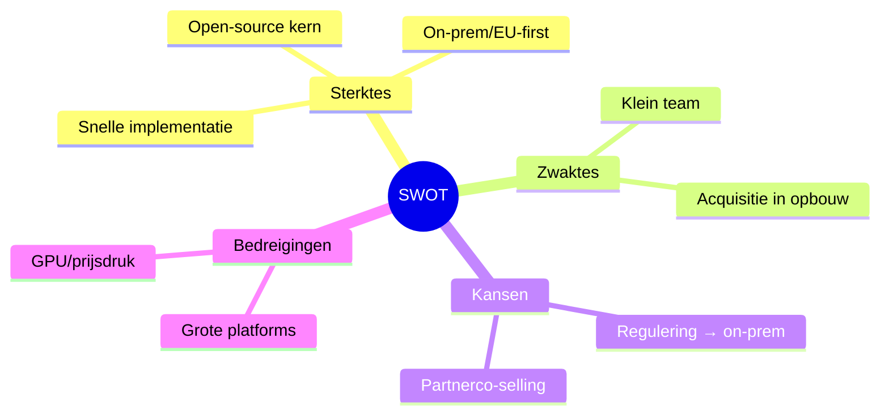

# 2.3 De markt

## 2.3.1 Marktontwikkeling

**1. Is de markt aan het groeien of aan het krimpen? Hoe komt dat?**  
De markt voor generatieve AI en on-premise inferentie groeit sterk (dubbelcijferige groei). Drivers: brede adoptie van LLM-toepassingen, behoefte aan lage latency, privacy/AVG-eisen, kostenbeheersing en de wens om vendor lock-in te vermijden. Open-source modellen en runtimes (o.a. llama.cpp, vLLM, TGI) verlagen drempels, maar implementatie en beheer blijven complex — hier ligt de vraag naar turnkey oplossingen.

**2. Welke trends zijn er in de markt?**  
Belangrijke trends: (1) verschuiving naar hybride en on-premise AI voor datasoevereiniteit; (2) snellere modellen en betere kv-caches/quantization voor betaalbare GPU’s; (3) productief maken van token-streaming met betrouwbaarheid/annuleerbaarheid; (4) standaardisatie van observability en MLOps; (5) EU-compliance (AVG/NIS2) en contractuele transparantie; (6) voorkeur voor open-source stacks met commerciële support.

**3. Wat zijn de lokale en landelijke ontwikkelingen in de markt?**  
In Nederland en de EU groeit de aandacht voor data-bescherming, AI-governance en audits. Veel mkb-bedrijven willen AI intern inzetten, maar missen GPU-kennis en beheerprocessen. Er is bereidheid om te investeren in bewezen oplossingen die privacy borgen, voorspelbare kosten bieden en snel waarde opleveren. Regionaal is er een actief netwerk van agencies/IT-dienstverleners die open-source oplossingen willen integreren bij klanten.

---

## 2.3.2 Doelgroepen

**1. Beschrijf hieronder wie je (potentiële) klanten zijn.**  
Primair: mkb (10–500 fte) in zakelijke dienstverlening, zorg, juridische sector, onderwijs en overheid-gerelateerde organisaties met privacy- of latency-eisen. Secundair: digitale bureaus/system integrators die voor klanten AI-functionaliteit opleveren en on-premise/hybride nodig hebben.

**2. Welke kenmerken hebben zij?**  
Kenmerken: behoefte aan snelle implementatie zonder eigen MLOps-team; voorkeur voor eigenaarschap over data en modellen; budget voor implementatie (€4k–€10k) en beheer (€250–€1.000 p/m); wens voor SLA, monitoring en duidelijke contracten; vaak bestaande IT-infrastructuur, maar weinig GPU-expertise.

---

## 2.3.3 Concurrentie

**1. Wie zijn je concurrenten?**  
Alternatieven: (1) publieke AI-API’s (OpenAI, Azure OpenAI); (2) managed platforms (Anyscale, Modal, Baseten); (3) point-solutions (vLLM/TGI-servers) zonder turnkey implementatie; (4) traditionele IT-consultants die maatwerk leveren zonder gespecialiseerd AI-orkestratieproduct.

**2. Wat bieden je concurrenten aan?**  
Publieke AI-API’s bieden snelle start maar met datalocatie/lock-in. Managed platforms leveren hosting en schaal, vaak cloud-only. Point-solutions bieden inference-servers zonder integrale provisioning/observability/SLA. Consultants bieden capaciteit, maar minder productgestuurd en minder gestandaardiseerd.

**3. Wat zijn de sterke en zwakke punten van je concurrenten?**  
Sterk: snelle onboarding, merkbekendheid, schaalbaarheid. Zwak: hogere TCO bij intensief gebruik, minder controle over data, afhankelijkheid van derden, beperkte on-prem opties, weinig deterministische token-streaming en minder transparantie in kosten/observability.

**4. Hoe ga jij je van je concurrenten onderscheiden?**  
Differentiatie: open-source kern (`llama-orch`) met spec-first contracten; on-premise/EU-first; deterministische en robuuste token-streaming; automatische engine→GPU-plaatsing met expliciete overrides; duidelijke SLA en monitoring; transparante kostenstructuur en eigenaarschap bij de klant. Acquisitie‑versnelling via B2B inhuur (retainer) en partnerco‑selling.

---

# 2.4 SWOT-analyse

Vul de tabel in en beschrijf je aanpak.

| | Intern (jij & je bedrijf) | Extern (markt) |
|---|---|---|
| **Sterktes** | Brede technische expertise (frontend/backend/infra); open-source product; snelle implementatie | Groeiende vraag naar on-prem/hybride AI; voorkeur voor open-source en EU-compliance |
| **Zwaktes** | Klein team; beperkte commerciële capaciteit; afhankelijk van partners voor opschaling | Snelle marktveranderingen; technologie beweegt snel |
| **Kansen** | Productbundels en SLA’s; partnerschappen met bureaus; referentiecases en niches | Toenemende regelgeving stimuleert on-prem; mkb investeert in AI |
| **Bedreigingen** | Tijd/capaciteitsdruk; cashflow bij langere salescycli | Concurrentie door grote platforms; prijsdruk en talent schaarste |

**Aanpak per kwadrant**  
- Sterktes benutten: inzetten op open-source geloofwaardigheid, snelle PoC’s en meetbare resultaten bij eerste klanten.  
- Zwaktes verbeteren: sales-/marketingritme professionaliseren; inzet van freelancers/partners op pieken; B2B acquisitie‑retainer voor voorspelbare pipeline.  
- Kansen realiseren: partnerprogramma opzetten; sectoruse-cases uitwerken; SLA-pakketten productiseren.  
- Bedreigingen mitigeren: technologische roadmap bijhouden; kostenbewaking en buffer; differentiatie vasthouden (EU/on-prem, transparantie).

---

## Visuals — SWOT in één oogopslag

Toelichting
- Doel: compact overzicht van SWOT zonder de tabel te lezen.
- Leeswijzer: elke tak vat de kern samen; details staan in de tabel.
- Wat dit aantoont: focus op sterke differentiators en realistische mitigaties van zwaktes/bedreigingen.
