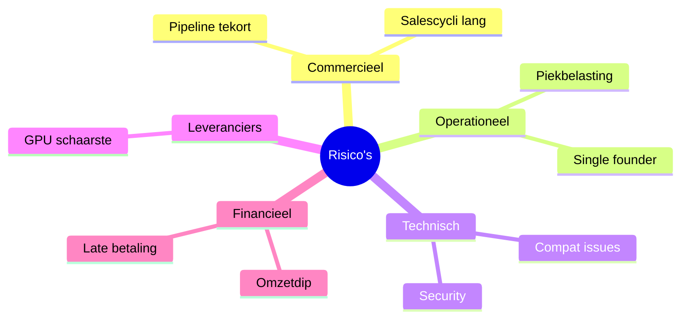
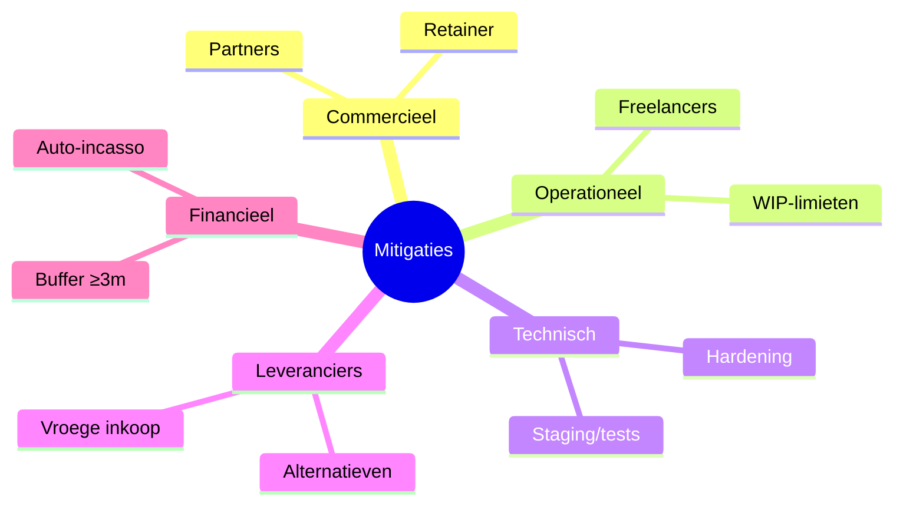

# 2.9 Risicoanalyse & Mitigatie

Doel: onzekerheden expliciet maken en concrete mitigerende maatregelen borgen.

## 2.9.1 Commercieel (pipeline & vraag)

- Risico: onvoldoende afsprakenstroom / langere salescycli.  
  Mitigatie: B2B acquisitie‑retainer (6 mnd), partnerco‑selling, strakke cadans (wekelijkse outreach), POC‑aanbod met tijdbox.

## 2.9.2 Operationeel (capaciteit & levering)

- Risico: piekbelasting / single‑founder bottleneck.  
  Mitigatie: freelancers/partners voor GPU/DevOps; sprints met WIP‑limieten; realistische planning; wachtrijbeheer.

## 2.9.3 Technisch (stabiliteit & veiligheid)

- Risico: model/engine wijzigingen, compatibiliteit, bugs.  
  Mitigatie: spec‑first, versiebeleid, staging‑omgeving, regressietests, incident‑reviews.  
- Risico: security incident.  
  Mitigatie: hardening, least‑privilege, dependency‑scans, audit‑logging, update‑beleid.

## 2.9.4 Leveranciers & hardware (GPU)

- Risico: beperkte beschikbaarheid / prijsstijging.  
  Mitigatie: alternatieve leveranciers, plan‑B hosting, schaalbare architectuur, tijdige inkoop.

## 2.9.5 Juridisch & compliance (AVG/NIS2)

- Risico: non‑compliance of onduidelijkheid rond data.  
  Mitigatie: EU‑first datalokatie, verwerkersovereenkomst, DPIA‑ondersteuning, log‑beleid, security‑checks.

## 2.9.6 Financieel & liquiditeit

- Risico: late betalingen / omzetdip.  
  Mitigatie: automatische incasso, deelfacturatie (implementatie), buffer ≥ 3 maanden vaste lasten, freelance inzet als back‑stop.

## 2.9.7 Reputatie & churn

- Risico: ontevreden klant / SLA‑breuk.  
  Mitigatie: duidelijke SLA’s, proactieve monitoring, snelle incidentrespons, maandrapportage en root‑cause‑fix.

---

## Visuals — Risico’s en mitigaties

Toelichting
- Doel: scheidt risico’s en maatregelen in twee snelle blikvelden.
- Leeswijzer: per categorie staat de eerste stuuractie bovenaan.
- Wat dit aantoont: bewuste beheersing van belangrijkste onzekerheden.

---

## 2.9.8 Website‑tactieken tegen lage sales

- Inbound leadmagnets (DPIA/Readiness) met nurture‑flow → verhoogt SQL’s.  
- Verticale LP’s + ABM mini‑LP’s → hogere CTR en conversie.  
- POC‑pakket formulier + transparante pricing → verkort beslistraject.  
- Status/KPI‑bewijzen (uptime/latency) + cases → vermindert twijfel.  
- Retargeting van bezoekers van /poc en /pricing → heractivatie.  
- Sales SLA: binnen 1 werkdag reageren op alle inbound (zie ops/sales_sla.md).
