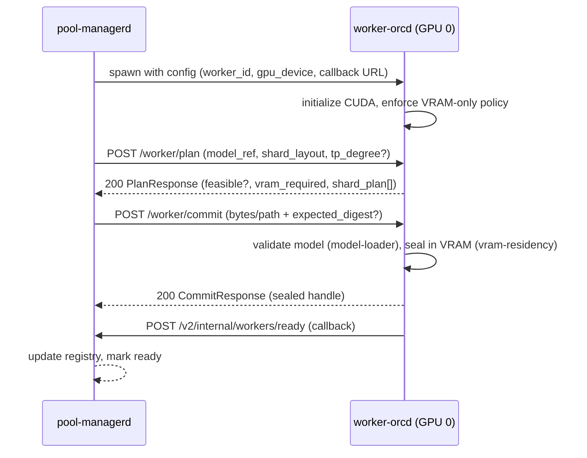
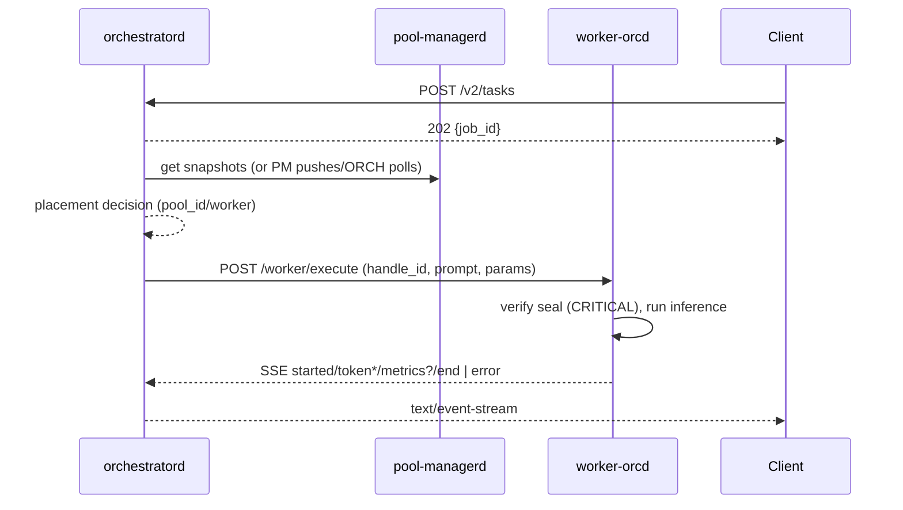

# System Flow & Contract — orchestratord ↔ pool-managerd ↔ worker-orcd

Status: Informational (partly Normative)
Conformance language: RFC-2119 (MUST/SHOULD/MAY)
Applies to: root system design; aligns the contracts between control plane and GPU workers

---

## 0. Scope

This document captures the end-to-end flow and contracts between:

- orchestratord (control plane)
- pool-managerd (GPU pool supervisor)
- worker-orcd (per-GPU worker with direct VRAM residency)

It consolidates how planning, staging (VRAM commit), readiness, and execution work together, including pool control of admission and VRAM residency.

Related specs:
- `bin/worker-orcd-crates/api/.specs/00_api.md` — Worker RPC endpoints (Plan/Commit/Ready/Execute + Capacity/Drain/Evict)
- `bin/worker-orcd/.specs/00_worker-orcd.md` — Worker binary architecture & lifecycle
- `.docs/WORKER_READINESS_CALLBACK_DESIGN.md` — Readiness callback (worker → pool-managerd)
- `.specs/30-pool-managerd.md` — Pool lifecycle and guardrails
- `bin/orchestratord-crates/orchestrator-core/.specs/11_pool_managerd.md` — Snapshots consumed by placement

GPU-only policy: CPU fallback is disallowed. VRAM-only residency is enforced end-to-end.

---

## 1. Roles & Responsibilities

- orchestratord
  - Accepts client jobs, performs admission and placement.
  - Consumes pool snapshots from pool-managerd.
  - Dispatches to workers (directly or via pool-managerd proxy).

- pool-managerd
  - Discovers GPUs, supervises per-GPU worker-orcd processes.
  - Builds pool snapshots (health, capacity, perf hints).
  - Controls workers: drain/undrain, evict shards, plan/commit sequencing.
  - Sees host RAM and can make higher-level planning decisions than workers.

- worker-orcd
  - One process per GPU (or device mask). Supports multi-model VRAM residency when capacity allows (M1 behavior; N ≥ 1).
  - Exposes HTTP RPC: Plan, Commit, Ready, Execute.
  - NEW control endpoints: Capacity, Drain, Evict.
  - Plans using only VRAM + capability knowledge; does not reason about host RAM.

---

## 2. Lifecycle & Flows

### 2.1 Provisioning & Readiness (Staging)

Sequence (single GPU):

Notes:
- Worker MUST not expose Ready until commit succeeded (seal verified).
- Callback replaces filesystem handoff files (see `.docs/WORKER_READINESS_CALLBACK_DESIGN.md`).

#### 2.1.1 Optional Host RAM Prefetch (pool-managerd)

Pool-managerd MAY prefetch models into host RAM or local filesystem cache on the GPU node to accelerate subsequent VRAM commits. This is a control-plane optimization that MUST NOT be used for inference offload.

- Prefetch sources: model catalog (disk), remote storage, or network registry.
- Prefetch destinations: process memory (RAM) and/or on-node cache file (e.g., memory-mapped file) accessible to the worker.
- Commit fast-paths:
  - `POST /worker/commit { model_path: "/path/to/prefetched.gguf" }` (preferred on same node)
  - `POST /worker/commit { model_bytes: <prefetched-bytes> }`
- Security: All commits MUST still pass model-loader validation and digest verification.
- Policy: Prefetch MUST be bounded by host RAM/disk limits and MUST NOT block critical control-plane threads.

### 2.2 Capacity & Planning

- PM queries `GET /worker/capacity` to obtain `{ vram_total, vram_used, vram_free, slots_total/free, draining }`.
- PM may call `POST /worker/plan` to validate VRAM feasibility and MCD/ECP compatibility.
- PM constructs pool snapshots that include VRAM fields for orchestratord’s placement logic.
- orchestratord uses snapshots to pick a pool/worker; pinning is achieved by selecting a specific pool/worker.

### 2.3 Admission & Execution

Notes:
- Worker MUST re-verify seal before every Execute.
- SSE streams MUST end with `end` or `error` (no events after termination).

### 2.4 Draining & Eviction

- PM can toggle admission via `POST /worker/drain { drain: bool }`.
- While draining:
  - Plan and Capacity remain available.
  - Commit and Execute MUST return `503 Service Unavailable` with stable code `ADMISSION_CLOSED` (unless Execute resumes an in-flight job owned by the caller).
- PM can reclaim VRAM by `POST /worker/evict { shard_ids: [...] }`.
  - Busy shards MUST respond `409 Conflict` and be left resident.

### 2.5 Multi-Model VRAM Residency (Instant Switch)

Worker-orcd MAY hold multiple sealed `ModelShardHandle`s simultaneously if VRAM permits. This enables instant switching between models with no additional staging latency.

- Residency vs. concurrency: `vram_free_bytes` governs how many models can be resident; `slots_total/free` govern how many concurrent executions can run.
- Ready attestation: `GET /worker/ready` returns all sealed handles; each handle has its own ID and metadata.
- Execution: `POST /worker/execute` MUST accept a `handle_id` to select which resident model to use.
- Admission: Draining semantics apply unchanged; Commit/Execute MUST still respect `503 ADMISSION_CLOSED`.
- Eviction: `POST /worker/evict` MAY be used to free VRAM by removing one or more resident models to make room for new commits.
- Placement: Orchestrator SHOULD prefer workers that already have the requested model resident to achieve zero-latency switches.

### 2.6 Fairness & Tie-Breaking

Fairness is applied at two layers: orchestrator placement across workers, and worker slot scheduling across tasks/handles. The goals are to avoid hot-spotting, prevent starvation, and preserve pin overrides.

#### 2.6.1 Inter-Worker Fairness (Placement)

- **F-ORCH-1 (Eligibility)**: Exclude draining workers. Include only workers with `slots_free > 0` for immediate execution; for staging, include workers with `vram_free_bytes ≥ estimated_vram(model)`.
- **F-ORCH-2 (Loaded preference)**: Prefer workers that already have the requested model resident (see §2.5) to minimize latency.
- **F-ORCH-3 (Least-in-flight)**: Among eligible workers, orchestrator MUST choose the worker with the fewest in-flight executions (`executing_count = slots_total - slots_free`).
- **F-ORCH-4 (Stable tiebreak)**: On ties, orchestrator SHOULD break ties using the longest time since last assignment (tracked locally) or a small random jitter to avoid synchronized selection.
- **F-ORCH-5 (Stageable tie)**: For staging candidates (no resident handle), prefer the worker with the largest `vram_free_bytes`.
- **F-ORCH-6 (Pin override)**: Pin requests bypass fairness and target the specified worker/pool, but MUST still satisfy eligibility and gating.
- **F-ORCH-7 (Starvation-freedom)**: Given a stable eligible set, no single eligible worker may be perpetually skipped; the least-in-flight + stable tiebreak yields eventual selection.

#### 2.6.2 Intra-Worker Fairness (Slots & Handles)

- **F-WORK-1 (Admission order)**: Worker slot admission SHOULD be FIFO by arrival time for requests received while `slots_free == 0`. Preemption is NOT required.
- **F-WORK-2 (Handle fairness)**: If worker supports multiple concurrent executions (`slots_total > 1`) across multiple resident handles, worker MAY apply per-handle round-robin or per-handle concurrency caps to avoid a single handle monopolizing slots. Otherwise, fairness is primarily enforced by orchestrator selection.
- **F-WORK-3 (No starvation)**: A queued request MUST eventually run once a slot is available unless cancelled or superseded by drain.

#### 2.6.3 Residency & Eviction Fairness

- **F-RES-1 (Eviction order)**: Eviction MUST prefer non-pinned, coldest (LRU) resident handles that free sufficient VRAM for the pending commit.
- **F-RES-2 (Protection)**: Pinned or currently executing handles MUST NOT be evicted.
- **F-RES-3 (Failure path)**: If eviction cannot free enough VRAM, Commit MUST fail with `507 VRAM_OOM` (or return to orchestrator to try another worker).

#### 2.6.4 Prefetch Fairness (Background)

- **F-PREF-1 (Priority)**: Prefetch operations MUST run at background priority and MUST yield to live Commit/Execute operations.
- **F-PREF-2 (Limits)**: Prefetch MUST respect RAM/disk caps and MAY be cancelled when hot-path needs arise.
- **F-PREF-3 (Observability)**: Prefetch outcomes SHOULD be surfaced via metrics/logs to inform placement and eviction heuristics.

### 2.7 Batching (Micro/Continuous)

Batching increases throughput by decoding multiple sequences together on the same resident model. It is implemented at the worker level and is transparent to orchestrator placement beyond normal fairness.

#### 2.7.1 Scope & Eligibility

- **BATCH-1 (Per-handle)**: Batching is per resident handle (model/shard). Cross-handle batching is NOT required.
- **BATCH-2 (Admission)**: Requests for the same handle received within a short window MAY be grouped into a micro-batch.
- **BATCH-3 (Engine capability)**: If the underlying engine supports continuous batching (adding/removing sequences mid-run), worker MAY adopt it; otherwise, fixed micro-batches are acceptable.

#### 2.7.2 Admission Window & Latency

- **BATCH-4 (Window)**: Worker MAY hold incoming Execute requests for up to `batch_window_ms` (e.g., 5–20ms, configurable) to form a batch.
- **BATCH-5 (Bounded wait)**: A request MUST either start decoding or time out of the batch window promptly; long waits are disallowed.

#### 2.7.3 Slots Semantics with Batching

- **BATCH-6 (Slots = sequences)**: `slots_total/free` represent the maximum number of concurrent sequences the worker can decode for a handle, not OS threads. With batching, a single GPU kernel step may serve multiple sequences.
- **BATCH-7 (Capacity reporting)**: Capacity/Ready reporting remains unchanged; the worker exposes overall `slots_total/free` and sealed handles.

#### 2.7.4 Fairness within Batches

- **BATCH-8 (Interleave)**: When continuous batching is available, worker SHOULD interleave decode steps fairly across sequences (e.g., one token per schedule) to prevent starvation.
- **BATCH-9 (Cancel-aware)**: Cancelled sequences MUST be dropped from the batch at a safe boundary without impacting others.

#### 2.7.5 SSE & Observability

- **BATCH-10 (SSE isolation)**: Each request maintains its own SSE stream (`started`, `token*`, `metrics?`, `end|error`).
- **BATCH-11 (Metrics)**: Worker SHOULD emit `batch_size`, `batch_wait_ms`, and throughput metrics to inform placement heuristics.

#### 2.7.6 Interactions

- **BATCH-12 (Draining)**: While draining, new Execute admissions MUST return `503 ADMISSION_CLOSED`. In-flight batches MAY complete; no new sequences are admitted.
- **BATCH-13 (Pinning & residency)**: Batching does not alter pinning. Orchestrator SHOULD still prefer already-resident handles (§2.5).
- **BATCH-14 (Prefetch)**: Prefetch does not change batching; it only reduces Commit latency.

---

### 2.8 Planning Enum Crosswalk (Worker ↔ Pool ↔ Orchestrator)

This crosswalk aligns human-readable planning statements with structured decisions returned by worker-orcd (§2.1 Plan, §2.1 Planning Enums in `worker-api`) and pool-managerd (`pool-managerd API` Plan). Orchestrator consumes these to choose an action.

- "Already have that model loaded in VRAM"
  - Worker: `UseResident { handle_id, slots_free }`
  - Pool: `RouteToWorker { worker_id, handle_id, slots_free }`
  - Orchestrator: Execute on that worker/handle immediately. If `slots_free == 0`, see next case.

- "Loaded on VRAM but busy (I'm inferring for someone else, ~x seconds)"
  - Worker: `UseResident { slots_free: 0, executing_count, est_slot_eta_ms }`
  - Pool: `RouteToWorker { executing_count, est_slot_eta_ms }`
  - Orchestrator: Either queue to that worker (respect SLA) or pick another eligible worker per fairness (§2.6.1).

- "No room, but I can evict something; queue is x"
  - Worker: `EvictThenCommitVRAM { shard_ids, bytes_to_free, est_eviction_eta_ms, est_commit_eta_ms }` (and/or `CannotFitVRAM { required, available, queue_depth }`)
  - Pool: `EvictThenCommitOnWorker { worker_id, shard_ids, bytes_to_free, ... }`
  - Orchestrator: Either authorize eviction+commit on that worker, or choose a different worker where commit fits without eviction.

- "I'm currently inferring (~x seconds) but I can load it into VRAM now"
  - Worker: `CommitVRAM { est_commit_eta_ms, can_execute_now: false }`
  - Pool: `CommitOnWorker { worker_id, est_commit_eta_ms, can_execute_now: false }`
  - Orchestrator: Commit now on that worker and route execute once a slot frees; or choose a worker with immediate execute.

- "I'm inferring (~x seconds) but I can evict someone and then load it into VRAM"
  - Worker: `EvictThenCommitVRAM { ... }`
  - Pool: `EvictThenCommitOnWorker { ... }`
  - Orchestrator: Authorize eviction+commit or select another worker.

- "I can load and infer immediately"
  - Worker: `CommitVRAM { can_execute_now: true, est_commit_eta_ms: 0 }` (or `UseResident { slots_free > 0 }`)
  - Pool: `CommitOnWorker { can_execute_now: true }` or `RouteToWorker { slots_free > 0 }`
  - Orchestrator: Route directly to that worker.

- Pool assistance: "Preload to RAM after 2 jobs"
  - Worker suggestion: `PrefetchRecommended { trigger: { "type": "AfterJobs", "count": 2 } }`
  - Pool decision: `PrefetchRecommended { node_id, trigger: AfterJobs{2} }`
  - Orchestrator action: Accept hint; pool performs background prefetch (§2.1.1). Later placement may leverage `model_path` fast-path to `Commit`.

Notes:
- ETA fields (`est_slot_eta_ms`, `est_commit_eta_ms`, `est_eviction_eta_ms`) are estimates and SHOULD be treated as hints, not hard guarantees.
- Pin overrides remain authoritative and may bypass normal tie-breaking if feasible (§4).

---

Additional cases (non-exhaustive):

- In-progress commit
  - Worker: `InProgressCommit { est_commit_eta_ms, queued_execute? }`
  - Pool: `CommitOnWorker { worker_id, est_commit_eta_ms, can_execute_now: false }`
  - Orchestrator: Queue on same worker or route elsewhere based on SLA.

- Per-handle concurrency cap reached
  - Worker: `ConcurrencyCapReached { cap, executing_count, est_slot_eta_ms? }`
  - Pool: `RouteToWorker { executing_count, est_slot_eta_ms }`
  - Orchestrator: Consider other eligible workers; otherwise queue.

- VRAM fragmentation blocks contiguous allocation
  - Worker: `VRAMFragmented { required_contiguous, largest_free_block, defrag_eta_ms? }`
  - Pool: may respond `RouteToSiblingWorker` (pool API) if available.
  - Orchestrator: Prefer a worker without fragmentation; otherwise accept ETA.

- Quantization needed to fit
  - Worker: `QuantizationTransformRequired { from, to, est_eta_ms, supported }`
  - Orchestrator: If `supported`, accept transform ETA; else route to a different worker/model variant.

- Batch join advisable
  - Worker: `BatchJoinAdvised { active_batch_size, est_speedup_factor, est_slot_eta_ms? }`
  - Orchestrator: Prefer this worker if throughput gain outweighs ETA.

- Eviction not permitted (policy)
  - Worker: `EvictionNotPermitted { reason }`
  - Orchestrator: Route to another worker; do not attempt eviction here.

---

### 2.9 Performance-Aware Placement

Orchestrator SHOULD keep per-model, per-worker performance telemetry and use it as a tie-breaker after fairness (§2.6):

- Maintain smoothed tokens/sec (EWMA) per `{worker_id, model_ref}` from worker metrics (`worker_tokens_out_total`, `worker_decode_time_ms`).
- Incorporate ETA hints from Plan decisions (`est_slot_eta_ms`, `est_commit_eta_ms`, `est_eviction_eta_ms`).
- Example scoring (illustrative): combine loaded preference, least-in-flight, smoothed TPS, ETA, and `vram_free_bytes` into a score; pick max, then stable tiebreak.
- Prefer workers where the model historically performs better for the requested SLO class.

Metrics (orchestrator):
- `orch_model_tps_smoothed{worker_id, model_ref}` (gauge)
- `orch_placement_score{worker_id, model_ref}` (gauge)
- `orch_placements_latency_ms` (histogram)

## 3. HTTP Contracts (summary)

Worker RPC (HTTP on worker bind addr):
- `POST /worker/plan` — Feasibility: checks MCD/ECP and VRAM availability.
- `POST /worker/commit` — Validate model, seal in VRAM, return sealed handle.
- `GET /worker/ready` — Health + sealed handle attestation (auth configurable).
- `POST /worker/execute` — SSE token streaming; seal re-verification.
- `GET /worker/capacity` — VRAM/slots capacity + draining state (Auth required).
- `POST /worker/drain` — Toggle admission; Commit/Execute gate to 503.
- `POST /worker/evict` — Free VRAM by unsealing shards; `409` for busy.

Pool-managerd internal API (receiver):
- `POST /v2/internal/workers/ready` — Worker readiness callback (Auth recommended, localhost bind).

References:
- See `bin/worker-orcd-crates/api/.specs/00_api.md` for full request/response formats.

---

## 4. Pinning & Overrides

- Automatic placement: orchestratord selects the best pool by snapshots (VRAM, perf hints, slots).
- Explicit pinning: callers MAY request a specific pool/worker; orchestratord honors override if feasible.
- Device selection is implicit: one worker process per GPU/mask. Selecting a worker selects the device.

---

## 5. Observability & Security

- VRAM-only policy: any attempt to offload to host RAM MUST fail fast.
- Audit logging: AuthSuccess/AuthFailure, VramSealed, SealVerificationFailed, PolicyViolation.
- Metrics: VRAM totals/used/free, job latency, token throughput, error counts.
- Authentication: Bearer tokens (timing-safe compare). mTLS is a refinement.

---

## 6. Error Taxonomy & Status Mapping

- Stable codes (examples): `ADMISSION_CLOSED`, `VRAM_OOM`, `INVALID_PARAMS`, `SEAL_VERIFICATION_FAILED`, `AUTH_FAILED`, `INTERNAL`.
- Mapping examples:
  - `ADMISSION_CLOSED` → 503 (draining)
  - `VRAM_OOM` → 507
  - `INVALID_PARAMS` → 400
  - `AUTH_FAILED` → 401
  - `SEAL_VERIFICATION_FAILED` → 500

See `bin/worker-orcd-crates/api/.specs/10_expectations.md` for expectations.

---

## 7. End-to-End Guarantees

- Deterministic, VRAM-resident inference; sealed shard integrity.
- Pool-managerd holds higher-level authority (can see host RAM and system state), while worker planning is VRAM-only.
- Readiness is callback-driven from worker to pool-managerd (no file polling).

---

## 8. Refinement Opportunities

- Define full error code catalog and include in worker-api spec and responses.
- Add mTLS for internal endpoints and callbacks.
- SSE keepalives/heartbeats for long decodes and robust cancel (see proposal 2025-09-19).
- Rate limiting/backpressure guidance for Plan/Commit.
- Job-scoped tokens for Execute (short-lived, signed).
- Expand snapshots to include NCCL/TP groups and quantization support.
- Host RAM prefetch policy: TTLs, size caps, background priority, and eviction strategy (LRU/size-aware).
- Multi-model residency heuristics: fairness between resident models, prewarming rules, and eviction order aligned with demand.
