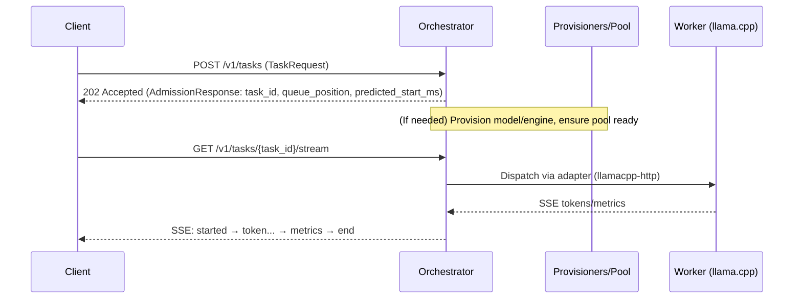

# Request → ID → SSE: Findings and Evidence

This note confirms the client flow and cites specs, docs, code, and tests.

## Executive Summary

- **Flow is correct (with one nuance):**
  - Client sends `POST /v1/tasks` with `TaskRequest`.
  - Server immediately responds `202 Accepted` with an `AdmissionResponse` containing the same `task_id`, `queue_position`, and `predicted_start_ms`.
  - Client then performs `GET /v1/tasks/{task_id}/stream` to receive SSE frames (`started`, `token`, `metrics`, `end`).
- **Nuance:** The ID is returned at acceptance, not only after all readiness/provisioning is complete. Provisioning/placement may proceed after acceptance; the `started` event includes the admission snapshot (e.g., `queue_position`, `predicted_start_ms`).

## Evidence from OpenAPI (source of truth)

- `contracts/openapi/data.yaml`:
  - `POST /v1/tasks` → `202 Accepted` with body `$ref: AdmissionResponse` (contains `task_id`, `queue_position`, `predicted_start_ms`, `backoff_ms`).
  - `GET /v1/tasks/{id}/stream` → `200` `text/event-stream` with normative SSE sequence (`started`, `token`, `metrics`, `end`, `error`).
  - The `TaskRequest.model_ref` description explicitly allows auto-fetch/prefetch per policy; readiness may lag the acceptance response.

## Evidence from Consumer Guide

- `CONSUMER_CAPABILITIES.md` (Data Plane section):
  - Shows `POST /v1/tasks` with example payload and `202` response.
  - Shows `GET /v1/tasks/{id}/stream` returning SSE with example frames.
  - Aligns with OpenAPI: enqueue first, then stream by `task_id`.

## Evidence from Orchestrator Code

- Routes: `bin/orchestratord/src/app/router.rs`
  - `POST /v1/tasks` → `api::data::create_task`
  - `GET /v1/tasks/:id/stream` → `api::data::stream_task`
- Enqueue: `bin/orchestratord/src/api/data.rs::create_task()`
  - Returns `202` with `AdmissionResponse { task_id, queue_position, predicted_start_ms, backoff_ms }`.
  - Seeds `admissions` map for the `started` event payload.
- Stream: `bin/orchestratord/src/api/data.rs::stream_task()`
  - Returns `200` with `Content-Type: text/event-stream` and delegates to `services::streaming::render_sse_for_task()`.
- Streaming: `bin/orchestratord/src/services/streaming.rs`
  - Tries adapter dispatch first; falls back to deterministic SSE if no adapter bound (implementation detail; contract remains SSE).
  - Emits `started` with `queue_position`/`predicted_start_ms`, then `token`/`metrics`/`end`.

## Evidence from Test Harness

- `test-harness/e2e-haiku/tests/e2e_client.rs`:
  - Calls `enqueue(base, task)` and asserts success, then `stream(base, task.task_id)` and asserts `200`.
  - Matches the POST→ID→GET SSE pattern.

## Drift Analysis (Specs vs Implementation)

- **ID timing:** Spec: ID returned with `202 Accepted` (immediate). Implementation: matches (returns `AdmissionResponse` on enqueue). Your initial notion that ID arrives only "when everything is ready" is slightly off; acceptance returns ID before full readiness; streaming begins later.
- **SSE fallback:** Implementation returns a deterministic SSE fallback when no adapter is bound. The contract remains `text/event-stream`; this is an acceptable dev-mode behavior and does not violate specs.
- **Error/budget headers:** Implementation includes `X-Budget-*` headers as documented. Backpressure and error taxonomy exist but are currently backed by sentinel logic; this is a partial implementation, not a spec change.
- **Worker registration:** `POST /v1/workers/register` exists in code for scaffolding but is not part of the published OpenAPI. This aligns with docs that treat it as a non-normative dev endpoint.

## Plan Alignment (no spec changes needed)

- Our plans (e.g., `CHECKLIST_HAIKU.md`) already follow the spec: enqueue returns `202` with `task_id`; streaming by `task_id` follows.
- We will keep specs as-is and adjust implementation tasks (auto-provisioning, pool readiness gating, auto-binding adapters) to fit this flow.

## Suggested UX Note for Clients (non-normative)

- Treat `predicted_start_ms` as a hint; the actual stream may start after readiness and placement. Clients should start the SSE request promptly after `202` and handle backpressure/cancel semantics.

## Sequence (mermaid)

## References

- `contracts/openapi/data.yaml`
- `CONSUMER_CAPABILITIES.md`
- `bin/orchestratord/src/app/router.rs`
- `bin/orchestratord/src/api/data.rs`
- `bin/orchestratord/src/services/streaming.rs`
- `test-harness/e2e-haiku/tests/e2e_client.rs`
