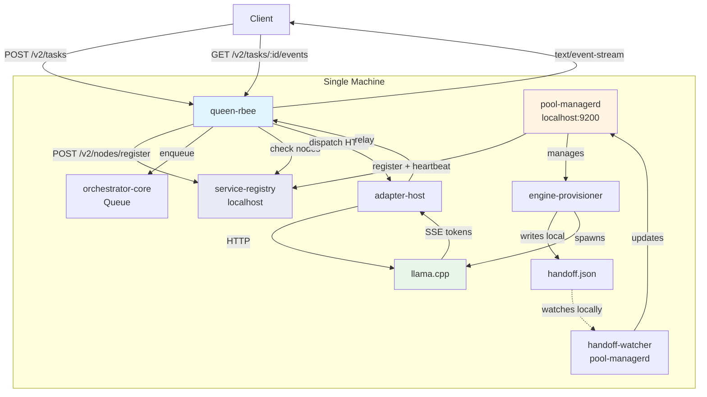
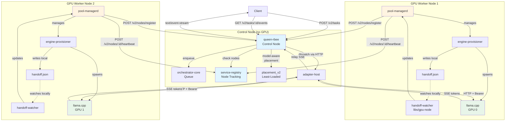
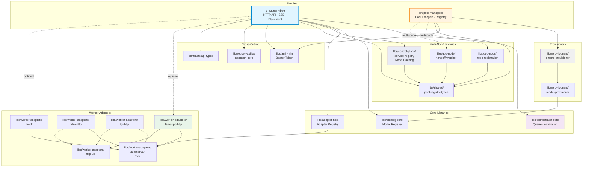
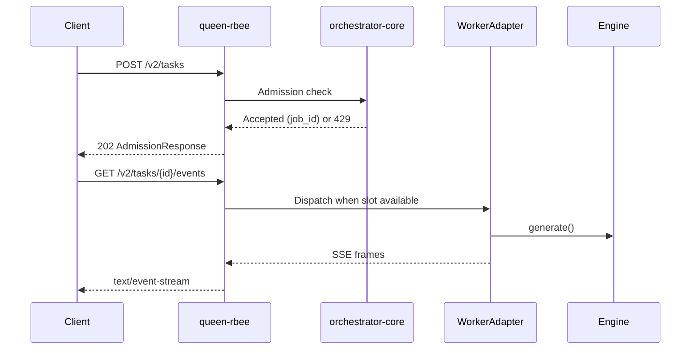

# llama-orch
**Reproducible, multi-architecture, multi-node GPU orchestration for LLM inference**
llama-orch is a three-binary system that provides test reproducibility, flexible memory architectures, and enterprise-grade orchestration across distributed GPU resources. Born from the simple frustration of "why can't I easily choose which GPU runs which model?", it evolved into a reproducible testing platform with a clean intelligence hierarchy.
**Current version**: `0.1.0` (early development)  
**License**: GPL-3.0-or-later (free and open source, copyleft)  
**Target platform**: Linux with NVIDIA GPUs
---
## What is llama-orch?
### Core Value Propositions
1. **Test Reproducibility**: Same seed + temp=0 → Same output (for testing validation, not a product promise)
2. **Temperature Control**: Full temperature range 0.0-2.0 for production use (product feature)
3. **Multi-Architecture Support**: NVIDIA CUDA (VRAM-only), Apple ARM (unified memory), and extensible worker adapters
4. **Multi-Node Orchestration**: Distribute models across GPU clusters
5. **Smart/Dumb Architecture**: Clean separation between decisions and execution
6. **Process Isolation**: Workers run in separate processes with isolated memory contexts
**Note**: Determinism is a testing tool, not a product guarantee. LLMs cannot guarantee deterministic behavior due to model architecture and hardware variations.
### The Four-Binary System
llama-orch consists of **4 binaries** (2 daemons + 2 CLIs):

**Daemons (HTTP servers, long-running):**
1. **`queen-rbee`** — The Brain (makes ALL intelligent decisions) [M1 - not built]
   - Port 8080, routes inference requests, Rhai scripting, worker registry (SQLite)
2. **`llm-worker-rbee`** — Workers (load one model, execute inference) [M0 ✅ DONE]
   - Ports 8001+, one per model, stateless, HTTP server
   - Variants: llorch-cpu-candled, llorch-cuda-candled, llorch-metal-candled

**CLI Tools (run on-demand, exit after command):**
3. **`rbee-keeper`** (from rbee-keeper crate) — **USER INTERFACE** [M0 ✅ DONE]
   - **Updated by TEAM-051:** This is the CLI UI, not a testing tool
   - Manages queen-rbee lifecycle (start/stop)
   - Configures SSH for remote machines
   - Manages rbee-hive and worker lifecycle
   - **Future:** Web UI will be added alongside CLI
4. **`rbee-hive`** (from rbee-hive crate) — Local pool management [M0 ✅ DONE]
   - Model catalog, worker spawning, backend detection, orphan cleanup

**Note:** pool-managerd daemon is NOT NEEDED - pool management is CLI-based!
### Intelligence Hierarchy
```
┌─────────────────────────────────────┐
│ queen-rbee (THE BRAIN - daemon)  │
│ - Rhai scripting (user-defined)     │
│ - Worker registry (SQLite)          │
│ - Scheduling, routing, admission    │
└──────────┬──────────────────────────┘
           │ HTTP POST /execute
           ↓
┌─────────────────────────────────────┐
│ llm-worker-rbee (EXECUTOR - daemon)  │
│ - Loads ONE model                   │
│ - Generates tokens                  │
│ - Stateless                         │
└─────────────────────────────────────┘

┌─────────────────────────────────────┐
│ Operator (Human)                    │
└──────────┬──────────────────────────┘
           │ runs
           ↓
┌─────────────────────────────────────┐
│ rbee-keeper (USER INTERFACE)      │
│ - Manages queen-rbee lifecycle      │
│ - Configures SSH                    │
│ - Manages hives and workers         │
│ - Future: Web UI                    │
└──────────┬──────────────────────────┘
           │ controls
           ↓
┌─────────────────────────────────────┐
│ rbee-hive (LOCAL CLI)             │
│ - Model catalog                     │
│ - Worker spawning                   │
│ - Backend detection                 │
└─────────────────────────────────────┘
```
**4 binaries total:** 2 daemons (queen-rbee, llm-worker-rbee) + 2 CLIs (rbee-keeper, rbee-hive)

**Decision boundary**: queen-rbee makes ALL intelligent decisions. Workers are dumb executors. rbee-keeper is the UI that manages everything.
### Why This Architecture?
- **4 binaries, clear separation**: 2 daemons (data plane) + 2 CLIs (control plane)
- **queen-rbee is THE BRAIN**: Rhai scripting for user-defined orchestration logic
- **rbee-hive is NOT a daemon**: CLI-based pool management (no HTTP server needed)
- **Workers are stateless**: Each worker loads ONE model, can be killed anytime
- **Orchestratord can run without GPUs**: Routes to remote workers via HTTP
- **Workers have isolated memory contexts**: Each worker owns its memory allocation
- **Testable components**: Each binary runs standalone for testing
- **Multi-architecture**: Worker variants for NVIDIA CUDA, Apple Metal, CPU
---
## VIBE CODED PROJECT
(THIS PART IS JUST FUTURE COPY PASTA, and something human to read)
> Hi there, My name is veighnsche (pronounced Vince). This project is nearly 99% AI generated I guess. I mean. I don't even know how to write rust before I began with this project. I would say that I take ownership of the very high level specifications and architecture, the crate structure and the code flow, the programming language choices and what you can see in the this [`git's history`](https://github.com/veighnsche/llama-orch/commit/e32cd7660671a74917e882fdfb89c0b994dd1ced). i WANT to take FULL responsibility of any breaking bugs and security failures. However. I cannot give you that guarantee until I have fully reviewed the code details (and peer reviews would be nice.)
>
> It goes without saying that I WON'T be offended if you REFUSE to use this project due to ALL the concerns surrounding vibe coding. I understand that you're skeptical and tbh I expect that you are. I hope that the product speaks for itself eventually and feel free to audit the code. I encourage you to audit the code. I am in desperate need of human code reviewers 😓. (I have professional programming experience so I know how to handle reviews, PLUS all the code is AI generated so I won't take nits personally. EXCEPT IF YOU BASELESSLY CRITIQUE THE CODE FLOW AND ARCHITECTURE 😡. But if you spot a critical issue. I will be eternally grateful 😇. (Please read [`./SECURITY.md`](SECURITY.md) for the correct handling of critical issues.))
>
> I just wanted to prove to other skeptics and... myself. That a good programmer can vibe code beyond their normal capabilities. But TO BE FAIR. while making this project... I felt like the best scrum master in the world 😎. It was fun having [`Windsurf`](http://windsurf.com) (not sponsered but.. hey 👋) open on all my 3 screens and working on making the docs and the tests and designing the front-end while my three lovely AI developers were slaving away without any complaint and full synthetic enthusiasm.
>
> So at the time of writing this (dd/mm/yy 01/10/25). I have tried Claude 4.5 for one full day now. And I got so confident that I wrote this. Like this is some victory speech. And yes. I am imagining myself in a gif appearing in /r/prematurecelebration but. Yeah. Idk. I'm kinda seeking recognition I guess. I love my friends and they are the best their professions and carreers, but I can't celebrate some technical nuances with them you know :L. annnnnyyyy way.
>
> Please take a look around. If you have some questions. I'm open to hear about it. If you are a hater. I have been a polarizing figure my entire life. I'M SORRY OKAY :P. so yeah. (btw I know this is cringe. But it's a testament about human text in an AI generated repo. Ask an AI to be exactly my level of cringe. An LLM can't do it, because you know it will overdo the cringyness. My level of cringe is PERFECTLY human... for someone with adhd)
>
> Byyeee <3
---
## Current Status
**Development Progress**: ~40% complete toward v0.2.0
### ✅ Implemented
- HTTP API (`queen-rbee`) with Axum server on port 8080
- Task admission, queueing, and placement (round-robin, least-loaded)
- SSE streaming: `started` → `token` → `metrics` → `end` frames
- Session service with TTL, budget tracking, KV warmth metadata
- Model catalog with filesystem storage and verification
- Pool management daemon (`pool-managerd`) with readiness tracking
- Worker adapters: llamacpp, vllm, tgi, openai-http (scaffolds), mock
- Prometheus metrics aligned to `.specs/metrics/otel-prom.md`
-  infrastructure (`libs/`) for test artifacts
- Service registry for multi-node deployments (bearer auth, node heartbeats)
- BDD test harness with Cucumber + 13 integration tests
### 🚧 In Progress
- Full adapter implementations (llamacpp integration, vllm completion)
- Production hardening and performance optimization
- Load testing on real GPU hardware
- Documentation refinements based on real-world usage
### 📋 Not Yet Implemented
- Policy engine for outbound HTTP allow/deny rules
- Advanced placement heuristics (VRAM-aware, session affinity)
- Callback webhooks for pool readiness
- Multi-region support
---
## Documentation
### Core Specifications
- [`.specs/00_llama-orch.md`](.specs/00_llama-orch.md) — Core requirements (ORCH-3xxx)
- [`.specs/20_queen-rbee.md`](.specs/20_queen-rbee.md) — Control plane service
- [`.specs/30_pool_managerd.md`](.specs/30_pool_managerd.md) — GPU worker service
- [`.specs/metrics/otel-prom.md`](.specs/metrics/otel-prom.md) — Metrics contract
- [`AGENTS.md`](AGENTS.md) — Repository guidelines, dev loop, coding/testing discipline
- [`SECURITY.md`](SECURITY.md) — Security policy and Minimal Auth Hooks seam
- **[`bin/shared-crates/secrets-management/`](bin/shared-crates/secrets-management/)** — ⚠️ **Use this for ALL credentials** (API tokens, seal keys, worker tokens)
### Operational Guides
- [`docs/CONFIGURATION.md`](docs/CONFIGURATION.md) — Complete environment variable reference
- [`docs/MANUAL_MODEL_STAGING.md`](docs/MANUAL_MODEL_STAGING.md) — Model staging guide
### Development
- [`.docs/testing/`](.docs/testing/) — Testing strategy, BDD wiring, test types
- [`CONSUMER_CAPABILITIES.md`](CONSUMER_CAPABILITIES.md) — Consumer-facing API guide
- [`COMPLIANCE.md`](COMPLIANCE.md) — Requirements traceability (ORCH/OC-* IDs)
### Security & Compliance
- [`bin/shared-crates/audit-logging/`](bin/shared-crates/audit-logging/) — **Tamper-evident audit logging** (Security Rating: A-)
- [`bin/shared-crates/AUDIT_LOGGING_REMINDER.md`](bin/shared-crates/AUDIT_LOGGING_REMINDER.md) — **⚠️ Required reading for all engineers**
- Use `audit-logging` crate for all security events (auth, authz, resource ops, GDPR compliance)
---
## Architecture (SIMPLIFIED 2025-10-09)

### queen-rbee (The Brain) - HTTP Daemon [M1]
**Responsibilities**:
- Accept client requests (HTTP API on port 8080)
- Task admission, queueing, and placement decisions
- SSE streaming to clients
- Worker registry (tracks available workers)
- Routes requests directly to workers

**Requirements**: No GPU needed

**Configuration**:
```bash
# Bind address
ORCHD_BIND_ADDR=0.0.0.0:8080
# Worker endpoints (discovered dynamically or configured)
ORCHD_WORKERS=http://mac.home.arpa:8001,http://workstation.home.arpa:8002
# Optional: Bearer token for authentication
LLORCH_API_TOKEN=$(openssl rand -hex 32)
```

**Status:** M1 (not built yet)

---

### llm-worker-rbee (Workers) - HTTP Daemons [M0 ✅]
**Responsibilities**:
- Load ONE model into VRAM/RAM
- Execute inference requests
- Stream tokens via SSE
- Report health and VRAM usage

**Requirements**: GPU (CUDA/Metal) or CPU

**Configuration**:
```bash
# Spawned by rbee-hive with these args:
llm-worker-rbee \
  --worker-id <uuid> \
  --model .test-models/qwen-0.5b \
  --port 8001 \
  --callback-url http://orchestrator:8080/callback
```

**Status:** M0 COMPLETE and WORKING ✅

---

### rbee-hive (Pool Manager) - CLI Tool [M0 ✅]
**Responsibilities**:
- Model management (download, catalog, register)
- Worker lifecycle (spawn, list, stop)
- Local pool operations

**Requirements**: Runs on pool machines

**Usage**:
```bash
# Download model
rbee-hive models download qwen-0.5b

# Spawn worker
rbee-hive worker spawn metal --model qwen-0.5b --gpu 0

# List workers
rbee-hive worker list
```

**Status:** M0 COMPLETE and WORKING ✅

**Note:** This REPLACES pool-managerd daemon! No HTTP daemon needed for pool management.

---

### rbee (Orchestrator CLI) - Remote Control Tool [M0 ✅]
**Responsibilities**:
- Remote pool control via SSH
- Model management on remote pools
- Worker management on remote pools
- Git operations on remote pools
- Inference testing

**Requirements**: SSH access to pools

**Usage**:
```bash
# Remote model download
llorch pool models download qwen-0.5b --host mac.home.arpa

# Remote worker spawn
llorch pool worker spawn metal --host mac.home.arpa --model qwen-0.5b --gpu 0

# Test inference
llorch infer --worker mac.home.arpa:8001 --prompt "Hello" --max-tokens 50
```

**Status:** M0 COMPLETE and WORKING ✅

---

### Deployment Flexibility
**Single machine** (orchestrator + workers on localhost):
```
Client → queen-rbee (localhost:8080) → llm-worker-rbee (localhost:8001)
```

**Multiple machines** (distributed):
```
Control Node:  queen-rbee (no GPU)
     ↓ HTTP
GPU Node 1:    llm-worker-rbee workers (ports 8001, 8002, ...)
GPU Node 2:    llm-worker-rbee workers (ports 8001, 8002, ...)
GPU Node N:    llm-worker-rbee workers (ports 8001, 8002, ...)

Operator uses SSH + rbee CLI to manage pools:
  rbee pool worker spawn metal --host gpu-node-1 --model qwen
```
The architecture is the same—only the URLs change.
---
## System Flow Diagrams
### Single-Machine Deployment

### Multi-Machine Deployment

### Binaries and Libraries Dependency Map

### Key Libraries
#### Core Orchestration
- `orchestrator-core/` — Queue, placement logic, domain types
- `bin/queen-rbee/` — HTTP server, API routes, streaming
- `bin/pool-managerd/` — Pool lifecycle, readiness, health checks (binary + lib)
- `libs/catalog-core/` — Model catalog, verification, lifecycle states
#### Worker Adapters
- `libs/adapter-host/` — Adapter registry and dispatch facade
- `libs/worker-adapters/` — Adapter implementations (llamacpp, vllm, tgi, openai-http, triton, mock)
- `libs/worker-adapters/http-util/` — Shared HTTP client utilities
#### Multi-Node Support
- `libs/control-plane/service-registry/` — Node tracking, health management
- `libs/gpu-node/node-registration/` — Node registration with control plane
- `libs/gpu-node/handoff-watcher/` — Handoff detection on GPU nodes
- `libs/shared/pool-registry-types/` — Shared types for node communication
#### Observability & Testing
- `libs/observability/narration-core/` — Human-readable event narration
- `libs//` — Test artifact standardization (NDJSON, JSON, Markdown)
- `test-harness/bdd/` — Cucumber BDD tests
- `test-harness/determinism-suite/` — Determinism validation
- `test-harness/chaos/` — Chaos engineering tests
#### Contracts & Tools
- `contracts/api-types/` — Shared API types
- `contracts/openapi/` — OpenAPI specifications (data, control, artifacts)
- `tools/spec-extract/` — Requirement extraction
- `tools/openapi-client/` — Generated HTTP client
### Consumer Layering
```
llama-orch-utils (applets, guardrails)
     ↓
llama-orch-sdk (typed API, transport)
     ↓
queen-rbee (HTTP API, ground truth)
```
- **Utils** drives requirements; SDK exposes orchestrator capabilities
- **SDK** mirrors OpenAPI contracts with minimal logic
- **Orchestrator** defines API ground truth via specs
See [`consumers/.docs/.adr/006-library-split.md`](consumers/.docs/.adr/006-library-split.md) for layering details.
---
## Repository Structure
| Path | Contents |
|------|----------|
| `.specs/` | Normative specifications (ORCH-3xxx requirements) |
| `.docs/` | Guides, ADRs, testing strategy, archived TODOs |
| `bin/` | Binaries: `queen-rbee`, `pool-managerd` |
| `libs/` | Core libraries (45+ crates) |
| `contracts/` | OpenAPI specs, API types, config schema |
| `test-harness/` | BDD, determinism, chaos, E2E test suites |
| `tools/` | Code generation, spec extraction, README indexing |
| `consumers/` | SDK (`llama-orch-sdk`), Utils (`llama-orch-utils`) |
| `ci/` | Metrics linting, dashboards, alerts, link checking |
---
## API Overview
### HTTP Endpoints
**Data Plane** (`contracts/openapi/data.yaml`):
- `POST /v2/tasks` — Enqueue task, returns 202 with `job_id`
- `GET /v2/tasks/{id}/events` — SSE stream: `started → token → metrics → end`
- `POST /v2/tasks/{id}/cancel` — Cancel running task
- `GET /v2/sessions/{id}` — Session status (TTL, budgets, KV warmth)
- `DELETE /v2/sessions/{id}` — Delete session
**Control Plane** (`contracts/openapi/control.yaml`):
- `GET /v2/meta/capabilities` — Orchestrator capabilities
- `GET /v2/pools/{id}/health` — Pool health and readiness
- `POST /v2/pools/{id}/{drain|reload|purge}` — Pool lifecycle management
**Catalog** (`contracts/openapi/control.yaml`):
- `POST /v2/catalog/models` — Register model
- `GET /v2/catalog/models/{id}` — Model metadata
- `POST /v2/catalog/models/{id}/verify` — Verify model integrity
- `POST /v2/catalog/models/{id}/state` — Update lifecycle state (Active/Retired)
**Multi-Node Management** (`contracts/openapi/control.yaml`):
- `POST /v2/nodes/register` — Register GPU node
- `POST /v2/nodes/{id}/heartbeat` — Heartbeat with pool status
- `DELETE /v2/nodes/{id}` — Deregister node
- `GET /v2/catalog/availability` — Model distribution across nodes
**Observability**:
- `GET /metrics` — Prometheus metrics endpoint
### SSE Streaming Format
```typescript
// Event: started
{type: "started", job_id: "...", queue_position: 0, predicted_start_ms: 50}
// Event: token
{type: "token", t: "hello", i: 0}
// Event: metrics (optional)
{type: "metrics", queue_depth: 0, on_time_probability: 0.95}
// Event: end
{type: "end", tokens_in: 10, tokens_out: 50, decode_time_ms: 150}
// Event: error (on failure)
{type: "error", code: "POOL_UNAVAILABLE", message: "..."}
```
### Request Lifecycle

---
## Developer Quickstart
### Prerequisites
- Rust toolchain (stable)
- NVIDIA GPU with drivers + CUDA runtime
- Linux (Ubuntu 22.04+ recommended)
### Build & Run
```bash
# Clone repository
git clone https://github.com/your-org/llama-orch
cd llama-orch
# Format check
cargo fmt --all -- --check
# Lint
cargo clippy --all-targets --all-features -- -D warnings
# Run all tests
cargo test --workspace --all-features -- --nocapture
# Run queen-rbee
cargo run -p queen-rbee
# Binds to 127.0.0.1:8080 by default
```
### Developer Loop
```bash
# Full dev loop: fmt, clippy, regen, tests, linkcheck
cargo xtask dev:loop
```
### Regenerate Contracts
```bash
# Regenerate OpenAPI and config schema
cargo xtask regen-openapi
cargo xtask regen-schema
# Extract requirements from specs
cargo run -p tools-spec-extract --quiet
```
### Run Specific Tests
```bash
# BDD harness
cargo test -p test-harness-bdd -- --nocapture
# Run determinism suite
cargo test -p test-harness-determinism-suite -- --nocapture
# Run service registry integration tests
cargo test -p queen-rbee --test service_registry_integration -- --nocapture
# Run metrics contract validation
cargo test -p test-harness-metrics-contract -- --nocapture
```
---
## Development Workflow

**⚠️ CRITICAL:** This is a Rust project. Do NOT write shell scripts for product features. See [NO_SHELL_SCRIPTS.md](NO_SHELL_SCRIPTS.md).

llama-orch follows strict **Spec → Contract → Tests → Code** discipline:
1. **Spec**: Define requirements in `.specs/` with stable IDs (ORCH-3xxx)
2. **Contract**: Update OpenAPI/types in `contracts/`
3. **Tests**: Write BDD scenarios, unit tests, integration tests
4. **Code**: Implement to satisfy tests and specs
### Key Principles
- **No backwards compatibility before v1.0** — Breaking changes are expected
- **Test reproducibility** — Identical inputs + temp=0 yield identical outputs (for testing only)
- **** — Tests emit artifacts (NDJSON, JSON, seeds) to `.proof_bundle/`
- **Metrics contract** — All metrics align with `.specs/metrics/otel-prom.md`
- **Zero dead code** — Remove unused code immediately (see `AGENTS.md`)
See [`AGENTS.md`](AGENTS.md) for complete repository guidelines.
---
## Contributing
### Before You Start
1. Read [`AGENTS.md`](AGENTS.md) — Repository guidelines and dev loop
2. Read [`.specs/00_llama-orch.md`](.specs/00_llama-orch.md) — Core requirements
3. Check [`TODO.md`](TODO.md) — Active work tracker
### Pull Request Checklist
- [ ] Spec updated (if changing behavior)
- [ ] Contract updated (if changing API)
- [ ] Tests added/updated
- [ ] `cargo fmt --all` passes
- [ ] `cargo clippy --all-targets --all-features` clean
- [ ] `cargo test --workspace` passes
- [ ] `cargo xtask regen-openapi` run (if contracts changed)
- [ ] Requirement IDs referenced in commits (e.g., `ORCH-3027: Add decode_time_ms to logs`)
- [ ] `TODO.md` updated
---
## License & Security
**License**: GPL-3.0-or-later (see [`LICENSE`](LICENSE))
**Security**: 
- Localhost defaults to no authentication
- Multi-node deployments require Bearer token authentication
- See [`SECURITY.md`](SECURITY.md) for security policy
- See [`.specs/11_min_auth_hooks.md`](.specs/11_min_auth_hooks.md) for Minimal Auth Hooks seam
---
<!-- BEGIN WORKSPACE MAP (AUTO-GENERATED) -->
## Workspace Map
| Path | Crate | Role | Key APIs/Contracts | Tests | Spec Refs |
|------|------|------|---------------------|-------|-----------|
| [`bin/queen-rbee/`](bin/queen-rbee/README.md) | `queen-rbee` | core | OpenAPI |
admission_metrics, api_types, domain_error_mapping, middleware, provider_verify, session_service,
storage, streaming | ORCH-3004, ORCH-3005, ORCH-3008, ORCH-3010, ORCH-3011, ORCH-3016, ORCH-3017,
ORCH-3027, ORCH-3028, ORCH-3044, ORCH-3045, ORCH-2002, ORCH-2101, ORCH-2102, ORCH-2103, ORCH-2104 |
| [`bin/queen-rbee/bdd/`](bin/queen-rbee/bdd/README.md) | `queen-rbee-bdd` | core |
OpenAPI | bdd, features, steps | ORCH-3004, ORCH-3005, ORCH-3008, ORCH-3010, ORCH-3011, ORCH-3016,
ORCH-3017, ORCH-3027, ORCH-3028, ORCH-3044, ORCH-3045 |
| [`consumers/llama-orch-sdk/`](consumers/llama-orch-sdk/README.md) | `llama-orch-sdk` | tool | — |
— | — |
| [`consumers/llama-orch-utils/`](consumers/llama-orch-utils/README.md) | `llama-orch-utils` | tool
| — | — | — |
| [`contracts/api-types/`](contracts/api-types/README.md) | `contracts-api-types` | contracts | — |
— | ORCH-3044, ORCH-3030 |
| [`contracts/config-schema/`](contracts/config-schema/README.md) | `contracts-config-schema` |
contracts | Schema | validate_examples, validate_v32_fields | ORCH-3044, ORCH-3030 |
| [`libs/adapter-host/`](libs/adapter-host/README.md) | `adapter-host` | adapter | — | — |
ORCH-3054, ORCH-3055, ORCH-3056, ORCH-3057, ORCH-3058 |
| [`libs/auth-min/`](libs/auth-min/README.md) | `auth-min` | tool | — | — | — |
| [`libs/catalog-core/`](libs/catalog-core/README.md) | `catalog-core` | core | — | — | ORCH-3004,
ORCH-3005, ORCH-3008, ORCH-3010, ORCH-3011, ORCH-3016, ORCH-3017, ORCH-3027, ORCH-3028, ORCH-3044,
ORCH-3045 |
| [`libs/catalog-core/bdd/`](libs/catalog-core/bdd/README.md) | `catalog-core-bdd` | core | — |
features | ORCH-3004, ORCH-3005, ORCH-3008, ORCH-3010, ORCH-3011, ORCH-3016, ORCH-3017, ORCH-3027,
ORCH-3028, ORCH-3044, ORCH-3045 |
| [`libs/observability/narration-core/`](libs/observability/narration-core/README.md) |
`observability-narration-core` | tool | — | — | — |
| [`libs/orchestrator-core/`](libs/orchestrator-core/README.md) | `orchestrator-core` | core | — |
props_queue | ORCH-3004, ORCH-3005, ORCH-3008, ORCH-3010, ORCH-3011, ORCH-3016, ORCH-3017,
ORCH-3027, ORCH-3028, ORCH-3044, ORCH-3045 |
| [`libs/orchestrator-core/bdd/`](libs/orchestrator-core/bdd/README.md) | `orchestrator-core-bdd` |
core | — | features | ORCH-3004, ORCH-3005, ORCH-3008, ORCH-3010, ORCH-3011, ORCH-3016, ORCH-3017,
ORCH-3027, ORCH-3028, ORCH-3044, ORCH-3045 |
| [`libs/pool-managerd/`](libs/pool-managerd/README.md) | `pool-managerd` | core | — | — |
ORCH-3004, ORCH-3005, ORCH-3008, ORCH-3010, ORCH-3011, ORCH-3016, ORCH-3017, ORCH-3027, ORCH-3028,
ORCH-3044, ORCH-3045, ORCH-3038, ORCH-3002 |
| [`libs/pool-managerd/bdd/`](libs/pool-managerd/bdd/README.md) | `pool-managerd-bdd` | core | — |
features | ORCH-3004, ORCH-3005, ORCH-3008, ORCH-3010, ORCH-3011, ORCH-3016, ORCH-3017, ORCH-3027,
ORCH-3028, ORCH-3044, ORCH-3045 |
| [`libs/provisioners/engine-provisioner/`](libs/provisioners/engine-provisioner/README.md) |
`provisioners-engine-provisioner` | tool | — | llamacpp_smoke | — |
| [`libs/provisioners/engine-provisioner/bdd/`](libs/provisioners/engine-provisioner/bdd/README.md)
| `engine-provisioner-bdd` | tool | — | features | — |
| [`libs/provisioners/model-provisioner/`](libs/provisioners/model-provisioner/README.md) |
`model-provisioner` | tool | — | — | — |
| [`libs/provisioners/model-provisioner/bdd/`](libs/provisioners/model-provisioner/bdd/README.md) |
`model-provisioner-bdd` | tool | — | features | — |
| [`libs/worker-adapters/adapter-api/`](libs/worker-adapters/adapter-api/README.md) |
`worker-adapters-adapter-api` | adapter | — | — | ORCH-3054, ORCH-3055, ORCH-3056, ORCH-3057,
ORCH-3058 |
| [`libs/worker-adapters/http-util/`](libs/worker-adapters/http-util/README.md) |
`worker-adapters-http-util` | adapter | — | — | ORCH-3054, ORCH-3055, ORCH-3056, ORCH-3057,
ORCH-3058 |
| [`libs/worker-adapters/llamacpp-http/`](libs/worker-adapters/llamacpp-http/README.md) |
`worker-adapters-llamacpp-http` | adapter | — | — | ORCH-3054, ORCH-3055, ORCH-3056, ORCH-3057,
ORCH-3058 |
| [`libs/worker-adapters/mock/`](libs/worker-adapters/mock/README.md) | `worker-adapters-mock` |
adapter | — | — | ORCH-3054, ORCH-3055, ORCH-3056, ORCH-3057, ORCH-3058 |
| [`libs/worker-adapters/openai-http/`](libs/worker-adapters/openai-http/README.md) |
`worker-adapters-openai-http` | adapter | — | — | ORCH-3054, ORCH-3055, ORCH-3056, ORCH-3057,
ORCH-3058 |
| [`libs/worker-adapters/tgi-http/`](libs/worker-adapters/tgi-http/README.md) |
`worker-adapters-tgi-http` | adapter | — | — | ORCH-3054, ORCH-3055, ORCH-3056, ORCH-3057,
ORCH-3058 |
| [`libs/worker-adapters/triton/`](libs/worker-adapters/triton/README.md) |
`worker-adapters-triton` | adapter | — | — | ORCH-3054, ORCH-3055, ORCH-3056, ORCH-3057, ORCH-3058 |
| [`libs/worker-adapters/vllm-http/`](libs/worker-adapters/vllm-http/README.md) |
`worker-adapters-vllm-http` | adapter | — | — | ORCH-3054, ORCH-3055, ORCH-3056, ORCH-3057,
ORCH-3058 |
| [`test-harness/bdd/`](test-harness/bdd/README.md) | `test-harness-bdd` | test-harness | — | bdd,
features, traceability | ORCH-3050, ORCH-3051 |
| [`test-harness/chaos/`](test-harness/chaos/README.md) | `test-harness-chaos` | test-harness | — |
— | ORCH-3050, ORCH-3051 |
| [`test-harness/determinism-suite/`](test-harness/determinism-suite/README.md) |
`test-harness-determinism-suite` | test-harness | — | byte_exact, placeholder | ORCH-3050,
ORCH-3051 |
| [`test-harness/e2e-haiku/`](test-harness/e2e-haiku/README.md) | `test-harness-e2e-haiku` |
test-harness | — | e2e_client, placeholder | ORCH-3050, ORCH-3051 |
| [`test-harness/metrics-contract/`](test-harness/metrics-contract/README.md) |
`test-harness-metrics-contract` | test-harness | — | metrics_lint, spec_alignment | ORCH-3050,
ORCH-3051 |
| [`tools/openapi-client/`](tools/openapi-client/README.md) | `tools-openapi-client` | tool |
OpenAPI | trybuild, ui | — |
| [`tools/readme-index/`](tools/readme-index/README.md) | `tools-readme-index` | tool | — | — | — |
| [`tools/spec-extract/`](tools/spec-extract/README.md) | `tools-spec-extract` | tool | — | — | — |
| [`xtask/`](xtask/README.md) | `xtask` | tool | — | — | — |
### Glossary
- `queen-rbee` — queen-rbee (core)
- `queen-rbee-bdd` — queen-rbee-bdd (core)
- `llama-orch-sdk` — Single-source SDK for llama-orch (Rust core, optional WASM for npm)
- `llama-orch-utils` — Utils applets for composing Blueprint pipelines for llama-orch (M2).
- `contracts-api-types` — contracts-api-types (contracts)
- `contracts-config-schema` — contracts-config-schema (contracts)
- `adapter-host` — adapter-host (adapter)
- `auth-min` — auth-min (tool)
- `catalog-core` — Model catalog: resolve/verify/cache and lifecycle for llama-orch
- `catalog-core-bdd` — catalog-core-bdd (core)
- `observability-narration-core` — observability-narration-core (tool)
- `orchestrator-core` — orchestrator-core (core)
- `orchestrator-core-bdd` — orchestrator-core-bdd (core)
- `pool-managerd` — pool-managerd (core)
- `pool-managerd-bdd` — pool-managerd-bdd (core)
- `provisioners-engine-provisioner` — provisioners-engine-provisioner (tool)
- `engine-provisioner-bdd` — engine-provisioner-bdd (tool)
- `model-provisioner` — Model provisioner: orchestrates resolve/verify/cache via catalog-core
- `model-provisioner-bdd` — model-provisioner-bdd (tool)
- `worker-adapters-adapter-api` — worker-adapters-adapter-api (adapter)
- `worker-adapters-http-util` — worker-adapters-http-util (adapter)
- `worker-adapters-llamacpp-http` — worker-adapters-llamacpp-http (adapter)
- `worker-adapters-mock` — worker-adapters-mock (adapter)
- `worker-adapters-openai-http` — worker-adapters-openai-http (adapter)
- `worker-adapters-tgi-http` — worker-adapters-tgi-http (adapter)
- `worker-adapters-triton` — worker-adapters-triton (adapter)
- `worker-adapters-vllm-http` — worker-adapters-vllm-http (adapter)
- `test-harness-bdd` — test-harness-bdd (test-harness)
- `test-harness-chaos` — test-harness-chaos (test-harness)
- `test-harness-determinism-suite` — test-harness-determinism-suite (test-harness)
- `test-harness-e2e-haiku` — test-harness-e2e-haiku (test-harness)
- `test-harness-metrics-contract` — test-harness-metrics-contract (test-harness)
- `tools-openapi-client` — tools-openapi-client (tool)
- `tools-readme-index` — tools-readme-index (tool)
- `tools-spec-extract` — tools-spec-extract (tool)
- `xtask` — xtask (tool)
### Getting Started
- Adapter work: see `libs/worker-adapters/*` crates.
- Contracts: see `contracts/*`.
- Core scheduling: see `libs/orchestrator-core/` and `bin/queen-rbee/`.
<!-- END WORKSPACE MAP (AUTO-GENERATED) -->
