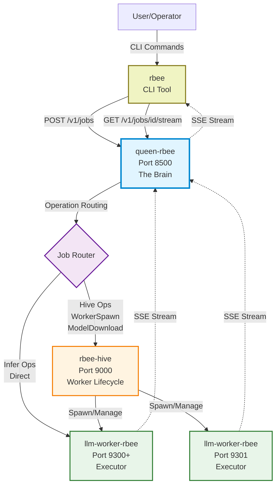
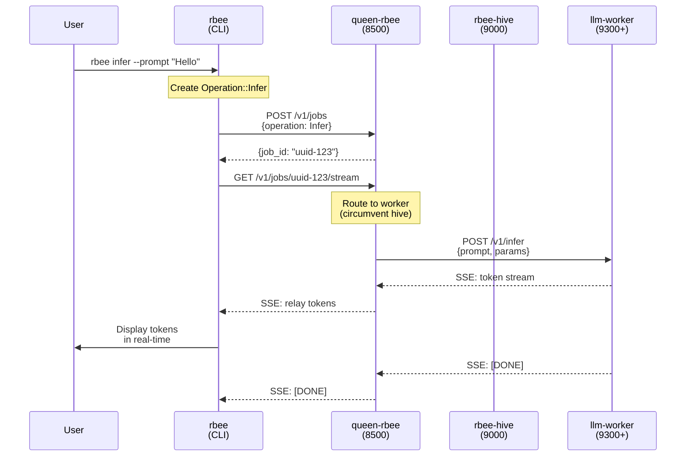
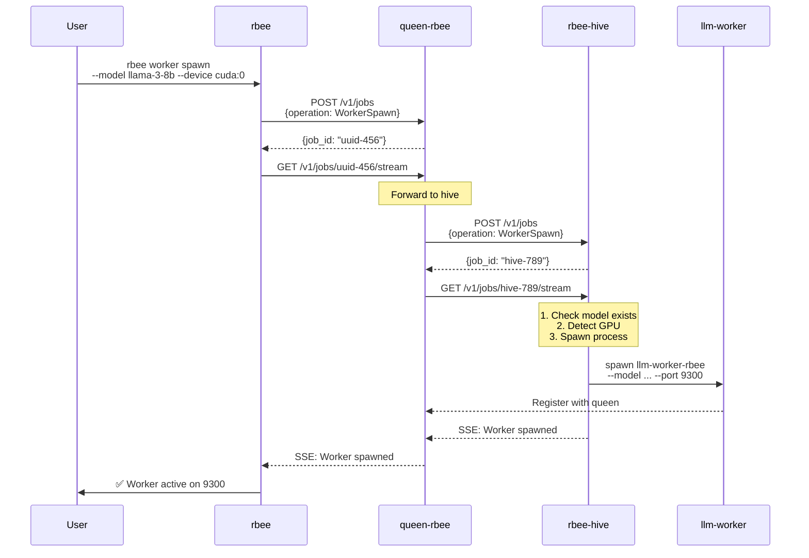
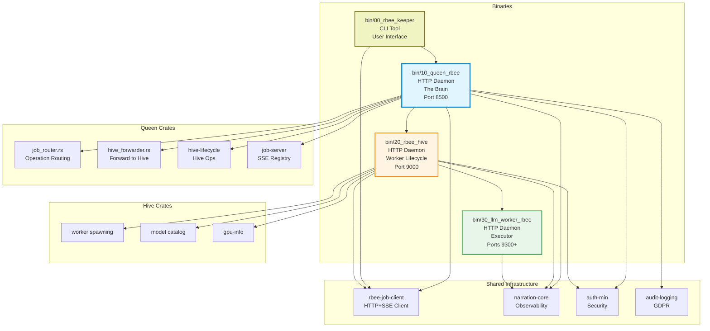
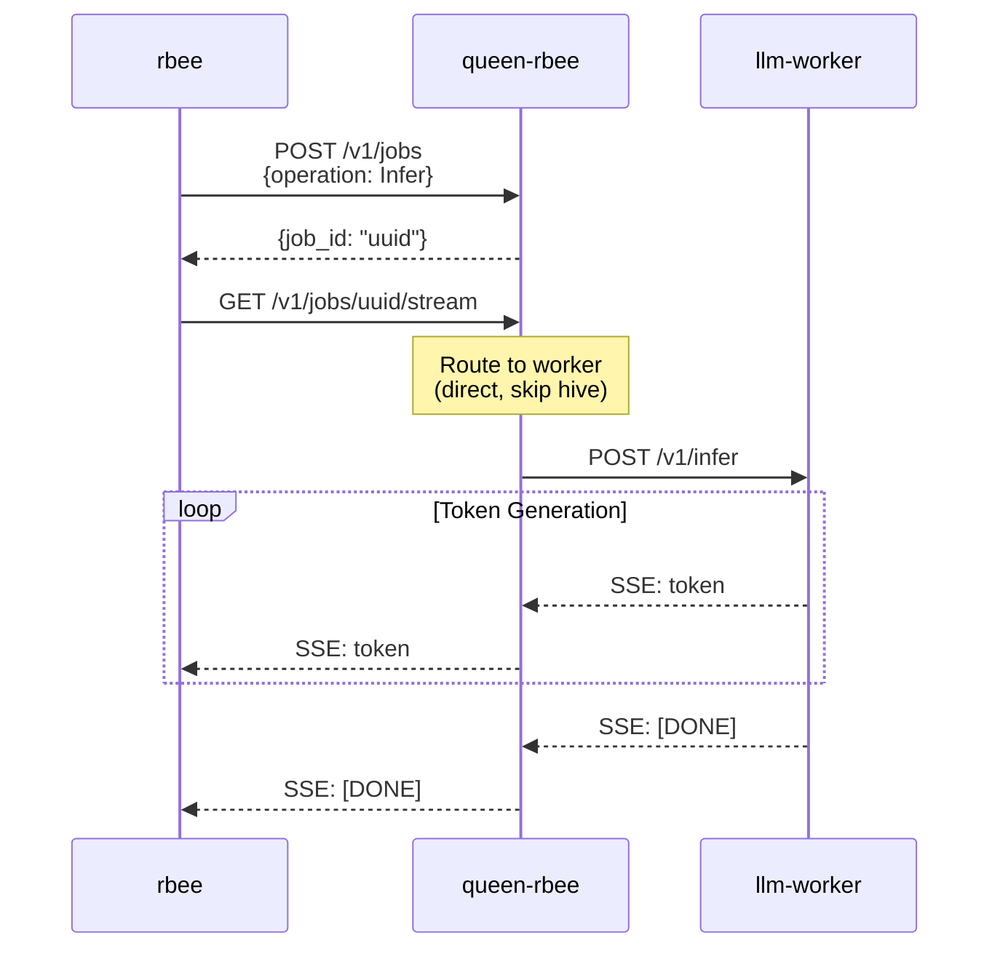

# rbee (pronounced "are-bee")
**Escape dependency on big AI providers. Build your own AI infrastructure.**

rbee is an OpenAI-compatible AI orchestration platform that lets you build your own AI infrastructure using ALL your home network hardware. Never depend on external AI providers again.

**🎯 PRIMARY TARGET AUDIENCE:** Developers who build with AI but don't want to depend on big AI providers.

**THE FEAR:** You're building complex codebases with AI assistance (Claude, GPT-4). What happens when the AI provider changes their models, shuts down, or changes pricing? Your codebase becomes unmaintainable without AI. You've created a dependency you can't control.

**THE SOLUTION:** Build AI coders from scratch using YOUR hardware. Agentic API with task-based streaming. @rbee/utils: TypeScript library for building AI agents. OpenAI-compatible = drop-in replacement. Independence from external providers.

**Current version**: `0.1.0` (68% complete - 42/62 BDD scenarios passing)  
**License**: GPL-3.0-or-later (free and open source, copyleft)  
**Target platform**: Linux with NVIDIA GPUs, Apple Silicon (Metal), CPU fallback  
**Development**: 99% AI-generated code via Character-Driven Development

---

## What is rbee?

### The Main Goal: Independence from Big AI Providers

**Build your own AI infrastructure using ALL your home network hardware:**

```bash
# Multi-machine setup (each GPU machine runs its own hive):

# On GPU Computer 1:
rbee-hive  # Starts hive daemon managing THIS machine's GPUs

# On GPU Computer 2:
rbee-hive  # Starts hive daemon managing THIS machine's GPUs

# On Mac with Metal:
rbee-hive  # Starts hive daemon managing THIS machine's GPU

# On control node (or any machine):
rbee queen start
rbee worker --hive gpu-computer-1 spawn --model llama-3-8b --device cuda:0
rbee worker --hive gpu-computer-2 spawn --model llama-3-8b --device cuda:1
rbee worker --hive mac spawn --model llama-3-8b --device metal:0

# OR single-machine setup (integrated mode - localhost only):
rbee queen start  # Queen embeds hive logic (local-hive feature)
rbee worker spawn --model llama-3-8b --device cuda:0

# 2. Configure Zed IDE (or build your own AI coder)
export OPENAI_API_BASE=http://localhost:8500/v1
export OPENAI_API_KEY=your-rbee-token

# 3. Now your AI tooling runs on YOUR infrastructure!
# Zero external dependencies
# Models never change without your permission
# Always available (your hardware, your uptime)
# Zero ongoing costs (electricity only)
# Complete control over your AI tooling
```

**OpenAI-compatible API** means drop-in replacement for:
- Zed IDE's AI agents
- Cursor IDE
- Continue.dev
- Any tool using OpenAI SDK

**Build your own AI agents with @rbee/utils** (TypeScript library):
- File operations, LLM invocation, prompt management
- Response extraction, model definitions
- Composable utilities for agentic workflows

---

## What is rbee (technical)?
### Core Value Propositions
1. **Test Reproducibility**: Same seed + temp=0 → Same output (for testing validation, not a product promise)
2. **Temperature Control**: Full temperature range 0.0-2.0 for production use (product feature)
3. **Multi-Architecture Support**: NVIDIA CUDA (VRAM-only), Apple ARM (unified memory), and extensible worker adapters
4. **Multi-Node Orchestration**: Distribute models across GPU clusters
5. **Smart/Dumb Architecture**: Clean separation between decisions and execution
6. **Process Isolation**: Workers run in separate processes with isolated memory contexts
**Note**: Determinism is a testing tool, not a product guarantee. LLMs cannot guarantee deterministic behavior due to model architecture and hardware variations.

---

## Why rbee? Competitive Advantages

### vs. Cloud APIs (OpenAI, Anthropic)

**We win on:**
- Independence - Never depend on external providers again
- Control - Your models, your rules, never change without permission
- Privacy - Code never leaves your network
- Cost - Zero ongoing costs (electricity only)
- Availability - Your hardware, your uptime

**They win on:**
- Ease of use (no infrastructure management)
- Model selection (access to latest models)

### vs. Self-Hosted (Ollama, llama.cpp)

**We win on:**
- Multi-node orchestration - Use ALL your computers' GPU power
- Agentic API - Task-based streaming for building AI agents
- @rbee/utils - TypeScript library for AI agent development
- EU compliance - GDPR built-in (7-year audit retention)
- Security-first - 5 specialized security crates
- Test reproducibility - Proof bundles for CI/CD

**They win on:**
- Simplicity (single binary)
- Maturity (battle-tested)

### Unique Features

**No one else has:**
- Character-Driven Development - 99% AI-generated code with 6 specialized teams
- Home Network Power - Use GPUs across ALL your computers
- Agentic API - Task-based streaming designed for AI agents
- @rbee/utils - TypeScript library for building LLM pipelines
- Security-First - 5 security crates (auth-min, audit-logging, input-validation, secrets-management, deadline-propagation)
- EU-Native - GDPR compliance from day 1

---

### The Four-Binary System
rbee (pronounced "are-bee") consists of **4 binaries** (2 daemons + 2 CLIs):

**Daemons (HTTP servers, long-running):**
1. **`queen-rbee`** — The Brain (makes ALL intelligent decisions) [🚧 In Progress]
   - Port 8500, routes inference requests, job-based architecture, worker registry
2. **`rbee-hive`** — Worker Lifecycle Manager (HTTP daemon) [✅ M0 DONE]
   - Port 9000, model catalog, worker spawning, backend detection, capabilities
3. **`llm-worker-rbee`** — LLM Inference Workers (multiple types) [✅ M0 DONE]
   - Ports 9300+, one per model, stateless, HTTP server
   - **Worker types:** cuda-llm-worker-rbee, metal-llm-worker-rbee, cpu-llm-worker-rbee
   - **Future:** comfyui-adapter, vllm-adapter, stable-diffusion-worker

**CLI Tools (run on-demand, exit after command):**
4. **`rbee`** — **USER INTERFACE** [✅ M0 DONE]
   - Binary: `rbee-keeper` (crate name), CLI command: `rbee`
   - Manages queen-rbee lifecycle (start/stop/status)
   - Manages hive lifecycle (install/start/stop/uninstall)
   - Manages workers (spawn/list/stop)
   - Inference testing
### Intelligence Hierarchy

**Single-Machine (Integrated Mode):**
```
┌─────────────────────────────────────┐
│ Operator (Human)                    │
└──────────┬──────────────────────────┘
           │ runs
           ↓
┌─────────────────────────────────────┐
│ rbee CLI (USER INTERFACE)           │
│ - Manages queen-rbee lifecycle      │
│ - Spawns workers                    │
│ - Submits inference                 │
└──────────┬──────────────────────────┘
           │ HTTP to queen
           ↓
┌─────────────────────────────────────┐
│ queen-rbee (THE BRAIN - daemon)     │
│ - Embedded hive logic (localhost)   │
│ - Job registry, routing             │
│ - Spawns workers directly           │
└──────────┬──────────────────────────┘
           │ spawns
           ↓
┌─────────────────────────────────────┐
│ llm-worker-rbee (EXECUTOR - daemon) │
│ - Loads ONE model                   │
│ - Generates tokens                  │
│ - Stateless                         │
└─────────────────────────────────────┘
```

**Multi-Machine (Distributed Mode):**
```
┌─────────────────────────────────────┐
│ Operator (Human)                    │
└──────────┬──────────────────────────┘
           │ runs
           ↓
┌─────────────────────────────────────┐
│ rbee CLI (USER INTERFACE)           │
│ - Manages queen-rbee lifecycle      │
│ - Registers remote hives            │
│ - Spawns workers on hives           │
└──────────┬──────────────────────────┘
           │ HTTP to queen
           ↓
┌─────────────────────────────────────┐
│ queen-rbee (THE BRAIN - daemon)     │
│ - Job registry, routing             │
│ - Routes ops to remote hives        │
└──────────┬──────────────────────────┘
           │ HTTP to hives
           ↓
┌─────────────────────────────────────┐
│ GPU Machine 1                       │
│ ┌─────────────────────────────────┐ │
│ │ rbee-hive (DAEMON on GPU box)   │ │
│ │ - Manages THIS machine's GPUs   │ │
│ └──────────┬──────────────────────┘ │
│            │ spawns                  │
│            ↓                         │
│ ┌─────────────────────────────────┐ │
│ │ llm-worker-rbee (EXECUTOR)      │ │
│ │ - Uses THIS machine's GPU       │ │
│ └─────────────────────────────────┘ │
└─────────────────────────────────────┘
```
**4 binaries total:** 3 daemons (queen-rbee, rbee-hive, llm-worker-rbee) + 1 CLI (rbee)

**Key Architecture Points:**
- **Queen:** Routes requests, makes decisions (can embed hive for localhost)
- **Hive:** Runs ON GPU machines, manages THAT machine's workers only
- **Workers:** Dumb executors, one per model
- **rbee CLI:** User interface for everything
### Why This Architecture?
- **4 binaries, clear separation**: 3 daemons (data plane) + 1 CLI (control plane)
- **queen-rbee is THE BRAIN**: Job-based architecture, routes all operations
- **rbee-hive IS a daemon**: HTTP server on port 9000 for worker lifecycle
- **Workers are stateless**: Each worker loads ONE model, can be killed anytime
- **Queen can run without GPUs**: Routes to remote workers via HTTP
- **Workers have isolated memory contexts**: Each worker owns its memory allocation
- **Testable components**: Each binary runs standalone for testing
- **Multi-architecture**: Worker variants for NVIDIA CUDA, Apple Metal, CPU
---
## VIBE CODED PROJECT
(THIS PART IS JUST FUTURE COPY PASTA, and something human to read)
> Hi there, My name is veighnsche (pronounced Vince). This project is **rbee** (pronounced "are-bee", formerly llama-orch) and it's nearly 99% AI generated I guess. **The main goal:** Power Zed IDE's AI agents with your homelab GPUs via OpenAI-compatible API. I mean. I don't even know how to write rust before I began with this project. I would say that I take ownership of the very high level specifications and architecture, the crate structure and the code flow, the programming language choices and what you can see in the this [`git's history`](https://github.com/veighnsche/llama-orch/commit/e32cd7660671a74917e882fdfb89c0b994dd1ced). i WANT to take FULL responsibility of any breaking bugs and security failures. However. I cannot give you that guarantee until I have fully reviewed the code details (and peer reviews would be nice.)
>
> It goes without saying that I WON'T be offended if you REFUSE to use this project due to ALL the concerns surrounding vibe coding. I understand that you're skeptical and tbh I expect that you are. I hope that the product speaks for itself eventually and feel free to audit the code. I encourage you to audit the code. I am in desperate need of human code reviewers 😓. (I have professional programming experience so I know how to handle reviews, PLUS all the code is AI generated so I won't take nits personally. EXCEPT IF YOU BASELESSLY CRITIQUE THE CODE FLOW AND ARCHITECTURE 😡. But if you spot a critical issue. I will be eternally grateful 😇. (Please read [`./SECURITY.md`](SECURITY.md) for the correct handling of critical issues.))
>
> I just wanted to prove to other skeptics and... myself. That a good programmer can vibe code beyond their normal capabilities. But TO BE FAIR. while making this project... I felt like the best scrum master in the world 😎. It was fun having [`Windsurf`](http://windsurf.com) (not sponsered but.. hey 👋) open on all my 3 screens and working on making the docs and the tests and designing the front-end while my three lovely AI developers were slaving away without any complaint and full synthetic enthusiasm.
>
> So at the time of writing this (dd/mm/yy 01/10/25). I have tried Claude 4.5 for one full day now. And I got so confident that I wrote this. Like this is some victory speech. And yes. I am imagining myself in a gif appearing in /r/prematurecelebration but. Yeah. Idk. I'm kinda seeking recognition I guess. I love my friends and they are the best their professions and carreers, but I can't celebrate some technical nuances with them you know :L. annnnnyyyy way.
>
> Please take a look around. If you have some questions. I'm open to hear about it. If you are a hater. I have been a polarizing figure my entire life. I'M SORRY OKAY :P. so yeah. (btw I know this is cringe. But it's a testament about human text in an AI generated repo. Ask an AI to be exactly my level of cringe. An LLM can't do it, because you know it will overdo the cringyness. My level of cringe is PERFECTLY human... for someone with adhd)
>
> Byyeee <3
---
## Current Status

**Development Progress**: 68% complete (42/62 BDD scenarios passing)

### ✅ What's Working

**Infrastructure:**
- ✅ Backend detection (CUDA, Metal, CPU)
- ✅ Registry schema with backend capabilities
- ✅ Model catalog (SQLite)
- ✅ Model provisioning (Hugging Face download)
- ✅ Worker spawning (llm-cuda-worker-rbee, llm-metal-worker-rbee, llm-cpu-worker-rbee)
- ✅ SSE streaming (token-by-token)
- ✅ HTTP APIs (queen-rbee, rbee-hive, worker)
- ✅ OpenAI-compatible API (v1 completion endpoints)

**CLI Commands:**
- ✅ `rbee queen start` (start queen, embeds hive for localhost)
- ✅ `rbee worker spawn --model <model> --device <device>` (localhost mode)
- ✅ `rbee worker --hive <alias> spawn --model <model> --device <device>` (distributed mode)
- ✅ `rbee infer --prompt "..." --model <model>`
- ✅ `cargo run --bin rbee-hive` (on GPU machines - starts hive daemon on port 9000)

**Testing:**
- ✅ 42/62 BDD scenarios passing (68% complete)
- ✅ Unit tests passing (queen-rbee, rbee-hive, gpu-info)
- ✅ Proof bundle system operational

**Security & Compliance:**
- ✅ **11 shared crates already built** (saves 5 days of development):
  - audit-logging (895 lines of docs, 32 GDPR event types)
  - auth-min (timing-safe token comparison, fingerprinting)
  - input-validation (injection prevention)
  - secrets-management (file-based, zeroization)
  - narration-core (observability, secret redaction)
  - deadline-propagation (timeout handling)
  - gpu-info (backend detection)
  - Plus 4 more crates

### 🚧 In Progress

**Current Sprint:**
- 🚧 Lifecycle management (daemon start/stop/status)
- 🚧 Cascading shutdown (queen-rbee → hives → workers)
- 🚧 SSH configuration management
- 🚧 Worker cancellation endpoint

**Expected:** 54+ scenarios passing by end of M0

### 📋 Roadmap

**M1 (Q1 2026):** Production-ready pool management
- rbee-hive as HTTP daemon
- Worker health monitoring (30s heartbeat)
- Idle timeout enforcement (5 minutes)

**M2 (Q2 2026):** Intelligent orchestration
- queen-rbee HTTP daemon (orchestrator)
- Rhai scripting engine (user-defined routing)
- Web UI (visual management)

**M3 (Q3 2026):** Multi-modal support
- Image generation (Stable Diffusion)
- Audio generation (TTS)
- Embeddings
- Multi-modal routing

### 🎯 30-Day Plan to First Customer

**Week 1 (Days 1-7):** Working end-to-end system  
**Week 2 (Days 8-14):** EU compliance (GDPR endpoints, audit logs, basic web UI)  
**Week 3 (Days 15-21):** Marketing (landing page, outreach, 10 qualified leads)  
**Week 4 (Days 22-30):** Revenue (demos, close deal, onboard customer, €200 MRR)

**Key Advantage:** 11 shared crates already built (audit-logging, auth-min, etc.) saves 5 days of development time!

### 💰 Conservative Financial Projections

**Year 1 (2026):** 35 customers, €10K MRR, €70K revenue  
**Year 2 (2027):** 100 customers, €30K MRR, €360K revenue  
**Year 3 (2028):** 200+ customers, €83K+ MRR, €1M+ revenue

**Pricing Tiers:**
- Starter: €99/mo
- Professional: €299/mo (most popular)
- Enterprise: Custom (€2K+/mo)

---

## Character-Driven Development (99% AI-Generated)

**rbee is built BY AI, not just WITH AI.**

### The Innovation: 6 AI Teams with Distinct Personalities

Instead of one AI doing everything, we created **6 specialized AI teams** that debate design decisions from their perspectives:

1. **Testing Team 🔍** - Obsessively paranoid, zero tolerance for false positives
2. **Security Team (auth-min) 🎭** - Trickster guardians, timing-safe everything
3. **Performance Team ⏱️** - Obsessive timekeepers, every millisecond counts
4. **Audit Logging Team 🔒** - The compliance engine, immutable trails
5. **Narration Core Team 🎀** - Observability artists, secret redaction experts
6. **Developer Experience Team 🎨** - Readability minimalists, policy hunters

**The Magic:** When teams with different priorities review the same code, they catch issues others miss. Security team catches timing attacks. Performance team catches waste. Testing team catches false positives.

**The Result:** Well-thought-out solutions examined from multiple angles.

### How It Works: TEAM-XXX Pattern

**Development workflow:**
1. Write Gherkin feature (define behavior)
2. Implement step definitions (Rust code)
3. Run BDD tests (`bdd-runner`)
4. Iterate until green
5. Handoff to next team with summary

**50+ TEAM handoffs** maintain continuity across development sessions. Each team builds on previous work. No context loss, no rework.

### What We've Proven

**Thesis:** AI can build production software if properly orchestrated

**Evidence:**
- 99% AI-generated code
- 42/62 BDD scenarios passing (68% complete)
- Clean architecture (4 binaries, clear separation)
- Multi-backend support (CUDA, Metal, CPU)
- Comprehensive testing (unit, integration, BDD, property)

**This is the future of software development.** 🐝

---

## Security Architecture: Defense in Depth

**rbee is built with security-first principles from day one.**

### The Five Security Crates

rbee's security is built on **five specialized security crates** that work together to create defense-in-depth:

| Crate | Purpose | Key Features |
|-------|---------|--------------|
| **auth-min** 🎭 | Authentication primitives | Timing-safe comparison, token fingerprinting, bind policy enforcement |
| **audit-logging** 🔒 | Compliance & forensics | Immutable audit trail, tamper detection, GDPR compliance (7-year retention) |
| **input-validation** 🛡️ | Injection prevention | Path traversal, SQL injection, log injection prevention |
| **secrets-management** 🔑 | Credential handling | File-based secrets (not env vars), zeroization, timing-safe verification |
| **deadline-propagation** ⏱️ | Resource protection | Deadline enforcement, timeout handling, prevents resource exhaustion |

**Together, they create defense-in-depth:** Multiple layers of security, each catching what others might miss.

### EU-Native Compliance (GDPR)

**Built-in compliance features:**
- ✅ **Immutable audit logging** - 32 event types across 7 categories
- ✅ **7-year retention** - GDPR, SOC2, ISO 27001 compliant
- ✅ **Tamper detection** - Blockchain-style hash chains
- ✅ **Data residency** - EU-only worker filtering
- ✅ **GDPR endpoints** - Data export, deletion, consent tracking

**Why This Matters:**
- Pass SOC2 audits
- Legally defensible proof of actions
- Customer trust (prove correct data handling)
- EU market advantage (GDPR compliance moat)

---
## Configuration

rbee uses file-based configuration stored in `~/.config/rbee/`:

- `config.toml` - Queen-level settings
- `hives.conf` - Hive definitions (SSH config style)
- `capabilities.yaml` - Auto-generated device capabilities

See [docs/HIVE_CONFIGURATION.md](docs/HIVE_CONFIGURATION.md) for details.

---
## Documentation
### Core Specifications
- [`.specs/20_queen-rbee.md`](.specs/20_queen-rbee.md) — Control plane service
- [`.specs/30_pool_managerd.md`](.specs/30_pool_managerd.md) — GPU worker service
- [`.specs/metrics/otel-prom.md`](.specs/metrics/otel-prom.md) — Metrics contract
- [`AGENTS.md`](AGENTS.md) — Repository guidelines, dev loop, coding/testing discipline
- [`SECURITY.md`](SECURITY.md) — Security policy and Minimal Auth Hooks seam
- **[`bin/shared-crates/secrets-management/`](bin/shared-crates/secrets-management/)** — ⚠️ **Use this for ALL credentials** (API tokens, seal keys, worker tokens)
### Operational Guides
- [`docs/HIVE_CONFIGURATION.md`](docs/HIVE_CONFIGURATION.md) — Hive configuration guide
- [`docs/MIGRATION_GUIDE.md`](docs/MIGRATION_GUIDE.md) — SQLite to file-based config migration
- [`docs/HIVE_QUICK_REFERENCE.md`](docs/HIVE_QUICK_REFERENCE.md) — Quick reference card
- [`docs/CONFIGURATION.md`](docs/CONFIGURATION.md) — Complete environment variable reference
- [`docs/MANUAL_MODEL_STAGING.md`](docs/MANUAL_MODEL_STAGING.md) — Model staging guide
### Development
- [`.docs/testing/`](.docs/testing/) — Testing strategy, BDD wiring, test types
- [`CONSUMER_CAPABILITIES.md`](CONSUMER_CAPABILITIES.md) — Consumer-facing API guide
- [`COMPLIANCE.md`](COMPLIANCE.md) — Requirements traceability (ORCH/OC-* IDs)
### Security & Compliance
- [`bin/shared-crates/audit-logging/`](bin/shared-crates/audit-logging/) — **Tamper-evident audit logging** (Security Rating: A-)
- [`bin/shared-crates/AUDIT_LOGGING_REMINDER.md`](bin/shared-crates/AUDIT_LOGGING_REMINDER.md) — **⚠️ Required reading for all engineers**
- Use `audit-logging` crate for all security events (auth, authz, resource ops, GDPR compliance)
### Stakeholder Documents
- [`.business/stakeholders/AGENTIC_AI_USE_CASE.md`](.business/stakeholders/AGENTIC_AI_USE_CASE.md) — Primary use case and value proposition
- [`.business/stakeholders/AI_DEVELOPMENT_STORY.md`](.business/stakeholders/AI_DEVELOPMENT_STORY.md) — Character-Driven Development methodology
- [`.business/stakeholders/ENGINEERING_GUIDE.md`](.business/stakeholders/ENGINEERING_GUIDE.md) — Engineering practices and patterns
- [`.business/stakeholders/FINANCIAL_PROJECTIONS_UPDATE.md`](.business/stakeholders/FINANCIAL_PROJECTIONS_UPDATE.md) — Conservative financial projections
- [`.business/stakeholders/SECURITY_ARCHITECTURE.md`](.business/stakeholders/SECURITY_ARCHITECTURE.md) — Defense-in-depth security design
- [`.business/stakeholders/STAKEHOLDER_STORY.md`](.business/stakeholders/STAKEHOLDER_STORY.md) — Complete story for all stakeholders
- [`.business/stakeholders/TECHNICAL_DEEP_DIVE.md`](.business/stakeholders/TECHNICAL_DEEP_DIVE.md) — Technical architecture deep dive
---
## Architecture Overview

> **📚 For comprehensive architecture documentation, see [`.arch/README.md`](.arch/README.md)**  
> The `.arch/` folder contains a complete 10-part architectural overview covering system design, components, data flow, security, and more.

### The Four-Binary System

> **Note:** This section provides a high-level overview. For detailed component analysis, communication patterns, and implementation details, refer to [`.arch/`](.arch/) documentation.

rbee consists of **4 binaries** with clear responsibilities:

| Binary | Type | Port | Purpose | Status |
|--------|------|------|---------|--------|
| **rbee** | CLI | - | User interface, manages infrastructure | ✅ M0 |
| **queen-rbee** | Daemon | 8500 | Brain, routes all requests | 🚧 In Progress |
| **rbee-hive** | Daemon | 9000 | Worker lifecycle management | ✅ M0 |
| **llm-worker-rbee** | Daemon | 9300+ | LLM inference (multiple worker types) | ✅ M0 | 

### Architectural Philosophy

#### 1. Smart/Dumb Architecture
**Principle:** Clear separation between decision-making and execution.

- **queen-rbee (BRAIN)** → Makes ALL intelligent decisions (routing, scheduling, load balancing)
- **llm-worker-rbee (EXECUTOR)** → Dumb execution (load model, execute inference, stream tokens)

**Why?** Testable components, scalable, maintainable, debuggable.

#### 2. Process Isolation
**Principle:** Each worker runs in a separate process with isolated memory.

```
Worker 1 (Process A) → 8GB VRAM → llama-3-8b
Worker 2 (Process B) → 8GB VRAM → mistral-7b
Worker 3 (Process C) → 16GB RAM → qwen-0.5b (CPU)
```

**Why?** Memory safety, resource accounting, kill safety, multi-model support.

#### 3. Job-Based Architecture
**Principle:** All operations are jobs with unique IDs and SSE streams.

```
Client → POST /v1/jobs → job_id
Client → GET /v1/jobs/{job_id}/stream → SSE events
```

**Why?** Real-time feedback, job isolation, audit trail, cancellation support.

### Binary Responsibilities

#### rbee (CLI - User Interface)
**Status:** ✅ M0 COMPLETE

**Purpose:** Primary user interface for human operators managing rbee infrastructure.

**Note:** Binary crate is `rbee-keeper`, but CLI command is `rbee` (configured via clap).

**Responsibilities:**
- Queen lifecycle management (start/stop/status/rebuild)
- Hive lifecycle management (install/start/stop/uninstall)
- Worker management (spawn/list/stop)
- Model management (download/list/delete)
- Inference testing

**Usage:**
```bash
# Single-machine (localhost integrated mode)
rbee queen start  # Embeds hive logic
rbee worker spawn --model llama-3-8b --device cuda:0
rbee infer --prompt "Hello" --model llama-3-8b

# Multi-machine (distributed mode)
# On each GPU machine:
rbee-hive  # Start hive daemon on GPU machine

# From control node:
rbee queen start
rbee hive install gpu-machine-1  # Register remote hive
rbee hive install gpu-machine-2
rbee worker --hive gpu-machine-1 spawn --model llama-3-8b --device cuda:0
rbee worker --hive gpu-machine-2 spawn --model llama-3-8b --device cuda:1
rbee worker list
rbee infer --prompt "Hello" --model llama-3-8b
```

#### queen-rbee (HTTP Daemon - The Brain)
**Status:** 🚧 In Progress  
**Port:** 8500

**Purpose:** Makes ALL intelligent decisions for the system.

**Responsibilities:**
- Job registry (track all operations)
- Operation routing (forwards to hive or worker)
- SSE streaming (real-time feedback)
- Hive registry (track available hives)
- Worker registry (track available workers)

**Requirements:** No GPU needed

**Key Features:**
- Job-based architecture (everything is a job with SSE stream)
- Dual-mode hive forwarder (HTTP or embedded)
- Real-time narration to clients

#### rbee-hive (HTTP Daemon - Worker Lifecycle)
**Status:** ✅ M0 COMPLETE  
**Port:** 9000

**Purpose:** Worker lifecycle manager that runs ON THE GPU MACHINE.

**Key Insight:** Each GPU machine runs its own hive daemon. The hive manages workers ON THAT MACHINE ONLY.

**Responsibilities:**
- Worker spawning/stopping ON THIS MACHINE
- Model catalog and download FOR THIS MACHINE
- Device detection (CUDA/Metal/CPU) ON THIS MACHINE
- Capabilities reporting FOR THIS MACHINE
- Local job registry

**Requirements:** Runs on the GPU machine itself (NOT centrally managed)

#### llm-worker-rbee (HTTP Daemon - Executor)
**Status:** ✅ M0 COMPLETE  
**Ports:** 9300+

**Purpose:** Dumb executor for LLM inference.

**Responsibilities:**
- Load ONE model into VRAM/RAM
- Execute inference requests
- Stream tokens via SSE
- Report health status

**Requirements:** GPU (CUDA/Metal) or CPU

**Key Properties:**
- Stateless (can be killed anytime)
- Process isolated (separate memory)
- Single model per worker
- Direct HTTP API

### Deployment Topologies

#### Single Machine (Localhost - Integrated Mode)
```
┌─────────────────────────────────────┐
│ Machine: localhost                  │
│                                     │
│  queen-rbee (8500)                 │
│  ├─ Embedded hive logic            │
│  │  (local-hive feature)           │
│  └─ Spawns workers directly        │
│                                     │
│  llm-worker-rbee (9300+)           │
│  - worker-1: llama-3-8b            │
│  - worker-2: mistral-7b            │
└─────────────────────────────────────┘

No separate hive daemon needed!
Queen embeds hive logic for localhost.
```

#### Multi-Machine (Distributed)
```
┌─────────────────────────────────────┐
│ Control Node (can have GPU or not)  │
│  queen-rbee (8500)                 │
│  - Routes requests to hives        │
└──────────┬──────────────────────────┘
           │ HTTP
     ┌─────┴─────────┬────────────┐
     ↓               ↓            ↓
┌─────────────┐ ┌─────────────┐ ┌─────────────┐
│ GPU Node 1  │ │ GPU Node 2  │ │ GPU Node N  │
│             │ │             │ │             │
│ rbee-hive   │ │ rbee-hive   │ │ rbee-hive   │
│ (9000)      │ │ (9000)      │ │ (9000)      │
│ ↓           │ │ ↓           │ │ ↓           │
│ workers     │ │ workers     │ │ workers     │
│ (9300+)     │ │ (9300+)     │ │ (9300+)     │
│             │ │             │ │             │
│ THIS        │ │ THIS        │ │ THIS        │
│ MACHINE'S   │ │ MACHINE'S   │ │ MACHINE'S   │
│ GPUs        │ │ GPUs        │ │ GPUs        │
└─────────────┘ └─────────────┘ └─────────────┘

Each hive manages ONLY its own machine's workers!
```
---
## System Flow Diagrams

### Communication Patterns


### Request Flow: Inference Operation


### Worker Lifecycle: Spawn Flow



### Component Architecture



### Key Shared Crates

#### Job Infrastructure
- **`bin/99_shared_crates/job-server/`** — SSE job registry, event broadcasting
- **`bin/99_shared_crates/rbee-job-client/`** — Unified HTTP+SSE client for job submission
- **`bin/99_shared_crates/timeout-enforcer/`** — Deadline enforcement with narration

#### Hive Management
- **`bin/15_queen_rbee_crates/hive-lifecycle/`** — Hive operations (install/start/stop/uninstall)
- **`bin/15_queen_rbee_crates/hive-forwarder/`** — Forward operations to hive via HTTP

#### Observability
- **`bin/99_shared_crates/narration-core/`** — Human-readable event narration with SSE routing
- Event types: action, status, error, warning
- Secret redaction for audit trails

#### Security (5 Crates)
- **`bin/99_shared_crates/auth-min/`** — Authentication primitives, timing-safe comparison
- **`bin/99_shared_crates/audit-logging/`** — Immutable audit trail, GDPR compliance
- **`bin/99_shared_crates/input-validation/`** — Injection prevention
- **`bin/99_shared_crates/secrets-management/`** — File-based credentials, zeroization
- **`bin/99_shared_crates/deadline-propagation/`** — Resource protection, timeout handling

#### Platform Support
- **`bin/99_shared_crates/gpu-info/`** — Multi-backend detection (CUDA, Metal, CPU)
- **`bin/99_shared_crates/rbee-config/`** — Cross-platform configuration paths

### Consumer Libraries

```
@rbee/utils (TypeScript utilities, guardrails)
     ↓
@rbee/sdk (TypeScript SDK, typed API)
     ↓
queen-rbee (HTTP API, ground truth)
```

- **`consumers/rbee-utils/`** — TypeScript utilities for building AI agents
- **`consumers/rbee-sdk/`** — TypeScript SDK (future)
- OpenAI-compatible API adapter
---
## Repository Structure

| Path | Contents |
|------|----------|
| **`.arch/`** | **10-part architecture documentation** (comprehensive system design) |
| `.specs/` | Feature specifications (Gherkin/BDD) |
| `.docs/` | Guides, testing strategy, development patterns |
| **`bin/`** | **4 binaries** (rbee CLI in rbee-keeper crate, queen-rbee, rbee-hive, llm-worker-rbee) |
| `bin/99_shared_crates/` | Shared infrastructure (job-server, narration, security) |
| `contracts/` | OpenAPI specs, API types, config schema |
| `consumers/` | TypeScript libraries (@rbee/utils, @rbee/sdk) |
| `tools/` | Code generation, spec extraction, README indexing |
| `ci/` | Metrics linting, dashboards, alerts |
---
## API Overview

### Job-Based Architecture

rbee uses a **job-based architecture** where ALL operations (hive management, worker spawning, inference) are jobs with SSE streams.

### HTTP Endpoints

#### queen-rbee (Port 8500)

**Job Submission:**
- `POST /v1/jobs` — Submit operation, returns `{job_id}`
- `GET /v1/jobs/{job_id}/stream` — SSE stream of job events

**Operations:**
```json
// Hive operations
{"operation": {"HiveInstall": {"alias": "localhost", ...}}}
{"operation": {"HiveStart": {"alias": "localhost"}}}
{"operation": {"HiveStop": {"alias": "localhost"}}}
{"operation": {"HiveStatus": {"alias": "localhost"}}}
{"operation": {"HiveUninstall": {"alias": "localhost"}}}

// Worker operations (forwarded to hive)
{"operation": {"WorkerSpawn": {"hive_id": "localhost", "model": "llama-3-8b", ...}}}
{"operation": {"WorkerList": {"hive_id": "localhost"}}}
{"operation": {"WorkerStop": {"worker_id": "uuid"}}}

// Model operations (forwarded to hive)
{"operation": {"ModelDownload": {"hive_id": "localhost", "model": "llama-3-8b"}}}
{"operation": {"ModelList": {"hive_id": "localhost"}}}

// Inference operations (direct to worker)
{"operation": {"Infer": {"prompt": "Hello", "model": "llama-3-8b", ...}}}
```

#### rbee-hive (Port 9000)

**Same API structure:**
- `POST /v1/jobs` — Submit operation (worker/model ops only)
- `GET /v1/jobs/{job_id}/stream` — SSE stream

#### llm-worker-rbee (Ports 9300+)

**Direct Inference:**
- `POST /v1/infer` — Submit inference request, SSE stream response
- `GET /health` — Worker health check
### SSE Streaming Format

**Narration Events:**
```
data: {"event": "hive_health_check", "message": "Checking hive health...", "timestamp": "..."}
data: {"event": "hive_start", "message": "🚀 Starting hive...", "timestamp": "..."}
data: {"event": "hive_start", "message": "✅ Hive started", "timestamp": "..."}
data: [DONE]
```

**Inference Stream:**
```
data: Hello
data:  world
data: !
data: [DONE]
```

**Error Events:**
```json
data: {"error": "Hive not found: unknown-hive", "timestamp": "..."}
data: [DONE]
```
### Request Lifecycle (Inference)


---
## Developer Quickstart

### Prerequisites
- Rust toolchain (1.70+)
- NVIDIA GPU with drivers + CUDA runtime (for GPU workers)
- OR Apple Silicon (for Metal workers)
- Linux (Ubuntu 22.04+) or macOS

### Build & Test

```bash
# Clone repository
git clone https://github.com/veighnsche/llama-orch
cd llama-orch

# Format check
cargo fmt --all -- --check

# Lint
cargo clippy --all-targets --all-features -- -D warnings

# Run BDD tests
cargo test --bin bdd-runner -- --nocapture

# Build all binaries
cargo build --release
```

### Run rbee System

**Single-Machine (Localhost Integrated Mode):**
```bash
# 1. Start queen (embeds hive logic for localhost)
cargo run --bin queen-rbee
# Listening on http://localhost:8500

# 2. Spawn worker (queen uses embedded hive)
rbee worker spawn \
  --model qwen-0.5b \
  --device cuda:0

# 3. Test inference
rbee infer \
  --prompt "Hello!" \
  --model qwen-0.5b \
  --max-tokens 50
```

**Multi-Machine (Distributed Mode):**
```bash
# On GPU machine (e.g., 192.168.1.100):
cargo run --bin rbee-hive
# Hive listening on 0.0.0.0:9000

# On control node:
cargo run --bin queen-rbee
# Queen listening on http://localhost:8500

# Register remote hive:
rbee hive install gpu-machine-1 \
  --url http://192.168.1.100:9000

# Spawn worker on remote machine:
rbee worker --hive gpu-machine-1 spawn \
  --model qwen-0.5b \
  --device cuda:0

# Test inference:
rbee infer \
  --prompt "Hello!" \
  --model qwen-0.5b \
  --max-tokens 50
```

### BDD Testing

```bash
# Run all BDD scenarios
cargo test --bin bdd-runner -- --nocapture

# Run specific scenario
cargo test --bin bdd-runner -- --nocapture "scenario name"

# Check BDD progress
# 42/62 scenarios passing (68% complete)
```
---
## Development Workflow

**⚠️ CRITICAL:** This is a Rust project. Do NOT write shell scripts for product features. See [NO_SHELL_SCRIPTS.md](NO_SHELL_SCRIPTS.md).

rbee follows strict **Spec → Contract → Tests → Code** discipline:
1. **Spec**: Define requirements in `.specs/` with stable IDs (ORCH-3xxx)
2. **Contract**: Update OpenAPI/types in `contracts/`
3. **Tests**: Write BDD scenarios, unit tests, integration tests
4. **Code**: Implement to satisfy tests and specs
### Key Principles
- **No backwards compatibility before v1.0** — Breaking changes are expected
- **Test reproducibility** — Identical inputs + temp=0 yield identical outputs (for testing only)
- **** — Tests emit artifacts (NDJSON, JSON, seeds) to `.proof_bundle/`
- **Metrics contract** — All metrics align with `.specs/metrics/otel-prom.md`
- **Zero dead code** — Remove unused code immediately (see `AGENTS.md`)
See [`AGENTS.md`](AGENTS.md) for complete repository guidelines.
---
## Contributing
### Before You Start
1. Read [`AGENTS.md`](AGENTS.md) — Repository guidelines and dev loop
3. Check [`TODO.md`](TODO.md) — Active work tracker
### Pull Request Checklist
- [ ] Spec updated (if changing behavior)
- [ ] Contract updated (if changing API)
- [ ] Tests added/updated
- [ ] `cargo fmt --all` passes
- [ ] `cargo clippy --all-targets --all-features` clean
- [ ] `cargo test --workspace` passes
- [ ] `cargo xtask regen-openapi` run (if contracts changed)
- [ ] Requirement IDs referenced in commits (e.g., `ORCH-3027: Add decode_time_ms to logs`)
- [ ] `TODO.md` updated
---
## License & Security
**License**: GPL-3.0-or-later (see [`LICENSE`](LICENSE))
**Security**: 
- Localhost defaults to no authentication
- Multi-node deployments require Bearer token authentication
- See [`SECURITY.md`](SECURITY.md) for security policy
- See [`.specs/11_min_auth_hooks.md`](.specs/11_min_auth_hooks.md) for Minimal Auth Hooks seam

---

## Quick Reference

**Pronunciation:** rbee (pronounced "are-bee")  
**Tagline:** Escape dependency on big AI providers. Build your own AI infrastructure.

**Target Audience:** Developers who build with AI but fear provider dependency  
**The Fear:** Complex codebases become unmaintainable if provider changes/shuts down  
**The Solution:** Build your own AI infrastructure using ALL your home network hardware

**Key Features:**
- 🐝 OpenAI-compatible API (drop-in replacement)
- 🐝 Agentic API (task-based streaming for building AI agents)
- 🐝 @rbee/utils (TypeScript library for AI agent development)
- 🐝 Multi-backend support (CUDA, Metal, CPU)
- 🐝 Home network power (use GPUs across ALL your computers)
- 🐝 EU-native compliance (GDPR from day 1)
- 🐝 Security-first (5 specialized security crates)
- 🐝 99% AI-generated code (Character-Driven Development)

**Current Status:**
- Version: 0.1.0 (68% complete - 42/62 BDD scenarios passing)
- 11 shared crates already built (saves 5 days of development)
- 30-day plan to first customer

**Conservative Projections:**
- Year 1: 35 customers, €10K MRR, €70K revenue
- Year 2: 100 customers, €30K MRR, €360K revenue
- Year 3: 200+ customers, €83K+ MRR, €1M+ revenue

**Pricing:**
- Starter: €99/mo
- Professional: €299/mo (most popular)
- Enterprise: Custom (€2K+/mo)

**Links:**
- Website: https://rbee.dev
- GitHub: https://github.com/veighnsche/llama-orch
- Stakeholder docs: `.business/stakeholders/`

**The Bottom Line:** Build AI coders from scratch. Never depend on external providers again. 🐝
