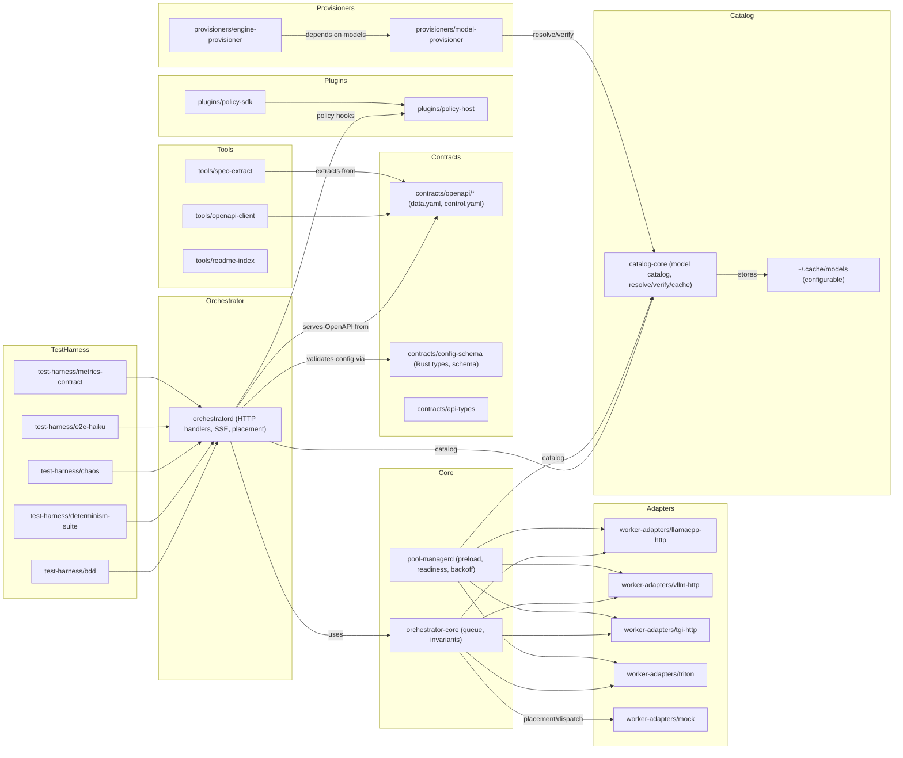
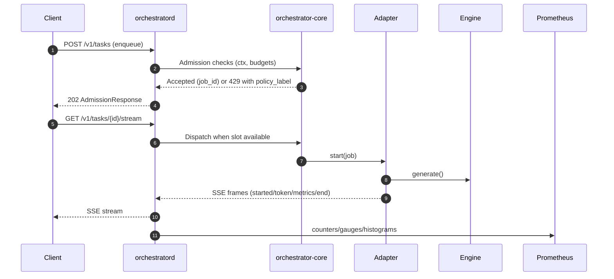

# llama-orch — Orchestrator for LLMs

llama-orch is an in-progress LLM Orchestrator. The codebase follows a strict Spec → Contract → Tests → Code workflow and ships features behind quality gates. We are currently building out Stage 6 (Admission → Dispatch → SSE) with contracts, tests, and an executable vertical slice.

See also:

- `README_LLM.md` — decision rules and workflow for contributors
- `.specs/` — normative specs and metrics contracts
- `.docs/` — project docs, archived TODO logs under `.docs/DONE/`

## Current status

- Stage progress (see `README_LLM.md`):
  - Stage 0–5 complete (contracts, CDC, provider verify, properties, observability)
  - Stage 6 (Admission → Dispatch → SSE) in progress
- What’s implemented right now:
  - HTTP routes modularized under `orchestratord/src/http/`
  - Data-plane admission accepts tasks, enqueues with metrics, and spawns a background dispatch to a WorkerAdapter (mock) that emits an SSE transcript: `started` → `token` → `metrics` → `end`
  - SSE stream served from in-memory transcript with correlation and budget headers
  - Metrics registry per `.specs/metrics/otel-prom.md` with sample families and streaming side-effects (first-token, decode duration, tokens in/out)
  - Control/catalog routes aligned to OpenAPI; `/metrics` endpoint available
  - JSON structured logging via `tracing-subscriber`

Note: The `orchestratord` binary builds the router but does not start a network server yet; tests and harnesses call handlers in-process.

## Architecture overview

- `contracts/` — single source of truth for OpenAPI (data + control) and config schema
- `orchestrator-core/` — queue and invariants; used by the orchestrator with metrics wrapper
- `orchestratord/` — HTTP handlers, state, metrics, placement, and binary entrypoint
  - `http/` modules: `auth.rs`, `data.rs`, `catalog.rs`, `control.rs`, `observability.rs`
  - `metrics.rs` Prometheus vectors/histograms; `/metrics` endpoint
  - `state.rs` app state and registries; `placement.rs` minimal adapter chooser
- `worker-adapters/` — adapter API + engines (mock now; llamacpp/vllm/tgi/triton scaffolds)
- `test-harness/` — BDD, determinism suite, chaos, E2E Haiku scaffolding
- `tools/` — generators and utilities: OpenAPI client, spec extract, README indexer
- `ci/` — pipelines and linters (metrics, links)

### Crate wiring (Mermaid)



## API surface (contracts first)

- Data plane (OrchQueue v1): `contracts/openapi/data.yaml`
  - `POST /v1/tasks` → 202 Accepted with `AdmissionResponse`
  - `GET /v1/tasks/{id}/stream` → `text/event-stream` frames: `started`, `token` (`{t,i}`), `metrics`, `end`
  - `POST /v1/tasks/{id}/cancel`
  - `GET|DELETE /v1/sessions/{id}`
- Control plane: `contracts/openapi/control.yaml`
  - `GET /v1/capabilities`, `GET /v1/pools/{id}/health`, `POST /v1/pools/{id}/{drain|reload}`
  - Catalog: `POST /v1/catalog/models`, `GET /v1/catalog/models/{id}`, `POST /v1/catalog/models/{id}/verify`, `POST /v1/catalog/models/{id}/state`
- Observability: `GET /metrics` (Prometheus text)

### Request lifecycle (OrchQueue v1)



## Metrics (implemented/registered)

- Counters: `tasks_enqueued_total`, `tasks_started_total`, `tasks_canceled_total`, `tasks_rejected_total`, `admission_backpressure_events_total`, `tokens_in_total`, `tokens_out_total`, `catalog_verifications_total`
- Gauges: `queue_depth`, `model_state` (Active|Retired), `kv_cache_usage_ratio`, `gpu_utilization`, `vram_used_bytes`
- Histograms: `latency_first_token_ms`, `latency_decode_ms`

SSE streaming side-effects update first-token latency, decode latency, and token counters. See `orchestratord/src/metrics.rs`.

## Developer quickstart

- Format and lint

```bash
cargo fmt --all -- --check
cargo clippy --all-targets --all-features -- -D warnings
```

- Regenerate contracts and requirements (deterministic)

```bash
cargo xtask regen-openapi
cargo xtask regen-schema
cargo run -p tools-spec-extract --quiet && git diff --exit-code
```

- Run all workspace tests

```bash
cargo test --workspace --all-features -- --nocapture
```

- Provider verification and BDD harness

```bash
cargo test -p orchestratord --test provider_verify -- --nocapture
cargo test -p test-harness-bdd -- --nocapture
```

- Full developer loop (fmt, clippy, regen, tests, linkcheck)

```bash
cargo xtask dev:loop
```

## Contributing & PR discipline

- Pre‑1.0.0: no backwards compatibility; remove dead code early
- Work order: Spec → Contract → Tests → Code; update `.specs/` and contracts before implementation
- Reference requirement IDs in commits, code, and tests (e.g., `ORCH-2001`)
- Keep the root `TODO.md` updated after each change; archive via `ci/scripts/archive_todo.sh` when complete
- JSON structured logs via `tracing`; redact secrets; see `.specs/metrics/otel-prom.md`

## License

GPL-3.0-or-later. See `LICENSE`.

<!-- BEGIN WORKSPACE MAP (AUTO-GENERATED) -->
## Workspace Map

| Path | Crate | Role | Key APIs/Contracts | Tests | Spec Refs |
|------|------|------|---------------------|-------|-----------|
| [`cli/consumer-tests/`](cli/consumer-tests/README.md) | `cli-consumer-tests` | test-harness | — |
orchqueue_pact, snapshot_transcript, snapshots, stub_wiremock | ORCH-3050, ORCH-3051 |
| [`contracts/api-types/`](contracts/api-types/README.md) | `contracts-api-types` | contracts | — |
— | ORCH-3044, ORCH-3030 |
| [`contracts/config-schema/`](contracts/config-schema/README.md) | `contracts-config-schema` |
contracts | Schema | validate_examples | ORCH-3044, ORCH-3030 |
| [`orchestrator-core/`](orchestrator-core/README.md) | `orchestrator-core` | core | — |
props_queue | ORCH-3004, ORCH-3005, ORCH-3008, ORCH-3010, ORCH-3011, ORCH-3016, ORCH-3017,
ORCH-3027, ORCH-3028, ORCH-3044, ORCH-3045 |
| [`orchestratord/`](orchestratord/README.md) | `orchestratord` | core | OpenAPI | provider_verify
| ORCH-3004, ORCH-3005, ORCH-3008, ORCH-3010, ORCH-3011, ORCH-3016, ORCH-3017, ORCH-3027,
ORCH-3028, ORCH-3044, ORCH-3045, ORCH-2002, ORCH-2101, ORCH-2102, ORCH-2103, ORCH-2104 |
| [`plugins/policy-host/`](plugins/policy-host/README.md) | `plugins-policy-host` | plugin | — | —
| ORCH-3048 |
| [`plugins/policy-sdk/`](plugins/policy-sdk/README.md) | `plugins-policy-sdk` | plugin | — | — |
ORCH-3048 |
| [`pool-managerd/`](pool-managerd/README.md) | `pool-managerd` | core | — | — | ORCH-3004,
ORCH-3005, ORCH-3008, ORCH-3010, ORCH-3011, ORCH-3016, ORCH-3017, ORCH-3027, ORCH-3028, ORCH-3044,
ORCH-3045, ORCH-3038, ORCH-3002 |
| [`test-harness/bdd/`](test-harness/bdd/README.md) | `test-harness-bdd` | test-harness | — | bdd,
features | ORCH-3050, ORCH-3051 |
| [`test-harness/chaos/`](test-harness/chaos/README.md) | `test-harness-chaos` | test-harness | — |
— | ORCH-3050, ORCH-3051 |
| [`test-harness/determinism-suite/`](test-harness/determinism-suite/README.md) |
`test-harness-determinism-suite` | test-harness | — | byte_exact, placeholder | ORCH-3050,
ORCH-3051 |
| [`test-harness/e2e-haiku/`](test-harness/e2e-haiku/README.md) | `test-harness-e2e-haiku` |
test-harness | — | e2e_client, placeholder | ORCH-3050, ORCH-3051 |
| [`test-harness/metrics-contract/`](test-harness/metrics-contract/README.md) |
`test-harness-metrics-contract` | test-harness | — | metrics_lint | ORCH-3050, ORCH-3051 |
| [`tools/openapi-client/`](tools/openapi-client/README.md) | `tools-openapi-client` | tool |
OpenAPI | trybuild, ui | — |
| [`tools/readme-index/`](tools/readme-index/README.md) | `tools-readme-index` | tool | — | — | — |
| [`tools/spec-extract/`](tools/spec-extract/README.md) | `tools-spec-extract` | tool | — | — | — |
| [`worker-adapters/llamacpp-http/`](worker-adapters/llamacpp-http/README.md) |
`worker-adapters-llamacpp-http` | adapter | — | — | ORCH-3054, ORCH-3055, ORCH-3056, ORCH-3057,
ORCH-3058 |
| [`worker-adapters/mock/`](worker-adapters/mock/README.md) | `worker-adapters-mock` | adapter | —
| — | ORCH-3054, ORCH-3055, ORCH-3056, ORCH-3057, ORCH-3058 |
| [`worker-adapters/tgi-http/`](worker-adapters/tgi-http/README.md) | `worker-adapters-tgi-http` |
adapter | — | — | ORCH-3054, ORCH-3055, ORCH-3056, ORCH-3057, ORCH-3058 |
| [`worker-adapters/triton/`](worker-adapters/triton/README.md) | `worker-adapters-triton` |
adapter | — | — | ORCH-3054, ORCH-3055, ORCH-3056, ORCH-3057, ORCH-3058 |
| [`worker-adapters/vllm-http/`](worker-adapters/vllm-http/README.md) | `worker-adapters-vllm-http`
| adapter | — | — | ORCH-3054, ORCH-3055, ORCH-3056, ORCH-3057, ORCH-3058 |
| [`xtask/`](xtask/README.md) | `xtask` | tool | — | — | — |

### Glossary

- `cli-consumer-tests` — cli-consumer-tests (test-harness)
- `contracts-api-types` — contracts-api-types (contracts)
- `contracts-config-schema` — contracts-config-schema (contracts)
- `orchestrator-core` — orchestrator-core (core)
- `orchestratord` — orchestratord (core)
- `plugins-policy-host` — plugins-policy-host (plugin)
- `plugins-policy-sdk` — plugins-policy-sdk (plugin)
- `pool-managerd` — pool-managerd (core)
- `test-harness-bdd` — test-harness-bdd (test-harness)
- `test-harness-chaos` — test-harness-chaos (test-harness)
- `test-harness-determinism-suite` — test-harness-determinism-suite (test-harness)
- `test-harness-e2e-haiku` — test-harness-e2e-haiku (test-harness)
- `test-harness-metrics-contract` — test-harness-metrics-contract (test-harness)
- `tools-openapi-client` — tools-openapi-client (tool)
- `tools-readme-index` — tools-readme-index (tool)
- `tools-spec-extract` — tools-spec-extract (tool)
- `worker-adapters-llamacpp-http` — worker-adapters-llamacpp-http (adapter)
- `worker-adapters-mock` — worker-adapters-mock (adapter)
- `worker-adapters-tgi-http` — worker-adapters-tgi-http (adapter)
- `worker-adapters-triton` — worker-adapters-triton (adapter)
- `worker-adapters-vllm-http` — worker-adapters-vllm-http (adapter)
- `xtask` — xtask (tool)

### Getting Started

- Adapter work: see `worker-adapters/*` crates.
- Contracts: see `contracts/*`.
- Core scheduling: see `orchestrator-core/` and `orchestratord/`.

<!-- END WORKSPACE MAP (AUTO-GENERATED) -->
