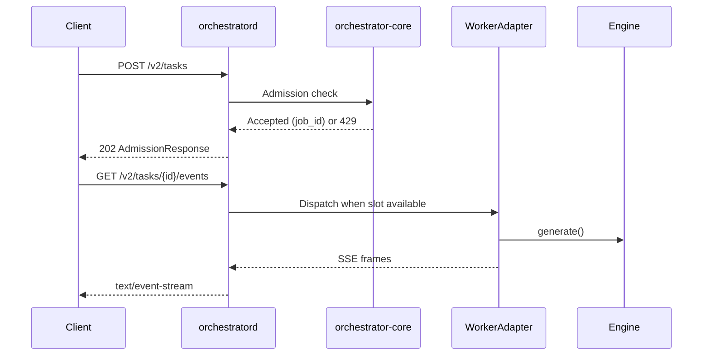

# llama-orch

**Multi-GPU LLM orchestrator for homelabs and agentic AI workloads**

llama-orch is a multi-system, multi-GPU orchestrator that routes LLM inference requests to specific GPUs across your network. Born from the simple frustration of "why can't I easily choose which GPU runs which model?", it evolved into a full agentic AI API for homelabs.

**Current version**: `0.0.0` (early development)  
**License**: GPL-3.0-or-later (free and open source, but copyleft—be careful redistributing as proprietary)  
**Target platform**: Linux with NVIDIA GPUs

---

## What is llama-orch?

### The Origin Story

I had two GPUs with different capabilities (VRAM, power, etc.) and a simple problem: **why is it so hard to pick which GPU a certain AI app gets loaded into?**

I wanted certain models on GPU 0 and others on GPU 1. But that wasn't easy at all. So I built this.

### What It Became

**llama-orch** is a multi-system, multi-GPU orchestrator for homelabs. It provides:

- **GPU-aware routing**: Pick which models run on which GPUs across multiple machines
- **Network-wide orchestration**: One control plane manages all GPUs in your homelab (or even remote systems via secure `auth-min` bearer tokens)
- **Concurrent agentic AI**: Handle multiple requests per second with parallel, batched inference across your GPU pool
- **Web UI** (planned): Visual interface to assign apps/models to specific GPUs
- **Flexible deployment**: Single machine with multiple GPUs, or distributed across your entire network

### Why This Matters

This is **so obvious** to build, and I'm surprised nobody has made it yet. If you have multiple systems at home, each with one or more GPUs, you need:

1. **One orchestrator system** (no GPU required, though it can host `pool-managerd` too)
2. **Multiple GPU worker nodes** running `pool-managerd` to manage local GPUs
3. **Secure remote access** via `auth-min` for distributed deployments

Your orchestrator handles multiple requests per second (depending on your GPU pools) and enables concurrent, parallel, and batched agentic AI workloads.

### Nice-to-Haves (Not Core Goals)

The project also includes determinism and observability features that I enjoyed building, but these are **bonuses**, not the primary purpose:

- Deterministic inference (same prompt + seed = same tokens)
- Prometheus metrics and structured logging
- Session management with KV cache tracking

---

## VIBE CODED PROJECT

(THIS PART IS JUST BACKGROUND STORY, and something human to read)

> Hi there, My name is veighnsche (pronounced Vince). This project is nearly 99% AI generated I guess. I mean. I don't even know how to write rust before I began with this project. I would say that I take ownership of the very high level specifications and architecture, the crate structure and the code flow, the programming language choices and what you can see in the this [`git's history`](https://github.com/veighnsche/llama-orch/commit/e32cd7660671a74917e882fdfb89c0b994dd1ced). i WANT to take FULL responsibility of any breaking bugs and security failures. However. I cannot give you that guarantee until I have fully reviewed the code details (and peer reviews would be nice.)
>
> It goes without saying that I WON'T be offended if you REFUSE to use this project due to ALL the concerns surrounding vibe coding. I understand that you're skeptical and tbh I expect that you are. I hope that the product speaks for itself eventually and feel free to audit the code. I encourage you to audit the code. I am in desperate need of human code reviewers 😓. (I have professional programming experience so I know how to handle reviews, PLUS all the code is AI generated so I won't take nits personally. EXCEPT IF YOU BASELESSLY CRITIQUE THE CODE FLOW AND ARCHITECTURE 😡. But if you spot a critical issue. I will be eternally grateful 😇. (Please read [`./SECURITY.md`](SECURITY.md) for the correct handling of critical issues.))
>
> I just wanted to prove to other skeptics and... myself. That a good programmer can vibe code beyond their normal capabilities. But TO BE FAIR. while making this project... I felt like the best scrum master in the world 😎. It was fun having [`Windsurf`](http://windsurf.com) (not sponsered but.. hey 👋) open on all my 3 screens and working on making the docs and the tests and designing the front-end while my three lovely AI developers were slaving away without any complaint and full synthetic enthusiasm.
>
> So at the time of writing this (dd/mm/yy 01/10/25). I have tried Claude 4.5 for one full day now. And I got so confident that I wrote this. Like this is some victory speech. And yes. I am imagining myself in a gif appearing in /r/prematurecelebration but. Yeah. Idk. I'm kinda seeking recognition I guess. I love my friends and they are the best their professions and carreers, but I can't celebrate some technical nuances with them you know :L. annnnnyyyy way.
>
> Please take a look around. If you have some questions. I'm open to hear about it. If you are a hater. I have been a polarizing figure my entire life. I'M SORRY OKAY :P. so yeah. (btw I know this is cringe. But it's a testament about human text in an AI generated repo. Ask an AI to be exactly my level of cringe. An LLM can't do it, because you know it will overdo the cringyness. My level of cringe is PERFECTLY human... for someone with adhd)
>
> Byyeee <3

---

## Current Status

**Development Progress**: ~40% complete toward v0.2.0

### ✅ Implemented
- HTTP API (`orchestratord`) with Axum server on port 8080
- Task admission, queueing, and placement (round-robin, least-loaded)
- SSE streaming: `started` → `token` → `metrics` → `end` frames
- Session service with TTL, budget tracking, KV warmth metadata
- Model catalog with filesystem storage and verification
- Pool management daemon (`pool-managerd`) with readiness tracking
- Worker adapters: llamacpp, vllm, tgi, openai-http (scaffolds), mock
- Prometheus metrics aligned to `.specs/metrics/otel-prom.md`
- Proof bundle infrastructure (`libs/proof-bundle`) for test artifacts
- Service registry for multi-node deployments (bearer auth, node heartbeats)
- BDD test harness with Cucumber + 13 integration tests

### 🚧 In Progress
- Full adapter implementations (llamacpp integration, vllm completion)
- Production hardening and performance optimization
- Load testing on real GPU hardware
- Documentation refinements based on real-world usage

### 📋 Not Yet Implemented
- Policy engine for outbound HTTP allow/deny rules
- Advanced placement heuristics (VRAM-aware, session affinity)
- Callback webhooks for pool readiness
- Multi-region support

---

## Documentation

### Core Specifications
- [`.specs/00_llama-orch.md`](.specs/00_llama-orch.md) — Core requirements (ORCH-3xxx)
- [`.specs/20_orchestratord.md`](.specs/20_orchestratord.md) — Control plane service
- [`.specs/30_pool_managerd.md`](.specs/30_pool_managerd.md) — GPU worker service
- [`.specs/metrics/otel-prom.md`](.specs/metrics/otel-prom.md) — Metrics contract
- [`AGENTS.md`](AGENTS.md) — Repository guidelines, dev loop, coding/testing discipline
- [`SECURITY.md`](SECURITY.md) — Security policy and Minimal Auth Hooks seam

### Operational Guides
- [`docs/CONFIGURATION.md`](docs/CONFIGURATION.md) — Complete environment variable reference
- [`docs/MANUAL_MODEL_STAGING.md`](docs/MANUAL_MODEL_STAGING.md) — Model staging guide

### Development
- [`.docs/testing/`](.docs/testing/) — Testing strategy, BDD wiring, test types
- [`CONSUMER_CAPABILITIES.md`](CONSUMER_CAPABILITIES.md) — Consumer-facing API guide
- [`COMPLIANCE.md`](COMPLIANCE.md) — Requirements traceability (ORCH/OC-* IDs)

---

## Architecture

llama-orch consists of **two services** that communicate via HTTP:

### orchestratord (Control Plane)

**Responsibilities**:
- Accept client requests (HTTP API on port 8080)
- Task admission, queueing, and placement decisions
- SSE streaming to clients
- Model catalog management
- Service registry (tracks available GPU workers)

**Requirements**: No GPU needed

**Configuration**:
```bash
# Bind address
ORCHD_BIND_ADDR=0.0.0.0:8080

# pool-managerd endpoints (comma-separated)
ORCHD_POOL_MANAGERS=http://localhost:9200
# or for multiple machines:
# ORCHD_POOL_MANAGERS=http://gpu-1:9200,http://gpu-2:9200

# Optional: Bearer token for authentication
LLORCH_API_TOKEN=$(openssl rand -hex 32)
```

### pool-managerd (GPU Worker)

**Responsibilities**:
- GPU discovery and management
- Engine provisioning (download, compile, start engines)
- Pool lifecycle (readiness, health monitoring)
- Report capacity to orchestratord

**Requirements**: NVIDIA GPU with CUDA

**Configuration**:
```bash
# Bind address
POOL_MANAGERD_BIND_ADDR=0.0.0.0:9200

# Node identifier (for multi-node setups)
POOL_MANAGERD_NODE_ID=gpu-node-1

# orchestratord endpoint (for registration)
ORCHESTRATORD_URL=http://localhost:8080

# Optional: Bearer token (must match orchestratord)
LLORCH_API_TOKEN=<same-token>
```

### Deployment Flexibility

**Single machine** (both services on localhost):
```
orchestratord (localhost:8080) → pool-managerd (localhost:9200) → GPU engines
```

**Multiple machines** (distributed):
```
Control Node:  orchestratord (no GPU)
     ↓ HTTP
GPU Node 1:    pool-managerd + engines
GPU Node 2:    pool-managerd + engines
GPU Node N:    pool-managerd + engines
```

The architecture is the same—only the URLs change.

---

## System Flow Diagrams

### Single-Machine Deployment


### Multi-Machine Deployment


### Binaries and Libraries Dependency Map


### Key Libraries

#### Core Orchestration
- `orchestrator-core/` — Queue, placement logic, domain types
- `bin/orchestratord/` — HTTP server, API routes, streaming
- `bin/pool-managerd/` — Pool lifecycle, readiness, health checks (binary + lib)
- `libs/catalog-core/` — Model catalog, verification, lifecycle states

#### Worker Adapters
- `libs/adapter-host/` — Adapter registry and dispatch facade
- `libs/worker-adapters/` — Adapter implementations (llamacpp, vllm, tgi, openai-http, triton, mock)
- `libs/worker-adapters/http-util/` — Shared HTTP client utilities

#### Multi-Node Support
- `libs/control-plane/service-registry/` — Node tracking, health management
- `libs/gpu-node/node-registration/` — Node registration with control plane
- `libs/gpu-node/handoff-watcher/` — Handoff detection on GPU nodes
- `libs/shared/pool-registry-types/` — Shared types for node communication

#### Observability & Testing
- `libs/observability/narration-core/` — Human-readable event narration
- `libs/proof-bundle/` — Test artifact standardization (NDJSON, JSON, Markdown)
- `test-harness/bdd/` — Cucumber BDD tests
- `test-harness/determinism-suite/` — Determinism validation
- `test-harness/chaos/` — Chaos engineering tests

#### Contracts & Tools
- `contracts/api-types/` — Shared API types
- `contracts/openapi/` — OpenAPI specifications (data, control, artifacts)
- `tools/spec-extract/` — Requirement extraction
- `tools/openapi-client/` — Generated HTTP client

### Consumer Layering

```
llama-orch-utils (applets, guardrails)
     ↓
llama-orch-sdk (typed API, transport)
     ↓
orchestratord (HTTP API, ground truth)
```

- **Utils** drives requirements; SDK exposes orchestrator capabilities
- **SDK** mirrors OpenAPI contracts with minimal logic
- **Orchestrator** defines API ground truth via specs

See [`consumers/.docs/.adr/006-library-split.md`](consumers/.docs/.adr/006-library-split.md) for layering details.

---

## Repository Structure

| Path | Contents |
|------|----------|
| `.specs/` | Normative specifications (ORCH-3xxx requirements) |
| `.docs/` | Guides, ADRs, testing strategy, archived TODOs |
| `bin/` | Binaries: `orchestratord`, `pool-managerd` |
| `libs/` | Core libraries (45+ crates) |
| `contracts/` | OpenAPI specs, API types, config schema |
| `test-harness/` | BDD, determinism, chaos, E2E test suites |
| `tools/` | Code generation, spec extraction, README indexing |
| `consumers/` | SDK (`llama-orch-sdk`), Utils (`llama-orch-utils`) |
| `ci/` | Metrics linting, dashboards, alerts, link checking |

---

## API Overview

### HTTP Endpoints

**Data Plane** (`contracts/openapi/data.yaml`):
- `POST /v2/tasks` — Enqueue task, returns 202 with `job_id`
- `GET /v2/tasks/{id}/events` — SSE stream: `started → token → metrics → end`
- `POST /v2/tasks/{id}/cancel` — Cancel running task
- `GET /v2/sessions/{id}` — Session status (TTL, budgets, KV warmth)
- `DELETE /v2/sessions/{id}` — Delete session

**Control Plane** (`contracts/openapi/control.yaml`):
- `GET /v2/meta/capabilities` — Orchestrator capabilities
- `GET /v2/pools/{id}/health` — Pool health and readiness
- `POST /v2/pools/{id}/{drain|reload|purge}` — Pool lifecycle management

**Catalog** (`contracts/openapi/control.yaml`):
- `POST /v2/catalog/models` — Register model
- `GET /v2/catalog/models/{id}` — Model metadata
- `POST /v2/catalog/models/{id}/verify` — Verify model integrity
- `POST /v2/catalog/models/{id}/state` — Update lifecycle state (Active/Retired)

**Multi-Node Management** (`contracts/openapi/control.yaml`):
- `POST /v2/nodes/register` — Register GPU node
- `POST /v2/nodes/{id}/heartbeat` — Heartbeat with pool status
- `DELETE /v2/nodes/{id}` — Deregister node
- `GET /v2/catalog/availability` — Model distribution across nodes

**Observability**:
- `GET /metrics` — Prometheus metrics endpoint

### SSE Streaming Format

```typescript
// Event: started
{type: "started", job_id: "...", queue_position: 0, predicted_start_ms: 50}

// Event: token
{type: "token", t: "hello", i: 0}

// Event: metrics (optional)
{type: "metrics", queue_depth: 0, on_time_probability: 0.95}

// Event: end
{type: "end", tokens_in: 10, tokens_out: 50, decode_time_ms: 150}

// Event: error (on failure)
{type: "error", code: "POOL_UNAVAILABLE", message: "..."}
```

### Request Lifecycle



---

## Developer Quickstart

### Prerequisites

- Rust toolchain (stable)
- NVIDIA GPU with drivers + CUDA runtime
- Linux (Ubuntu 22.04+ recommended)

### Build & Run

```bash
# Clone repository
git clone https://github.com/your-org/llama-orch
cd llama-orch

# Format check
cargo fmt --all -- --check

# Lint
cargo clippy --all-targets --all-features -- -D warnings

# Run all tests
cargo test --workspace --all-features -- --nocapture

# Run orchestratord
cargo run -p orchestratord
# Binds to 127.0.0.1:8080 by default
```

### Developer Loop

```bash
# Full dev loop: fmt, clippy, regen, tests, linkcheck
cargo xtask dev:loop
```

### Regenerate Contracts

```bash
# Regenerate OpenAPI and config schema
cargo xtask regen-openapi
cargo xtask regen-schema

# Extract requirements from specs
cargo run -p tools-spec-extract --quiet
```

### Run Specific Tests

```bash
# BDD harness
cargo test -p test-harness-bdd -- --nocapture

# Run determinism suite
cargo test -p test-harness-determinism-suite -- --nocapture

# Run service registry integration tests
cargo test -p orchestratord --test service_registry_integration -- --nocapture

# Run metrics contract validation
cargo test -p test-harness-metrics-contract -- --nocapture
```

---

## Development Workflow

llama-orch follows strict **Spec → Contract → Tests → Code** discipline:

1. **Spec**: Define requirements in `.specs/` with stable IDs (ORCH-3xxx)
2. **Contract**: Update OpenAPI/types in `contracts/`
3. **Tests**: Write BDD scenarios, unit tests, integration tests
4. **Code**: Implement to satisfy tests and specs

### Key Principles

- **No backwards compatibility before v1.0** — Breaking changes are expected
- **Determinism by default** — Identical inputs yield identical outputs
- **Proof bundles** — Tests emit artifacts (NDJSON, JSON, seeds) to `.proof_bundle/`
- **Metrics contract** — All metrics align with `.specs/metrics/otel-prom.md`
- **Zero dead code** — Remove unused code immediately (see `AGENTS.md`)

See [`AGENTS.md`](AGENTS.md) for complete repository guidelines.

---

## Contributing

### Before You Start

1. Read [`AGENTS.md`](AGENTS.md) — Repository guidelines and dev loop
2. Read [`.specs/00_llama-orch.md`](.specs/00_llama-orch.md) — Core requirements
3. Check [`TODO.md`](TODO.md) — Active work tracker

### Pull Request Checklist

- [ ] Spec updated (if changing behavior)
- [ ] Contract updated (if changing API)
- [ ] Tests added/updated
- [ ] `cargo fmt --all` passes
- [ ] `cargo clippy --all-targets --all-features` clean
- [ ] `cargo test --workspace` passes
- [ ] `cargo xtask regen-openapi` run (if contracts changed)
- [ ] Requirement IDs referenced in commits (e.g., `ORCH-3027: Add decode_time_ms to logs`)
- [ ] `TODO.md` updated

---

## License & Security

**License**: GPL-3.0-or-later (see [`LICENSE`](LICENSE))

**Security**: 
- Localhost defaults to no authentication
- Multi-node deployments require Bearer token authentication
- See [`SECURITY.md`](SECURITY.md) for security policy
- See [`.specs/11_min_auth_hooks.md`](.specs/11_min_auth_hooks.md) for Minimal Auth Hooks seam

---

<!-- BEGIN WORKSPACE MAP (AUTO-GENERATED) -->
## Workspace Map

| Path | Crate | Role | Key APIs/Contracts | Tests | Spec Refs |
|------|------|------|---------------------|-------|-----------|
| [`bin/orchestratord/`](bin/orchestratord/README.md) | `orchestratord` | core | OpenAPI |
admission_metrics, api_types, domain_error_mapping, middleware, provider_verify, session_service,
storage, streaming | ORCH-3004, ORCH-3005, ORCH-3008, ORCH-3010, ORCH-3011, ORCH-3016, ORCH-3017,
ORCH-3027, ORCH-3028, ORCH-3044, ORCH-3045, ORCH-2002, ORCH-2101, ORCH-2102, ORCH-2103, ORCH-2104 |
| [`bin/orchestratord/bdd/`](bin/orchestratord/bdd/README.md) | `orchestratord-bdd` | core |
OpenAPI | bdd, features, steps | ORCH-3004, ORCH-3005, ORCH-3008, ORCH-3010, ORCH-3011, ORCH-3016,
ORCH-3017, ORCH-3027, ORCH-3028, ORCH-3044, ORCH-3045 |
| [`consumers/llama-orch-sdk/`](consumers/llama-orch-sdk/README.md) | `llama-orch-sdk` | tool | — |
— | — |
| [`consumers/llama-orch-utils/`](consumers/llama-orch-utils/README.md) | `llama-orch-utils` | tool
| — | — | — |
| [`contracts/api-types/`](contracts/api-types/README.md) | `contracts-api-types` | contracts | — |
— | ORCH-3044, ORCH-3030 |
| [`contracts/config-schema/`](contracts/config-schema/README.md) | `contracts-config-schema` |
contracts | Schema | validate_examples, validate_v32_fields | ORCH-3044, ORCH-3030 |
| [`libs/adapter-host/`](libs/adapter-host/README.md) | `adapter-host` | adapter | — | — |
ORCH-3054, ORCH-3055, ORCH-3056, ORCH-3057, ORCH-3058 |
| [`libs/auth-min/`](libs/auth-min/README.md) | `auth-min` | tool | — | — | — |
| [`libs/catalog-core/`](libs/catalog-core/README.md) | `catalog-core` | core | — | — | ORCH-3004,
ORCH-3005, ORCH-3008, ORCH-3010, ORCH-3011, ORCH-3016, ORCH-3017, ORCH-3027, ORCH-3028, ORCH-3044,
ORCH-3045 |
| [`libs/catalog-core/bdd/`](libs/catalog-core/bdd/README.md) | `catalog-core-bdd` | core | — |
features | ORCH-3004, ORCH-3005, ORCH-3008, ORCH-3010, ORCH-3011, ORCH-3016, ORCH-3017, ORCH-3027,
ORCH-3028, ORCH-3044, ORCH-3045 |
| [`libs/observability/narration-core/`](libs/observability/narration-core/README.md) |
`observability-narration-core` | tool | — | — | — |
| [`libs/orchestrator-core/`](libs/orchestrator-core/README.md) | `orchestrator-core` | core | — |
props_queue | ORCH-3004, ORCH-3005, ORCH-3008, ORCH-3010, ORCH-3011, ORCH-3016, ORCH-3017,
ORCH-3027, ORCH-3028, ORCH-3044, ORCH-3045 |
| [`libs/orchestrator-core/bdd/`](libs/orchestrator-core/bdd/README.md) | `orchestrator-core-bdd` |
core | — | features | ORCH-3004, ORCH-3005, ORCH-3008, ORCH-3010, ORCH-3011, ORCH-3016, ORCH-3017,
ORCH-3027, ORCH-3028, ORCH-3044, ORCH-3045 |
| [`libs/pool-managerd/`](libs/pool-managerd/README.md) | `pool-managerd` | core | — | — |
ORCH-3004, ORCH-3005, ORCH-3008, ORCH-3010, ORCH-3011, ORCH-3016, ORCH-3017, ORCH-3027, ORCH-3028,
ORCH-3044, ORCH-3045, ORCH-3038, ORCH-3002 |
| [`libs/pool-managerd/bdd/`](libs/pool-managerd/bdd/README.md) | `pool-managerd-bdd` | core | — |
features | ORCH-3004, ORCH-3005, ORCH-3008, ORCH-3010, ORCH-3011, ORCH-3016, ORCH-3017, ORCH-3027,
ORCH-3028, ORCH-3044, ORCH-3045 |
| [`libs/provisioners/engine-provisioner/`](libs/provisioners/engine-provisioner/README.md) |
`provisioners-engine-provisioner` | tool | — | llamacpp_smoke | — |
| [`libs/provisioners/engine-provisioner/bdd/`](libs/provisioners/engine-provisioner/bdd/README.md)
| `engine-provisioner-bdd` | tool | — | features | — |
| [`libs/provisioners/model-provisioner/`](libs/provisioners/model-provisioner/README.md) |
`model-provisioner` | tool | — | — | — |
| [`libs/provisioners/model-provisioner/bdd/`](libs/provisioners/model-provisioner/bdd/README.md) |
`model-provisioner-bdd` | tool | — | features | — |
| [`libs/worker-adapters/adapter-api/`](libs/worker-adapters/adapter-api/README.md) |
`worker-adapters-adapter-api` | adapter | — | — | ORCH-3054, ORCH-3055, ORCH-3056, ORCH-3057,
ORCH-3058 |
| [`libs/worker-adapters/http-util/`](libs/worker-adapters/http-util/README.md) |
`worker-adapters-http-util` | adapter | — | — | ORCH-3054, ORCH-3055, ORCH-3056, ORCH-3057,
ORCH-3058 |
| [`libs/worker-adapters/llamacpp-http/`](libs/worker-adapters/llamacpp-http/README.md) |
`worker-adapters-llamacpp-http` | adapter | — | — | ORCH-3054, ORCH-3055, ORCH-3056, ORCH-3057,
ORCH-3058 |
| [`libs/worker-adapters/mock/`](libs/worker-adapters/mock/README.md) | `worker-adapters-mock` |
adapter | — | — | ORCH-3054, ORCH-3055, ORCH-3056, ORCH-3057, ORCH-3058 |
| [`libs/worker-adapters/openai-http/`](libs/worker-adapters/openai-http/README.md) |
`worker-adapters-openai-http` | adapter | — | — | ORCH-3054, ORCH-3055, ORCH-3056, ORCH-3057,
ORCH-3058 |
| [`libs/worker-adapters/tgi-http/`](libs/worker-adapters/tgi-http/README.md) |
`worker-adapters-tgi-http` | adapter | — | — | ORCH-3054, ORCH-3055, ORCH-3056, ORCH-3057,
ORCH-3058 |
| [`libs/worker-adapters/triton/`](libs/worker-adapters/triton/README.md) |
`worker-adapters-triton` | adapter | — | — | ORCH-3054, ORCH-3055, ORCH-3056, ORCH-3057, ORCH-3058 |
| [`libs/worker-adapters/vllm-http/`](libs/worker-adapters/vllm-http/README.md) |
`worker-adapters-vllm-http` | adapter | — | — | ORCH-3054, ORCH-3055, ORCH-3056, ORCH-3057,
ORCH-3058 |
| [`test-harness/bdd/`](test-harness/bdd/README.md) | `test-harness-bdd` | test-harness | — | bdd,
features, traceability | ORCH-3050, ORCH-3051 |
| [`test-harness/chaos/`](test-harness/chaos/README.md) | `test-harness-chaos` | test-harness | — |
— | ORCH-3050, ORCH-3051 |
| [`test-harness/determinism-suite/`](test-harness/determinism-suite/README.md) |
`test-harness-determinism-suite` | test-harness | — | byte_exact, placeholder | ORCH-3050,
ORCH-3051 |
| [`test-harness/e2e-haiku/`](test-harness/e2e-haiku/README.md) | `test-harness-e2e-haiku` |
test-harness | — | e2e_client, placeholder | ORCH-3050, ORCH-3051 |
| [`test-harness/metrics-contract/`](test-harness/metrics-contract/README.md) |
`test-harness-metrics-contract` | test-harness | — | metrics_lint, spec_alignment | ORCH-3050,
ORCH-3051 |
| [`tools/openapi-client/`](tools/openapi-client/README.md) | `tools-openapi-client` | tool |
OpenAPI | trybuild, ui | — |
| [`tools/readme-index/`](tools/readme-index/README.md) | `tools-readme-index` | tool | — | — | — |
| [`tools/spec-extract/`](tools/spec-extract/README.md) | `tools-spec-extract` | tool | — | — | — |
| [`xtask/`](xtask/README.md) | `xtask` | tool | — | — | — |

### Glossary

- `orchestratord` — orchestratord (core)
- `orchestratord-bdd` — orchestratord-bdd (core)
- `llama-orch-sdk` — Single-source SDK for llama-orch (Rust core, optional WASM for npm)
- `llama-orch-utils` — Utils applets for composing Blueprint pipelines for llama-orch (M2).
- `contracts-api-types` — contracts-api-types (contracts)
- `contracts-config-schema` — contracts-config-schema (contracts)
- `adapter-host` — adapter-host (adapter)
- `auth-min` — auth-min (tool)
- `catalog-core` — Model catalog: resolve/verify/cache and lifecycle for llama-orch
- `catalog-core-bdd` — catalog-core-bdd (core)
- `observability-narration-core` — observability-narration-core (tool)
- `orchestrator-core` — orchestrator-core (core)
- `orchestrator-core-bdd` — orchestrator-core-bdd (core)
- `pool-managerd` — pool-managerd (core)
- `pool-managerd-bdd` — pool-managerd-bdd (core)
- `provisioners-engine-provisioner` — provisioners-engine-provisioner (tool)
- `engine-provisioner-bdd` — engine-provisioner-bdd (tool)
- `model-provisioner` — Model provisioner: orchestrates resolve/verify/cache via catalog-core
- `model-provisioner-bdd` — model-provisioner-bdd (tool)
- `worker-adapters-adapter-api` — worker-adapters-adapter-api (adapter)
- `worker-adapters-http-util` — worker-adapters-http-util (adapter)
- `worker-adapters-llamacpp-http` — worker-adapters-llamacpp-http (adapter)
- `worker-adapters-mock` — worker-adapters-mock (adapter)
- `worker-adapters-openai-http` — worker-adapters-openai-http (adapter)
- `worker-adapters-tgi-http` — worker-adapters-tgi-http (adapter)
- `worker-adapters-triton` — worker-adapters-triton (adapter)
- `worker-adapters-vllm-http` — worker-adapters-vllm-http (adapter)
- `test-harness-bdd` — test-harness-bdd (test-harness)
- `test-harness-chaos` — test-harness-chaos (test-harness)
- `test-harness-determinism-suite` — test-harness-determinism-suite (test-harness)
- `test-harness-e2e-haiku` — test-harness-e2e-haiku (test-harness)
- `test-harness-metrics-contract` — test-harness-metrics-contract (test-harness)
- `tools-openapi-client` — tools-openapi-client (tool)
- `tools-readme-index` — tools-readme-index (tool)
- `tools-spec-extract` — tools-spec-extract (tool)
- `xtask` — xtask (tool)

### Getting Started

- Adapter work: see `libs/worker-adapters/*` crates.
- Contracts: see `contracts/*`.
- Core scheduling: see `libs/orchestrator-core/` and `bin/orchestratord/`.

<!-- END WORKSPACE MAP (AUTO-GENERATED) -->
