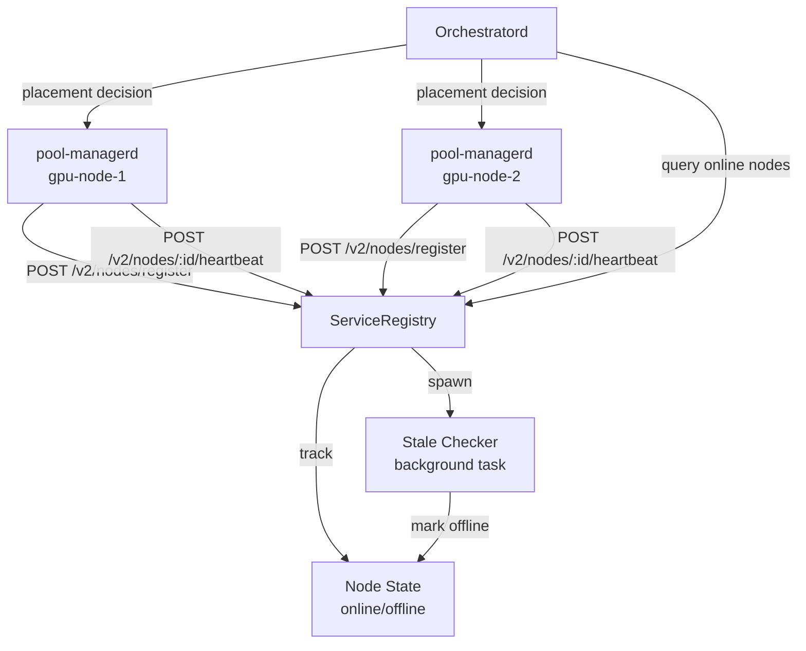

# service-registry

**Service registry for tracking GPU nodes in multi-node deployments**

`libs/control-plane/service-registry` — Maintains authoritative state of which GPU nodes are online, their capabilities, and pool availability.

---

## What This Library Does

service-registry provides **node tracking and health monitoring** for llama-orch:

- **Node registration** — GPU nodes register on startup with metadata
- **Heartbeat monitoring** — Detect offline nodes via heartbeat timeout
- **Stale detection** — Automatic offline marking for missed heartbeats
- **Pool mapping** — Track which pools exist on which nodes
- **Query API** — Find nodes by ID, pool, or online status
- **Thread-safe** — Concurrent access from multiple threads

**Used by**: `orchestratord` for multi-node placement decisions

---

## Key Types

### ServiceRegistry

```rust
use service_registry::ServiceRegistry;

// Create registry with 30s heartbeat timeout
let registry = ServiceRegistry::new(30_000);

// Register a node
registry.register(node)?;

// Process heartbeat
registry.heartbeat("gpu-node-1")?;

// Get online nodes
let online = registry.get_online_nodes();

// Query specific node
let node = registry.get_node("gpu-node-1")?;
```

### NodeInfo

```rust
use pool_registry_types::NodeInfo;

pub struct NodeInfo {
    pub node_id: String,
    pub hostname: String,
    pub endpoint: String,
    pub pools: Vec<String>,
    pub capabilities: NodeCapabilities,
    pub registered_at: DateTime<Utc>,
    pub last_heartbeat: DateTime<Utc>,
}
```

### NodeCapabilities

```rust
pub struct NodeCapabilities {
    pub gpu_count: usize,
    pub total_vram_mb: u64,
    pub cuda_version: String,
}
```

---

## Architecture



### Responsibilities

- **Registration**: Accept node registration with metadata
- **Heartbeat**: Update last_heartbeat timestamp
- **Stale detection**: Background task marks nodes offline after timeout
- **Query**: Provide online nodes for placement decisions

---

## Usage Example

```rust
use service_registry::ServiceRegistry;
use pool_registry_types::{NodeInfo, NodeCapabilities};

#[tokio::main]
async fn main() -> Result<()> {
    // Create registry with 30s heartbeat timeout
    let registry = ServiceRegistry::new(30_000);
    
    // Register a node
    let node = NodeInfo {
        node_id: "gpu-node-1".to_string(),
        hostname: "machine-alpha".to_string(),
        endpoint: "http://192.168.1.100:9200".to_string(),
        pools: vec!["pool-0".to_string(), "pool-1".to_string()],
        capabilities: NodeCapabilities {
            gpu_count: 2,
            total_vram_mb: 48_000,
            cuda_version: "12.1".to_string(),
        },
        registered_at: Utc::now(),
        last_heartbeat: Utc::now(),
    };
    
    registry.register(node)?;
    
    // Process heartbeat
    registry.heartbeat("gpu-node-1")?;
    
    // Get online nodes for placement
    let online_nodes = registry.get_online_nodes();
    println!("Online nodes: {}", online_nodes.len());
    
    // Spawn stale checker task (runs every 10s)
    let checker = service_registry::heartbeat::spawn_stale_checker(
        registry.clone(),
        10,
    );
    
    // Query specific node
    if let Some(node) = registry.get_node("gpu-node-1")? {
        println!("Node: {} (pools: {:?})", node.hostname, node.pools);
    }
    
    // Deregister node
    registry.deregister("gpu-node-1")?;
    
    Ok(())
}
```

---

## Heartbeat Mechanism

### Heartbeat Flow

1. `pool-managerd` sends `POST /v2/nodes/{id}/heartbeat` every 10s
2. `ServiceRegistry` updates `last_heartbeat` timestamp
3. Stale checker runs every 10s
4. If `now - last_heartbeat > timeout`, mark node offline

### Stale Checker

```rust
use service_registry::heartbeat::spawn_stale_checker;

// Spawn background task that checks every 10s
let checker = spawn_stale_checker(registry.clone(), 10);

// Checker marks nodes offline if:
// now - last_heartbeat > registry.timeout_ms
```

---

## Testing

### Unit Tests

```bash
# Run all tests
cargo test -p service-registry -- --nocapture

# Run specific test
cargo test -p service-registry -- test_heartbeat_timeout --nocapture
```

---

## Dependencies

### Internal

- `pool-registry-types` — Shared types for node communication

### External

- `tokio` — Async runtime, background tasks
- `chrono` — Timestamps
- `serde` — Serialization
- `thiserror` — Error types

---

## Metrics

Service registry metrics (exposed by orchestratord):

- `service_registry_nodes_total{status}` — Total nodes (online/offline)
- `service_registry_heartbeats_total{node_id, outcome}` — Heartbeat attempts
- `service_registry_stale_checks_total{outcome}` — Stale checker runs

---

## Specifications

Implements requirements from:
- CLOUD-2001 (Node registration endpoint)
- CLOUD-2010 (Heartbeat mechanism)
- CLOUD-2013 (Offline detection, 30s timeout)
- CLOUD-2020 (Graceful deregistration)

See `.specs/01_cloud_profile.md` for full requirements.

---

## Status

- **Version**: 0.0.0 (early development)
- **License**: GPL-3.0-or-later
- **Stability**: Alpha
- **Maintainers**: @llama-orch-maintainers
