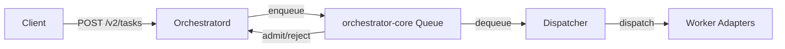

# orchestrator-core

**Core orchestration library for task admission and queueing**

`libs/orchestrator-core` — Bounded FIFO queue with admission control, backpressure, and placement logic.

---

## What This Library Does

orchestrator-core provides the **core orchestration primitives** for llama-orch:

- **Admission queue** — Bounded FIFO with configurable capacity
- **Backpressure** — Reject tasks when queue is full (with `Retry-After`)
- **Admission policies** — Drop-LRU, reject-new, fail-fast
- **Queue metrics** — Depth, enqueue/dequeue rates, wait times
- **Session affinity** — Helper types for session-to-pool mapping
- **Domain types** — Task, Job, AdmissionResult, QueuePolicy

**Used by**: `orchestratord` for task admission and queueing

---

## Key Types

### Queue

```rust
use orchestrator_core::Queue;

// Create bounded queue with capacity 100
let queue = Queue::new(100);

// Enqueue task
let result = queue.enqueue(task)?;

// Dequeue for processing
let job = queue.dequeue()?;

// Query state
let depth = queue.depth();
let capacity = queue.capacity();
```

### Admission Policies

```rust
use orchestrator_core::AdmissionPolicy;

// Reject new tasks when full
let policy = AdmissionPolicy::RejectNew;

// Drop least-recently-used when full
let policy = AdmissionPolicy::DropLru;

// Fail fast (no queueing)
let policy = AdmissionPolicy::FailFast;
```

### AdmissionResult

```rust
pub enum AdmissionResult {
    Accepted { job_id: String, position: usize },
    Rejected { reason: RejectionReason },
}

pub enum RejectionReason {
    QueueFull,
    InvalidRequest,
    PolicyViolation,
}
```

---

## Architecture



### Responsibilities

- **Admission control**: Accept or reject tasks based on capacity
- **Queue management**: FIFO ordering, bounded capacity
- **Backpressure**: Signal when queue is full
- **Metrics**: Track queue depth, admission rates, wait times

### Does NOT

- Make HTTP requests (that's orchestratord)
- Dispatch to adapters (that's adapter-host)
- Manage pools (that's pool-managerd)

---

## Usage Example

```rust
use orchestrator_core::{Queue, Task, AdmissionPolicy};

// Create queue
let queue = Queue::builder()
    .capacity(100)
    .policy(AdmissionPolicy::DropLru)
    .build();

// Enqueue task
let task = Task {
    model: "llama-3.1-8b-instruct".to_string(),
    max_tokens: 100,
    session_id: Some("sess-123".to_string()),
};

match queue.enqueue(task) {
    Ok(AdmissionResult::Accepted { job_id, position }) => {
        println!("Accepted: job_id={}, position={}", job_id, position);
    }
    Ok(AdmissionResult::Rejected { reason }) => {
        println!("Rejected: {:?}", reason);
    }
    Err(e) => {
        eprintln!("Error: {}", e);
    }
}

// Dequeue for processing
if let Some(job) = queue.dequeue() {
    // Dispatch to adapter
}

// Query metrics
println!("Queue depth: {}", queue.depth());
println!("Capacity: {}", queue.capacity());
```

---

## Queue Invariants

The queue maintains these invariants (verified by property tests):

1. **Bounded capacity**: Never exceeds configured capacity
2. **FIFO ordering**: Tasks dequeued in enqueue order
3. **No duplicates**: Each job_id is unique
4. **Atomic operations**: Enqueue/dequeue are thread-safe
5. **Consistent metrics**: Depth always matches actual queue size

---

## Testing

### Unit Tests

```bash
# Run all tests
cargo test -p orchestrator-core -- --nocapture

# Run specific test
cargo test -p orchestrator-core -- queue_respects_capacity --nocapture
```

### Property Tests

```bash
# Run property-based tests (using proptest)
cargo test -p orchestrator-core -- props_ --nocapture
```

Property tests verify:
- Queue never exceeds capacity
- FIFO ordering is preserved
- Admission policies work correctly
- Metrics are always consistent

---

## Dependencies

### Internal

- None (this is a foundational library)

### External

- `serde` — Serialization for types
- `thiserror` — Error types
- `tokio` — Async primitives (Mutex, RwLock)
- `proptest` — Property-based testing

---

## Metrics

Queue metrics (exposed by orchestratord):

- `orchd_admission_queue_depth{pool_id}` — Current queue depth
- `orchd_admission_enqueued_total{pool_id, outcome}` — Total enqueued (accepted/rejected)
- `orchd_admission_rejected_total{pool_id, reason}` — Total rejected by reason
- `orchd_queue_wait_time_ms{pool_id}` — Time tasks spend in queue

---

## Specifications

Implements requirements from:
- ORCH-3004 (Admission control)
- ORCH-3005 (Queue capacity)
- ORCH-3008 (Backpressure)
- ORCH-3010 (FIFO ordering)
- ORCH-3011 (Rejection policies)
- ORCH-3016, ORCH-3017, ORCH-3027, ORCH-3028
- ORCH-3044, ORCH-3045

See `.specs/00_llama-orch.md` for full requirements.

---

## Status

- **Version**: 0.0.0 (early development)
- **License**: GPL-3.0-or-later
- **Stability**: Alpha
- **Maintainers**: @llama-orch-maintainers
