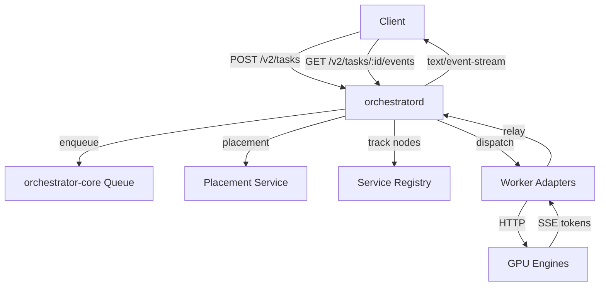

# orchestratord

**Control plane HTTP server for llama-orch**

`bin/orchestratord` — Axum-based HTTP API server providing task admission, queueing, placement, SSE streaming, and catalog management.

---

## What This Binary Does

orchestratord is the **control plane** of llama-orch. It:

- **Accepts client requests** via HTTP API (port 8080)
- **Admits and queues tasks** using `orchestrator-core`
- **Makes placement decisions** (which pool/node should handle this task)
- **Streams responses** to clients via Server-Sent Events (SSE)
- **Manages the model catalog** (register, verify, lifecycle)
- **Tracks GPU workers** via service registry (multi-node deployments)
- **Dispatches work** to engines through worker adapters

**Does NOT**:
- Run on GPU hardware (no GPU required)
- Execute inference directly (delegates to engines via adapters)
- Manage engine processes (that's `pool-managerd`'s job)

---

## Architecture



### Key Components

- **HTTP Server**: Axum on port 8080
- **Admission Queue**: `orchestrator-core` bounded FIFO with backpressure
- **Placement**: Round-robin or least-loaded across available pools
- **Service Registry**: Tracks online GPU nodes and their pools
- **Adapter Host**: Dispatches to worker adapters (llamacpp, vllm, etc.)
- **Catalog**: Model registry with verification and lifecycle

---

## HTTP API

### Data Plane (`contracts/openapi/data.yaml`)

- `POST /v2/tasks` — Enqueue task, returns 202 with job_id
- `GET /v2/tasks/{id}/events` — SSE stream: started → token → metrics → end
- `POST /v2/tasks/{id}/cancel` — Cancel running task
- `GET /v2/sessions/{id}` — Session status (TTL, budgets, KV warmth)
- `DELETE /v2/sessions/{id}` — Delete session

### Control Plane (`contracts/openapi/control.yaml`)

- `GET /v2/meta/capabilities` — Orchestrator capabilities
- `GET /v2/pools/{id}/health` — Pool health and readiness
- `POST /v2/pools/{id}/{drain|reload|purge}` — Pool lifecycle

### Catalog

- `POST /v2/catalog/models` — Register model
- `GET /v2/catalog/models/{id}` — Model metadata
- `POST /v2/catalog/models/{id}/verify` — Verify integrity
- `POST /v2/catalog/models/{id}/state` — Update lifecycle state

### Multi-Node Management

- `POST /v2/nodes/register` — Register GPU node
- `POST /v2/nodes/{id}/heartbeat` — Heartbeat with pool status
- `DELETE /v2/nodes/{id}` — Deregister node
- `GET /v2/catalog/availability` — Model distribution across nodes

### Observability

- `GET /metrics` — Prometheus metrics

---

## Configuration

### Environment Variables

```bash
# Bind address
ORCHD_BIND_ADDR=0.0.0.0:8080

# pool-managerd endpoints (comma-separated)
ORCHD_POOL_MANAGERS=http://localhost:9200
# or for multiple machines:
# ORCHD_POOL_MANAGERS=http://gpu-1:9200,http://gpu-2:9200

# Admission queue
ORCHD_ADMISSION_CAPACITY=100
ORCHD_ADMISSION_POLICY=drop-lru

# Optional: Bearer token for authentication
LLORCH_API_TOKEN=$(openssl rand -hex 32)

# Observability
OTEL_EXPORTER_OTLP_ENDPOINT=http://tempo:4317
PROMETHEUS_METRICS_PORT=9090
```

---

## Running

### Development

```bash
# Run with default config (localhost:8080)
cargo run -p orchestratord

# With custom bind address
ORCHD_BIND_ADDR=0.0.0.0:8080 cargo run -p orchestratord

# With multiple pool managers
ORCHD_POOL_MANAGERS=http://gpu-1:9200,http://gpu-2:9200 cargo run -p orchestratord
```

### Production

```bash
# Build release binary
cargo build --release -p orchestratord

# Run
./target/release/orchestratord
```

---

## Testing

### Unit & Integration Tests

```bash
# All tests for orchestratord
cargo test -p orchestratord -- --nocapture

# Specific test suites
cargo test -p orchestratord --test provider_verify -- --nocapture
cargo test -p orchestratord --test service_registry_integration -- --nocapture

# BDD tests
cargo test -p orchestratord-bdd -- --nocapture
```

### Full Dev Loop

```bash
# Format, clippy, regen, tests, linkcheck
cargo xtask dev:loop
```

---

## Dependencies

### Core Libraries

- `orchestrator-core` — Queue, admission, placement logic
- `catalog-core` — Model catalog
- `adapter-host` — Adapter registry and dispatch
- `service-registry` — Node tracking (multi-node)
- `pool-registry-types` — Shared types for node communication

### Worker Adapters

- `worker-adapters/llamacpp-http`
- `worker-adapters/vllm-http`
- `worker-adapters/tgi-http`
- `worker-adapters/mock` (dev/testing)

### Cross-Cutting

- `auth-min` — Bearer token authentication
- `narration-core` — Human-readable event narration
- `contracts/api-types` — Shared API types

---

## Metrics & Observability

### Prometheus Metrics

- `orchd_admission_queue_depth{pool_id}`
- `orchd_admission_enqueued_total{pool_id, outcome}`
- `orchd_admission_rejected_total{pool_id, reason}`
- `orchd_tasks_dispatched_total{pool_id, outcome}`
- `orchd_dispatch_latency_ms{pool_id}`
- `orchd_pool_health_checks_total{pool_id, outcome}`

### Structured Logs

JSON Lines format with correlation IDs:

```json
{"level":"info","target":"orchestratord::dispatch","job_id":"abc123","pool_id":"default","latency_ms":45,"msg":"task dispatched"}
```

---

## GPU Policy

**VRAM-only residency**: Weights, KV cache, and activations must fit in GPU VRAM. No RAM↔VRAM sharing, UMA/zero-copy, or host-RAM offload. Tasks that don't fit fail fast with `POOL_UNAVAILABLE`.

See `.specs/00_llama-orch.md` §2.13 for details.

---

## Specifications

Implements requirements from:
- ORCH-3004, ORCH-3005, ORCH-3008, ORCH-3010, ORCH-3011
- ORCH-3016, ORCH-3017, ORCH-3027, ORCH-3028
- ORCH-3044, ORCH-3045
- ORCH-2002, ORCH-2101, ORCH-2102, ORCH-2103, ORCH-2104

See `.specs/00_llama-orch.md` and `requirements/00_llama-orch.yaml` for full details.

---

## Development

### Regenerate Artifacts

```bash
# Regenerate OpenAPI and config schema
cargo xtask regen-openapi
cargo xtask regen-schema

# Extract requirements from specs
cargo run -p tools-spec-extract --quiet
```

### Update Documentation

```bash
# Rebuild workspace map
cargo run -p tools-readme-index --quiet
```

---

## Status

- **Version**: 0.0.0 (early development, ~40% complete toward v0.2.0)
- **License**: GPL-3.0-or-later
- **Stability**: Alpha
- **Maintainers**: @llama-orch-maintainers
