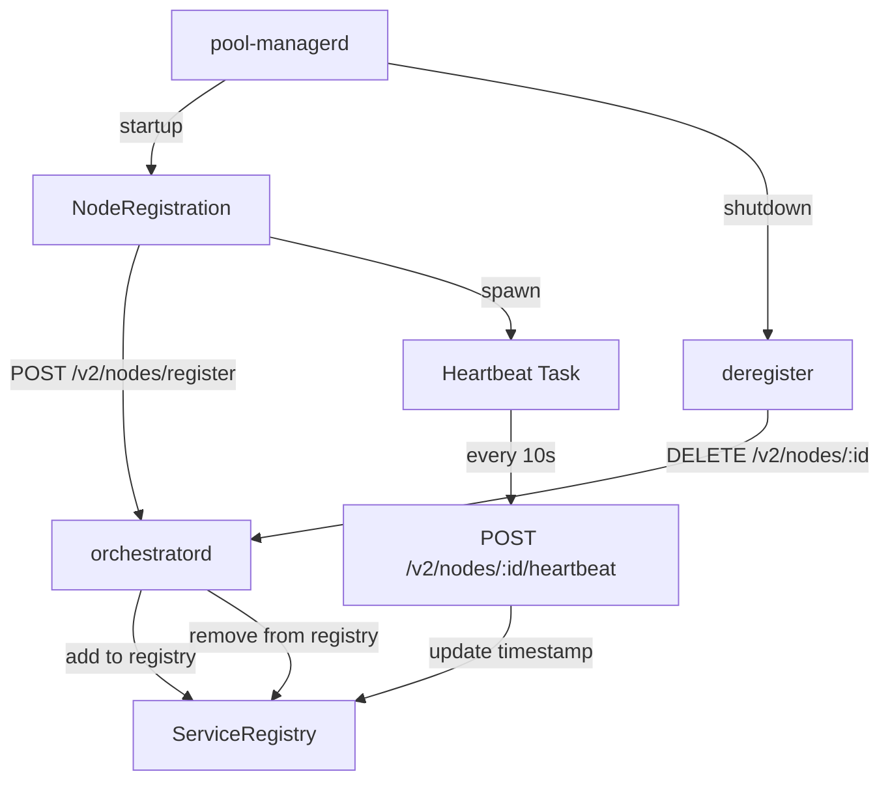

# node-registration

**Node registration and heartbeat for GPU nodes in multi-node deployments**

`libs/gpu-node/node-registration` — GPU nodes register with orchestratord on startup and send periodic heartbeats.

---

## What This Library Does

node-registration provides **node lifecycle management** for llama-orch:

- **Registration** — Register GPU node with orchestratord on startup
- **Heartbeat** — Send periodic heartbeats with pool status
- **Deregistration** — Gracefully deregister on shutdown
- **Bearer auth** — Optional API token authentication
- **Background task** — Async heartbeat loop

**Used by**: `pool-managerd` to register with orchestratord

---

## Key Types

### NodeRegistration

```rust
use node_registration::{NodeRegistration, NodeRegistrationConfig};

// Configure registration
let config = NodeRegistrationConfig {
    node_id: "gpu-node-1".to_string(),
    machine_id: "machine-alpha".to_string(),
    address: "http://192.168.1.100:9200".to_string(),
    orchestratord_url: "http://192.168.1.1:8080".to_string(),
    pools: vec!["pool-0".to_string()],
    capabilities: NodeCapabilities { /* ... */ },
    heartbeat_interval_secs: 10,
    api_token: Some("secret".to_string()),
};

// Register
let registration = NodeRegistration::new(config);
registration.register().await?;

// Spawn heartbeat
let handle = registration.spawn_heartbeat(get_pool_status);

// Deregister
registration.deregister().await?;
```

### NodeRegistrationConfig

```rust
pub struct NodeRegistrationConfig {
    pub node_id: String,
    pub machine_id: String,
    pub address: String,
    pub orchestratord_url: String,
    pub pools: Vec<String>,
    pub capabilities: NodeCapabilities,
    pub heartbeat_interval_secs: u64,
    pub api_token: Option<String>,
}
```

---

## Architecture



### Responsibilities

- **Register**: Send node metadata to orchestratord on startup
- **Heartbeat**: Periodic updates with pool status
- **Deregister**: Clean shutdown notification

---

## Usage Example

```rust
use node_registration::{NodeRegistration, NodeRegistrationConfig};
use pool_registry_types::NodeCapabilities;

#[tokio::main]
async fn main() -> Result<()> {
    // Configure registration
    let config = NodeRegistrationConfig {
        node_id: "gpu-node-1".to_string(),
        machine_id: "machine-alpha".to_string(),
        address: "http://192.168.1.100:9200".to_string(),
        orchestratord_url: "http://192.168.1.1:8080".to_string(),
        pools: vec!["pool-0".to_string(), "pool-1".to_string()],
        capabilities: NodeCapabilities {
            gpu_count: 2,
            total_vram_mb: 48_000,
            cuda_version: "12.1".to_string(),
        },
        heartbeat_interval_secs: 10,
        api_token: Some("secret-token".to_string()),
    };
    
    // Register on startup
    let registration = NodeRegistration::new(config);
    registration.register().await?;
    println!("Registered with orchestratord");
    
    // Spawn heartbeat task
    let get_pool_status = || {
        // Return current pool status
        vec![
            PoolStatus {
                pool_id: "pool-0".to_string(),
                ready: true,
                slots_free: 4,
            },
        ]
    };
    
    let heartbeat_handle = registration.spawn_heartbeat(get_pool_status);
    println!("Heartbeat task spawned");
    
    // Run until shutdown signal
    tokio::signal::ctrl_c().await?;
    
    // Deregister on shutdown
    registration.deregister().await?;
    println!("Deregistered from orchestratord");
    
    Ok(())
}
```

---

## Registration Flow

### Startup

1. `pool-managerd` starts
2. `NodeRegistration::register()` called
3. `POST /v2/nodes/register` to orchestratord
4. orchestratord adds node to `ServiceRegistry`
5. Response: success

### Running

1. `spawn_heartbeat()` starts background task
2. Every 10s: `POST /v2/nodes/{id}/heartbeat`
3. Payload includes timestamp and pool status
4. orchestratord updates `last_heartbeat` timestamp

### Shutdown

1. `pool-managerd` receives shutdown signal
2. `NodeRegistration::deregister()` called
3. `DELETE /v2/nodes/{id}` to orchestratord
4. orchestratord removes node from registry

---

## Registration Payload

```json
{
  "node_id": "gpu-node-1",
  "machine_id": "machine-alpha",
  "address": "http://192.168.1.100:9200",
  "pools": ["pool-0", "pool-1"],
  "capabilities": {
    "gpu_count": 2,
    "total_vram_mb": 48000,
    "cuda_version": "12.1"
  }
}
```

---

## Heartbeat Payload

```json
{
  "timestamp": "2025-10-01T00:00:00Z",
  "pools": [
    {
      "pool_id": "pool-0",
      "ready": true,
      "slots_free": 4
    }
  ]
}
```

---

## Testing

### Unit Tests

```bash
# Run all tests
cargo test -p node-registration -- --nocapture

# Run specific test
cargo test -p node-registration -- test_registration --nocapture
```

---

## Dependencies

### Internal

- `pool-registry-types` — Shared types for node communication

### External

- `reqwest` — HTTP client
- `tokio` — Async runtime, background tasks
- `serde` — Serialization
- `serde_json` — JSON format
- `thiserror` — Error types

---

## Specifications

Implements requirements from:
- CLOUD-2001 (Register on startup)
- CLOUD-2002 (Registration payload: node_id, address, pools, capabilities)
- CLOUD-2010 (Heartbeat mechanism)
- CLOUD-2011 (Heartbeat interval: configurable, default 10s)
- CLOUD-2012 (Heartbeat payload: timestamp, pool status)
- CLOUD-2020 (Deregister on shutdown)

See `.specs/01_cloud_profile.md` for full requirements.

---

## Related

- `libs/control-plane/service-registry` — Control plane counterpart

---

## Status

- **Version**: 0.0.0 (early development)
- **License**: GPL-3.0-or-later
- **Stability**: Alpha
- **Maintainers**: @llama-orch-maintainers
