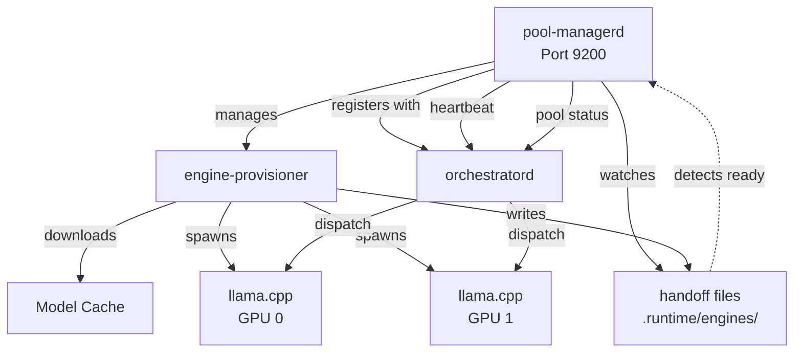

# pool-managerd

**GPU worker daemon for llama-orch**

`bin/pool-managerd` — Manages GPU pools, engine provisioning, health monitoring, and registration with orchestratord.

---

## What This Binary Does

pool-managerd is the **GPU worker daemon** of llama-orch. It:

- **Discovers GPUs** on the local machine (NVIDIA only)
- **Provisions engines** (downloads, compiles, starts llama.cpp/vllm/etc.)
- **Manages pool lifecycle** (preload → ready → drain → reload)
- **Monitors engine health** (heartbeat, readiness checks)
- **Watches handoff files** (local filesystem for engine readiness)
- **Registers with orchestratord** (multi-node deployments)
- **Reports capacity** (slots, VRAM, model availability)

**Requires**:
- NVIDIA GPU with CUDA drivers
- Runs on the same machine as GPU engines

**Does NOT**:
- Accept client requests directly (orchestratord does that)
- Make placement decisions (orchestratord does that)
- Execute inference (engines do that)

---

## Architecture



### Key Components

- **Pool Registry**: Tracks pool state (live, ready, draining)
- **Engine Provisioner**: Downloads models, compiles engines, starts processes
- **Handoff Watcher**: Monitors `.runtime/engines/*.json` for engine readiness
- **Node Registration**: Registers with orchestratord (multi-node)
- **Health Monitor**: Checks engine heartbeats, marks pools offline

---

## HTTP API

pool-managerd exposes an HTTP API on port 9200 (used by orchestratord):

### Pool Status

- `GET /v2/pools/{id}/status` — Pool readiness, slots, VRAM
- `GET /v2/pools` — List all pools on this node

### Node Registration (Multi-Node)

- `POST /v2/nodes/register` — Register this node with orchestratord
- `POST /v2/nodes/{id}/heartbeat` — Send heartbeat with pool status

### Health

- `GET /health` — Liveness check
- `GET /ready` — Readiness check

---

## Configuration

### Environment Variables

```bash
# Bind address
POOL_MANAGERD_BIND_ADDR=0.0.0.0:9200

# Node identifier (for multi-node setups)
POOL_MANAGERD_NODE_ID=gpu-node-1

# orchestratord endpoint (for registration)
ORCHESTRATORD_URL=http://localhost:8080

# Handoff watcher
POOL_MANAGERD_RUNTIME_DIR=/var/lib/llama-orch/engines
POOL_MANAGERD_WATCH_INTERVAL_MS=1000
POOL_MANAGERD_AUTO_DELETE_HANDOFF=true

# GPU discovery
POOL_MANAGERD_GPU_DISCOVERY_INTERVAL_MS=10000

# Optional: Bearer token (must match orchestratord)
LLORCH_API_TOKEN=<same-token>

# Observability
OTEL_EXPORTER_OTLP_ENDPOINT=http://tempo:4317
PROMETHEUS_METRICS_PORT=9091
```

---

## Running

### Development

```bash
# Run with default config (localhost:9200)
cargo run -p pool-managerd

# With custom node ID
POOL_MANAGERD_NODE_ID=gpu-node-1 cargo run -p pool-managerd

# Register with remote orchestratord
ORCHESTRATORD_URL=http://control-plane:8080 \
LLORCH_API_TOKEN=your-token \
cargo run -p pool-managerd
```

### Production

```bash
# Build release binary
cargo build --release -p pool-managerd

# Run as systemd service
sudo systemctl start pool-managerd
```

### Systemd Service

Example service file:

```ini
[Unit]
Description=llama-orch GPU Pool Manager
After=network.target

[Service]
Type=simple
User=llama-orch
Environment="POOL_MANAGERD_NODE_ID=gpu-node-1"
Environment="ORCHESTRATORD_URL=http://control-plane:8080"
Environment="LLORCH_API_TOKEN=your-token"
ExecStart=/usr/local/bin/pool-managerd
Restart=on-failure
RestartSec=10

[Install]
WantedBy=multi-user.target
```

---

## Pool Lifecycle

### States

1. **Uninitialized** — Pool created but engine not started
2. **Provisioning** — Engine being downloaded/compiled
3. **Starting** — Engine process starting
4. **Ready** — Engine healthy, accepting requests
5. **Draining** — No new requests, finishing existing
6. **Offline** — Engine stopped or unhealthy

### Transitions

```
Uninitialized → Provisioning → Starting → Ready
                                           ↓
                                      Draining → Offline
                                           ↑
                                      (health check fail)
```

---

## Testing

### Unit & Integration Tests

```bash
# All tests for pool-managerd
cargo test -p pool-managerd -- --nocapture

# BDD tests
cargo test -p pool-managerd-bdd -- --nocapture
```

### Full Dev Loop

```bash
# Format, clippy, regen, tests, linkcheck
cargo xtask dev:loop
```

---

## Dependencies

### Core Libraries

- `engine-provisioner` — Downloads and starts engines
- `model-provisioner` — Ensures models are cached
- `pool-registry-types` — Shared types for node communication

### Multi-Node Support

- `node-registration` — Registers with orchestratord
- `handoff-watcher` — Watches local handoff files
- `auth-min` — Bearer token authentication

---

## Metrics & Observability

### Prometheus Metrics

- `pool_slots_total{pool_id}`
- `pool_slots_free{pool_id}`
- `pool_vram_total_bytes{pool_id}`
- `pool_vram_free_bytes{pool_id}`
- `pool_ready{pool_id}` — 0 or 1
- `pool_handoff_files_processed_total{pool_id, outcome}`
- `pool_health_checks_total{pool_id, outcome}`

### Structured Logs

JSON Lines format:

```json
{"level":"info","target":"pool_managerd::registry","pool_id":"pool-0","state":"ready","slots_free":4,"msg":"pool ready"}
```

---

## GPU Requirements

### NVIDIA Only

pool-managerd **requires NVIDIA GPUs** with CUDA drivers. It will:
- Detect GPUs via `nvidia-smi` or NVML
- Fail fast if no NVIDIA GPUs found
- Refuse to run on CPU or non-NVIDIA hardware

### VRAM Policy

**VRAM-only residency**: Weights, KV cache, and activations must fit in GPU VRAM. No RAM↔VRAM sharing, UMA/zero-copy, or host-RAM offload. Tasks that don't fit fail fast with `POOL_UNAVAILABLE`.

See `.specs/00_llama-orch.md` §2.13 for details.

---

## Handoff Files

pool-managerd watches `.runtime/engines/*.json` for engine readiness:

### Handoff Format

```json
{
  "pool_id": "pool-0",
  "engine": "llamacpp",
  "endpoint": "http://localhost:8081",
  "gpu_device": 0,
  "slots": 4,
  "ready": true
}
```

When a handoff file appears:
1. Handoff watcher detects it
2. Pool registry updates state to "ready"
3. pool-managerd sends heartbeat to orchestratord
4. orchestratord can now dispatch to this pool

---

## Specifications

Implements requirements from:
- ORCH-3004, ORCH-3005, ORCH-3008, ORCH-3010, ORCH-3011
- ORCH-3016, ORCH-3017, ORCH-3027, ORCH-3028
- ORCH-3044, ORCH-3045
- ORCH-3038, ORCH-3002

See `.specs/00_llama-orch.md` and `requirements/00_llama-orch.yaml` for full details.

---

## Development

### Regenerate Artifacts

```bash
# Regenerate OpenAPI and config schema
cargo xtask regen-openapi
cargo xtask regen-schema
```

### Update Documentation

```bash
# Rebuild workspace map
cargo run -p tools-readme-index --quiet
```

---

## Status

- **Version**: 0.0.0 (early development, ~40% complete toward v0.2.0)
- **License**: GPL-3.0-or-later
- **Stability**: Alpha
- **Maintainers**: @llama-orch-maintainers
