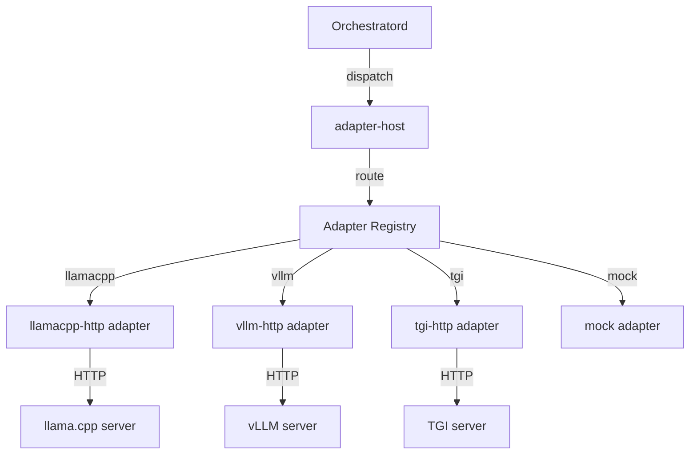

# adapter-host

**Adapter registry and dispatch facade for worker adapters**

`libs/adapter-host` — In-process registry for worker adapters with unified dispatch interface.

---

## What This Library Does

adapter-host provides **adapter management and dispatch** for llama-orch:

- **Adapter registry** — Register and discover worker adapters at runtime
- **Unified dispatch** — Single interface for dispatching to any engine type
- **Adapter trait** — Common interface all adapters must implement
- **Lifecycle management** — Initialize, health check, shutdown adapters
- **Error handling** — Translate engine-specific errors to orchestrator errors

**Used by**: `orchestratord` for dispatching tasks to engines

---

## Key Types

### AdapterHost

```rust
use adapter_host::AdapterHost;

// Create adapter host
let host = AdapterHost::new();

// Register adapters
host.register("llamacpp", LlamaCppAdapter::new())?;
host.register("vllm", VllmAdapter::new())?;
host.register("mock", MockAdapter::new())?;

// Dispatch task
let result = host.dispatch("llamacpp", task).await?;
```

### Adapter Trait

```rust
#[async_trait]
pub trait Adapter: Send + Sync {
    /// Dispatch task to engine
    async fn dispatch(&self, task: Task) -> Result<Response>;
    
    /// Health check
    async fn health(&self) -> Result<HealthStatus>;
    
    /// Shutdown adapter
    async fn shutdown(&self) -> Result<()>;
}
```

### AdapterRegistry

```rust
pub struct AdapterRegistry {
    adapters: HashMap<String, Box<dyn Adapter>>,
}

impl AdapterRegistry {
    pub fn register(&mut self, name: &str, adapter: Box<dyn Adapter>);
    pub fn get(&self, name: &str) -> Option<&dyn Adapter>;
    pub fn list(&self) -> Vec<String>;
}
```

---

## Architecture



### Responsibilities

- **Registry**: Maintain map of adapter name → adapter instance
- **Dispatch**: Route tasks to appropriate adapter
- **Lifecycle**: Initialize and shutdown adapters
- **Health**: Check adapter health status

### Does NOT

- Implement engine-specific logic (that's in individual adapters)
- Make HTTP requests directly (adapters do that)
- Manage engine processes (that's pool-managerd)

---

## Usage Example

```rust
use adapter_host::{AdapterHost, Adapter};
use worker_adapters_llamacpp_http::LlamaCppAdapter;
use worker_adapters_mock::MockAdapter;

#[tokio::main]
async fn main() -> Result<()> {
    // Create adapter host
    let mut host = AdapterHost::new();
    
    // Register adapters
    host.register(
        "llamacpp",
        Box::new(LlamaCppAdapter::new("http://localhost:8081")?),
    )?;
    
    host.register(
        "mock",
        Box::new(MockAdapter::new()),
    )?;
    
    // List available adapters
    let adapters = host.list();
    println!("Available adapters: {:?}", adapters);
    
    // Dispatch task
    let task = Task {
        model: "llama-3.1-8b-instruct".to_string(),
        prompt: "Hello, world!".to_string(),
        max_tokens: 100,
    };
    
    let response = host.dispatch("llamacpp", task).await?;
    println!("Response: {}", response.text);
    
    // Health check
    let health = host.health("llamacpp").await?;
    println!("Health: {:?}", health);
    
    // Shutdown
    host.shutdown().await?;
    
    Ok(())
}
```

---

## Adapter Trait

All worker adapters must implement the `Adapter` trait:

```rust
use adapter_host::Adapter;
use async_trait::async_trait;

pub struct MyAdapter {
    endpoint: String,
}

#[async_trait]
impl Adapter for MyAdapter {
    async fn dispatch(&self, task: Task) -> Result<Response> {
        // Make HTTP request to engine
        let response = reqwest::Client::new()
            .post(&self.endpoint)
            .json(&task)
            .send()
            .await?;
        
        // Parse response
        let text = response.text().await?;
        Ok(Response { text })
    }
    
    async fn health(&self) -> Result<HealthStatus> {
        // Check engine health
        let response = reqwest::Client::new()
            .get(&format!("{}/health", self.endpoint))
            .send()
            .await?;
        
        if response.status().is_success() {
            Ok(HealthStatus::Healthy)
        } else {
            Ok(HealthStatus::Unhealthy)
        }
    }
    
    async fn shutdown(&self) -> Result<()> {
        // Cleanup resources
        Ok(())
    }
}
```

---

## Available Adapters

### Production Adapters

- **llamacpp-http** — llama.cpp HTTP server adapter
- **vllm-http** — vLLM HTTP server adapter
- **tgi-http** — Text Generation Inference adapter
- **openai-http** — OpenAI-compatible HTTP adapter

### Development Adapters

- **mock** — Mock adapter for testing (no real engine)

---

## Testing

### Unit Tests

```bash
# Run all tests
cargo test -p adapter-host -- --nocapture

# Run specific test
cargo test -p adapter-host -- test_register_adapter --nocapture
```

---

## Dependencies

### Internal

- `worker-adapters/adapter-api` — Adapter trait definition

### External

- `async-trait` — Async trait support
- `thiserror` — Error types
- `tokio` — Async runtime

---

## Metrics

Adapter metrics (exposed by orchestratord):

- `adapter_dispatch_total{adapter, outcome}` — Total dispatches (success/failure)
- `adapter_dispatch_latency_ms{adapter}` — Dispatch latency
- `adapter_health_checks_total{adapter, outcome}` — Health check results

---

## Specifications

Implements requirements from:
- ORCH-3054 (Adapter registry)
- ORCH-3055 (Adapter dispatch)
- ORCH-3056 (Adapter lifecycle)
- ORCH-3057 (Health checks)
- ORCH-3058 (Error handling)

See `.specs/00_llama-orch.md` for full requirements.

---

## Status

- **Version**: 0.0.0 (early development)
- **License**: GPL-3.0-or-later
- **Stability**: Alpha
- **Maintainers**: @llama-orch-maintainers
