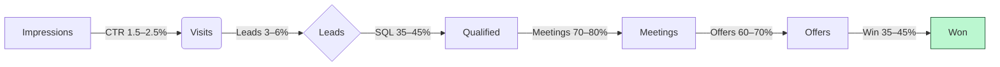

# 2.10 Advertentieplan (concept)

Doel: voorspelbare afsprakenstroom creëren voor server templates + implementatie (SLA‑upsell), met nadruk op veiligheid/privé en EU/AVG‑first. `llama‑orch` positioneren als dunne, controleerbare laag tussen organisatie en open‑source — geen vendor lock‑in, wel borging van determinisme en observability.

## 2.10.1 Propositie & kernboodschap

- Propositie: “Snel en veilig open‑source AI op eigen servers met geharde server templates, implementatie in 2–4 weken en voorspelbaar beheer (SLA).”  
- Differentiatie: on‑prem/EU‑first, dunne orkestratielaag (veiligheid/privé), open‑source transparantie, meetbare KPI’s (latency/uptime/kosten).  
- Bewijs: referentie‑architecturen, demo’s/POC’s, benchmarks, SSE‑transcripten, observability‑screens.

## 2.10.2 ICP & segmentboodschappen

- Zorg/juridisch/overheid: datasoevereiniteit, DPIA‑ondersteuning, audit‑logging, geen dataleak naar derden.  
- Agencies/SIs: sneller opleveren bij klanten met herbruikbare templates en SLA‑backline.  
- Onderwijs/zakelijke diensten: kostenbeheersing vs cloud‑API’s, controle over modellen en data.

## 2.10.3 Aanbod & CTA’s

- Discovery call (gratis, 30 min).  
- POC‑pakket (tijdbox, vaste prijs) met meetbare KPI’s.  
- Implementatie fixed price + SLA‑bundel (Essential/Advanced/Enterprise).  
- Whitepaper/Checklist: “On‑prem AI ready in 2–4 weken (EU/AVG‑first)”.

## 2.10.4 Kanalen & campagnes

- LinkedIn Ads (decision‑makers + tech leads):  
  - Campagne 1 — Awareness: video/carousel over server templates + privacy‑first.  
  - Campagne 2 — Consideration: case/benchmark + CTA POC.  
  - Campagne 3 — Retargeting: demo/POC, whitepaper download.  
- Google Search: keywords “on‑prem LLM”, “open‑source AI server”, “vLLM on‑prem”, “AI privacy EU”, “NIS2 AI”.  
- GitHub/Dev‑communities: readme badges, repo stars, tutorial posts; organisch + beperkte sponsor spots.  
- Nieuwsbrief en webinars: korte deep‑dives (observability, determinisme, DPIA‑support).

### Verticale varianten (campagnes)

- Legal/Professional Services (LP: marketing/landing_vertical_legal_NL.md):  
  - Keywords: “AI on‑prem juridisch”, “AVG veilige AI kantoor”, “contract analyse LLM on‑prem”, “NIS2 AI legal”, “privé LLM EU”.  
  - Creatives: “Vertrouwelijke documenten blijven op eigen server • Audit‑log • DPIA‑ready” (CTA: POC/Checklist DPIA).  
  - Lead magnet: “Checklist DPIA LLM On‑Prem (NL)”.  
- Agencies/SI (LP: marketing/landing_vertical_agency_SI_NL.md):  
  - Keywords: “vLLM implementatie partner”, “on‑prem AI voor agencies”, “AI orkestratie open‑source”, “SLA backline AI”.  
  - Creatives: “In 2–4 weken bij klanten live • Templates • SLA‑backline” (CTA: Partner call/Co‑delivery).  
  - Lead magnet: “Template set: on‑prem LLM bij klanten in 2 weken”.

---

## Visuals — Funnel (met KPI‑bandbreedtes)

Toelichting
- Doel: maakt acquisitie meetbaar en stuurbaar.
- Leeswijzer: percentages zijn doelbandbreedtes; per vertical variëren we messaging/keywords.
- Wat dit aantoont: we sturen op SQL’s en wins met duidelijke drempelwaarden.

## 2.10.5 Creatives (NL) — voorbeeldcopy

- Headline: “Open‑source AI op eigen servers. Veilig. Snel. Meetbaar.”  
- Sub: “Geharde server templates + implementatie in 2–4 weken. SLA‑beheer.”  
- Bullets: “EU/AVG‑first • Geen lock‑in • Dunne orkestratielaag • KPI’s transparant”.  
- CTA: “Plan een discovery call” / “Download de on‑prem checklist”.

Vertical‑specifieke varianten:  
- Legal: “Open‑source AI op eigen servers. Vertrouwelijk. Auditbaar. DPIA‑ready.”  
- Agency/SI: “On‑prem AI voor uw klant. Templates, co‑delivery en SLA‑backline.”

## 2.10.6 Landing pages (outline)

- Hero: propositie + CTA’s (call/download).  
- Sectie: Server Templates (veiligheid, hardening, observability).  
- Sectie: Implementatie (stappen, 2–4 weken), SLA‑bundels.  
- Sectie: Veiligheid/AVG (DPIA, logging, datalokatie EU).  
- Sectie: Benchmarks/POC resultaten (latency, uptime, kosten/1K tokens).  
- Sectie: FAQ (modellen, hardware, integratie, support).  
- Footer: contact, juridische documenten (AV, SLA, privacy).

## 2.10.7 Meting & attributie

- UTM‑tags, events (view content, lead, meeting booked).  
- CRM: bron/kanaal, funnelstap, conversie‑tijd; wekelijkse rapportage.  
- SQL‑definitie: budget, use‑case, beveiligingseisen, tijdslijn, beslisser geïdentificeerd.

Verticale attributie: label campagnes en landingspages per vertical en stuur op CTR, CPL, SQL→meeting rate en win rate; reallocate per 4 weken.

## 2.10.8 Testmatrix (A/B)

- Boodschap: “privacy‑first” vs “kostenbeheersing” vs “implementatietijd” focus.  
- Creatief: video vs carousel vs statisch.  
- Aanbod: POC CTA vs checklist download.  
- Doelgroep: sector‑specifieke varianten.  
- Landingspagina: korte vs lange vorm.

Outreach scripts (koud, verkort):  
- Legal: “Wij leveren on‑prem AI met geharde server templates, DPIA‑ready en audit‑logging. 2–4 weken live. Zullen we 30 min sparren?”  
- Agency/SI: “Wij zorgen dat uw klant in 2–4 weken on‑prem AI live is met templates en SLA‑backline. Interesse in co‑delivery?”

## 2.10.9 Budget & frequentie (indicatief, tbd in financieel plan)

- Verdeling (%): Search 30, LinkedIn 50, Retargeting 10, Experiments 10.  
- Cadans: continu always‑on, sprints per 4 weken; evaluatie en reallocatie per maand.

## 2.10.10 Sales‑afspraken (SLA)

- Reactietijden op inbound: binnen 1 werkdag; opvolg‑cadans binnen 5 werkdagen.  
- Kwalificatievragen: sector, data‑locatie, security, budget, timeline, stakeholders.  
- Voorstel binnen 5 werkdagen na intake (of POC‑plan bij onduidelijkheid).

## 2.10.11 Experimenten backlog

- Calculator: TCO on‑prem vs cloud‑API’s (download gate).  
- Whitepaper: “Deterministische SSE en observability voor AI in productie”.  
- Webinar: “NIS2‑proof AI on‑prem in 4 stappen”.  
- Case micro‑sites met interactieve benchmarks.

---

## 2.10.12 Website‑gedreven mitigaties tegen lage sales

- Lead magnets met gating: DPIA & On‑Prem Readiness → e‑mail → nurture flow (3 mails: checklist → architectuur → ROI/TCO).  
- Verticale LP’s + ABM mini‑LP’s: 10–20 target accounts ontvangen gepersonaliseerde variant (logo, use‑case).  
- Snelle CTA’s: “Book a call” (Cal.com/Calendly) + kort contactformulier met Turnstile (lage frictie).  
- POC‑pakket pagina: directe aanvraag met tijdbox en KPI’s (verhoogt intent).  
- Pricing transparantie + FAQ: reduceert twijfel, versnelt beslissingen.  
- Status/KPI badges (uptime/latency): bewijs, verlaagt risico‑perceptie.  
- Retargeting audiences: bezoekers van /poc en /pricing → retargeting met POC‑CTA.  
- KPI‑sturing: CTR, CPL, SQL→meeting, win; reallocatie per 4 weken; A/B messaging.
