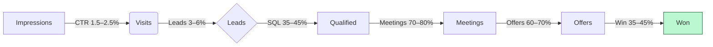
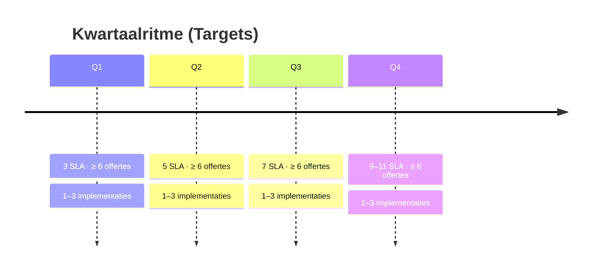

# 2.5 De marketingmix

Met de marketingmix bepaal je jouw marketingstrategie. Deze bestaat uit vijf onderdelen.

---

## 2.5.1 Product

**Beschrijf jouw product of dienst.**  

1. [ ] Fysiek product – beschrijf samenstelling, afmetingen, functie, verpakking, merknaam, service, garantie  
2. [x] Dienst – Server Templates + Implementatie + Beheer (merk: "llama-orch" als dunne orkestratielaag).  
   - Server Templates: gestandaardiseerde, geharde GPU‑serverimages en configuraties (OS‑profielen, drivers, runtimes) met provisioning‑scripts en observability out‑of‑the‑box.  
   - Implementatie: plaatsing van modellen/engines, beveiliging (least‑privilege), logging/metrics, testen en overdracht documentatie.  
   - Beheer (SLA): monitoring, updates/patching, incidentrespons en maandrapportages.  
   - Dunne softwarelaag: `llama‑orch` als minimalistische, controleerbare laag tussen organisatie en open‑source componenten om veiligheid, privacy en determinisme te borgen (SSE‑streaming, cancel, observability).  

**Toegevoegde waarde voor klanten:**  
Snel en veilig open-source AI in productie zonder eigen MLOps-team. Volledige controle over data (on-prem/EU), voorspelbare kosten, en professionele ondersteuning met meetbare betrouwbaarheid (robuste SSE-streaming, observability en SLA).

**Welk probleem los je op voor klanten?**  
Klanten willen hoogwaardige open-source AI gebruiken maar missen GPU-kennis en infrastructuur. Ik neem de complexiteit van provisioning, modelplaatsing, monitoring en schaalbaarheid weg met een kant-en-klaar, beheerd platform.

**Wat maakt jouw aanbod beter/unieker dan dat van concurrenten?**  
Open-source kern met spec-first contracten, deterministische token-streaming, automatische engine→GPU-plaatsing met expliciete overrides, en EU/AVG-first implementatie. Transparante kosten en eigenaarschap bij de klant. De server templates + implementatie verkorten time‑to‑value en reduceren risico’s (security/compliance) aantoonbaar.

**SLA-pakketten (omvang en service):**  
- Essential (€ 350 p/m): monitoring, maandelijkse updates, kantooruren support, R/T 8/24 uur.  
- Advanced (€ 600 p/m): uitgebreide observability, tweewekelijkse updates, R/T 4/12 uur.  
- Enterprise (€ 900 p/m): weekly updates, optionele on-call, R/T 2/6 uur, maatwerk rapportage.  
Facturatie: maand vooruit via automatische incasso; duidelijke SLA/AV.

---

## 2.5.2 Prijs

**1. Prijspositie t.o.v. concurrenten (lager/gelijk/hoger):**  
Gelijk tot lager (totale TCO lager bij intensieve inferentie door on-premise uitvoering en efficiënte GPU-inzet).

**2. Prijs en motivatie:**  
Implementatiebundels €4.500–€9.500 per traject (scope-afhankelijk). Beheer/SLA €350–€900 per maand per server/instantie. Prijsstelling is marktconform, met focus op voorspelbare waarde, uptime en beveiliging.

---

## 2.5.3 Plaats en distributie

**1. Vestigingsplaats & motivatie (pand/thuis/anders):**  
Thuis/remote kantoor in Breda; implementaties remote en op locatie bij klanten indien nodig. Lage vaste lasten, hoge flexibiliteit en snelle responstijden.

**2. Verkoopkanalen & motivatie (webshop/social media/fysiek):**  
Direct via website en GitHub (documentatie/cases), netwerk en partners (bureaus/IT-dienstverleners), LinkedIn en conferenties/meetups. Deze kanalen bereiken zowel beslissers als technische teams.

---

## 2.5.4 Promotie

**1. Hoe weten klanten dat je bestaat?**  
Website met duidelijke cases en referenties, GitHub-repo van `llama-orch`, en thought leadership via blog/LinkedIn. Introductie via partners en bestaande relaties.

**2. Hoe kunnen klanten je vinden?**  
SEO op relevante zoektermen (on-prem AI, open-source LLM, GPU-inferentie), technische documentatie en tutorialcontent, en zichtbaar portfolio op GitHub.

**3. Hoe maak je jouw producten zichtbaar?**  
Demo’s, proof-of-concepts, referentie-implementaties en meetbare benchmarks. Publicatie van klantcases met concrete KPI’s (latency, uptime, kostenbesparing).

**4. Welke media zet je in en hoe? Waarom?**  
LinkedIn (beslissers), GitHub (ontwikkelaars), nieuwsbrief (updates en cases), relevante events/meetups (netwerk). Mix bereikt zowel business- als techniekpubliek en ondersteunt vertrouwen.  
Inhuur B2B‑acquisitie (retainer) voor gestructureerde outreach, kwalificatie en afspraak‑setting met duidelijke KPI’s.

---

## 2.5.5 Personeel

**Ga je personeel aannemen?**  
- [ ] Ja → Eisen & werving: n.v.t. in jaar 1; bij groei: freelance/ZZP GPU DevOps en data engineers via netwerk en platforms.  
- [x] Nee → Hoe om te gaan met piekperiodes: opschalen met freelancers/partners, duidelijke planning/scope, wachtrijbeheer en tijdige communicatie met klanten.

---

# 2.6 Doelstellingen

---

## 2.6.1 Jouw missie

**1. Wie zijn wij?**  
Een gespecialiseerde open-source AI implementatiepartner die organisaties helpt veilig, snel en betaalbaar AI in te zetten op eigen infrastructuur.

**2. Wat zijn onze waarden?**  
Transparantie, betrouwbaarheid, vakmanschap en eigenaarschap bij de klant. Privacy-by-design en EU/AVG-first.

**3. Hoe willen wij met klanten en medewerkers omgaan?**  
Partnergericht, eerlijk en resultaatgedreven. Heldere afspraken, meetbare servicelevels en respectvolle samenwerking met klanten en freelancers/partners.

---

## 2.6.2 Jouw visie

**1. Waar wil je over 5–10 jaar staan met je onderneming?**  
Een toonaangevend open-source AI-orkestratieproduct met een ecosysteem van partners; een portfolio van EU-referenties in privacygevoelige sectoren; stabiele terugkerende omzet uit beheer/SLA’s.

**2. Wat ga je doen om succes te halen en te behouden?**  
Continue productverbetering en documentatie, investeren in observability/veiligheid, partnerschappen uitbouwen, en focus houden op niches waar on-premise en compliance doorslaggevend zijn.

---

## 2.6.3 Commerciële targets per kwartaal (jaar 1)

- Pipeline (SQL’s): ≥ 12 gekwalificeerde leads p/kwartaal  
- Offertes: ≥ 6 uitgebracht p/kwartaal, conversie ≥ 40%  
- Implementaties: 1–3 per kwartaal (doorlooptijd 2–4 weken)  
- SLA’s actief: Q1 ≥ 3, Q2 ≥ 5, Q3 ≥ 7, Q4 ≥ 9  
- MRR (SLA): Q1 ≥ € 1.350, Q2 ≥ € 2.250, Q3 ≥ € 3.150, Q4 ≥ € 4.050  
- Churn: ≤ 5% per jaar  
- NPS/Klanttevredenheid: ≥ 8/10

Funnelsturing: wekelijkse outreach‑cadans, partnerco‑selling, demo/POC binnen 10 werkdagen, en strakke opvolging via CRM.

---

## Visuals — Funnel en kwartaalritme

Toelichting
- Doel: toon conversiestappen en kwartaalgroei die MRR opbouwt.
- Leeswijzer: percentages zijn bandbreedtes; targets per kwartaal sluiten op budget/DSCR.
- Wat dit aantoont: voorspelbare commerciële executie met duidelijke stuurpunten.
