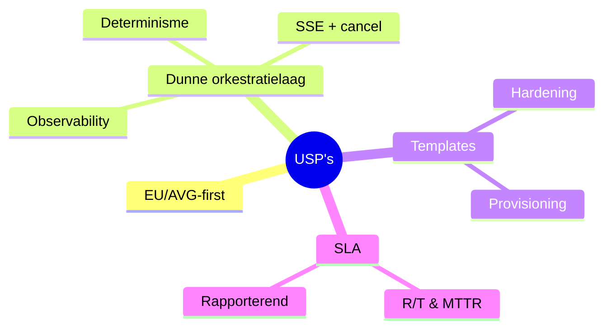
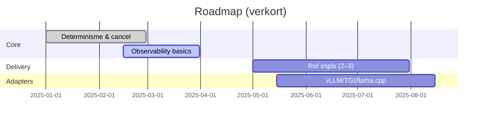

# 2.7 USP’s, Roadmap en KPI’s

## 2.7.1 Unique Selling Points (USP’s)

- EU/AVG-first on‑prem/hybride: datasoevereiniteit, lage latency, geen vendor lock‑in.  
- Open‑source kern (`llama‑orch`) met spec‑first contracten en transparante ontwikkeling.  
- Deterministische, robuuste token‑streaming (SSE) met annuleerbaarheid en observability.  
- Slimme plaatsing: engine→GPU toewijzing met expliciete overrides; voorbereiding op heterogene GPU’s.  
- Observability & metrics volgens vaste namen (latency, throughput, queue, budgets).  
- Snelle implementatie (2–4 weken) door productgestuurde aanpak i.p.v. maatwerk‑from‑scratch.  
- Heldere SLA‑bundels met automatische incasso en voorspelbare TCO.  
- Documentatie, tests, en incident‑reviews als standaard werkwijze.
 - Radicale transparantie: roadmap/changelog/incident‑reviews publiek; plannen & PDF’s online; status/KPI’s zichtbaar.  
 - GPL‑licentie voor software: vrijheid en auditbaarheid; diensten (implementatie/SLA) leveren kwaliteit en support.

## 2.7.2 Technische roadmap (12 maanden)

Kwartaal 1–2:
- Productisering `llama‑orch`: determinisme end‑to‑end; cancel‑semantiek; capability discovery.  
- Observability: GPU/NVML metrics; structured logging; basis OpenTelemetry.  
- Referentie‑implementaties op RTX 4090/3090 omgeving; runbooks en hardening‑profielen.  

Kwartaal 3–4:
- Adapter‑uitbreiding (vLLM/TGI/Triton) + pool‑manager; heterogene scheduling.  
- Artifact registry en SBOM; audit logging en policy guardrails.  
- Partnerintegraties (agencies/SIs) en cases in privacygevoelige sectoren.

## 2.7.3 KPI’s (operational en commercieel)

- Uptime ≥ 99,5%; MTTR ≤ 6 uur (Premium); median latency ≤ 300 ms.  
- Onboarding: implementatie 2–4 weken; 95% acceptatie bij eerste poging.  
- Kwaliteit: 0 kritieke security‑incidenten; post‑mortems binnen 5 werkdagen.  
- Commercieel: conversie ≥ 40% op offertes; MRR groei ≥ € 900 per kwartaal.  
- Klanttevredenheid: NPS ≥ 8/10; churn ≤ 5% per jaar.

---

## Visuals — USP’s en roadmap

Toelichting
- Doel: kristalliseert waardepropositie en de korte‑termijnreleases.
- Leeswijzer: mindmap toont kernwaarden; gantt vat volgorde en timing samen.
- Wat dit aantoont: focus op veiligheid/determinisme + tempo in levering/cases.
