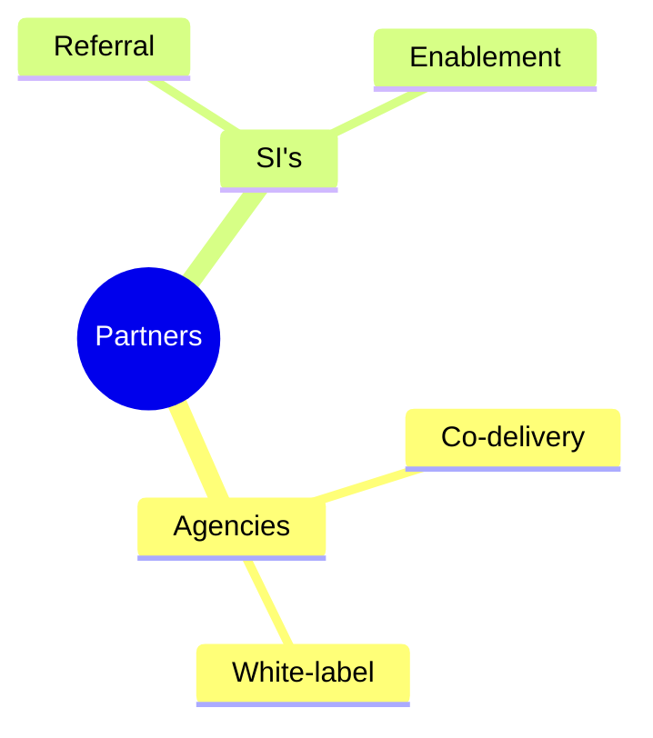

# 2.8 Acquisitie & Partners

## 2.8.1 Acquisitiestrategie

- Doelsegmenten: mkb (zorg, juridisch, onderwijs, overheid‑gerelateerd), agencies/SIs voor co‑selling.  
- Propositie: turnkey on‑prem AI met open‑source kern, SLA‑bundels en voorspelbare TCO.  
- Kanalen: website/GitHub, LinkedIn, partnerco‑selling, events/meetups.  
- Bewijslast: demo’s/POC’s, benchmarks, referentie‑implementaties met KPI’s.

## 2.8.2 Inhuur B2B acquisitie (budget uit lening)

Doel: versneld een voorspelbare pipeline en afsprakenstroom creëren onder regie en met kwaliteitsstandaarden.

- Retainer (indicatief): € 1.200 p/m × 6 maanden = € 7.200  
- Deliverables per maand:  
  - ≥ 60 relevante outreach‑contacten  
  - ≥ 8 kwalificatiegesprekken (SQL’s)  
  - ≥ 4 afspraak‑settings met beslissers  
- Kwaliteitskaders: ICP‑definitie, messaging‑guides, anti‑spam en AVG‑conform werken.  
- Rapportage: conversie‑rapport, meeting notes, CRM‑updates; maandelijkse evaluatie.  
- Exit‑criteria: stop/opschalen op KPI’s; overdraagbare assets (lijsten, templates).

## 2.8.3 Partnerprogramma

- Types: digitale bureaus, system integrators, security‑/infra‑partners.  
- Model: referral fee of co‑delivery; gezamenlijke cases; gedeelde marketing.  
- Enablement: demo‑omgevingen, sales kits, runbooks; gezamenlijke webinars.

## 2.8.4 Pipeline en targets (jaar 1)

- SQL’s: ≥ 12 per kwartaal  
- Offertes: ≥ 6 per kwartaal, conversie ≥ 40%  
- Implementaties: 1–3 per kwartaal  
- SLA’s actief: Q4 ≥ 9–11  
- MRR: Q4 ≥ € 4.050–€ 4.950

---

## Visuals — Pipeline & partners

```mermaid
flowchart LR
  O[Outreach (Retainer/Partners)] --> L[Leads]
  L --> Q{SQL}
  Q --> M[Meetings]
  M --> Of[Offers]
  Of --> W[Won Deals]
  style W fill:#bbf7d0,stroke:#14532d
```



Toelichting
- Doel: maakt het acquisitie‑pad en partnervormen visueel.
- Leeswijzer: pipelineblokken corresponderen met KPI’s; partnermindmap toont de twee routes.
- Wat dit aantoont: schaalbare acquisitie via retainer + partners, niet alleen eigen tijd.

---

## 2.8.5 Partner leadflow & referral

- Partner‑LP met co‑branding + formulier (referral of co‑delivery aanvraag).  
- Referral vergoeding of co‑delivery fee; duidelijke voorwaarden op 1 pagina.  
- Enablement: demo‑omgevingen, case kits, webinar templates.  
- SLA‑backline: partners positioneren “wij bouwen; backline door leverancier”.
