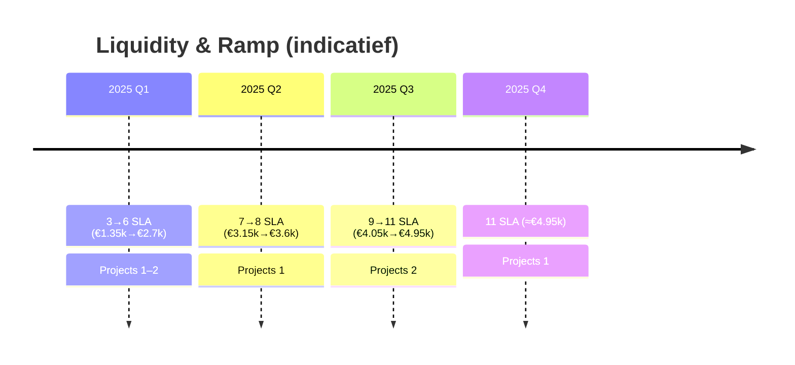

# 3.10 12-maanden liquiditeit (overzicht)

Indicatief overzicht voor jaar 1 met ramp‑up van SLA‑klanten en spreiding van implementatieprojecten. Bedragen excl. btw; exacte doorrekening in Excel‑bijlage.

Assumpties:
- Start SLA‑klanten: 3 (maand 1) → +1/maand t/m maand 8 → 11 per maand 9–12.  
- SLA‑prijs: € 450 p/m per klant.  
- Implementatieprojecten: 6 × € 6.000 verdeeld over maanden 2, 3, 5, 7, 9, 11.  
- Opex vast ~€ 1.195 p/m + variabel ~€ 400 p/m = ~€ 1.595 p/m.  
- Leninglast: ~€ 731 p/m (annuïteit, indicatief, 48 mnd).  
- Privéopname: € 2.000 p/m (beleid; aanpasbaar bij DSCR < 1,2×).

Legenda per maand: SLA_klanten · SLA_omzet · Project_omzet · Kosten_bedrijf · Lening · Privé

1: 3 · 1.350 · 0 · 1.595 · 731 · 2.000  
2: 4 · 1.800 · 6.000 · 1.595 · 731 · 2.000  
3: 5 · 2.250 · 6.000 · 1.595 · 731 · 2.000  
4: 6 · 2.700 · 0 · 1.595 · 731 · 2.000  
5: 7 · 3.150 · 6.000 · 1.595 · 731 · 2.000  
6: 8 · 3.600 · 0 · 1.595 · 731 · 2.000  
7: 9 · 4.050 · 6.000 · 1.595 · 731 · 2.000  
8: 10 · 4.500 · 0 · 1.595 · 731 · 2.000  
9: 11 · 4.950 · 6.000 · 1.595 · 731 · 2.000  
10: 11 · 4.950 · 0 · 1.595 · 731 · 2.000  
11: 11 · 4.950 · 6.000 · 1.595 · 731 · 2.000  
12: 11 · 4.950 · 0 · 1.595 · 731 · 2.000  

Interpretatie:
- Break‑even (incl. privéopname) zonder projecten ligt rond 10 SLA‑klanten.  
- Projectmaanden zorgen voor significante bufferopbouw.  
- Bij tegenvallende pipeline: privéopname tijdelijk verlagen of freelance inzet verhogen om DSCR ≥ 1,2× te houden.

NB: dit is een indicatief scenario; exacte cijfers, btw/IB en seizoenspatroon worden uitgewerkt in de Excel‑bijlage.

---

## Visual — Ramp als tijdlijn

Toelichting
- Doel: maakt de opbouw naar stabiliteit visueel in kwartalen.
- Leeswijzer: combinatie van SLA‑MRR en projectmomenten; het patroon moet DSCR verbeteren.
- Wat dit aantoont: voorspelbare groei en bufferopbouw passend bij leninglast.
