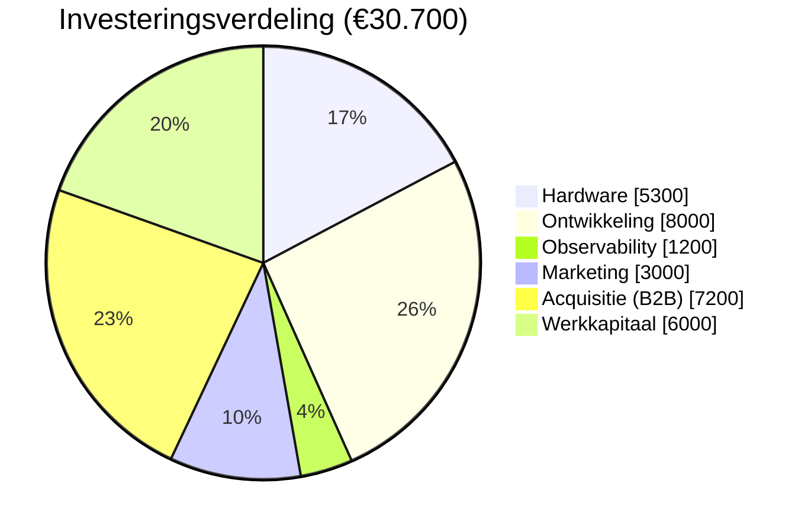
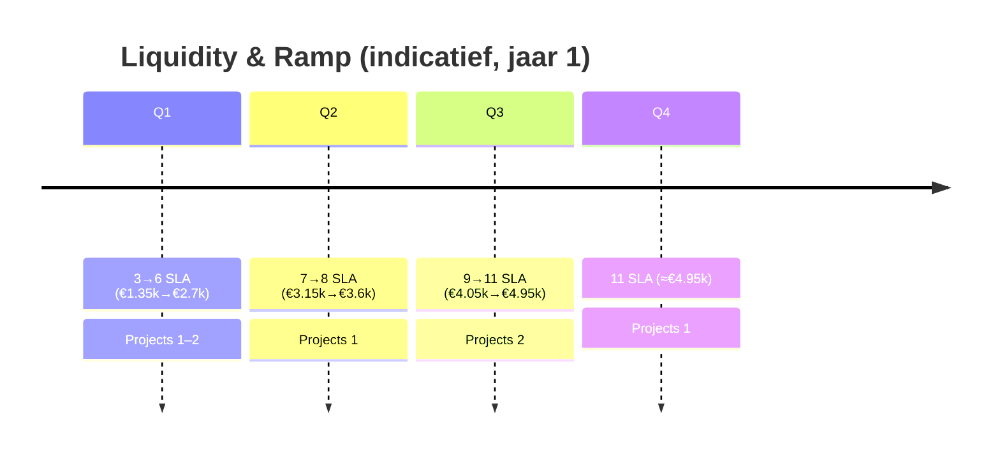

# 3. Het Financieel Plan

Het financieel plan is de cijfermatige vertaling van jouw bedrijfsidee.  
Je denkt na over de investeringsbegroting, financieringsbegroting, exploitatiebegroting en liquiditeitsbegroting.  
Gebruik hiervoor bijlagen (spreadsheet of apart sjabloon) en vat hier de kern samen.

---

## Kern voor kredietbeoordeling (samenvatting)

- Maandlast lening (indicatief, 48 mnd, ~8%): ~€ 731  
- Structurele dekking uit SLA’s: 6 klanten × € 450 = € 2.700 p/m  
- Vaste lasten excl. lening: ~€ 1.195 p/m; variabel (gemiddeld): ~€ 400 p/m → totaal ~€ 1.595 p/m  
- Break-even (maanden zonder projecten): 6 SLA‑klanten dekken vaste lasten + leninglast  
- Buffer: ≥ 3 maanden vaste lasten inclusief leninglast gereserveerd  
- DSCR (basismaand, alleen SLA): ~1,5× (indicatief)  
- DSCR (met 1 klein project/kwartaal): ~2,3×–2,9× (afhankelijk van 5–6 SLA)  
- Fallback: variabele kosten terugschalen + inzet freelancecapaciteit indien nodig (waarborgt aflossing)  
- Privéopname (richtbedrag): € 2.000 p/m; beleid om tijdelijk te verlagen bij DSCR < 1,2×

---

## 3.1 Investeringsbegroting

**Welke investeringen moet je doen om te kunnen starten of groeien?**  
 Hoofdinvesteringen zijn gericht op ontwikkel- en demonstratiecapaciteit (GPU), professionalisering van product (`llama-orch`), commerciële start en acquisitie‑inhuur.  
- GPU-ontwikkelserver (workstation met RTX 4090, 64 GB RAM, NVMe): € 4.500  
- Netwerk/UPS/back-upopslag: € 800  
- Ontwikkelingskosten productisering (documentatie, tests, automatisering): € 8.000  
- Monitoring/observability-inrichting (initieel): € 1.200  
- Branding, website en initiële marketingmaterialen: € 3.000  
- B2B acquisitie‑retainer (6 mnd × € 1.200): € 7.200  
- Werkkapitaal (buffer voor 3–4 maanden vaste lasten): € 6.000  
Totaal investeringen: € 30.700

**Samenvatting investeringen:**  
Fysieke assets (~€ 5.300), immateriële ontwikkeling/ops (~€ 9.200), marketing/acquisitie (€ 10.200) en werkkapitaal (€ 6.000). Totaal € 30.700.

Toelichting (investeringsverdeling)
- Doel: koppelt posten aan omzet/levering (acquisitie + ontwikkeling) en continuïteit (werkkapitaal).
- Leeswijzer: grootste blokken zijn direct omzetversnellend en kwaliteitsborgend.
- Wat dit aantoont: gerichte besteding met aantoonbaar effect op terugbetaalvermogen.

---

## 3.2 Financieringsbegroting

**Hoe ga je de investeringen financieren? (eigen geld, lening, subsidie, etc.)**  
Financieringsmix:  
- Lening: € 30.000 (doeleinden: ontwikkeling, hardware, marketing + B2B acquisitie‑retainer)  
- Eigen vermogen: € 700  
Voorstel lening: looptijd 48 maanden, 8% rente, annuïteit. Indicatieve maandlast: ~€ 731.  
Automatische incasso wordt ingesteld; reservering voor maandlast in liquiditeitsplanning opgenomen.

**Samenvatting financiering:**  
Totaal financiering € 30.700 = totaal investeringen. Lening dekt ~98%, eigen middelen ~2%.

---

## 3.3 Exploitatiebegroting

**Wat zijn je verwachte opbrengsten en kosten per jaar?**  
Opbrengsten (jaar 1, conservatief):  
- Implementatieprojecten: 6 trajecten à gemiddeld € 6.000 = € 36.000  
- Beheer/SLA: 6 klanten à € 450 p/m = € 32.400  
- Advies/prototyping: € 10.000  
Totaal opbrengsten: € 78.400  

Kosten (jaar 1):  
- Tools/subscripties/hosting: € 1.200  
- Verzekeringen/administratie/overige vaste lasten: € 2.600  
- Marketing & sales: € 4.000  
- Energie/colocatie en klein materiaal: € 1.800  
- Inhuur/freelancers (pieken): € 5.000  
- Afschrijving hardware (3 jaar): € 1.500  
- Afschrijving ontwikkelingskosten (3 jaar): € 2.667  
- Rente lening (jaar 1, indicatief): € 1.300  
Totaal kosten: € 20.067  

Resultaat vóór belasting (indicatief): ~€ 58.333

**Samenvatting exploitatiebegroting:**  
Gezonde marge door combinatie van implementatie-omzet en terugkerende SLA’s. Kostenstructuur licht en schaalbaar; investeringen worden in 3 jaar afgeschreven.

---

## 3.3b Break-even en dekkingsgraad (maandelijks)

- Vaste lasten (excl. lening): ~€ 1.195 p/m  
- Variabel (gemiddeld): ~€ 400 p/m  
- Leninglast: ~€ 731 p/m  
- Benodigde dekking in ‘stille’ maand (excl. privé): ~€ 2.326 p/m  
- SLA‑omzet per klant: € 450 p/m  
- Break-even aantal SLA‑klanten zonder projecten: 6  
Conclusie: in maanden zonder implementatieprojecten dekken 6 SLA‑klanten alle lasten incl. aflossing. Projectmaanden vergroten de buffer.

---

## 3.3c Opex per maand (uitsplitsing)

Indicatieve verdeling (jaar 1), exclusief btw:
- Tools/subscripties/hosting: ~€ 100 p/m  
- Verzekeringen, administratie en overige vaste lasten: ~€ 215 p/m  
- Marketing & sales: ~€ 330 p/m  
- Energie/colocatie en klein materiaal: ~€ 150 p/m  
- Gemiddelde inhuur/freelance (variabel, piekgedreven): ~€ 400 p/m  

Totaal excl. lening: ~€ 1.195 vast + ~€ 400 variabel ≈ € 1.595 p/m (past binnen gehanteerde bandbreedte ~€ 1.200 + € 300–€ 500).

---

## 3.3d Break-even inclusief privéopname

- Privéopname: € 2.000 p/m (richtbedrag; beleid om te temporiseren bij DSCR < 1,2×).  
- Benodigde dekking incl. privé: ~€ 1.595 + € 731 + € 2.000 ≈ € 4.326 p/m.  
- SLA‑omzet per klant: € 450 p/m → 10 klanten ≈ € 4.500 p/m.  
Conclusie: bij 10 SLA‑klanten is de dekking (incl. privé) gerealiseerd zonder projectomzet. Projecten verlagen de benodigde SLA‑omvang.
---

## 3.4 Liquiditeitsbegroting

**Hoe ontwikkelt je kasstroom zich maandelijks?**  
Maandelijkse instroom bestaat primair uit SLA-omzet (~€ 2.700 p/m bij 6 klanten). Implementatieprojecten leveren pieken op (€ 4.500–€ 9.500) in uitvoeringsmaanden.  
Vaste maandlasten (excl. btw, indicatief): € 1.595 operationeel + € 731 lening = ~€ 2.326. Variabele kosten (inhuur) gemiddeld € 300–€ 500 p/m.  
Conclusie: op basis van SLA’s is de basis liquiditeit positief; projectmaanden versterken de buffer. Werkkapitaal vangt seizoensschommelingen op.

**Samenvatting liquiditeitsbegroting:**  
Positieve kasstroom in ‘rustige’ maanden door SLA’s; projectomzetten zorgen voor extra ruimte. Leninglast stabiel (~€ 731 p/m). Buffer van € 6.000 dekt ca. 2–3 maanden vaste lasten.

Toelichting (ramp)
- Doel: visualiseert opbouw van vaste inkomsten (SLA) en projectpieken.
- Leeswijzer: elke periode combineert MRR uit SLA’s en geplande projecten.
- Wat dit aantoont: voorspelbare dekking van lasten, toenemende buffer en DSCR.

---

## 3.5 Scenarioanalyse (omzet, kosten, DSCR)

Definities: DSCR = vrije operationele kasstroom / schuldendienst (maandlast). Indicatief, exclusief belasting/privéopnames; wordt gespecificeerd in Excel.

- Downside (excl. privé): 5 SLA‑klanten (2.250 p/m), 0 projecten  → vrije kasstroom ≈ € 2.250 − (€ 1.195 + € 400) = € 655  → DSCR ≈ 0,9×.  
  Mitigatie: variabel verlagen, korte freelance‑inzet of extra POC → doel DSCR ≥ 1,2×.  
- Basis (excl. privé): 6 SLA‑klanten (2.700 p/m), 0 projecten → vrije kasstroom ≈ € 1.105 → DSCR ≈ 1,5×.  
- Conservatief (excl. privé) met 1 klein project/kwartaal (gem. € 1.000/maand over kwartaal) + 5 SLA → vrije kasstroom ≈ € 1.655 → DSCR ≈ 2,3×.  

Na privéopname (€ 2.000 p/m) ontstaat in ‘stille’ maanden een aanvullende dekkingseis die wordt ingevuld door:  
1) het opbouwen naar 10 SLA‑klanten, 2) projectomzet in de betreffende periode, of 3) tijdelijke verlaging van privéopname en/of freelance inzet.

Opmerking: volledige doorrekening inclusief BTW, IB en privébegroting is opgenomen in het Excel‑bijlagebestand; bovenstaande is een leesbare samenvatting voor de kredietbeoordelaar.

---

## 3.6 Zekerheden, borg en afspraken

- Zekerheden: zakelijke inventaris (GPU‑werkstation e.d.), debiteurenportefeuille (indien van toepassing).  
- Borging: eigen inbreng (€ 700) en contractuele verplichting tot automatische incasso.  
- Rapportage: kwartaalrapportage (omzet, marge, liquiditeit, pipeline) aan Qredits op verzoek.  
- Covenanten (indicatief, bespreekbaar): minimale liquiditeitsbuffer van ≥ 2 maanden vaste lasten; meldplicht bij >20% omzetdaling kwartaal‑op‑kwartaal.

---

## 3.7 Toelichting aannames

- SLA‑prijsstelling: € 350–€ 900 p/m afhankelijk van pakket; rekenvoorbeeld hanteert € 450 p/m.  
- Projectgemiddelde: € 4.500–€ 9.500 per implementatie, 1–3 per kwartaal (scope‑afhankelijk).  
- Kosten: tooling licht en schaalbaar; variabelen stijgen alleen bij groei (freelance, energie).  
- Fiscale posten: BTW gereserveerd per maand; IB door boekhouder in jaarafsluiting (Excel‑sheet rekent door).

---

## 3.8 Bijlagen

- [ ] Excel / Spreadsheet met volledige cijfers: financieel_plan_2025.xlsx  
- [ ] Overige documenten: hardware_offertes.pdf; SLA_voorbeeld.pdf  
- [ ] Privébegroting (samenvatting), op verzoek

---

## 3.9 Privébegroting (samenvatting en beleid)

- Privéopname beleid: richtbedrag € 2.000 per maand; temporiseren bij DSCR < 1,2× (bijv. tijdelijk € 1.200 p/m) en/of extra omzet genereren (freelance/POC).  
- Overige verplichtingen: geen zakelijke lease‑/leningsverplichtingen buiten de aangevraagde lening.  
- Detailoverzicht privé vaste lasten: op verzoek beschikbaar (bankafschriften/overzicht boekhouder).  
- Doel: bedrijfscontinuïteit en aflossingscapaciteit prioriteren; privéopnames passen binnen bovengenoemd beleid.
