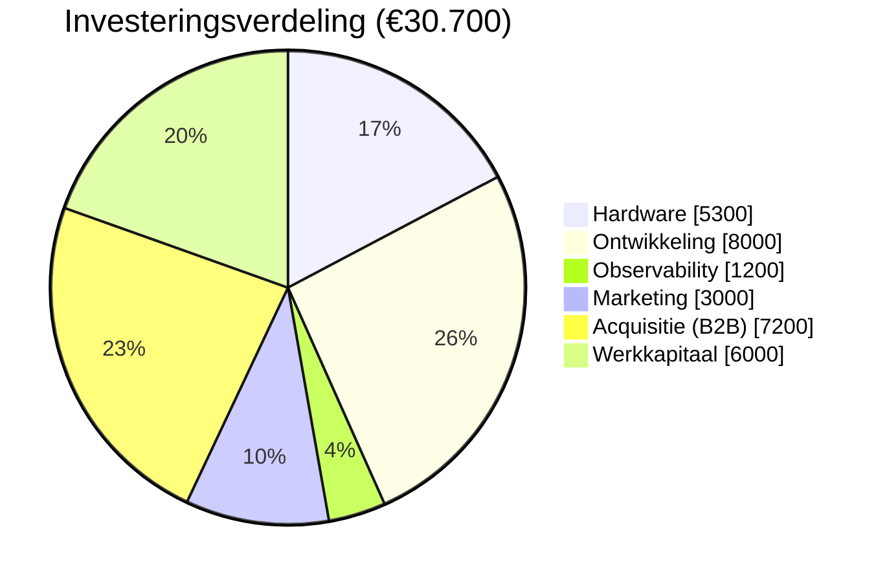
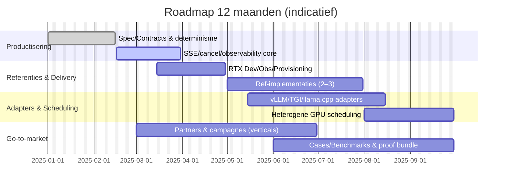
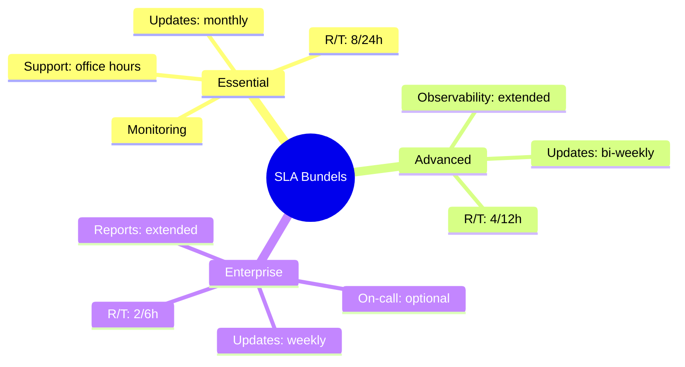
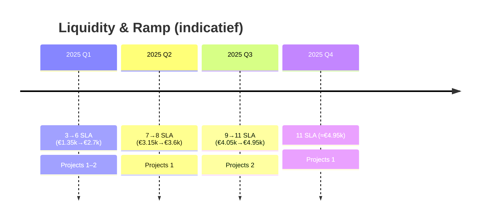
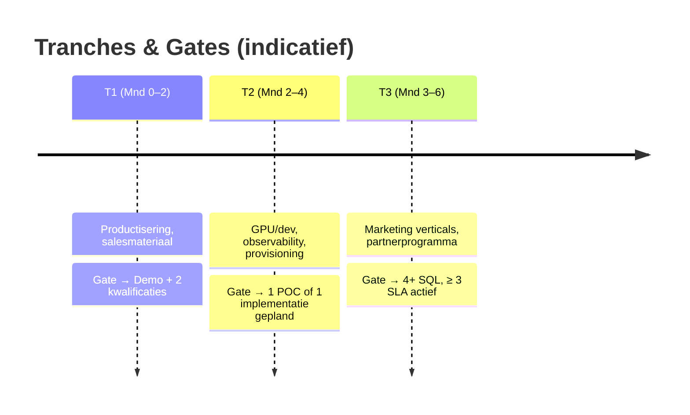
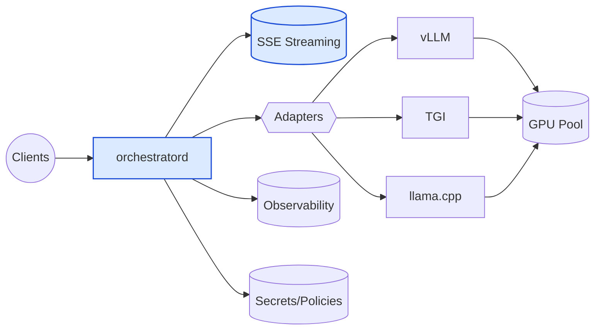

# Mermaid Visuals — Draft

## Investeringsverdeling (pie)

Toelichting (doel, leeswijzer, bewijswaarde)
- Doel: laat in één oogopslag zien waar de lening in wordt geïnvesteerd en waarom dit omzetversnelling en leveringszekerheid oplevert.
- Leeswijzer: de grootste posten (ontwikkeling en acquisitie) versnellen tijd‑tot‑waarde en afsprakenstroom; werkkapitaal dekt tijdelijke schommelingen.
- Wat dit aantoont: besteding is direct gekoppeld aan omzetgeneratie (acquisitie/marketing) en betrouwbare levering (ontwikkeling/observability/hardware), met buffer voor continuïteit.

## Roadmap 12 maanden (gantt)

Toelichting
- Doel: toont fasering van product → referenties → partners/cases zodat waardecreatie snel en beheerst verloopt.
- Leeswijzer: overlappende balken geven parallel werk aan; referenties/cases vallen na de eerste leveringen.
- Wat dit aantoont: planmatige uitvoering en voorspelbare milestones die direct aansluiten op tranche‑gates en omzetopbouw.

## Funnel (flowchart)

Toelichting
- Doel: visualiseert de conversiestappen en streefwaarden zodat acquisitie meetbaar en bijstuurbaar is.
- Leeswijzer: de percentages zijn doelbandbreedtes; per campagne sturen we op CTR, CPL, SQL→meeting en winrate.
- Wat dit aantoont: pipeline is niet willekeurig; met KPI’s en retainer/partners borgen we voldoende afsprakenstroom voor dekking en groei.

## SLA Bundels (mindmap)

Toelichting
- Doel: in één beeld de service‑niveaus en responstijden, zodat verwachtingen helder zijn.
- Leeswijzer: elk pakket bouwt voort op de vorige (meer observability, snellere R/T, uitgebreidere rapportage).
- Wat dit aantoont: voorspelbare, schaalbare service die maandlasten dekt en kwaliteit borgt (relevant voor terugbetaalbaarheid).

## Liquidity & Ramp (timeline)

Toelichting
- Doel: laat zien hoe SLA‑ramp gecombineerd met projecten voldoende cash creëert voor leninglast en privéopname.
- Leeswijzer: elke periode toont SLA‑MRR (bij €450/klant) en aantal projecten; balans tussen vaste en variabele instroom.
- Wat dit aantoont: dekkingsgraad groeit voorspelbaar; projecten versnellen bufferopbouw richting stabiele DSCR.

## Tranche besteding & gates (timeline)

Toelichting
- Doel: koppelt uitgaven aan concrete mijlpalen om overbesteding te voorkomen.
- Leeswijzer: elke tranche heeft een duidelijke “Gate” (bewijsstuk/KPI) voordat de volgende uitgaven starten.
- Wat dit aantoont: uitgaven zijn beheerst en direct gelinkt aan omzet‑ en leveringsmijlpalen, wat risico verlaagt.

## Architectuur (flowchart)

Toelichting
- Doel: toont de minimalistische, controleerbare laag tussen clients en open‑source componenten met focus op determinisme en observability.
- Leeswijzer: data blijft binnen de eigen omgeving; adapters koppelen naar gekozen engines; observability en policies zijn eerste‑klas.
- Wat dit aantoont: kleine attack‑surface, duidelijke verantwoordelijkheden en meetbaarheid — voorwaarden voor veilige, betrouwbare levering.
