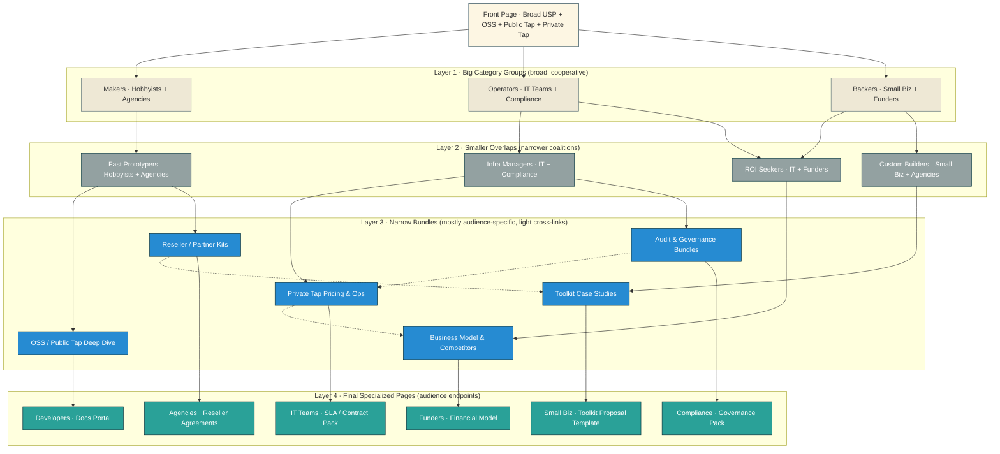

# Mesh Site Architecture

> Status: Future proposal — not implemented in Draft 2 (see `index.md` §C).

## Purpose

This document defines the website’s architecture as a **mesh** rather than a tree.  
Each **category** corresponds to a target audience.  
Each category has **4 abstraction layers**, moving from broad + cross-linked to deep + audience-specific.  
By **Layer 4**, each audience has self-routed into their own funnel without being forced.

---

## Categories (Audiences)

1. Hobbyists & Developers  
2. IT Teams (SMEs)  
3. Agencies & Consultancies  
4. Compliance-Sensitive Orgs (Finance, Healthcare, Gov)  
5. Small Businesses (Custom Toolkit Buyers)  
6. Investors / Funders  

---

## Layers of Abstraction

### Layer 1 — Broad & Cooperative

- Pages are wide in scope and show cooperation between categories.  
- Messaging: *“AI plumbing fits many needs.”*  
- Heavy cross-links: hobbyists → agencies, IT → compliance, etc.  
- Example: Front-page hero with all services (OSS, Public Tap, Private Tap).  

### Layer 2 — Semi-Broad

- Landing pages tailored to each audience but still cross-linked.  
- Example: *Agencies page* shows how agencies work with IT teams, and how Public Tap connects to Private Tap.  
- Still more width than depth.  

### Layer 3 — Deep with Light Cross-Refs

- Pages narrow in focus, mostly addressing one audience.  
- Still reference adjacent categories lightly (“For compliance, see proof library”).  
- Example: IT Teams page shows Private Tap pricing, logs, monitoring.  

### Layer 4 — Fully Specialized

- Audience-specific, final content.  
- Developers → SDK & docs (on separate docs subdomain).  
- IT Teams → SLA, uptime guarantees, monitoring proof.  
- Agencies → partner kits, reseller agreements.  
- Compliance → governance checklists, AI Act references.  
- Small Biz → case studies, custom toolkit offers.  
- Funders → revenue model, competitor maps, feasibility docs.  

---

## Routing Principles

- Users self-route: no forced funnels.  
- **Layer 1** encourages exploration.  
- **Layer 2** narrows but still connects.  
- **Layer 3** is audience-specific with rare cross-refs.  
- **Layer 4** is fully segmented: each audience in its own domain of expertise.  
- **Docs** live on `docs.[brand].com`, but reachable from Dev/Hobbyist category Layer 4.  

---

## Visual Overview (Conceptual)

```

\[Front Page]
↓
┌─────────────┬──────────────┬───────────────┬──────────────┬──────────────┬──────────────┐
\| Hobbyists   | IT Teams      | Agencies      | Compliance   | Small Biz    | Funders      | (Layer 1)
└─────┬───────┴──────┬────────┴──────┬────────┴──────┬───────┴──────┬──────┴────────────┘
↓              ↓               ↓               ↓               ↓                  ↓
\[Layer 2: semi-broad, cross-links remain]
↓              ↓               ↓               ↓               ↓                  ↓
\[Layer 3: deep, only light cross-refs]
↓              ↓               ↓               ↓               ↓                  ↓
\[Layer 4: final funnels → Docs / SLA / Toolkit / Biz models]

```

# Mesh Site Diagram



# 🔑 How to read it

- **Front Page (L0):** one universal entry point.  
- **Layer 1:** broad umbrellas (Makers, Operators, Backers).  
- **Layer 2:** smaller overlap coalitions.  
- **Layer 3:** narrowed bundles (deep dives).  
- **Layer 4:** final audience endpoints (unique, jargon-heavy, no more overlaps).  
