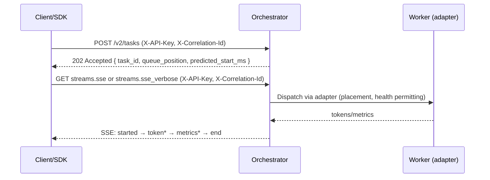

# Client Handbook — Enqueue, Stream, and Human-Narrated Logging
This guide shows how a client (SDK or app) should interact with the orchestrator to:
- Enqueue a task and obtain its ID.
- Stream results via SSE.
- Correlate and collect human‑narrated JSON logs for the same request.
- Execute the “Haiku minute spelled‑out” test.
Contracts referenced are authoritative: `contracts/openapi/data.yaml`. See also `CONSUMER_CAPABILITIES.md`.
## Quickstart Flow
1. **Generate a correlation ID** (UUID). Send it as `X-Correlation-Id` on all requests.
2. **POST /v2/tasks** with a `TaskRequest`. On success you get `202 Accepted` with `AdmissionResponseV2` containing:
   - `task_id`, `queue_position`, `predicted_start_ms`, `backoff_ms`
   - `streams` — direct URLs:
     - `streams.sse` → base SSE
     - `streams.sse_verbose` → SSE with `?verbose=true` (metrics may include `human` narration/diagnostics)
   - `preparation` — optional list of preparatory steps (`engine_provision`, `model_fetch`, `pool_warmup`) that may happen before decode.
3. **Choose a stream**:
   - If `preparation.steps` is non-empty or you need richer UX, use `streams.sse_verbose`.
   - Otherwise, `streams.sse` is sufficient.
4. **Collect logs** emitted by the server and filter them by your correlation ID.

## HTTP Details
- **Auth**: `X-API-Key: valid` (current stub policy) on all requests.
- **Correlation**: `X-Correlation-Id: <uuid>` recommended; the server echoes it in responses and logs.
- **POST /v2/tasks** body (selected):
  - Required: `task_id (uuid)`, `session_id (uuid)`, `workload`, `model_ref`, `engine`, `ctx`, `priority`, `max_tokens`, `deadline_ms`.
  - Optional: `prompt`, `seed`, `determinism`, `sampler_profile_version`, `expected_tokens`, `kv_hint`, `placement`.
- **GET /v2/tasks/{id}/events** returns `text/event-stream` frames in order:
  - `started { queue_position, predicted_start_ms }`
  - `token { t, i }` repeated
  - `metrics { ... }` optional repeated
  - `end { tokens_out, decode_ms }` or `error { code, message, engine }`
- Query parameter `verbose=true` enables optional narration/diagnostics embedded into some `metrics` frames (e.g., `{ "human": "provisioning llama.cpp...", "phase": "engine_provision" }`).
## SDK Responsibilities
- **Headers**: set `X-API-Key` and `X-Correlation-Id` on both POST and GET.
- **SSE Parser**: handle incremental `text/event-stream`. Do not assume one JSON per line; parse `event:`/`data:` pairs.
- **Backpressure & cancel**: handle server backoff (`429` with `Retry-After`, `X-Backoff-Ms`). Support explicit cancel via `POST /v2/tasks/{id}/cancel`.
- **Transcript capture**: store SSE transcript (events + data JSON) for proof/debugging.
- **Narration logs**: collect server JSON logs filtered by correlation ID; bundle them with the SSE transcript.
### Capturing Narration Logs
Orchestrator emits JSON logs including a `human` field (narration), plus structured fields like `actor`, `action`, `target`, and may include `x_correlation_id`.
- Run the server to emit JSON logs (default when metrics feature is on). Example env for rich logs:
  - `RUST_LOG=info` (or `debug`)
- Collect logs from stdout/stderr or a configured sink, and filter by your correlation ID.
- Recommended filter keys: `x_correlation_id` (if present), plus `job_id` (task), `session_id`.
Example shell snippet to view logs correlated to a UUID (adapt to your logger):
```bash
UUID=11111111-1111-4111-8111-111111111111
# If orchestrator prints JSON to stdout
stdbuf -oL your_orchestrator_cmd | jq -c --arg cid "$UUID" 'select(.x_correlation_id == $cid)'
```
Your SDK should:
- Allow injecting a correlation ID.
- Offer a helper to tail/collect logs for that correlation ID (if you launch/manage the server), or accept a provided log stream and filter it.
## Haiku Test (Minute Spelled Out)
Purpose: prove a real decode path (anti-stub) by requiring the model to mention the current minute spelled out in English.
- Compute current minute at stream start on the client side (UTC or local; be consistent):
  - `minute = now().minute` → map to an English word (e.g., 0 → “zero”, 1 → “one”, ..., 59 → “fifty‑nine”).
- Prompt template example (tune to your model):
```
Compose a three-line haiku about time.
Current minute: {{minuteWord}}
```
- SDK steps:
  - Generate `task_id`, `session_id`, `correlation_id`.
  - POST `/v2/tasks` (include the prompt and reasonable `max_tokens`, `deadline_ms`).
- Immediately GET `/v2/tasks/{task_id}/events` and parse events.
  - Accumulate the generated text from `token` events.
  - Validate that the spelled minute word appears once in the final text.
  - Save a  containing:
    - SSE transcript (ordered frames)
    - Collected narration logs filtered by `X-Correlation-Id`
{{ ... }}
Notes:
- The minute value is evaluated by the client; the test goal is to ensure real decoding occurred and the SDK streamed/validated content.
- If your policy requires server-derived time, you can also capture `stream_start_ts` locally and assert the minute matches local start; both approaches are acceptable for this test’s intent.
## Example HTTP Sequence (curl)
```bash
CID=$(uuidgen)
TASK=$(uuidgen)
SESSION=$(uuidgen)
# Enqueue
curl -s -H 'X-API-Key: valid' -H "X-Correlation-Id: $CID" -H 'Content-Type: application/json' \
  -d '{
    "task_id":"'$TASK'",
    "session_id":"'$SESSION'",
    "workload":"completion",
    "model_ref":"hf:Qwen/Qwen2.5-0.5B-Instruct-GGUF/qwen2.5-0.5b-instruct-q4_k_m.gguf",
    "ctx":8192,
    "priority":"interactive",
    "prompt":"Compose a three-line haiku about time. Include the current minute spelled out in English: forty-two.",
    "max_tokens":64,
    "deadline_ms":30000
  }' \
  http://127.0.0.1:8080/v2/tasks | jq .
# Suppose the AdmissionResponse has:
#  {
#    ...,
#    "streams": {
#      "sse": "http://127.0.0.1:8080/v2/tasks/'$TASK'/events",
#      "sse_verbose": "http://127.0.0.1:8080/v2/tasks/'$TASK'/events?verbose=true"
#    },
#    "preparation": { "steps": [{"kind":"engine_provision"},{"kind":"model_fetch"}] }
#  }
# Choose verbose when preparation is present
VERBOSE_URL="http://127.0.0.1:8080/v2/tasks/$TASK/events?verbose=true"
if [ "$(jq -r '.preparation.steps | length' <<< "$RESPONSE)" -gt 0 ]; then
  curl -s -H 'X-API-Key: valid' -H "X-Correlation-Id: $CID" "$VERBOSE_URL"
else
  curl -s -H 'X-API-Key: valid' -H "X-Correlation-Id: $CID" "http://127.0.0.1:8080/v2/tasks/$TASK/events"
fi
- `admission.json`: `AdmissionResponse` and HTTP headers
- `sse_transcript.jsonl`: one line per SSE frame: `{ event, data, ts }`
- `logs.jsonl`: orchestrator narration logs filtered by correlation id
- `verification.json`: checks performed (minute word present, tokens_out, timings)
## Edge Cases & Guidance
- **Backpressure**: If POST returns `429`, obey `Retry-After`/`X-Backoff-Ms` before retrying.
- **Pool unready**: You may see delayed `started` frames while provisioning occurs. Keep the stream open.
- **Cancel**: Provide a cancel function mapping to `POST /v2/tasks/{id}/cancel`; ensure no tokens arrive after cancel.
- **Disconnection**: Reconnect logic is app-specific; SSE is not resumable mid-stream today.
## Refinement Opportunities
- Provide a ready-made SDK helper to spawn orchestrator and return a filtered log stream bound to a correlation ID.
- Add typed SSE client in the SDK with backpressure and heartbeats.
- Standardize the  schema (versioned) and integrate with test harness upload.
- Expose a utility to map minute → English words (i18n later) and validate appears exactly once.
- Add a “verbose” mode that mirrors narration `human` lines as client-side progress callbacks.
