import { Meta } from "@storybook/addon-docs/blocks";

<Meta title="Commercial/Site Architecture" />

# Mesh Site Architecture

_Source: `consumers/.business/ondernemersplan_NL_nl/.002-draft/mesh-site-architecture.md`_

## Purpose
Mesh over tree: audiences as categories; four abstraction layers. By Layer 4, each audience self-routes to its endpoint.

## Categories
- Hobbyists & Developers
- IT Teams
- Agencies & Consultancies
- Compliance-Sensitive Orgs
- Small Businesses
- Funders

## Layers
- Layer 1: Broad & Cooperative
- Layer 2: Semi-Broad (still cross-linked)
- Layer 3: Deep with light cross-refs
- Layer 4: Fully Specialized (unique endpoints)

## Routing Principles
- Self-routing; encourage exploration early, segment deeply late.
- Docs live on docs subdomain; reachable from developer Layer 4.

## Diagram (concept)

```mermaid
flowchart TB
  L0[Front Page] --> L1A[Makers] & L1B[Operators] & L1C[Backers]
  L1A --> L2A[Fast Prototypers]
  L1B --> L2B[Infra Managers]
  L1C --> L2C[ROI Seekers] & L2D[Custom Builders]
  L2A --> DEV_DEEP[OSS / Public Tap]
  L2B --> IT_DEEP[Private Tap]
  L2C --> FUNDING_DEEP[Business Model]
  L2D --> SMB_DEEP[Toolkit Case Studies]
  DEV_DEEP --> DEV_DOCS[Developers · Docs Portal]
  IT_DEEP --> IT_SLA[IT Teams · SLA]
  FUNDING_DEEP --> FUNDERS_FIN[Funders · Financial Model]
  SMB_DEEP --> SMB_PROPOSAL[Small Biz · Toolkit Proposal]
```

