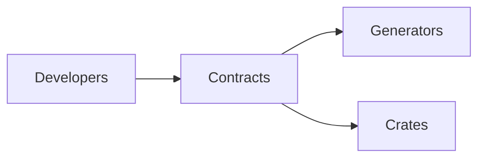

# contracts-config-schema — contracts-config-schema (contracts)

## 1. Name & Purpose

contracts-config-schema (contracts)

## 2. Why it exists (Spec traceability)

- ORCH-3044 — [.specs/00_llama-orch.md](../../.specs/00_llama-orch.md#orch-3044)
- ORCH-3030 — [.specs/00_llama-orch.md](../../.specs/00_llama-orch.md#orch-3030)

## 3. Public API surface

- Rust crate API (internal)

## 4. How it fits

- Houses public contracts and schemas.

## 5. Build & Test

- Workspace fmt/clippy: `cargo fmt --all -- --check` and `cargo clippy --all-targets --all-features
-- -D warnings`
- Tests for this crate: `cargo test -p contracts-config-schema -- --nocapture`
- Regen OpenAPI: `cargo xtask regen-openapi`
- Regen Schema: `cargo xtask regen-schema`
- Extract requirements: `cargo run -p tools-spec-extract --quiet`

## 6. Contracts

- Schema:
  - [contracts/config-schema/src/lib.rs](../../contracts/config-schema/src/lib.rs)

## 7. Config & Env

- Schema-focused crate; no runtime env.

## 8. Metrics & Logs

- Minimal logs.

## 9. Runbook (Dev)

- Regenerate artifacts: `cargo xtask regen-openapi && cargo xtask regen-schema`
- Rebuild docs: `cargo run -p tools-readme-index --quiet`

## 10. Status & Owners

- Status: alpha
- Owners: @llama-orch-maintainers

## 11. Changelog pointers

- None

## 12. Footnotes

- Spec: [.specs/00_llama-orch.md](../../.specs/00_llama-orch.md)
- Requirements: [requirements/00_llama-orch.yaml](../../requirements/00_llama-orch.yaml)

### Additional Details
- How to regenerate types, schemas, and validate; pact files location and scope.

## What this crate is not

- Not runtime logic; contracts only.
