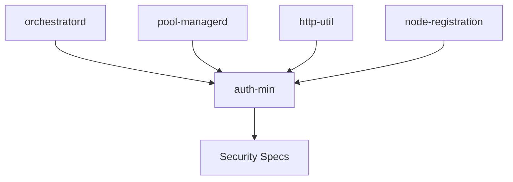

# auth-min — Security-Hardened Authentication Utilities

## 1. Name & Purpose

**auth-min** - Minimal authentication utilities with maximum security

Provides timing-safe token comparison, secure fingerprinting, and robust Bearer token parsing for llama-orch services.

## 2. Why it exists (Spec traceability)

Implements authentication requirements from:
- [.specs/11_min_auth_hooks.md](../../.specs/11_min_auth_hooks.md) (AUTH-1001..AUTH-1008)
- [.specs/12_auth-min-hardening.md](../../.specs/12_auth-min-hardening.md) (SEC-AUTH-*)
- [.specs/00_llama-orch.md](../../.specs/00_llama-orch.md) §2.7 (Security & Policy)

## 3. Public API surface

```rust
// Timing-safe comparison (prevents CWE-208)
pub fn timing_safe_eq(a: &[u8], b: &[u8]) -> bool;

// SHA-256 token fingerprint for logs
pub fn token_fp6(token: &str) -> String;

// Bearer token parser
pub fn parse_bearer(header_val: Option<&str>) -> Option<String>;

// Bind policy enforcement
pub fn enforce_startup_bind_policy(bind_addr: &str) -> Result<()>;
pub fn is_loopback_addr(addr: &str) -> bool;

// Proxy auth trust gate
pub fn trust_proxy_auth() -> bool;

// Error types
pub enum AuthError { ... }
pub type Result<T> = std::result::Result<T, AuthError>;
```

## 4. How it fits

Shared security library used by:
- `orchestratord` - Control plane authentication
- `pool-managerd` - GPU node authentication
- `http-util` - Token redaction in logs
- `node-registration` - Client-side Bearer tokens



## 5. Build & Test

### Standard Tests
```bash
# Format check
cargo fmt --all -- --check

# Clippy
cargo clippy --all-targets --all-features -- -D warnings

# Unit tests
cargo test -p auth-min -- --nocapture

# Specific test suites
cargo test -p auth-min compare  # Timing-safe comparison
cargo test -p auth-min timing   # Timing attack resistance
cargo test -p auth-min leakage  # Token leakage detection
```

### Security Tests
```bash
# Timing attack resistance (must pass)
cargo test -p auth-min test_timing_variance -- --nocapture

# Token leakage detection
cargo test -p auth-min test_fingerprint -- --nocapture
```

## 6. Contracts

Implements security contracts:
- **Timing-safe comparison**: Variance < 10% regardless of mismatch position
- **Non-reversible fingerprints**: SHA-256 based, cannot recover token
- **Robust parsing**: Handles whitespace, validates format
- **Bind policy**: Refuses non-loopback without token

## 7. Config & Env

### Environment Variables

| Variable | Required | Default | Purpose |
|----------|----------|---------|---------|
| `LLORCH_API_TOKEN` | Conditional | None | Authentication token (required for non-loopback) |
| `TRUST_PROXY_AUTH` | No | `false` | Trust proxy-injected auth headers (dangerous!) |

### Usage Examples

```bash
# Generate secure token
export LLORCH_API_TOKEN=$(openssl rand -hex 32)

# Loopback development (no token required)
ORCHD_ADDR=127.0.0.1:8080

# Production (token required)
ORCHD_ADDR=0.0.0.0:8080
LLORCH_API_TOKEN=your-secret-token-here
```

## 8. Metrics & Logs

### Logging Pattern

```rust
use auth_min::{timing_safe_eq, token_fp6, parse_bearer};

// Parse and validate
let token = parse_bearer(auth_header)?;
if !timing_safe_eq(token.as_bytes(), expected.as_bytes()) {
    let fp6 = token_fp6(&token);
    tracing::warn!(identity = %format!("token:{}", fp6), "auth failed");
    return Err(AuthError::InvalidToken);
}

// Success
let fp6 = token_fp6(&token);
tracing::info!(identity = %format!("token:{}", fp6), "authenticated");
```

### Log Safety

- ✅ **SAFE**: `token:a3f2c1` (fingerprint)
- ❌ **UNSAFE**: `token:secret-abc123` (raw token)

## 9. Runbook (Dev)

### Common Tasks

```bash
# Run all tests
cargo test -p auth-min

# Run timing attack tests
cargo test -p auth-min timing -- --nocapture --test-threads=1

# Check for timing vulnerabilities
rg 'token.*==' --type rust | grep -v timing_safe_eq

# Check for token leakage
rg 'tracing.*token(?!_fp6|:)' --type rust
```

### Security Audit

```bash
# 1. Verify all comparisons are timing-safe
rg '== .*token|token.*==' libs/auth-min/src/ | grep -v timing_safe_eq
# Should be EMPTY

# 2. Verify fingerprints used for logging
rg 'token_fp6' libs/auth-min/src/
# Should show usage in all auth code

# 3. Run security test suite
cargo test -p auth-min --test timing
cargo test -p auth-min --test leakage
```

## 10. Status & Owners

- **Status**: Production-ready (security-hardened)
- **Owners**: @llama-orch-maintainers (security team approval required)
- **Security Review**: Required for all changes

## 11. Changelog pointers

- 2025-09-30: Full implementation with modular structure
  - Separated concerns: compare, fingerprint, parse, policy, error
  - Comprehensive test coverage (timing, leakage)
  - Documentation with security properties

## 12. Footnotes

### Specifications
- [.specs/11_min_auth_hooks.md](../../.specs/11_min_auth_hooks.md) - Minimal auth hooks
- [.specs/12_auth-min-hardening.md](../../.specs/12_auth-min-hardening.md) - Security hardening
- [.specs/00_llama-orch.md](../../.specs/00_llama-orch.md) §2.7 - Security & policy

### Security References
- CWE-208: Observable Timing Discrepancy
- RFC 6750: OAuth 2.0 Bearer Token Usage
- OWASP Testing Guide: Timing Attack Testing

## Security Properties

### Timing-Safe Comparison

**Property**: Execution time independent of mismatch position

**Test**: Variance < 10% for early vs. late mismatches

**Implementation**: Bitwise OR accumulation examines all bytes

### Token Fingerprinting

**Property**: Non-reversible, collision-resistant

**Algorithm**: SHA-256 → first 6 hex chars (24-bit space)

**Use Case**: Safe for audit logs, correlation, debugging

### Bind Policy

**Property**: Refuses non-loopback bind without token

**Enforcement**: Startup validation (fail-fast)

**Override**: Not allowed (security by design)

## What this crate is not

- ❌ Not a full authentication framework (no users, roles, sessions)
- ❌ Not OAuth2/OIDC/SSO (minimal shared-secret only)
- ❌ Not mTLS (future: v0.3.0)
- ❌ Not rate limiting (handled at admission layer)
