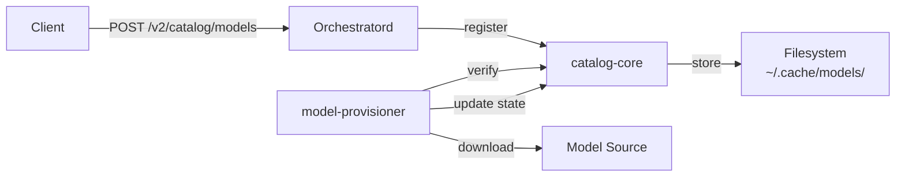

# catalog-core

**Model catalog library for registration, verification, and lifecycle management**

`libs/catalog-core` — Model registry with SHA-256 verification, lifecycle states, and filesystem storage.

---

## What This Library Does

catalog-core provides **model catalog management** for llama-orch:

- **Model registration** — Register models with metadata (name, source, digest)
- **Integrity verification** — SHA-256 checksum verification
- **Lifecycle states** — Pending, Active, Retired, Failed
- **Filesystem storage** — Models stored in `~/.cache/llama-orch/models/` (configurable)
- **Query API** — Find models by ID, name, or state
- **Atomic operations** — Thread-safe catalog updates

**Used by**: `orchestratord` (catalog HTTP API) and `model-provisioner` (download/verify)

---

## Key Types

### Catalog

```rust
use catalog_core::Catalog;

// Create catalog with default storage
let catalog = Catalog::new("/var/lib/llama-orch/models")?;

// Register a model
let entry = catalog.register(
    "llama-3.1-8b-instruct",
    "https://huggingface.co/meta-llama/Llama-3.1-8B-Instruct",
    Some("abc123def456..."),
)?;

// Query models
let model = catalog.get("llama-3.1-8b-instruct")?;
let active_models = catalog.list_by_state(LifecycleState::Active)?;
```

### ModelEntry

```rust
pub struct ModelEntry {
    pub id: String,
    pub name: String,
    pub source: String,
    pub digest: Option<String>,
    pub state: LifecycleState,
    pub registered_at: DateTime<Utc>,
    pub verified_at: Option<DateTime<Utc>>,
}
```

### LifecycleState

```rust
pub enum LifecycleState {
    Pending,    // Registered but not verified
    Active,     // Verified and available
    Retired,    // Deprecated, no longer used
    Failed,     // Verification failed
}
```

---

## Architecture



### Responsibilities

- **Registration**: Add models to catalog with metadata
- **Verification**: Compute and verify SHA-256 digests
- **Lifecycle**: Manage model states (pending → active → retired)
- **Storage**: Persist catalog to filesystem
- **Query**: Find models by various criteria

### Does NOT

- Download models (that's `model-provisioner`)
- Serve HTTP API (that's `orchestratord`)
- Manage GPU resources (that's `pool-managerd`)

---

## Usage Example

```rust
use catalog_core::{Catalog, LifecycleState};

// Create catalog
let catalog = Catalog::new("/var/lib/llama-orch/models")?;

// Register a model
let entry = catalog.register(
    "llama-3.1-8b-instruct",
    "https://huggingface.co/meta-llama/Llama-3.1-8B-Instruct",
    None, // digest computed during verification
)?;

println!("Registered: {} (state: {:?})", entry.id, entry.state);

// Verify model (after download)
let path = catalog.model_path(&entry.id);
catalog.verify(&entry.id, &path)?;

// Update lifecycle state
catalog.set_state(&entry.id, LifecycleState::Active)?;

// Query models
let active = catalog.list_by_state(LifecycleState::Active)?;
println!("Active models: {}", active.len());

// Get specific model
if let Some(model) = catalog.get("llama-3.1-8b-instruct")? {
    println!("Model: {} (digest: {:?})", model.name, model.digest);
}
```

---

## Verification

### SHA-256 Digest

Models are verified using SHA-256 checksums:

```rust
use catalog_core::verify_digest;

let path = "/var/lib/llama-orch/models/llama-3.1-8b-instruct.gguf";
let expected = "abc123def456...";

match verify_digest(path, expected) {
    Ok(()) => println!("Verification passed"),
    Err(e) => eprintln!("Verification failed: {}", e),
}
```

### Verification Flow

1. Model registered with `state: Pending`
2. `model-provisioner` downloads model
3. Provisioner calls `catalog.verify(id, path)`
4. Catalog computes SHA-256 digest
5. If matches expected: `state → Active`
6. If mismatch: `state → Failed`

---

## Storage

### Filesystem Layout

```
~/.cache/llama-orch/models/
├── catalog.json              # Catalog metadata
├── llama-3.1-8b-instruct.gguf
├── llama-3.1-70b-instruct.gguf
└── mistral-7b-instruct.gguf
```

### Catalog Format

```json
{
  "models": [
    {
      "id": "llama-3.1-8b-instruct",
      "name": "Llama 3.1 8B Instruct",
      "source": "https://huggingface.co/...",
      "digest": "abc123def456...",
      "state": "Active",
      "registered_at": "2025-10-01T00:00:00Z",
      "verified_at": "2025-10-01T00:05:00Z"
    }
  ]
}
```

---

## Testing

### Unit Tests

```bash
# Run all tests
cargo test -p catalog-core -- --nocapture

# Run specific test
cargo test -p catalog-core -- test_register_model --nocapture
```

### BDD Tests

```bash
# Run BDD scenarios
cargo test -p catalog-core-bdd -- --nocapture
```

---

## Dependencies

### Internal

- None (foundational library)

### External

- `serde` — Serialization for catalog storage
- `serde_json` — JSON format for catalog
- `sha2` — SHA-256 digest computation
- `chrono` — Timestamps
- `thiserror` — Error types
- `tokio` — Async file I/O

---

## Metrics

Catalog metrics (exposed by orchestratord):

- `catalog_models_total{state}` — Total models by state
- `catalog_verification_total{outcome}` — Verification attempts (success/failure)
- `catalog_operations_total{operation}` — Register, verify, update operations

---

## Specifications

Implements requirements from:
- ORCH-3004, ORCH-3005, ORCH-3008, ORCH-3010, ORCH-3011
- ORCH-3016, ORCH-3017, ORCH-3027, ORCH-3028
- ORCH-3044, ORCH-3045

See `.specs/00_llama-orch.md` for full requirements.

---

## Status

- **Version**: 0.0.0 (early development)
- **License**: GPL-3.0-or-later
- **Stability**: Alpha
- **Maintainers**: @llama-orch-maintainers
