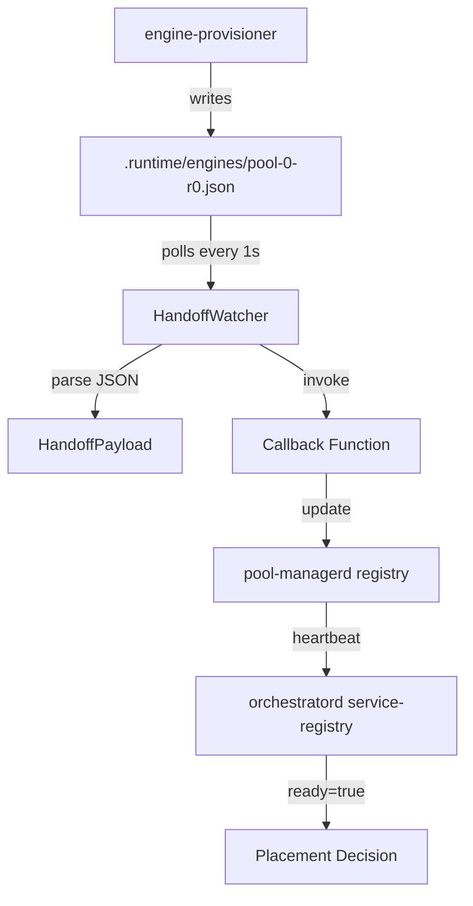

# handoff-watcher

**Watches for handoff files written by engine-provisioner on GPU nodes**

`libs/gpu-node/handoff-watcher` — Polls `.runtime/engines/*.json` for engine readiness and invokes callbacks.

---

## What This Library Does

handoff-watcher provides **handoff file detection** for llama-orch:

- **Filesystem polling** — Watch `.runtime/engines/*.json` for new files
- **Handoff parsing** — Parse JSON handoff files with pool metadata
- **Callback invocation** — Notify when engines are ready
- **Auto-cleanup** — Optionally delete processed handoff files
- **Background task** — Runs as async task in pool-managerd

**Used by**: `pool-managerd` to detect when engines are ready

---

## Key Types

### HandoffWatcher

```rust
use handoff_watcher::{HandoffWatcher, HandoffWatcherConfig};

// Configure watcher
let config = HandoffWatcherConfig {
    runtime_dir: PathBuf::from(".runtime/engines"),
    poll_interval_ms: 1000,
    auto_delete: true,
};

// Create callback
let callback = Box::new(|payload: HandoffPayload| {
    println!("Engine ready: {}", payload.pool_id);
    Ok(())
});

// Spawn watcher task
let watcher = HandoffWatcher::new(config, callback);
let handle = watcher.spawn();
```

### HandoffPayload

```rust
pub struct HandoffPayload {
    pub pool_id: String,
    pub replica_id: String,
    pub url: String,
    pub gpu_device: usize,
    pub slots: usize,
    pub ready: bool,
}
```

### HandoffWatcherConfig

```rust
pub struct HandoffWatcherConfig {
    pub runtime_dir: PathBuf,
    pub poll_interval_ms: u64,
    pub auto_delete: bool,
}
```

---

## Architecture



### Responsibilities

- **Poll**: Check `.runtime/engines/` directory every 1s
- **Parse**: Read and parse JSON handoff files
- **Notify**: Invoke callback with HandoffPayload
- **Cleanup**: Optionally delete processed files

---

## Usage Example

```rust
use handoff_watcher::{HandoffWatcher, HandoffWatcherConfig, HandoffPayload};
use std::path::PathBuf;

#[tokio::main]
async fn main() -> Result<()> {
    // Create callback that updates pool registry
    let callback = Box::new(|payload: HandoffPayload| {
        println!("Engine ready:");
        println!("  pool_id: {}", payload.pool_id);
        println!("  replica_id: {}", payload.replica_id);
        println!("  url: {}", payload.url);
        println!("  slots: {}", payload.slots);
        
        // Update local pool registry
        // pool_registry.mark_ready(&payload.pool_id)?;
        
        Ok(())
    });
    
    // Configure watcher
    let config = HandoffWatcherConfig {
        runtime_dir: PathBuf::from(".runtime/engines"),
        poll_interval_ms: 1000,
        auto_delete: true,
    };
    
    // Spawn watcher task
    let watcher = HandoffWatcher::new(config, callback);
    let handle = watcher.spawn();
    
    // Watcher runs in background
    // Wait for shutdown signal
    tokio::signal::ctrl_c().await?;
    
    Ok(())
}
```

---

## Handoff File Format

### Example Handoff File

`.runtime/engines/pool-0-r0.json`:

```json
{
  "pool_id": "pool-0",
  "replica_id": "r0",
  "url": "http://localhost:8081",
  "gpu_device": 0,
  "slots": 4,
  "ready": true
}
```

### Detection Flow

1. `engine-provisioner` starts engine process
2. Engine becomes ready (health check passes)
3. Provisioner writes handoff file to `.runtime/engines/`
4. `HandoffWatcher` detects new file (within 1s)
5. Watcher parses JSON
6. Callback invoked with `HandoffPayload`
7. `pool-managerd` updates local registry
8. Next heartbeat to orchestratord includes `ready=true`

---

## Why GPU Node?

In multi-node deployments, handoff detection must happen on the **GPU node** (same filesystem as engine-provisioner).

### Single-Machine Deployment

- orchestratord and pool-managerd on same machine
- Both can access `.runtime/engines/` directly
- Either can watch handoff files

### Multi-Node Deployment

- orchestratord on control node (no GPU)
- pool-managerd on GPU nodes
- orchestratord **cannot** access GPU node filesystem
- **Solution**: pool-managerd watches locally, reports via HTTP

---

## Testing

### Unit Tests

```bash
# Run all tests
cargo test -p handoff-watcher -- --nocapture

# Run specific test
cargo test -p handoff-watcher -- test_handoff_detection --nocapture
```

---

## Dependencies

### Internal

- `pool-registry-types` — Shared types for handoff payload

### External

- `tokio` — Async runtime, background tasks
- `serde` — JSON parsing
- `serde_json` — JSON format
- `notify` — Filesystem watching (optional)
- `thiserror` — Error types

---

## Specifications

Implements requirements from:
- CLOUD-3001 (pool-managerd owns handoff watcher)
- CLOUD-3010 (Watch `.runtime/engines/*.json`)
- CLOUD-3011 (Update local registry + heartbeat)
- CLOUD-3013 (Process within 2 seconds)

See `.specs/01_cloud_profile.md` for full requirements.

---

## Status

- **Version**: 0.0.0 (early development)
- **License**: GPL-3.0-or-later
- **Stability**: Alpha
- **Maintainers**: @llama-orch-maintainers
