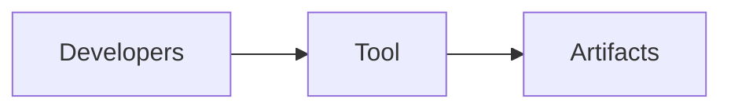

# observability-narration-core — observability-narration-core (tool)

## 1. Name & Purpose

observability-narration-core (tool)

## 2. Why it exists (Spec traceability)

- See spec and requirements for details.
  - [.specs/00_llama-orch.md](../../../.specs/00_llama-orch.md)
  - [requirements/00_llama-orch.yaml](../../../requirements/00_llama-orch.yaml)

## 3. Public API surface

- Rust crate API (internal)

## 4. How it fits

- Developer tooling supporting contracts and docs.

## 5. Build & Test

- Workspace fmt/clippy: `cargo fmt --all -- --check` and `cargo clippy --all-targets --all-features
-- -D warnings`
- Tests for this crate: `cargo test -p observability-narration-core -- --nocapture`

## 6. Contracts

- None

## 7. Config & Env

- Not applicable.

## 8. Metrics & Logs

- Emits structured narration events via tracing
- All events include: actor, action, target, human (plain English)
- Optional fields: correlation_id, session_id, pool_id, replica_id, etc.
- Automatic secret redaction (bearer tokens, API keys)

## 9. Runbook (Dev)

- Run tests: `cargo test -p observability-narration-core -- --nocapture`
- Regenerate artifacts: `cargo xtask regen-openapi && cargo xtask regen-schema`
- Rebuild docs: `cargo run -p tools-readme-index --quiet`

## High/Mid/Low Behavior

### High (Production, CI)
- **Structured JSON logs**: All narration emitted as JSON with full field taxonomy
- **Automatic redaction**: Bearer tokens, API keys, secrets masked with `[REDACTED]`
- **Correlation ID propagation**: Track requests across orchestratord → pool-managerd → provisioners
- **Zero allocation on hot paths**: Uses tracing's zero-cost abstractions
- **Test capture disabled**: No overhead from capture adapter in production

### Mid (Development, Local)
- **Pretty console logs**: Optional human-readable format via `RUST_LOG`
- **Capture adapter available**: Enable in tests with `CaptureAdapter::install()`
- **Assertion helpers**: `assert_includes()`, `assert_field()`, `assert_correlation_id_present()`
- **Story snapshots**: Generate golden files showing complete flows (future)

### Low (Debugging, Troubleshooting)
- **Grep by correlation_id**: `grep "correlation_id=req-xyz" logs/*.log`
- **Filter by actor**: `grep "actor=pool-managerd" logs/*.log`
- **Read the story**: `grep "human=" logs/*.log | jq -r '.human'`
- **Trace multi-service flows**: Follow correlation_id across service boundaries
- **Assert in BDD**: Use capture adapter to verify observability coverage

## 10. Status & Owners

- Status: alpha
- Owners: @llama-orch-maintainers

## 11. Changelog pointers

- None
## 12. Footnotes

- Spec: [.specs/00_llama-orch.md](../../../.specs/00_llama-orch.md)
- Requirements: [requirements/00_llama-orch.yaml](../../../requirements/00_llama-orch.yaml)

## Policy note

- VRAM-only residency during inference (weights/KV/activations). No RAM↔VRAM sharing, UMA/zero-copy, or host-RAM offload; tasks that do not fit fail fast with `POOL_UNAVAILABLE`. See `/.specs/proposals/GPU_ONLY.md` and `/.specs/00_llama-orch.md §2.13`.

## What this crate is not

- Not a production service.
