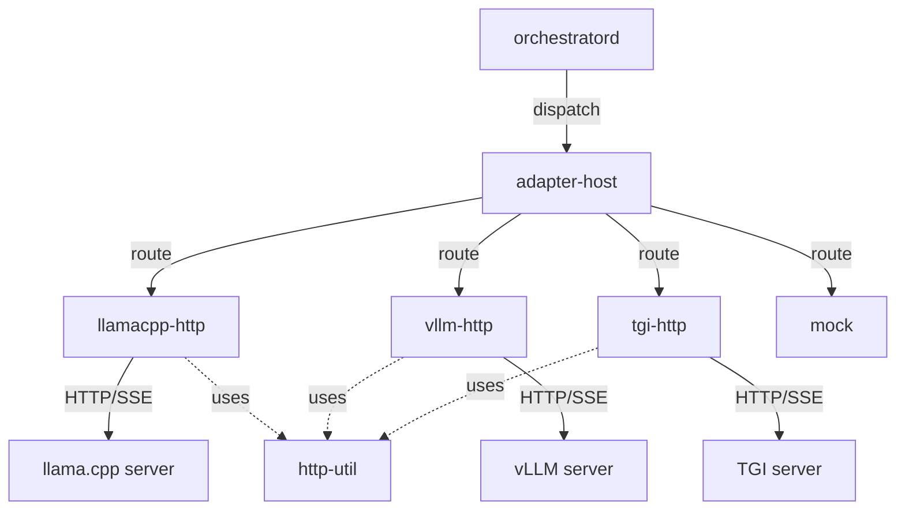

# worker-adapters

**Engine adapters implementing the WorkerAdapter trait**

`libs/worker-adapters/` — Adapters that bridge orchestrator requests to engine-native APIs (llama.cpp, vLLM, TGI, Triton, OpenAI, etc.).

---

## What This Directory Contains

Worker adapters provide **engine-specific implementations** for llama-orch:

- **adapter-api** — Shared `WorkerAdapter` trait and types
- **http-util** — Shared HTTP client utilities (timeouts, retries, streaming)
- **llamacpp-http** — llama.cpp HTTP server adapter
- **vllm-http** — vLLM HTTP server adapter
- **tgi-http** — Text Generation Inference adapter
- **triton** — NVIDIA Triton adapter
- **openai-http** — OpenAI-compatible HTTP adapter
- **mock** — Mock adapter for testing

---

## WorkerAdapter Trait

All adapters implement a common trait:

```rust
#[async_trait]
pub trait WorkerAdapter: Send + Sync {
    /// Health check
    async fn health(&self) -> Result<HealthStatus>;
    
    /// Get engine properties
    async fn props(&self) -> Result<EngineProps>;
    
    /// Submit task and stream tokens
    async fn submit(&self, task: TaskRequest) -> Result<TokenStream>;
    
    /// Cancel running task
    async fn cancel(&self, job_id: &str) -> Result<()>;
    
    /// Get engine version
    async fn engine_version(&self) -> Result<String>;
}
```

---

## Available Adapters

### Production Adapters

- **llamacpp-http** — llama.cpp HTTP server
  - Endpoint: `http://localhost:8081`
  - Streaming: SSE
  - Features: KV cache, slots, deterministic sampling

- **vllm-http** — vLLM HTTP server
  - Endpoint: `http://localhost:8000`
  - Streaming: SSE
  - Features: Continuous batching, PagedAttention

- **tgi-http** — Text Generation Inference
  - Endpoint: `http://localhost:3000`
  - Streaming: SSE
  - Features: Flash Attention, tensor parallelism

- **triton** — NVIDIA Triton Inference Server
  - Endpoint: `http://localhost:8000`
  - Protocol: gRPC
  - Features: Multi-model, dynamic batching

- **openai-http** — OpenAI-compatible HTTP
  - Endpoint: Configurable
  - Streaming: SSE
  - Features: Compatible with OpenAI API format

### Development Adapters

- **mock** — Mock adapter for testing
  - No real engine required
  - Configurable responses
  - Deterministic behavior

---

## Shared HTTP Utilities

The `http-util` crate provides shared functionality:

- **HTTP/2 client** — Keep-alive, connection pooling
- **Timeouts** — Per-request timeout enforcement
- **Retries** — Capped + jittered retries for idempotent operations
- **Streaming** — SSE decode helpers
- **Header redaction** — Sensitive headers (Authorization) redacted in logs
- **Error mapping** — Engine errors → WorkerError taxonomy

---

## Architecture



---

## Token Streaming

All adapters preserve the streaming order:

1. **started** — Job started, includes engine_version
2. **token** — Token generated (text, index)
3. **token** — More tokens...
4. **end** — Job complete, includes metrics

Example token frame:

```json
{"type": "token", "text": "hello", "index": 0}
```

---

## Error Handling

Adapters map engine-specific errors to `WorkerError`:

```rust
pub enum WorkerError {
    Timeout,
    EngineUnavailable,
    InvalidRequest,
    CapacityExceeded,
    Unknown(String),
}
```

---

## Testing

### Per-Adapter Tests

```bash
# Test specific adapter
cargo test -p worker-adapters-llamacpp-http -- --nocapture
cargo test -p worker-adapters-vllm-http -- --nocapture
cargo test -p worker-adapters-mock -- --nocapture
```

### Integration Tests

```bash
# Test adapter integration
cargo test -p orchestratord --test adapter_integration -- --nocapture
```

---

## Adding a New Adapter

1. Create new crate: `libs/worker-adapters/my-adapter/`
2. Implement `WorkerAdapter` trait
3. Use `http-util` for HTTP operations
4. Add unit tests
5. Register in `adapter-host`

Example:

```rust
use worker_adapters_adapter_api::WorkerAdapter;
use async_trait::async_trait;

pub struct MyAdapter {
    endpoint: String,
}

#[async_trait]
impl WorkerAdapter for MyAdapter {
    async fn health(&self) -> Result<HealthStatus> {
        // Implementation
    }
    
    async fn submit(&self, task: TaskRequest) -> Result<TokenStream> {
        // Implementation
    }
    
    // ... other methods
}
```

---

## Dependencies

### Shared

- `adapter-api` — Trait definition
- `http-util` — HTTP utilities

### Per-Adapter

- `reqwest` — HTTP client
- `tokio` — Async runtime
- `serde` — Serialization
- `async-trait` — Async trait support

---

## GPU Policy

**VRAM-only residency**: Weights, KV cache, and activations must fit in GPU VRAM. No RAM↔VRAM sharing, UMA/zero-copy, or host-RAM offload. Tasks that don't fit fail fast with `POOL_UNAVAILABLE`.

---

## Status

- **Version**: 0.0.0 (early development)
- **License**: GPL-3.0-or-later
- **Stability**: Alpha
- **Maintainers**: @llama-orch-maintainers
