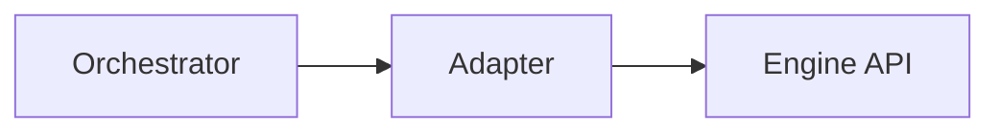

# worker-adapters-llamacpp-http — worker-adapters-llamacpp-http (adapter)

## 1. Name & Purpose

worker-adapters-llamacpp-http (adapter)

## 2. Why it exists (Spec traceability)

- ORCH-3054 — [.specs/00_llama-orch.md](../../../.specs/00_llama-orch.md#orch-3054)
- ORCH-3055 — [.specs/00_llama-orch.md](../../../.specs/00_llama-orch.md#orch-3055)
- ORCH-3056 — [.specs/00_llama-orch.md](../../../.specs/00_llama-orch.md#orch-3056)
- ORCH-3057 — [.specs/00_llama-orch.md](../../../.specs/00_llama-orch.md#orch-3057)
- ORCH-3058 — [.specs/00_llama-orch.md](../../../.specs/00_llama-orch.md#orch-3058)

## 3. Public API surface

- Rust crate API (internal)

### High / Mid / Low behaviors

- **High**
  - Map orchestrator requests to llama.cpp native HTTP endpoints. Stream tokens over SSE preserving order `started → token* → end` (optional `metrics`).
  - Use shared HTTP client defaults (timeouts, TLS verify ON) and redact secrets in logs.
  - Determinism-friendly defaults (temperature 0, top_p 1.0; pass `seed` when set).

- **Mid**
  - `submit(req)` POSTs `{base}/completion` with `stream=true` and decodes SSE via `worker-adapters-http-util::stream_decode()`.
  - `health()`/`props()` MVP stubs return Ready with unknown slots; wire real `/health` and `/props` in follow-ups.
  - Error mapping: non-success upstream status → `WorkerError::Adapter(redacted_message)`; 429/5xx treated as retriable at policy layer.
  - Construct with `LlamaCppHttpAdapter::new(base_url)`; do not read env inside adapter.

- **Low**
  - For MVP, we buffer the SSE body then emit `TokenEvent`s in order. Future: incremental decoding with backpressure.
  - Token indices are asserted monotonic (`i` strictly increasing). Non-monotonic indices are logged at `warn`.

## 4. How it fits

- Maps engine-native APIs to the orchestrator worker contract.

## 5. Build & Test

- Workspace fmt/clippy: `cargo fmt --all -- --check` and `cargo clippy --all-targets --all-features
-- -D warnings`
- Tests for this crate: `cargo test -p worker-adapters-llamacpp-http -- --nocapture`

## 6. Contracts

- None

## 7. Config & Env

- Construct with `base_url` only. Credentials, if any, are injected at the request layer using `http-util::with_bearer(rb, token)`.
- Orchestrator (optional) runtime binding via feature flag + env (see below).

### Orchestrator binding (optional)
- Cargo feature: `orchestratord:llamacpp-adapter` (disabled by default).
- Env at startup when feature is enabled:
  - `ORCHD_LLAMACPP_URL` (required) — base URL to bind.
  - `ORCHD_LLAMACPP_POOL` (default: `default`).
  - `ORCHD_LLAMACPP_REPLICA` (default: `r0`).
- Binding goes through `AdapterHost.bind(pool, replica, adapter)`; dispatch uses `AdapterHost.submit(pool, req)`.

## 8. Metrics & Logs

- Emits adapter health and request metrics per engine.

Notes:
- Secrets (e.g., Authorization) are redacted in error messages using `http-util::redact_secrets()`.
- Add Prometheus `/metrics` scrape mapping in a future iteration (MVP optional).

## 9. Runbook (Dev)

- Regenerate artifacts: `cargo xtask regen-openapi && cargo xtask regen-schema`
- Rebuild docs: `cargo run -p tools-readme-index --quiet`

## 10. Status & Owners

- Status: alpha
- Owners: @llama-orch-maintainers

## 11. Changelog pointers

- None

## 12. Footnotes

- Spec: [.specs/00_llama-orch.md](../../../.specs/00_llama-orch.md)
- Requirements: [requirements/00_llama-orch.yaml](../../../requirements/00_llama-orch.yaml)

## Policy note

- VRAM-only residency during inference (weights/KV/activations). No RAM↔VRAM sharing, UMA/zero-copy, or host-RAM offload; tasks that do not fit fail fast with `POOL_UNAVAILABLE`. See `/.specs/proposals/GPU_ONLY.md` and `/.specs/00_llama-orch.md §2.13`.

### Additional Details
- Engine endpoint mapping tables (native/OpenAI-compat to adapter calls), determinism knobs,
version capture.

### Determinism notes
- Prefer greedy decoding (`temperature=0`, `top_p=1.0`).
- Forward `seed` from request when provided. Replica sets should pin identical binaries and sampler profiles.

### Testing
- Unit/integration tests: `cargo test -p worker-adapters-llamacpp-http -- --nocapture`.
- Integration test uses a stub Axum server emitting SSE `started/token/end` to verify ordering and indices.

## What this crate is not

- Not a public API; do not expose engine endpoints directly.
