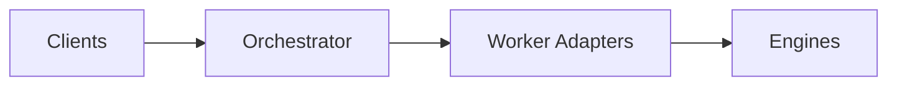
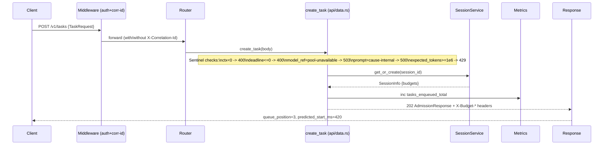
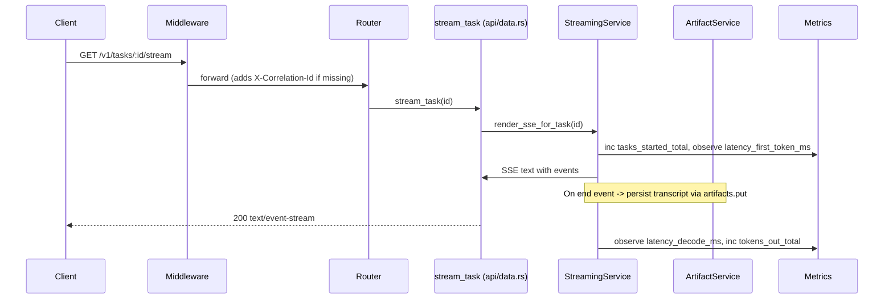
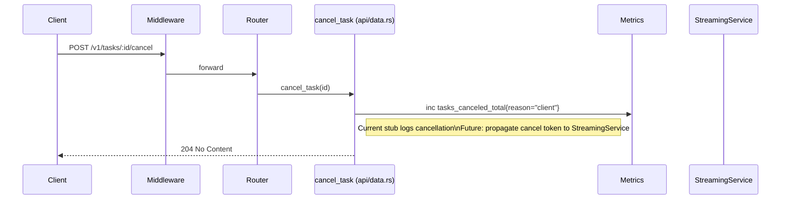
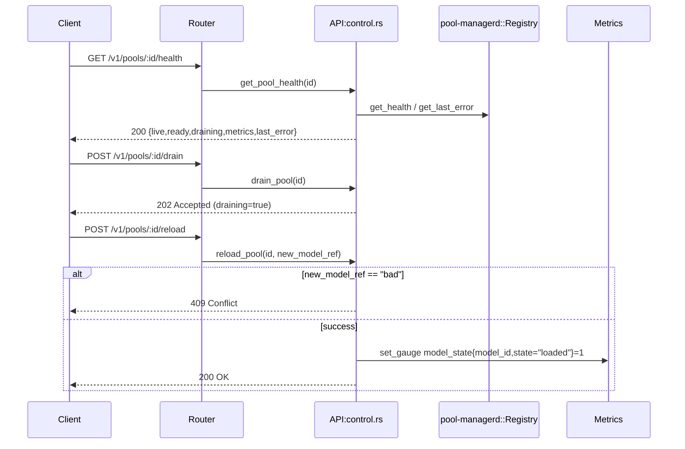
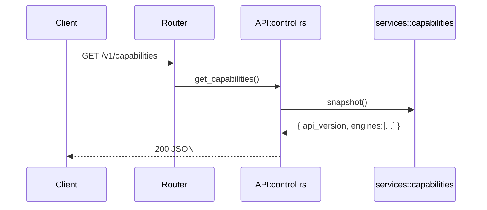
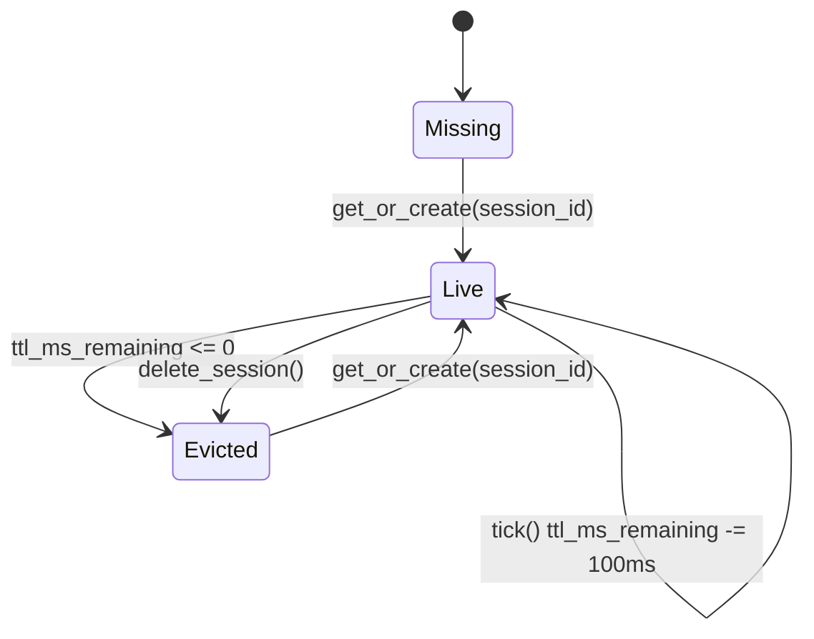
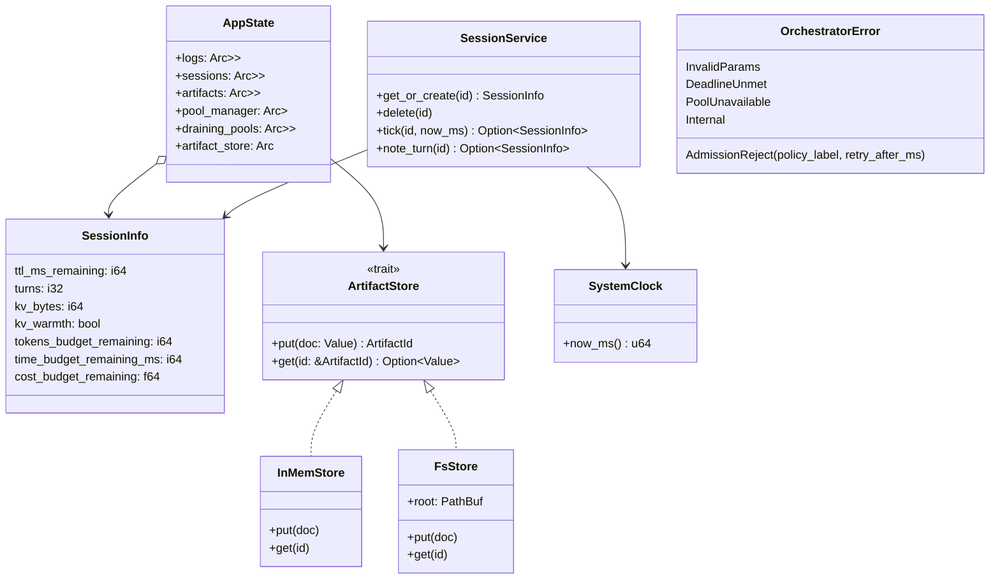

# orchestratord — orchestratord (core)

## 1. Name & Purpose

`orchestratord` is the HTTP control and data‑plane daemon of llama‑orch. It accepts tasks, streams tokens via SSE, manages short‑lived sessions and budgets, exposes capability discovery, and provides a small control surface for pools (drain/reload/health). The crate aims for deterministic behavior by default and strong observability for multi‑agent developer workflows on a single host.

## 2. Why it exists (Spec traceability)

Traceability follows the leading workspace specs. This crate primarily implements:

- Core orchestrator spec: [.specs/00_llama-orch.md](../.specs/00_llama-orch.md)
  - Admission & backpressure: ORCH-3004, ORCH-3005, ORCH-2007
  - Placement & scheduling (single‑host): ORCH-3010, ORCH-3011, ORCH-3012
  - Sessions & budgets: ORCH-3021, ORCH-3022, ORCH-3023, ORCH-3099
  - Streaming & determinism (SSE): ORCH-2002, ORCH-3026, ORCH-3029, ORCH-3045, ORCH-3046
  - Observability (logs/metrics/SSE metrics frame): ORCH-3027, ORCH-3028, ORCH-3100
  - Capability discovery: ORCH-3095, ORCH-3096
  - Resilience & recovery: ORCH-3038, ORCH-3039, ORCH-3040
- Home profile overlay (single‑host constraints): [.specs/00_home_profile.md](../.specs/00_home_profile.md)
  - CLI integration and SSE metrics framing: HME-020, HME-021, HME-022
  - Developer experience and validation gates: HME-030..HME-042

Crate‑specific design and acceptance criteria are captured under:

- [orchestratord/.specs/00_orchestratord.md](./.specs/00_orchestratord.md)
- [orchestratord/.specs/10_orchestratord_v2_architecture.md](./.specs/10_orchestratord_v2_architecture.md)


## 3. Public API surface

- OpenAPI: [contracts/openapi/control.yaml](../contracts/openapi/control.yaml)
- OpenAPI: [contracts/openapi/data.yaml](../contracts/openapi/data.yaml)

HTTP endpoints implemented by this crate (see OpenAPI for authoritative shapes):

- Data plane
  - `POST /v1/tasks` — enqueue; returns 202 with `queue_position`, `predicted_start_ms` and budget headers
  - `GET  /v1/tasks/:id/stream` — SSE: `started`, repeated `token`, optional repeated `metrics`, `end`, `error`
  - `POST /v1/tasks/:id/cancel` — race‑free cancel; no tokens after cancel
  - Sessions: `GET /v1/sessions/:id`, `DELETE /v1/sessions/:id`
- Artifacts
  - `POST /v1/artifacts` (201), `GET /v1/artifacts/:id` (200/404)
- Capability discovery
  - `GET /v1/capabilities` — single source of truth for engine snapshot and `api_version`
  - Note: `/v1/replicasets` is intentionally not served pre‑1.0
- Control plane
  - `POST /v1/pools/:id/drain`, `POST /v1/pools/:id/reload`, `GET /v1/pools/:id/health`
- Observability
  - `GET /metrics` — Prometheus text format; always includes `X-Correlation-Id`


## 4. How it fits

- Part of the core orchestrator. Upstream: adapters, Downstream: workers.



### Architecture at a glance

- API layer (Axum handlers) maps requests to services:
  - `api::{data, control, artifacts, catalog, observability}`
- Services orchestrate domain behavior:
  - `services::{admission, streaming, session, artifacts, capabilities, control}`
- Ports define seams to external systems:
  - `ports::{adapters, pool, clock, storage}`
- Infra provides in‑memory and HTTP/NVML implementations where applicable.

See: [v2 architecture proposal](./.specs/10_orchestratord_v2_architecture.md) for full module layout.

#### Detailed behavior (High / Mid / Low)

- High-level
  - HTTP daemon built with Axum serving control and data planes. Entry points: `src/main.rs` and `src/app/bootstrap.rs` start the server and init logging (JSON via `tracing_subscriber`).
  - Core endpoints wired in `src/app/router.rs` with layers: correlation-id then API-key auth from `src/app/middleware.rs`.
  - Exposes: tasks enqueue/stream/cancel, sessions get/delete, artifacts put/get, capabilities snapshot, pool drain/reload/health, and `/metrics`.
  - Determinism-friendly SSE path: `src/services/streaming.rs` emits `started` → `token` → optional `metrics` → `end` and persists a transcript artifact.

- Mid-level (components and responsibilities)
  - App state: `src/state.rs` defines `AppState` holding `logs`, `sessions`, `artifacts`, `pool_manager` registry from `pool_managerd`, `draining_pools`, and an `artifact_store` (defaults to in-memory store).
  - API layer: `src/api/`
    - `data.rs` — `POST /v1/tasks`, `GET /v1/tasks/:id/stream`, `POST /v1/tasks/:id/cancel`, sessions `GET/DELETE /v1/sessions/:id`.
    - `control.rs` — `GET /v1/pools/:id/health`, `POST /v1/pools/:id/drain`, `POST /v1/pools/:id/reload`, `GET /v1/capabilities`.
    - `artifacts.rs` — `POST /v1/artifacts`, `GET /v1/artifacts/:id`.
    - `observability.rs` — `/metrics` Prometheus v0.0.4 text.
  - Services: `src/services/`
    - `session.rs` — TTL/turns/budget bookkeeping; `get_or_create`, `delete`, `tick`, `note_turn`.
    - `streaming.rs` — orchestrates SSE events and records metrics; persists transcript via `services::artifacts`.
    - `artifacts.rs` — uses configured `ArtifactStore` to `put/get`, mirroring an in-memory map for tests.
    - `capabilities.rs` — returns an `api_version` + engines snapshot for `/v1/capabilities`.
    - `control.rs` — placeholder for richer control-plane logic (drain/reload/health orchestration).
  - Ports (abstractions): `src/ports/`
    - `adapters.rs` — `AdapterRegistry`/`AdapterClient` interfaces and stream items for engine adapters.
    - `pool.rs` — `PoolRegistry` trait for pool lifecycle and health; `ReloadOutcome`.
    - `storage.rs` — `ArtifactStore` trait.
    - `clock.rs` — `Clock` trait used by session service.
  - Infra (implementations): `src/infra/`
    - Storage: `storage/inmem.rs` (SHA-256 IDs, in-memory) and `storage/fs.rs` (filesystem, root from `ORCH_ARTIFACTS_FS_ROOT`, defaults to `/tmp/llorch-artifacts`).
    - Clock: `clock.rs` provides `SystemClock` implementation.
    - Metrics: `infra/metrics.rs` re-exports crate-local helpers.
  - Domain: `src/domain/`
    - `error.rs` — `OrchestratorError` → HTTP mapping with `contracts_api_types::ErrorEnvelope` and backpressure headers.
    - `sse.rs` — typed `SseEvent` enum.
    - `ids.rs` — `TaskId`, `SessionId`, `ArtifactId` newtypes.
  - Admission & queue metrics: `src/admission.rs` wraps `orchestrator_core::queue::InMemoryQueue` in `QueueWithMetrics` to apply policies (`Reject`, `DropLru`) and emit metrics (`queue_depth`, `tasks_*`, `admission_backpressure_events_total`).

- Low-level (selected flows and exact behaviors)
  - Create task: `api/data.rs::create_task`
    - Validates sentinels: `ctx < 0` → `InvalidParams` (400), `deadline_ms <= 0` → `DeadlineUnmet` (400), `model_ref == "pool-unavailable"` → `PoolUnavailable` (503), `prompt == "cause-internal"` → `Internal` (500), `expected_tokens >= 1_000_000` → `AdmissionReject` (429 with `Retry-After` + `X-Backoff-Ms`).
    - On success returns `202` `AdmissionResponse { task_id, queue_position: 3, predicted_start_ms: 420, backoff_ms: 0 }` and seeds budget headers from `SessionService` (`X-Budget-*`).
  - Stream task: `api/data.rs::stream_task`
    - Sets `Content-Type: text/event-stream` and budget headers; renders deterministic SSE via `services/streaming.rs`:
      - events: `started` (queue position and ETA), one `token` (`{"t":"Hello","i":0}`), `metrics` frame (queue depth, on-time probability, kv warmth, remaining budgets), `end` (tokens_out, decode_ms).
      - persists a transcript document via `services::artifacts::put`.
      - emits metrics: `tasks_started_total`, `latency_first_token_ms`, `latency_decode_ms`, `tokens_out_total`.
  - Cancel task: `api/data.rs::cancel_task` increments `tasks_canceled_total{reason="client"}` and logs a cancellation record.
  - Sessions: `api/data.rs::{get_session, delete_session}` use `services::session::SessionService` to read/create or delete; `SessionService::tick` decrements TTL and evicts when ≤ 0.
  - Artifacts: `api/artifacts.rs` uses `services::artifacts::{put,get}`; IDs are `sha256:<hex>` of JSON content for both in-memory and filesystem stores.
  - Capabilities: `api/control.rs::get_capabilities` returns `services::capabilities::snapshot()` with `api_version` and a static engines list (llamacpp, vllm, tgi, triton).
  - Control plane: `api/control.rs::{get_pool_health, drain_pool, reload_pool}`
    - Health reads `pool_managerd::registry::Registry` for `live/ready` and `last_error`; augments with `draining` flag.
    - Drain sets `draining_pools[pool_id]=true` and returns `202`.
    - Reload writes `model_state{model_id,state="loaded"}=1` gauge or returns `409` for sentinel `new_model_ref == "bad"`.
  - Middleware: `app/middleware.rs`
    - Correlation-ID: echoes `X-Correlation-Id` or injects a UUID, attaching it to responses and request extensions.
    - API key enforcement: all routes except `/metrics` require `X-API-Key: valid`.
  - Metrics: `src/metrics.rs` provides in-process counters/gauges/histograms; `/metrics` seeds required series and returns Prometheus text with TYPE lines and samples.

#### Mermaid: Component map (from request to services, ports, and infra)

```mermaid
flowchart TB
  subgraph App [Axum App]
    MW1[Middleware: Correlation-Id (app/middleware.rs)] --> MW2[Middleware: API Key (app/middleware.rs)]
    MW2 --> Router[Router (app/router.rs)]
    Router --> API_Data[api/data.rs]
    Router --> API_Control[api/control.rs]
    Router --> API_Artifacts[api/artifacts.rs]
    Router --> API_Obs[api/observability.rs]
  end

  subgraph Services
    S_Admission[services::admission]
    S_Streaming[services::streaming]
    S_Session[services::session]
    S_Artifacts[services::artifacts]
    S_Cap[services::capabilities]
    S_Control[services::control]
  end

  subgraph Ports
    P_Adapters[ports::adapters]
    P_Pool[ports::pool]
    P_Clock[ports::clock]
    P_Storage[ports::storage]
  end

  subgraph Infra
    I_Clock[infra::clock::SystemClock]
    I_StoreInMem[infra::storage::inmem]
    I_StoreFs[infra::storage::fs]
    I_Metrics[crate metrics]
    Ext_PoolMgr[pool-managerd::registry::Registry]
  end

  API_Data --> S_Session
  API_Data --> S_Streaming
  API_Data --> S_Artifacts
  API_Control --> S_Cap
  API_Control --> S_Control
  API_Artifacts --> S_Artifacts
  API_Obs --> I_Metrics

  S_Session --> P_Clock --> I_Clock
  S_Artifacts --> P_Storage --> I_StoreInMem
  P_Storage -.-> I_StoreFs
  S_Control --> P_Pool --> Ext_PoolMgr

  S_Streaming --> I_Metrics
  S_Admission --> I_Metrics
```

#### Mermaid: Task enqueue flow (POST /v1/tasks)



#### Mermaid: SSE streaming flow (GET /v1/tasks/:id/stream)



#### Mermaid: Cancel semantics (POST /v1/tasks/:id/cancel)



#### Mermaid: Pools control plane (GET health, POST drain/reload)



#### Mermaid: Capabilities snapshot (GET /v1/capabilities)



#### Mermaid: Session lifecycle (TTL/turns) — state diagram



#### Mermaid: Metrics surfaces

```mermaid
flowchart LR
  subgraph Emitters
    E1[create_task] --> C1[tasks_enqueued_total]
    E2[streaming start] --> C2[tasks_started_total]
    E3[cancel_task] --> C3[tasks_canceled_total]
    E4[admission policy] --> C4[tasks_rejected_total]
    E4 --> C5[admission_backpressure_events_total]
    E5[decode] --> H1[latency_first_token_ms]
    E5 --> H2[latency_decode_ms]
    E6[stream end] --> C6[tokens_out_total]
  end
  subgraph Metrics
    G[gather_metrics_text()] --> T[Prometheus v0.0.4 text]
  end
  C1 --> G
  C2 --> G
  C3 --> G
  C4 --> G
  C5 --> G
  C6 --> G
  H1 --> G
  H2 --> G
```


#### Mermaid: AppState, services, and stores (class diagram)



#### Mermaid: Error mapping and backpressure headers

```mermaid
sequenceDiagram
  participant C as Client
  participant A as create_task (api/data.rs)
  participant E as OrchestratorError

  Note over C: Examples that trigger errors
  C->>A: ctx = -1
  A-->>C: 400 code=InvalidParams

  C->>A: deadline_ms = 0
  A-->>C: 400 code=DeadlineUnmet

  C->>A: model_ref = "pool-unavailable"
  A-->>C: 503 code=PoolUnavailable retriable=true retry_after_ms=1000

  C->>A: prompt = "cause-internal"
  A-->>C: 500 code=Internal

  C->>A: expected_tokens >= 1_000_000
  A->>E: AdmissionReject(policy_label="reject", retry_after_ms=1000)
  E-->>C: 429
  Note right of E: Headers: Retry-After=1; X-Backoff-Ms=1000
  Note over E: Body: ErrorEnvelope(code=AdmissionReject, retriable=true, policy_label="reject", retry_after_ms=1000)
```


## 5. Build & Test

- Workspace fmt/clippy: `cargo fmt --all -- --check` and `cargo clippy --all-targets --all-features
-- -D warnings`
- Tests for this crate: `cargo test -p orchestratord -- --nocapture`
  - Provider verify: `cargo test -p orchestratord --test provider_verify -- --nocapture`
  - Run server locally (defaults/features as configured): `cargo run -p orchestratord`

  Quickstart (local):

  ```bash
  # Bind address/port (defaults to 0.0.0.0:8080 if unset)
  export ORCHD_ADDR=127.0.0.1:8080
  # Optional: filesystem artifact store root used by FsStore default
  export ORCH_ARTIFACTS_FS_ROOT=/tmp/llorch-artifacts
  # Optional: adjust logging verbosity (tracing_subscriber EnvFilter)
  export RUST_LOG=info

  cargo run -p orchestratord

  # Capabilities
  curl -s -H 'X-API-Key: valid' http://127.0.0.1:8080/v1/capabilities | jq .

  # Create task (sentinel-safe example)
  curl -s -H 'X-API-Key: valid' -H 'Content-Type: application/json' \
    -d '{"task_id":"t1","session_id":"s1","model_ref":"llamacpp:m0","ctx":0,"deadline_ms":60000}' \
    http://127.0.0.1:8080/v1/tasks | jq .

  # Stream task
  curl -s -H 'X-API-Key: valid' http://127.0.0.1:8080/v1/tasks/t1/stream

  # Metrics
  curl -s http://127.0.0.1:8080/metrics | head -n 50
  ```

## 6. Contracts

- OpenAPI:
  - [contracts/openapi/control.yaml](../contracts/openapi/control.yaml)
  - [contracts/openapi/data.yaml](../contracts/openapi/data.yaml)


## 7. Config & Env

- Environment variables
  - `ORCHD_ADDR`: bind address for the HTTP server (e.g., `0.0.0.0:8080`). Used by `src/main.rs` and `app/bootstrap.rs`.
  - `ORCH_ARTIFACTS_FS_ROOT`: filesystem root for the filesystem `ArtifactStore` (`infra/storage/fs.rs`). Defaults to `/tmp/llorch-artifacts` if unset.
  - `RUST_LOG`: logging filter consumed by `tracing_subscriber::EnvFilter` in `app/bootstrap.rs` (e.g., `info`, `debug`).

- Headers & auth
  - `X-API-Key`: required on all routes except `/metrics`. The current stub accepts only `valid` (see `app/middleware.rs`).
  - `X-Correlation-Id`: optional; if omitted, a UUID is generated and echoed back (see `app/middleware.rs`).
  - Backpressure headers on 429: `Retry-After` (seconds), `X-Backoff-Ms` (milliseconds) are included when applicable (see `domain/error.rs`).

- SSE response headers
  - `Content-Type: text/event-stream` on `GET /v1/tasks/:id/stream`.
  - Budget headers may be included at stream start: `X-Budget-Tokens-Remaining`, `X-Budget-Time-Remaining-Ms`, `X-Budget-Cost-Remaining`.

## 8. Metrics & Logs

- Prometheus metrics comply with `ci/metrics.lint.json`. Key series include:
  - Counters: `tasks_enqueued_total`, `tasks_started_total`, `tasks_canceled_total{reason}`, `tasks_rejected_total{reason}`, `admission_backpressure_events_total{policy}`
  - Gauges: `queue_depth{engine,engine_version,pool_id,priority}`, `active_leases{pool_id}`, `pool_ready{pool_id}`, `kv_cache_usage_ratio{...}`
  - Histograms: `latency_first_token_ms{...}`, `latency_decode_ms{...}`
- Logs are JSON Lines with correlation IDs; fields include `job_id`, `session_id`, `engine`, versions, pool/replica IDs, queue position, predicted start, tokens in/out, and decode timings.
- SSE `metrics` frames include additive JSON (`queue_depth`, `on_time_probability`, `kv_warmth`, and remaining budgets) per spec.

## 9. Runbook (Dev)

- Regenerate artifacts: `cargo xtask regen-openapi && cargo xtask regen-schema`
- Rebuild docs: `cargo run -p tools-readme-index --quiet`


## 10. Status & Owners

- Status: alpha
- Owners: @llama-orch-maintainers

## 11. Changelog pointers

- None

## 12. Footnotes

- Leading specs:
  - Core: [.specs/00_llama-orch.md](../.specs/00_llama-orch.md)
  - Home overlay: [.specs/00_home_profile.md](../.specs/00_home_profile.md)
- Crate‑specific specs:
  - [orchestratord/.specs/00_orchestratord.md](./.specs/00_orchestratord.md)
  - [orchestratord/.specs/10_orchestratord_v2_architecture.md](./.specs/10_orchestratord_v2_architecture.md)
- Requirements: [requirements/00_llama-orch.yaml](../requirements/00_llama-orch.yaml)

### Additional Details
- Data/control plane routes, SSE framing details, backpressure headers, provider verify entry
points.


## What this crate is not

- Not a general-purpose inference server; focuses on orchestration.
