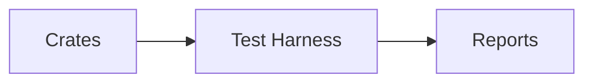

# test-harness-bdd — Cross-crate Integration & Behavior

## 1. Purpose

This harness contains BDD tests for cross-crate integration only: HTTP control/data plane flows through `orchestratord`, adapter streaming behavior, pool readiness interactions, and end-to-end error/observability envelopes.

## 2. Why it exists (Spec traceability)

- ORCH-3050 — [.specs/00_llama-orch.md](../../.specs/00_llama-orch.md#orch-3050)
- ORCH-3051 — [.specs/00_llama-orch.md](../../.specs/00_llama-orch.md#orch-3051)

## 3. Scope

- Integration of `orchestratord` with adapters and `pool-managerd` (admission, placement, SSE, cancel).
- Control plane flows that span multiple crates (drain/reload, health, capabilities).
- Error taxonomy envelopes and observability fields over the HTTP boundary.

Non-goals:
- Per-crate unit/behavior tests (moved to each crate).
- Schema generation/validation and preflight/apply correctness (owned by respective crates).

## 4. How it fits

- Drives integration scenarios across crates and validates cross-boundary behavior.

## 5. Build & Test

- Workspace fmt/clippy: `cargo fmt --all -- --check` and `cargo clippy --all-targets --all-features
-- -D warnings`
- Tests for this crate: `cargo test -p test-harness-bdd -- --nocapture`

## 6. Contracts

- Aligns with `orchestratord` OpenAPI contracts and shared adapter contracts.

## 7. Config & Env

- Not applicable.

## 8. Metrics & Logs

- Verifies metrics/log fields presence as per `.specs/metrics/otel-prom.md` and `README_LLM.md`.

## 9. Runbook (Dev)

- Regenerate artifacts: `cargo xtask regen-openapi && cargo xtask regen-schema`
- Rebuild docs: `cargo run -p tools-readme-index --quiet`

## 10. Status & Owners

- Status: alpha
- Owners: @llama-orch-maintainers

## 11. Changelog pointers

- None

## 12. Footnotes

- Spec: [.specs/00_llama-orch.md](../../.specs/00_llama-orch.md)
- Requirements: [requirements/00_llama-orch.yaml](../../requirements/00_llama-orch.yaml)

### Additional Details
- Which tests are ignored vs required; how to run real-model Haiku; determinism suite scope.

## What this crate is not

- Not a place for crate-scoped tests; those live under each crate.
