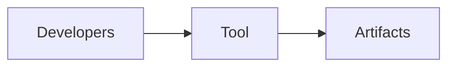

# tools-openapi-client — tools-openapi-client (tool)

## 1. Name & Purpose

tools-openapi-client (tool)

## 2. Why it exists (Spec traceability)

- See spec and requirements for details.
  - [.specs/orchestrator-spec.md](../../.specs/orchestrator-spec.md)
  - [requirements/00_llama-orch.yaml](../../requirements/00_llama-orch.yaml)

## 3. Public API surface

- OpenAPI: [contracts/openapi/control.yaml](../../contracts/openapi/control.yaml)
- OpenAPI: [contracts/openapi/data.yaml](../../contracts/openapi/data.yaml)
- OpenAPI operations: 9
  - examples: cancelTask, createTask, deleteSession, drainPool, getPoolHealth

## 4. How it fits

- Developer tooling supporting contracts and docs.

## 5. Build & Test

- Workspace fmt/clippy: `cargo fmt --all -- --check` and `cargo clippy --all-targets --all-features
-- -D warnings`
- Tests for this crate: `cargo test -p tools-openapi-client -- --nocapture`

## 6. Contracts

- OpenAPI:
  - [contracts/openapi/control.yaml](../../contracts/openapi/control.yaml)
  - [contracts/openapi/data.yaml](../../contracts/openapi/data.yaml)

## 7. Config & Env

- Not applicable.

## 8. Metrics & Logs

- Minimal logs.

## 9. Runbook (Dev)

- Regenerate artifacts: `cargo xtask regen-openapi && cargo xtask regen-schema`
- Rebuild docs: `cargo run -p tools-readme-index --quiet`

## 10. Status & Owners

- Status: alpha
- Owners: @llama-orch-maintainers

## 11. Changelog pointers

- None

## 12. Footnotes

- Spec: [.specs/orchestrator-spec.md](../../.specs/orchestrator-spec.md)
- Requirements: [requirements/00_llama-orch.yaml](../../requirements/00_llama-orch.yaml)

### Additional Details
- Responsibilities, inputs/outputs; how determinism and idempotent regeneration are enforced.

## What this crate is not

- Not a production service.
