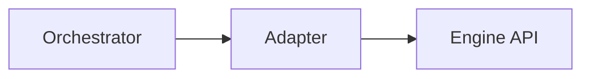

# worker-adapters-llamacpp-http — worker-adapters-llamacpp-http (adapter)

## 1. Name & Purpose

`worker-adapters-llamacpp-http` adapts llama.cpp’s HTTP surface to the worker adapter trait used by the orchestrator. It reports health/props and streams token events to the control/data plane via a common `WorkerAdapter` interface. Current implementation is a stub suitable for vertical-slice flows and tests.

## 2. Why it exists (Spec traceability)

Traceability follows the leading workspace specs:

- Core orchestrator spec: [.specs/00_llama-orch.md](../../.specs/00_llama-orch.md)
  - Adapter responsibilities per engine (health, props, streaming): ORCH-3054..3058
  - Determinism hooks: engine version exposure and single-slot mode where applicable
- Home profile overlay: [.specs/00_home_profile.md](../../.specs/00_home_profile.md) — single-host assumptions and concurrency hints

## 3. Public API surface

- Rust crate API (internal)

## 4. How it fits

- Maps engine-native APIs to the orchestrator worker contract.

#### Detailed behavior (High / Mid / Low)

- High-level
  - Implements the `WorkerAdapter` trait for llama.cpp HTTP engines. Current code is stubbed (no network), returning a short, deterministic token stream.

- Mid-level
  - Trait and types from `worker_adapters_adapter_api` used: `WorkerAdapter`, `WorkerHealth`, `WorkerProps`, `TokenEvent`, `TokenStream`, `WorkerError`.
  - Adapter struct: `LlamaCppHttpAdapter { base_url: String }` with constructor `new(base_url)`.
  - Core methods:
    - `health() -> WorkerHealth { live: true, ready: true }`
    - `props() -> WorkerProps { slots_total: Some(1), slots_free: Some(1) }`
    - `submit(TaskRequest) -> TokenStream` yields `started` → `token` → `end`
    - `cancel(task_id) -> Result<(), WorkerError>` no-op stub
    - `engine_version() -> String` returns `"llamacpp-stub-v0"`

- Low-level (from `src/lib.rs`)
  - `submit` builds a boxed `TokenStream` over an iterator of three `TokenEvent`s:
    - `{ kind: "started", data: {} }`
    - `{ kind: "token", data: {"t":"hello","i":0} }`
    - `{ kind: "end", data: {"tokens_out":1, "decode_ms":0} }`
  - No HTTP is performed in the stub; production impl will map orchestrator requests to llama.cpp endpoints and forward streamed tokens and metrics.

## 5. Build & Test

- Workspace fmt/clippy: `cargo fmt --all -- --check` and `cargo clippy --all-targets --all-features
-- -D warnings`
- Tests for this crate: `cargo test -p worker-adapters-llamacpp-http -- --nocapture`

## 6. Contracts

- None

## 7. Config & Env

- `base_url` for the llama.cpp engine HTTP endpoint is carried in the adapter struct; the current stub does not perform network calls.
- In a future impl, engine credentials and timeouts will be surfaced here.

## 8. Metrics & Logs

- Emits adapter health and request metrics per engine.

## 9. Runbook (Dev)

- Regenerate artifacts: `cargo xtask regen-openapi && cargo xtask regen-schema`
- Rebuild docs: `cargo run -p tools-readme-index --quiet`

## 10. Status & Owners

- Status: alpha
- Owners: @llama-orch-maintainers

## 11. Changelog pointers

- None

## 12. Footnotes

- Specs:
  - Core: [.specs/00_llama-orch.md](../../.specs/00_llama-orch.md)
  - Home overlay: [.specs/00_home_profile.md](../../.specs/00_home_profile.md)
- Requirements: [requirements/00_llama-orch.yaml](../../requirements/00_llama-orch.yaml)

### Additional Details
- Engine endpoint mapping tables (native/OpenAI-compat to adapter calls), determinism knobs,
version capture.

## What this crate is not

- Not a public API; do not expose engine endpoints directly.
