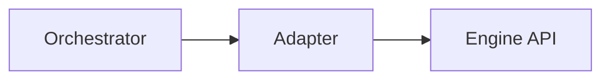

# worker-adapters-llamacpp-http — worker-adapters-llamacpp-http (adapter)

## 1. Name & Purpose

worker-adapters-llamacpp-http (adapter)

## 2. Why it exists (Spec traceability)

- ORCH-3054 — [.specs/orchestrator-spec.md](../../.specs/orchestrator-spec.md#orch-3054)
- ORCH-3055 — [.specs/orchestrator-spec.md](../../.specs/orchestrator-spec.md#orch-3055)
- ORCH-3056 — [.specs/orchestrator-spec.md](../../.specs/orchestrator-spec.md#orch-3056)
- ORCH-3057 — [.specs/orchestrator-spec.md](../../.specs/orchestrator-spec.md#orch-3057)
- ORCH-3058 — [.specs/orchestrator-spec.md](../../.specs/orchestrator-spec.md#orch-3058)

## 3. Public API surface

- Rust crate API (internal)

## 4. How it fits

- Maps engine-native APIs to the orchestrator worker contract.

## 5. Build & Test

- Workspace fmt/clippy: `cargo fmt --all -- --check` and `cargo clippy --all-targets --all-features
-- -D warnings`
- Tests for this crate: `cargo test -p worker-adapters-llamacpp-http -- --nocapture`

## 6. Contracts

- None

## 7. Config & Env

- Engine connection endpoints and credentials where applicable.

## 8. Metrics & Logs

- Emits adapter health and request metrics per engine.

## 9. Runbook (Dev)

- Regenerate artifacts: `cargo xtask regen-openapi && cargo xtask regen-schema`
- Rebuild docs: `cargo run -p tools-readme-index --quiet`

## 10. Status & Owners

- Status: alpha
- Owners: @llama-orch-maintainers

## 11. Changelog pointers

- None

## 12. Footnotes

- Spec: [.specs/orchestrator-spec.md](../../.specs/orchestrator-spec.md)
- Requirements: [requirements/index.yaml](../../requirements/index.yaml)

### Additional Details
- Engine endpoint mapping tables (native/OpenAI-compat to adapter calls), determinism knobs,
version capture.

## What this crate is not

- Not a public API; do not expose engine endpoints directly.
